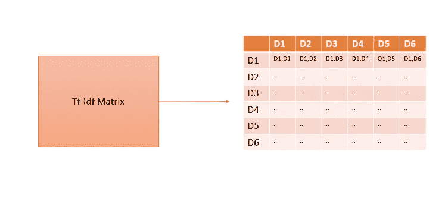

# 我如何使用文本挖掘来决定观看哪个 Ted 演讲

> 原文：<https://towardsdatascience.com/how-i-used-text-mining-to-decide-which-ted-talk-to-watch-dfe32e82bffd?source=collection_archive---------6----------------------->

我喜欢 ted 演讲，谁不喜欢呢？当我第一次看这个数据集的时候，我突然想到了一些事情。首先，由于这个数据集包含了许多 ted 演讲的文字记录，默认情况下，我们有一个非常丰富的语料库，并且在语言学上有很好的结构。第二，由于这个语料库有很好的语言学属性，它可能是一个和路透社 20 新闻组或任何版本的古滕贝格语料库一样好的数据集。这让我想到:


***我有许多 ted 演讲的所有记录的数据，我能试着想出一种方法来根据它们的相似性推荐 ted 演讲吗，就像官方 Ted 页面所做的那样？***

当然，官方 ted 页面所使用的推荐引擎将会比我在这里演示的更加复杂，并且还会涉及到使用某种历史用户-项目交互数据。

这里的想法是演示如何仅仅使用内容就能产生推荐。当你没有任何用户-项目交互数据时，这变得非常重要，尤其是当你开始一个新的项目，并且仍然想要为你的内容的消费者提供相关的上下文推荐时。

# **满足数据**

数据以表格文件的形式输入，每次谈话的文字记录存储在名为 ***文字记录*** 的一行中。下面是该文件的样子

```
**import** **pandas** **as** **pd**
transcripts=pd.read_csv("E:**\\**Kaggle**\\**ted-data**\\**transcripts.csv")
transcripts.head()
```


在检查了数据的样子之后，我发现我可以很容易地从 url 中提取演讲的标题。我的最终目标是使用抄本栏中的文本来创建一个相似性度量。然后为一个演讲推荐 4 个最相似的标题。使用简单的字符串分割操作将标题从 url 中分离出来非常简单，如下所示

```
transcripts['title']=transcripts['url'].map(**lambda** x:x.split("/")[-1])
transcripts.head()
```


在这一点上，我准备开始拼凑将帮助我建立一个谈话推荐器的组件。为了实现这一目标，我必须:

1.  创建每个转录本的向量表示
2.  为上面创建的向量表示创建相似性矩阵
3.  对于每个演讲，基于一些相似性度量，选择 4 个最相似的演讲

# **使用 Tf-Idf 创建单词向量:**

因为我们的最终目标是基于内容的相似性来推荐演讲，所以我们要做的第一件事是，创建一个可以比较的文字记录的表示。一种方法是为每个转录本创建一个 tfidf 载体。但是这个 tfidf 到底是什么东西？让我们先讨论一下。

## 语料库、文档和计数矩阵

为了表示文本，我们将把每个抄本看作一个“文档”，把所有文档的集合看作一个“语料库”。然后，我们将创建一个向量，表示每个文档中出现的字数，如下所示:


如您所见，对于每个文档，我们都创建了一个向量来计算每个单词出现的次数。所以向量(1，1，1，1，0，0)表示文档 1 中单词“This”、“is”、“sentence”、“one”、“two”、“three”的计数。这就是所谓的计数矩阵。这种文本表示有一个问题，它没有考虑到文档中单词的重要性。例如，单词“one”在文档 1 中只出现一次，但在其他文档中却没有出现，因此从其重要性的角度来看，“one”是文档 1 的一个重要单词，因为它表征了文档 1，但是如果我们查看文档 1 的计数向量，我们可以看到“one”的权重为 1，像“This”、“is”等单词也是如此。关于文档中单词重要性的问题可以使用所谓的 ***Tf-Idf*** 来处理。

# 术语频率-逆文档频率(Tf-Idf):

为了理解 Tf-Idf 如何帮助识别单词的重要性，让我们做一个思维实验，问我们自己几个问题，什么决定一个单词是否重要？

1.  如果这个词在文档中出现很多？
2.  如果这个词在语料库中很少出现？
3.  1 和 2 都是？

如果一个单词在文档中出现很多，但在语料库中的其他文档中很少出现，则该单词在文档中是重要的。**术语频率**衡量该词在给定文档中出现的频率，而**逆文档频率**衡量该词在语料库中出现的频率。这两个量的乘积，衡量这个词的重要性，被称为 **Tf-Idf** 。创建 tf-idf 表示相当简单，如果您正在使用机器学习框架，比如 scikit-learn，那么创建文本数据的矩阵表示也相当简单

```
**from** **sklearn.feature_extraction** **import** text
Text=transcripts['transcript'].tolist()
tfidf=text.TfidfVectorizer(input=Text,stop_words="english")
matrix=tfidf.fit_transform(Text)
*#print(matrix.shape)*
```

因此，一旦我们通过考虑单词的重要性来解决表示单词向量的问题，我们就可以开始处理下一个问题了，如何找出哪些文档(在我们的例子中是 Ted talk 抄本)与给定的文档相似？

# **查找相似文档**

为了在不同的文档中找出相似的文档，我们需要计算相似性的度量。通常在处理 Tf-Idf 向量时，我们使用余弦相似度。可以把余弦相似性看作是衡量一个 TF-Idf 向量与另一个向量的接近程度。如果你还记得之前的讨论，我们能够把每个抄本表示为一个向量，所以余弦相似度将成为我们发现一个 Ted 演讲的抄本和另一个有多相似的一种方法。

所以本质上，我从 Tf-Idf 向量创建了一个余弦矩阵来表示每个文档与另一个文档的相似程度，大致如下:



再一次，使用 sklearn，这样做是非常直接的

```
*### Get Similarity Scores using cosine similarity*
**from** **sklearn.metrics.pairwise** **import** cosine_similarity
sim_unigram=cosine_similarity(matrix)
```

我现在要做的就是，根据余弦相似度，找出每份抄本中最相似的 4 份。从算法上来说，这相当于为上面构建的余弦矩阵中的每一行找出五列的索引，这五列与对应于相应行号的文档(在我们的情况下是抄本)最相似。这是使用几行代码完成的

```
**def** get_similar_articles(x):
    **return** ",".join(transcripts['title'].loc[x.argsort()[-5:-1]])
transcripts['similar_articles_unigram']=[get_similar_articles(x) **for** x **in** sim_unigram]
```

让我们通过检查建议来检查我们是如何公平的。让我们从列表中选择任何一个 Ted 演讲题目，比如说我们选择:

```
transcripts['title'].str.replace("_"," ").str.upper().str.strip()[1]'AL GORE ON AVERTING CLIMATE CRISIS'
```

然后，根据我们的分析，四个最相似的标题是

```
transcripts['similar_articles_unigram'].str.replace("_"," ").str.upper().str.strip().str.split("**\n**")[1]['RORY BREMNER S ONE MAN WORLD SUMMIT',
 ',ALICE BOWS LARKIN WE RE TOO LATE TO PREVENT CLIMATE CHANGE HERE S HOW WE ADAPT',
 ',TED HALSTEAD A CLIMATE SOLUTION WHERE ALL SIDES CAN WIN',
 ',AL GORE S NEW THINKING ON THE CLIMATE CRISIS']
```

你可以清楚地看到，通过使用 Tf-Idf 向量来比较会谈的记录，我们能够挑选出，主题相似的会谈。

我还在这里创建了一个 kaggle 内核，别忘了向上投票:[https://www . ka ggle . com/gunvant/building-content-recommender-tutorial](https://www.kaggle.com/gunnvant/building-content-recommender-tutorial)

你可以在这里找到完整的代码[https://github . com/gun vant/ted _ talks/blob/master/blog March 18 . ipynb](https://github.com/Gunnvant/ted_talks/blob/master/BlogMarch18.ipynb)