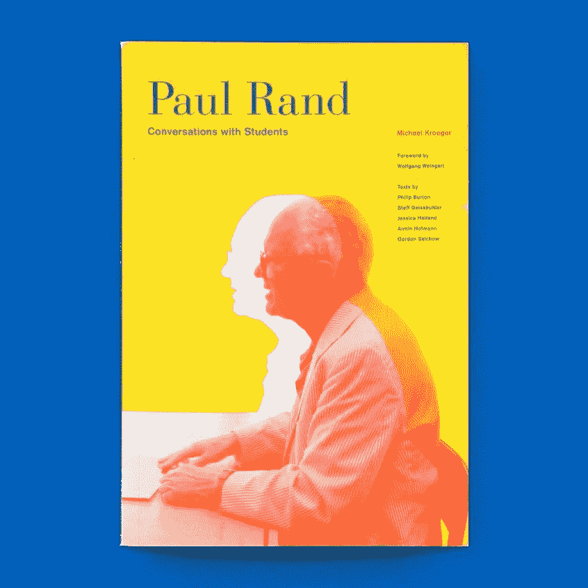
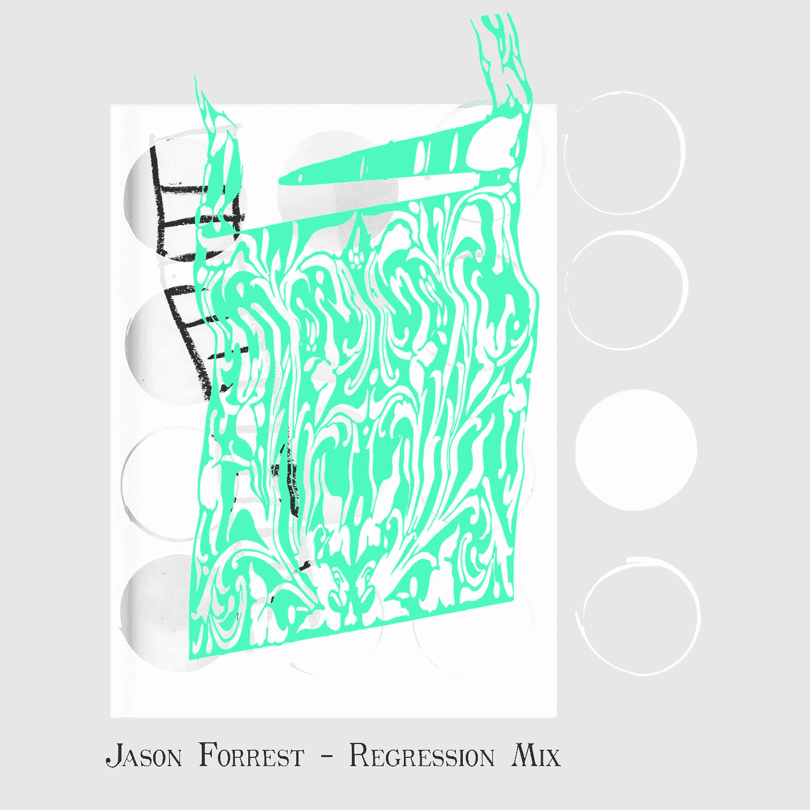
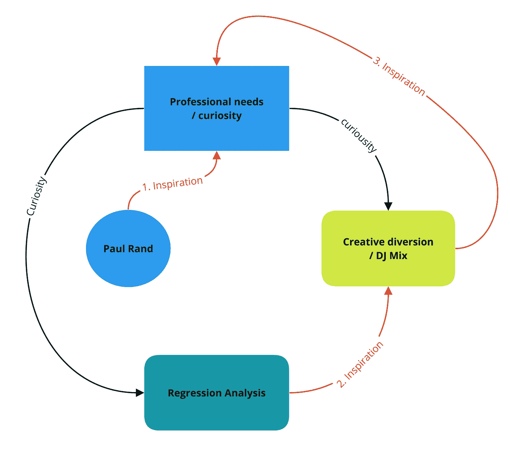

# 我如何从阅读保罗·兰德到做回归分析影响了 DJ Mix

> 原文：<https://towardsdatascience.com/how-i-went-from-reading-paul-rand-to-making-a-regression-analysis-influenced-dj-mix-911fc2389696?source=collection_archive---------8----------------------->

这里有一个灵感的故事，有一些不寻常的转折。有时你不明白你在一条路上，直到你发现隐藏的线索。

在软件开发领域工作了 10 年，并且在过去的 5 年里作为一名 UX 设计师，我发现自己对下一个项目不那么感兴趣了。我觉得我对设计和开发软件有相当多的了解，但是我对我为什么要做这个有一些疑问。

但是在这开始之前，我的日历上还有一些时间，所以我想我应该利用这段时间去探索一个不同的方向。我住在纽约，经常去 The Strand，但去年秋天的某一天，我有一个小时的额外空闲，在设计区寻找，碰巧发现了这本书:

[buy it here](https://www.amazon.com/Paul-Rand-Conversations-Michael-Kroeger/dp/1568987250) or [view on slide share](https://www.slideshare.net/malcoquintero/paul-rand-conversation-with-students)

[保罗·兰德](https://en.wikipedia.org/wiki/Paul_Rand)是二十世纪最有影响力的平面设计师之一。就像副标题所说的，这是一本与学生对话的书，他不是在谈论自己或他的工作，他在回答关于设计本质的问题，并通过他的回答重新构建这些问题。你可以看到他的答案真的挑战了学生，他没有让他们摆脱困境。更重要的是，你可以看到他真的在这个他认为是大师的主题上推行他自己的观点，这是一个超级有趣的阅读。

然后，在第 19 页，他说:

…就这样，我明白他不仅仅指“页面上”的对象，还指人与人甚至组织之间的复杂关系。

让我产生共鸣的想法是，我可以通过使用我的能力，超越绘制软件图片的界限，来帮助“设计”一个组织。当然，实用性植根于技术，但真正的工作是理解做出了什么业务决策，需要做出什么决策，并通过向我们的同事提供证明组织实际正在做什么的数据来帮助他们提升思维。这是解放！

正如我在这篇文章的开头所说，我在专业上有点害怕，这三个小词帮助我离开了产品设计，走向了分析设计。那天晚上，我开始研究机器学习，这让我找到了维基百科的条目:

> "**回归**分析广泛用于预测和预报，其使用与机器学习领域有大量重叠。**回归**分析也用于了解哪些自变量与因变量相关，并探究这些关系的形式。”—维基百科

哦——你也看到了，对吗？

因此，如果… *设计是关系…* 而统计回归是揭示这些关系的*技术…* 那么…理解回归分析…就是设计的工具！

哇，好吧！我知道我现在在正确的道路上！那么我接下来做了什么？

# …我做了一个 DJ 混音！

观察力敏锐的读者可能已经在我的简历中注意到我是一名音乐家。我发现我倾向于以多种方式处理我所学到的东西；有时候我会直接在日常实践中插入新的概念，但有时候我需要从抽象的角度思考，让东西渗透进来。作为一名务实的 UX 设计师，我戴上了“同理心帽子”，试图思考我那些有统计学头脑的同事是如何从不同的角度解决问题的。

但是不要让我欺骗你——当我坐下来做混音的时候，这些我都没想到。我只是有一种想做点什么的冲动。当你制作 DJ 混音时，你可能知道你想要播放的歌曲，但你通常不知道它们是如何组合在一起的。这就像一个谜题，很难理解歌曲之间的关系，但当它起作用时，你就知道了。

对于这个特殊的组合，我给了自己一堆约束。我想在混音中使用每个艺术家两次，我想把它分成两个“侧面”,我想用环境声音以及某种丛林节拍来演奏，但不要过度索引任何一个流派。我喜欢有内在逻辑的混音，尤其是当你不知道它要去哪里的时候。

看，[在我之前的帖子](/on-my-peculiar-experience-and-where-it-goes-from-here-f3478d7f25f6)中，我解释了我刚刚作为他们的 UX 设计师过渡到一个人员分析团队。自从我开始与我的新团队合作以来，我一直在思考我们如何衡量事物，由于我的角色很大一部分将是数据可视化，我一直在绘制尺子、网格、线条和圆形以获取灵感。

作为一名平面设计师，我还继续探索我认为是设计“基础”的东西——圆、线、网格等等。因此，我以类似的方式为我的组合做了一个设计，作为探索一些创造性想法的练习，并没有真正考虑数据科学。这是我想到的:

当我完成混音后，我知道这与我在分析设计方面的新工作有关。我明白，我在视觉上摆弄的设计元素与为我的业务同事创建的图表是一样的。“测量”当然已经渗透到我的潜意识里了。

所以现在我们在时间线的尽头，我正在做机器学习的研究，我已经完成了我的混音，设计有点不完整，我受到了兰德的话的启发。像许多人一样，我的浏览器中有许多打开的标签，我去关闭它们——它就在那里。回归分析作为一种在嘈杂世界中寻找逻辑线索的方法。

这是一个灵感的故事。这篇文章试图通过三个层次的灵感。当然，(翻白眼)，我不得不把它画成图表:

1.  **兰德的话激发了学习和应用新技能的欲望**
2.  **回归分析成为 DJing 的意外隐喻**
3.  **由此产生的组合激发了设计和数据科学概念在持续学习和激活方面的应用**

最终很难理解我们的想法到底从何而来，但思考它们如何演变以及它们可能对未来决策产生什么影响是很有趣的。谁知道呢——你拿起或浏览的最后一本书可能会激发你做出一个有所作为的创造性决定。