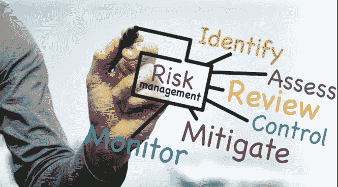

# 信息技术如何影响风险管理？

> 原文：<https://towardsdatascience.com/how-information-technologies-influenced-risk-management-7eb3a38d253?source=collection_archive---------0----------------------->

Risk management process / Image Source: [www.edarabia.com/229684/pmi-risk-management-professional-pmi-rmp-abu-dhabi-uae](https://www.edarabia.com/229684/pmi-risk-management-professional-pmi-rmp-abu-dhabi-uae/)

# 1.介绍

风险管理是一项非常需要的核心能力，可以帮助组织随着时间的推移交付和增加利益相关者的价值。良好的风险管理需要更好的数据和信息，因此组织可以对不断变化的风险清单采取行动。

风险管理团队必须促进和鼓励当前和前瞻性风险信息的获取、分析和交付。预测风险信息可以帮助管理层做出更明智的决策，并帮助他们采取行动，产生更可靠的结果。

计算和风险技术的发展，以及利用大数据、分析、移动应用、云计算、企业资源规划(ERP)和治理、风险和合规(GRC)系统的新技术的相关发展，对风险管理也很重要。这些技术进步为风险管理者和那些参与改进现有风险管理计划的管理人员或组织外部人员提供了增强风险管理有效性的更好能力。

在这份报告中，我将试图总结信息技术和风险管理之间的关系，以及信息技术的发展如何影响风险管理领域。

# 2.风险管理

# 2.1.什么是风险管理？

风险管理是识别、评估、评价和控制对组织资本和收益的威胁的过程。这些威胁或风险可能来自各种来源，包括财务不确定性、法律责任、战略管理失误、事故和自然灾害。[18]

# 2.2.风险管理流程

所有的风险管理计划都遵循相同的步骤，这些步骤共同构成了整个风险管理过程:[18]

1.风险识别:公司识别并定义可能对特定公司流程或项目产生负面影响的潜在风险。

2.风险分析:一旦确定了特定类型的风险，公司就可以确定风险发生的可能性以及风险的后果。分析的目标是进一步了解风险的每个具体实例，以及它如何影响公司的项目和目标。

3.风险评估和评价:在确定风险发生的总体可能性及其总体后果后，对风险进行进一步评估。然后，公司可以根据其风险偏好来决定风险是否可接受以及公司是否愿意承担风险。

4.风险缓解:在这一步骤中，公司评估其最高级别的风险，并制定计划，使用特定的风险控制来缓解风险。这些计划包括风险缓解流程、风险预防策略和风险实现时的应急计划。

5.风险监控:缓解计划的一部分包括跟踪风险和整体计划，以持续监控和跟踪新的和现有的风险。整体风险管理流程也应进行相应的审查和更新。

# 2.3.风险管理策略

在确定了公司的具体风险并实施了风险管理流程后，公司可以针对不同类型的风险采取几种不同的策略:[18]

1.风险规避:虽然完全消除所有风险几乎是不可能的，但风险规避策略旨在转移尽可能多的威胁，以避免破坏性事件的高成本和破坏性后果。

2.降低风险:公司有时能够降低某些风险对公司流程的影响。这是通过调整整个项目计划或公司流程的某些方面，或通过缩小其范围来实现的。

3.风险分担:有时，风险的后果被分担，或分布在项目的几个参与者或业务部门中。风险也可以由第三方分担，如供应商或业务伙伴。

4.风险保留:有时，公司决定从商业角度来看风险是值得的，并决定保留风险和处理任何潜在的后果。公司往往会保留一定程度的风险，一个项目的预期利润大于其潜在风险的成本。

# 2.4.风险管理标准

自 21 世纪初以来，一些行业和政府机构扩大了监管合规性规则，以审查公司的风险管理计划、政策和程序。越来越多的行业要求董事会审查和报告企业风险管理流程的充分性。因此，风险分析、内部审计和其他风险评估手段已经成为企业战略的主要组成部分。

风险管理标准已由多个组织制定，包括美国国家标准与技术研究所和 ISO。这些标准旨在帮助组织识别特定的威胁，评估独特的漏洞以确定其风险，确定降低这些风险的方法，然后根据组织战略实施风险降低措施。

例如,《ISO 31000 原则》提供了改进风险管理流程的框架，无论公司的规模或目标部门如何，都可以使用这些框架。根据 ISO 网站[13]，ISO 31000 旨在“增加实现目标的可能性，改善对机会和威胁的识别，并有效地分配和使用风险处理资源”。虽然 ISO 31000 不能用于认证目的，但它可以帮助为内部或外部风险审计提供指导，并允许组织将其风险管理实践与国际公认的基准进行比较。

ISO 建议以下目标领域或原则应成为整体风险管理流程的一部分:

1.  这个过程应该为组织创造价值。
2.  它应该是整个组织过程的一个组成部分。
3.  它应该成为公司整体决策过程中的一个因素。
4.  它必须明确解决任何不确定性。
5.  它应该是系统的和结构化的。
6.  它应该基于现有的最佳信息。
7.  应该根据项目量身定制。
8.  它必须考虑到人为因素，包括潜在的错误。
9.  它应该是透明的和包罗万象的。
10.  它应该能适应变化。
11.  应该不断对其进行监测和改进

ISO 标准和其他类似的标准已经在世界范围内制定，以帮助组织系统地实施风险管理最佳实践。这些标准的最终目标是建立通用框架和流程，以有效实施风险管理策略。

这些标准通常得到国际监管机构或目标行业团体的认可。它们还会定期补充和更新，以反映快速变化的业务风险来源。尽管遵循这些标准通常是自愿的，但行业监管机构或商业合同可能会要求遵守这些标准。

# 2.5.企业风险管理

企业风险管理包括各组织用来管理风险和抓住与实现其目标相关的机会的方法和流程。机构风险管理提供了一个风险管理框架，通常涉及确定与组织目标(风险和机会)相关的特定事件或情况，从影响的可能性和程度方面对其进行评估，确定应对战略，并监测进展情况。通过识别和积极应对风险和机遇，工商企业保护并为其利益相关者创造价值，包括所有者、员工、客户、监管者和整个社会。[2]

# 2.6.治理、风险管理和法规遵从性(GRC)

治理、风险管理和法规遵从性(GRC)是一个涵盖组织在这三个领域的方法的总称:治理、风险管理和法规遵从性。GRC 被正式定义为“使组织能够可靠地实现目标、解决不确定性并诚信行事的能力的集成集合。”[1]

GRC 是一个旨在跨治理、风险管理和合规同步信息和活动的学科，以便更有效地运营、实现有效的信息共享、更有效地报告活动并避免浪费的重叠。尽管在不同的组织中有不同的解释，但 GRC 通常包括诸如公司治理、企业风险管理(ERM)和公司遵守适用法律法规等活动。

组织达到需要对 GRC 活动进行协调控制才能有效运营的规模。这三个学科中的每一个都为其他两个学科创造了有价值的信息，并且这三个学科都影响着相同的技术、人员、流程和信息。

当独立管理治理、风险管理和法规遵从性时，会出现大量重复任务。重叠和重复的 GRC 活动会对运营成本和 GRC 矩阵产生负面影响。[8]

# 3.风险信息

有效的风险计划应该为管理层提供增强的能力，以持续捕捉、评估、分析和应对因内部运营、外部市场或法规变化而产生的风险。不能有效地管理这些变化会产生财务损失、负面宣传，并影响组织目标或任务的实现。因此，有效的风险计划考虑、评估并为组织的规划、绩效衡量提供输入，并支持评估潜在的负面事件及其对组织既定风险偏好和容忍度设定流程的影响。此外，请注意，信息和沟通是基本的框架组件，但更重要的是反馈工具。

拥有及时的信息是有效的机构风险管理计划的关键。例如，立即知道一个关键供应商经历了原材料供应链的重大中断，使客户能够调用供应链弹性计划，以快速在其他地方获得替代材料。如果没有及时的信息，供应商的中断也可能会中断其客户的制造流程。管理层必须持续监控内部运营、供应商、关联方、交易对手和客户，以寻找必须解决的不断变化的情况，从而降低损失风险。

# 4.风险管理和信息技术

信息技术的发展已经影响到我们生活的每个领域，如学习、营销、商业、娱乐和政治。风险管理是受这种发展影响很大的领域之一，因为它主要基于数据。日复一日，信息技术促进了从风险识别到监控过程的自动化。大数据、分析、移动应用、云计算、企业资源规划(ERP)以及治理、风险和合规(GRC)系统等新技术的开发对于风险管理非常重要。这些技术进步为风险管理者和那些从事改进的管理人员或组织外的人员提供了机会。

在这一部分，我将描述不同信息技术领域在风险管理中的作用。

# 4.1.基本风险可视化程序

信息技术影响风险管理领域的第一个基本因素是不太复杂和不太昂贵的应用程序的基础，如 Microsoft Excel、PowerPoint 和 SharePoint 等办公自动化工具，这些工具在大、中、小型组织中广泛用于风险跟踪和报告目的。

此外，还有许多由著名服务提供商发明的基本威胁建模程序，如微软[20]，以及许多其他程序，如 CORAS 威胁建模[19]。

# 4.2.社会化媒体

一些企业现在积极监控社交媒体内容(例如 Yelp ),以收集关于客户服务、产品质量或服务交付问题的及时见解。在这种情况下，广泛和即时可用的社交媒体内容提供了关于公众对企业产品和服务的看法的宝贵见解，这有助于企业通过提供管理工具来避免声誉受损，这些工具可以在服务和产品质量问题造成严重的品牌或特许经营损害之前快速解决它们。[9]

# 4.3.数据集成和分析

许多组织目前已经在生产中拥有大型和广泛的数据库，许多 IT 部门正在积极地将这些数据库与现有应用程序更好地集成，以从 IT 投资中获取更多价值。许多数据库包含风险数据点，这些数据点也可以被更强大的计算平台提取、“挖掘”或摄取，从而随着时间的推移提供更多的组织价值。组织的首席信息官(CIO)现在使用的工具包括电子数据仓库(edw)、“大数据”、商业智能(BI)应用和信息分析技术。[9]

这些工具可以辅以强大的数据提取、转换和加载(ETL)技术，这些技术为从难以定位和解析的数据文件中提取价值提供了更大的自由度。虽然风险经理最初可能不是这种数据集成投资的预期受益者，但是许多组织仍然在为此目的使用这些工具。

此外，大数据分析可以在许多与市场风险分析相关的领域提供帮助:[21]

-欺诈管理:快速识别欺诈，将损失降至最低

-信用管理:更好的预测能力，新的数据来源允许预测用户行为

-洗钱:更快发现问题，实时反应

-市场和商业贷款:允许更好地模拟和预测市场和公司

-运营风险:对与客户的互动提供更多控制和知识，提高安全性。

-综合风险管理:在出现金融风险的不同部门和领域提供全球视野

# 4.4.数据挖掘

此外，对于我们在上一部分中提到的数据分析的使用，组织可以从数据挖掘技术中受益，以预测组件或机器的故障，识别欺诈，甚至预测公司利润。与其他数据挖掘技术结合使用，预测包括分析趋势、分类、模式匹配和关系。通过分析过去的事件或实例，你可以对一个事件做出预测。

例如，使用信用卡授权，您可以将对单个过去交易的决策树分析与分类和历史模式匹配结合起来，以识别交易是否是欺诈性的。在购买飞往美国的航班和在美国的交易之间进行匹配，很可能交易是有效的。[6]

# 4.5.开放数据

开放数据是这样一种理念，一些数据应该免费提供给每个人使用和重新发布，不受版权、专利或其他控制机制的限制。[23]

如今，大多数组织都可以通过实时数据源即时获得有关不断变化的经济状况和市场的数据。商业新闻服务提供商，如 Thompson Reuters、Blackrock、彭博、道琼斯和华尔街日报，都提供有关金融资产和市场价值变化的最新信息。这种数据馈送还可以用来支持成熟的机构风险管理方案和风险监测流程，这些信息服务对股票交易和资本市场参与者的影响是显而易见的。[9]

许多全球性组织正变得越来越全球一体化，并跨境运营非常复杂的业务流程。当市场条件发生实时变化时，这样的组织在纳秒内执行交易、评估和采取行动。

许多新一代面向大数据、“基于分析”的 BI 系统已经支持智能决策、交易处理和数据可视化，这些都是监控风险和运营绩效的有用工具。

# 4.6.云计算

在评估 GRC 应用程序时，基于云的 IT 环境的发展也是人们可能希望或需要了解和考虑的事情。提供“按需”GRC 软件即服务(SaaS)的基于云的 IT 环境利用了基于平台的操作系统和相关基础设施及中间件软件的固有虚拟化功能，为“租户”用户提供了比购买 GRC 应用程序并在内部运行更高效、更经济的替代方案。基于云的应用程序，或“租户”，以及使用它们的组织提供并收取这些应用程序的用户所需的处理能力的费用。[9]

基于需求的使用和收费方案为用户提供了更大的灵活性，因为它要求用户只在运营业务所需的应用程序上花钱。基于云的应用程序利用了规模经济的优势，SaaS 允许多个租户用户组织使用云托管的应用程序，同时支持多种 IT 使用案例。

# 4.7.物联网

对于风险经理来说，物联网可以归结为在业务之上引入一层技术。运营不需要重新发明。这为依赖管理风险的组织提供了一个不可或缺的工具。通过为公司配备更多连接到互联网的传感器和设备，组织能够收集更多实时数据来推动商业价值。这对管理风险也有很大影响。

例如，使用物联网来帮助用射频识别(RFID)标签标记资产。这有助于监控从起重机等设备的维修间隔到确保发电机具有正确的燃料水平的一切。[3] [4]

物联网使决策者能够发现趋势，适应不断变化的市场条件，并改进他们的战略。此外，物联网主导的方法可以应用于任何企业，无论是零售商、医疗机构、初创公司，甚至是建筑公司。

通过利用物联网等新兴技术并实施集成系统，您可以收集和分析来自多个位置的无限数量来源的海量数据。通过这种方式，您可以改进运营流程以提高报告的及时性，并利用数据来推动预防措施，让您在潜在风险面前领先一步。

# 4.8.数字图象处理

图像处理是将图像转换成数字形式并对其进行某种操作，以获得增强的图像或从中提取一些有用信息的方法。[17]

从 1997 年开始，图像处理被引入作为医疗风险评估的工具。应用于高分辨率乳腺热像图的图像处理技术用于预测乳腺癌。目标是观察由于温度差异和/或观察到的泡状结构区域和其他“热点”导致的热模式的不对称性。[16]

此外，图像处理还被用于预测自然风险，如森林火灾，处理和分析由飞机或卫星平台上的传感器捕获的图像。图像衍生产品用于火灾风险的火灾前评估、火灾范围和移动的实时绘图、烧伤范围和严重程度的火灾后分析以及火灾后恢复。[14] [15]

# 4.9.网络安全

网络安全是旨在保护网络、计算机、程序和数据免受攻击、破坏或未经授权访问的技术、流程和实践的集合。[5]

风险管理人员必须受益于领先的网络安全公司，如赛门铁克、卡巴斯基等，这些公司定期发布最新的威胁、恶意软件和系统漏洞。这将使他们对使用技术时可能发生的风险有更多的了解，从而提高意识并选择适当的安全防御措施来防止风险。

网络安全最成问题的因素之一是安全风险的快速和不断演变的性质。传统的方法是将大部分资源集中在最关键的系统组件上，并防范已知的最大威胁，这使得一些不太重要的系统组件和一些不太危险的风险无法防范。这种方法在当前环境下是不够的

# 4.10.人工智能

人工智能是一种“认知技术”，它扩展了过去被认为是人类过程的东西——如思考、学习和预测——并将它们嵌入到联网的机器中。此外，由于谷歌、IBM 和微软等主要开发商如今通常可以免费获得这项技术，初创公司就像资金雄厚的大型组织一样能够颠覆行业。

例如，在风险管理中，人工智能可用于将政策、程序和控制与监管机构和监管变化相结合，以提高其组织的合规性。[24] [25]

# 5.挑战

正如我们在上一节中所描述的，风险管理受到信息技术兴起的极大影响。然而，我们必须考虑到每一种可以使用的技术都有其自身的风险。因此，在使用一项技术时，我们必须意识到所有潜在的漏洞。

例如，当在云上存储企业数据以便在风险评估流程中使用时，我们可能会遇到隐私问题，尤其是在使用机密数据时，例如新发明的产品或战略计划。[22]

另一方面，每个组织都必须有精通知识的 IT 专家，以便能够处理使用某项技术带来的任何风险。或者，公司必须与外部 IT 公司签订合同，这可能会导致隐私泄露

# 6.摘要

在本报告中，我们简要概述了风险管理，其中我们描述了流程、方法和标准。之后，我们谈到了信息收集在风险管理中的重要性。然后我们讨论了影响这个领域的信息技术，从可视化程序开始，到人工智能结束。

另一方面，我们谈到了在使用这些技术时发现的一些挑战。

未来可以做的工作之一，是研究使用信息技术来评估一个组织中的风险会带来哪些风险，以及许多技术的集成是否会有风险。

# 7.参考

*   [1] OCEG，“GRC 能力模型”，网址:[https://go.oceg.org/grc-capability-model-red-book](https://go.oceg.org/grc-capability-model-red-book)，访问日期:2017–12–25
*   [2]托马斯·h·斯坦顿，“企业风险管理”，网址:【https://www.youtube.com/watch?v=voGyHN-tWMg ，访问日期:2017–12–25
*   [3] Beatrix Knopjes，“为什么物联网是集成风险管理的未来”，URL:【https://www.isometrix.com/iot-in-risk-management/ ，访问日期:2017–12–25
*   [4] Hein Koen，“物联网如何有利于风险管理”，网址:[http://www . riskmanagementmonitor . com/How-the-Internet-of-Things-Benefits-Risk-Management/](http://www.riskmanagementmonitor.com/how-the-internet-of-things-benefits-risk-management/)，访问日期:2017–12–25
*   [5]玛格丽特·劳斯，“什么是网络安全？”，网址:[http://whatis.techtarget.com/definition/cybersecurity](http://whatis.techtarget.com/definition/cybersecurity)，访问日期:2017–12–25
*   [6]马丁·布朗，《数据挖掘技术》，网址:[https://www . IBM . com/developer works/library/ba-Data-mining-techniques/](https://www.ibm.com/developerworks/library/ba-data-mining-techniques/)，访问日期:2017–12–23
*   [7]约翰·史派西，“7 种风险清单”，网址:[https://simplicable.com/new/inventory-risk](https://simplicable.com/new/inventory-risk)，访问日期:2017–12–24
*   [8] OCEG，“风险管理是 GRC 和原则性绩效的核心”，URL:[https://www.oceg.org/about/people-like-you-risk/](https://www.oceg.org/about/people-like-you-risk/)，访问日期:2017–12–26
*   [9]汤姆·帕特森，“信息技术在风险管理中的应用”，出版日期:2015 年 9 月
*   [10] Michael Thoits，“企业风险管理技术解决方案”，出版日期:2009 年
*   [11] Maryam Teymouria 和 Maryam Ashoori，“信息技术对风险管理的影响”，出版日期:2010 年
*   [12] Hamidi Tohidi，“风险管理在组织的 IT 系统中的作用”，出版日期:2010 年
*   [13] ISO 组织，“ISO 31000 —风险管理”，网址:[https://www.iso.org/iso-31000-risk-management.html](https://www.iso.org/iso-31000-risk-management.html)，访问日期:2017–12–26
*   [14] Douglas Stow，“遥感和图像处理在火灾管理中的作用”，URL:【http://map.sdsu.edu/Notes/stow-remotesensing.htm, 访问日期:2017–12–26
*   [15]PRIYADARSHINI M . HANAMARADDI，“森林火灾探测图像处理的文献研究”，出版日期:2016 年 12 月
*   [16] C.A. Lipari 和 J.F. Head，“用于乳腺癌风险评估的高级红外图像处理”，出版日期:1997 年 10 月 30 日
*   [17] EngineersGarage，《图像处理导论》，网址:[https://www . engineers garage . com/articles/image-processing-tutorial-applications](https://www.engineersgarage.com/articles/image-processing-tutorial-applications)，访问日期:2017–12–26
*   [18]玛格丽特·劳斯，“什么是风险管理？”，网址:[http://search compliance . tech target . com/definition/risk-management](http://searchcompliance.techtarget.com/definition/risk-management)，访问日期:2017–12–23
*   [19]“CORAS 方法”，网址:[http://coras.sourceforge.net/,](http://coras.sourceforge.net/,)访问日期:2017–12–26
*   [20]微软，《微软威胁建模工具 2016》，网址:[https://www.microsoft.com/en-us/download/details.aspx?id=49168，](https://www.microsoft.com/en-us/download/details.aspx?id=49168,)访问日期:2017–12–26
*   [21] ICAR，“大数据如何帮助金融风险管理？”，网址:[https://www . icar vision . com/en/how-does-big-data-help-with-financial-risk-management-](https://www.icarvision.com/en/how-does-big-data-help-with-financial-risk-management-)，访问日期:2017–12–25
*   [22] CEPIS，“云计算安全与隐私问题”，网址:[https://www.cepis.org/index.jsp?p=641&n = 825&a = 4758](https://www.cepis.org/index.jsp?p=641&n=825&a=4758)，访问日期:2017–12–26
*   [23] Auer，S. R .和 Bizer，c .和 Kobilarov，g .和 Lehmann，j .和 Cyganiak，r .和 Ives，z .“DBpedia:开放数据网的核心”，出版日期:2007 年
*   [24]企业风险，“人工智能与风险管理”，网址:[https://enterpririsgmag . com/ARTIFICIAL-INTELLIGENCE-Risk-MANAGEMENT](https://enterpriseriskmag.com/artificial-intelligence-risk-management)，访问日期:2017–12–27
*   [25]彭博，“人工智能是金融风险管理的游戏规则改变者”，网址:[https://www . Bloomberg . com/professional/blog/Artificial-Intelligence-game-changer-risk-management-finance](https://www.bloomberg.com/professional/blog/artificial-intelligence-game-changer-risk-management-finance)，访问日期:2017–12–27