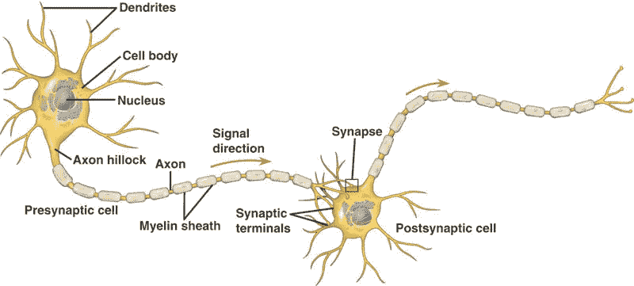
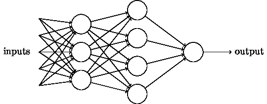

# 学习神经网络是如何给我带来生存危机的

> 原文：<https://towardsdatascience.com/how-learning-about-neural-nets-gave-me-an-existential-crisis-d8e3f42d70b6?source=collection_archive---------5----------------------->

此刻没有人能忽视的一件事是 AI 在我们日常生活中的盛行。我们在日常使用的所有应用程序中都可以看到人工智能的雏形。脸书最近一直用我和我的朋友们的旧记忆困扰着我。他们很好地使用了他们的图像识别算法，与我建立了另一个层次的情感联系，提醒我我已经没有朋友了。

因此，就像所有其他对人工智能感兴趣的产品开发人员一样，我最近开始想办法在我的平台上使用机器学习、神经网络和其他预测算法。我想知道如何让它变得更智能，并显著减少由于数千个基于开关/案例规则的系统而导致的处理过载。所以我开始了解什么是神经网络以及如何实现它的一些基础知识。

开发人工神经网络的方法包括松散地复制我们自己的大脑如何工作。开始时，我没有注意太多的逻辑——但我越是试图理解神经网络如何实现背后的逻辑，它就越让我起鸡皮疙瘩。我知道这听起来很荒谬。我过度使用它，直到我的大脑自动关闭，我在周末剩下的时间里狂看黑白电影 Strangelove 博士，North x northwestern 和 Clerks。

这是两个神经元之间连接的非常精确的细胞表达。人工神经网络也基于非常相似的概念工作——有不同的节点&连接节点的突触。每个节点都被编程为对其输入执行特定的处理。你在神经网络的开始传递某些输入，它经过不同的处理层产生一个输出。Siraj Raval 在他的一个视频中很好地解释了这个概念——他是我此刻的英雄。

此图中的圆圈显示了一个三层神经网络，每层都有不同的节点集。尽管该图看起来非常简单，但是每个节点都内置了许多抽象概念。然而，神经网络如何工作背后的简单思想是，传入的每组输入根据其对输出的贡献大小而被赋予一定的权重。

例如，如果我要选择一家餐馆或酒吧进行约会，我会注意某个地方的以下特征——食物质量、饮料质量、等级、离家距离、音乐类型、屋顶或其他。接下来，我会使用上述所有特征以及约会质量对我以前的约会地点进行手动分类。然后，我会将这些分类数据传入我的神经网络进行训练。这里的输入是一家餐馆的所有特色，输出是约会的质量。在对训练集进行多次迭代之后，神经网络将知道每个特征在产生期望输出中的重要性。然后，它将根据每个要素对输出的影响程度为其分配相关权重。节点之间的每个突触都有自己的逻辑程序，为不同的特征分配相应的权重。

我的神经网络的目的是根据我选择的地点来预测我的约会是令人惊奇还是不那么棒。当然，这是一个非常愚蠢的例子，因为约会的地点与约会的质量关系不大。和你的人际交往能力有很大关系。所以请不要真的设计一个神经网络来预测你约会的质量。然而，这将有助于确定你约会的最佳地点。

好了，这是我将偏离技术细节的时刻，因为这真的让我反思我们的大脑是如何工作的。我们一生都在接受所谓的“训练数据”,以规划我们当前的行为模式。无论我们一天中做什么，都只是我们体内的神经元根据周围环境传递给我们的输入进行计算。我们的突触被训练来分配传递到我们系统的不同输入的权重，这就是我们的个性。

这让我质疑我生活和存在的基础。我是不是一辈子都在无意识地训练自己的神经元，才真正塑造了我现在的人格？我一直是 A 型人格，总是努力不断改进，这真的让我很失望，因为这需要我完全重新编程我的神经元，以改善我人格的某些方面。这一开始听起来确实令人难以置信，但并非完全不可能。

这个训练我们的神经元来改变它们的连接并影响我们行为的过程也被称为神经可塑性。临床心理学家经常使用这一过程来帮助大脑适应新的环境或适应任何类型的伤害或疾病。这个模型给了我们希望，通过有意识地训练我们的大脑，我们有可能从任何对我们心灵造成的严重伤害中恢复过来，事实证明我们的大脑非常灵活——这与传统的观点相反，传统观点认为人类的大脑是僵化的，人类的行为在一定年龄后无法改变。

这怎么可能呢？神经网络中使用的感知器模型意味着，如果我们简单地改变我们每天从周围环境中接收的训练数据，那么我们就可以显著地改变我们提供的输出。现在的困境是——如何准确地过滤训练数据，以便给你的个性塑造理想的形象？这要求我们完全意识到我们是如何度过我们的时间和我们所接触的一切的。一些无意识决策的时刻，我们的神经元以某种方式被编程，以影响我们的决策能力。

这个想法是首先要注意我们是如何做决定的(即使是冲动的决定),并理解我们的神经元是如何权衡每个输入的。一旦我们对我们的神经元如何被编程有了想法，我们就可以开始有意识地权衡传入我们系统的不同输入，以提供符合我们真正想要成为的人的期望输出。

我怀疑没有人读到这里。点击下面的绿色心脏，让我知道你是否做了:)