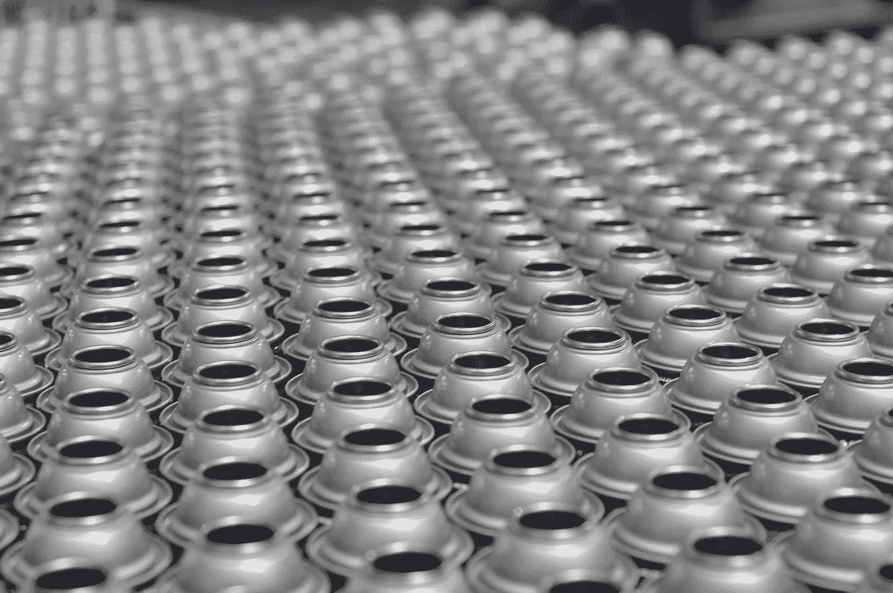
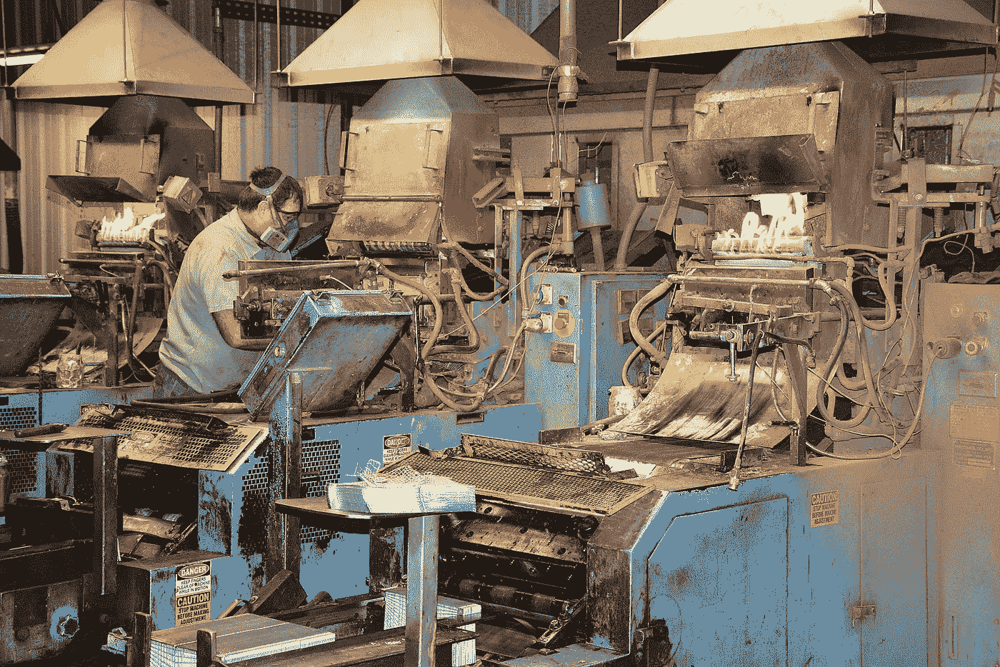
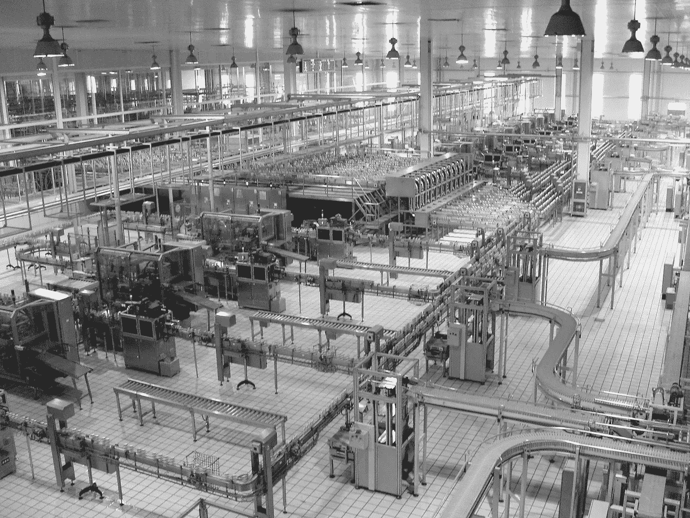
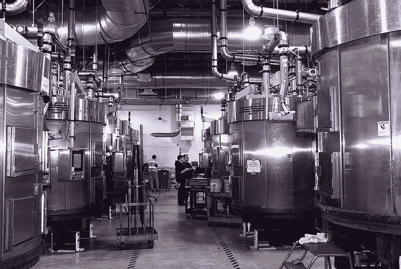

# 机器学习(ML)如何改变制造业

> 原文：<https://towardsdatascience.com/how-machine-learning-ml-is-transforming-manufacturing-dfaaa30e87e4?source=collection_archive---------11----------------------->

对于没有合适的工具来开发产品的公司来说，制造过程既耗时又昂贵。近年来，机器学习(ML)在建造和组装物品方面变得更加流行，使用先进的技术来减少制造的长度和成本。在组装过程中使用[ML](https://www.techemergence.com/machine-learning-in-manufacturing/)有助于创造所谓的智能制造，在智能制造中，机器人以外科手术般的精度将物品组装在一起，同时该技术实时调整任何误差，以减少溢出。

[使用 ML 算法](https://www.nextplatform.com/2018/02/01/machine-learning-opportunity-manufacturing-logistics/)、应用程序和平台可以通过监控其组装过程的质量来彻底变革商业模式，同时优化运营。TrendForce 估计，智能制造将在未来三年内快速增长。该公司预测，到今年年底，智能制造市场的价值将超过 2000 亿美元，到 2020 年将增长到 3200 亿美元，预计复合年增长率为 12.5%。 [WorkFusion](http://www.workfusion.com/?utm_source=other&utm_medium=medium&utm_name=karl-utermohlen&utm_term=how-machine-learning-(ml)-is-transforming-manufacturing) 正通过一系列智能解决方案帮助企业满足其制造需求。

以下是 ML 改变制造业游戏的一些方式。

**1)优化半导体制造**

McKinsey & Company 看到了使用 ML 将半导体制造产量提高 30%的巨大价值。该公司认为，该公司可以通过降低废品率和优化与 ML 的业务。该技术可以使用根本原因分析，并通过简化制造工作流程来降低测试成本。此外，在 ML 上运行的制造设备的年维护成本预计将降低 10%,同时停机时间减少 20%,检测成本减少 25%。

**2)质量控制和 OEE**

术语 OEE 指的是总体设备效率，ML 在提高设备效率方面起着关键作用。这个指标衡量组装设备的可用性、性能和质量，这些都是通过集成深度学习神经网络来提高的，深度学习神经网络可以快速学习这些机器的弱点，并帮助将其最小化。德国企业集团西门子几十年来一直在使用神经网络监控其钢铁厂并提高效率。该公司表示，在过去十年中，它已投资约 100 亿美元收购美国软件公司，包括加入 IBM 的 Watson Analytics，以提高其运营的质量水平。

**3)完善供应链**

ML 还通过改善物流解决方案，包括资产管理、供应链管理和库存管理流程，在实现公司价值最大化方面发挥着重要作用。人工智能(AI)和物联网的成功结合对于现代公司来说是必要的，以确保其供应链在最高水平上运行。世界经济论坛(WEF)和 A.T. Kearny 的一项研究发现，制造商正在寻找将 ML、AI 和物联网等新兴技术与提高资产跟踪准确性、库存优化和供应链可见性相结合的方法。通用电气推出了一套出色的制造套件，它监控制造、包装和交付过程的每一步，是该公司供应链管理的重要组成部分。

**4)更多统计数据**

普华永道预测，更多的制造商将采用机器学习和分析来改善预测性维护，预计未来五年将增长 38%。在此期间，流程可视化和自动化预计将增长 34%，而分析、API 和大数据的集成将使互联工厂增长 31%。麦肯锡补充说，ML 将减少 50%的供应链预测误差，同时也减少 65%的销售损失。

**互联的未来**

制造业中的 ML 有很多值得期待的地方，因为该技术有助于组装厂建立一系列互联的物联网设备，这些设备协调工作，以改善工作流程。从质量控制到资产管理、供应链解决方案和降低开支，ML 正在以多种方式改变制造业的未来。

WorkFusion 提供了 [RPA 解决方案](https://www.workfusion.com/rpaexpress?utm_source=other&utm_medium=medium&utm_name=karl-utermohlen&utm_term=how-machine-learning-(ml)-is-transforming-manufacturing)来帮助希望改善制造流程的公司。