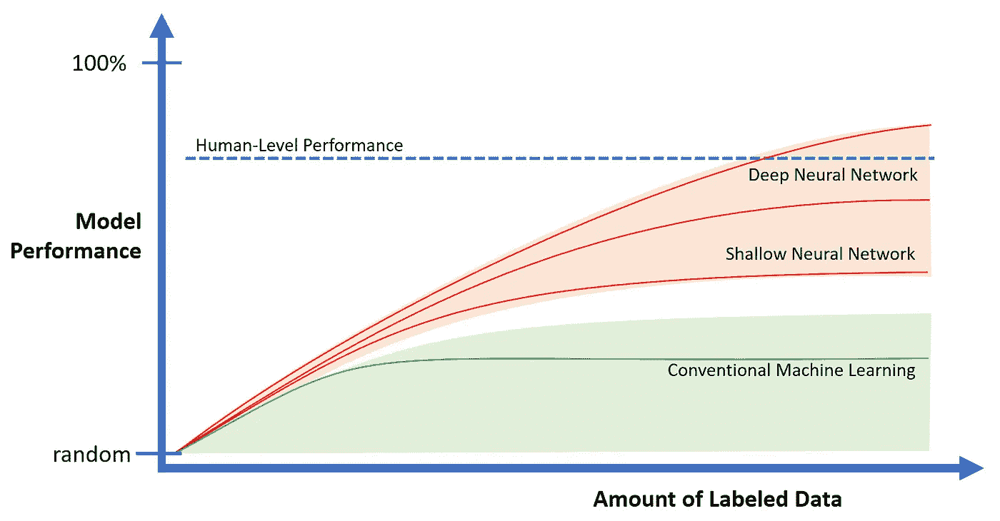
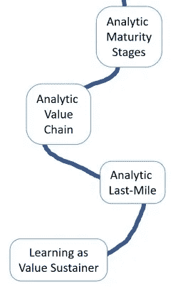

# 管理者应该如何为深度学习做准备:新价值观

> 原文：<https://towardsdatascience.com/how-managers-should-prepare-for-deep-learning-new-values-f29a98b70bd8?source=collection_archive---------15----------------------->

Exploring the unique challenges for managing analytic systems enabled by Deep Learning *[photo by* [*Charlie Wild*](https://unsplash.com/photos/dKb_2w88rsk) *on* [*Unsplash]*](https://unsplash.com/@charles_the1st)

**TL；DR** —请参见末尾的摘要以快速了解概况。

> 本文是[关于深度学习](https://medium.com/@Hackathorn/series-on-how-managers-should-prepare-for-deep-learning-f5b795b36148) 的**管理视角系列文章中的第二篇，面向负责或参与由**深度学习** (DL)使用人工神经网络技术实现的分析系统的管理人员。在处理这些系统时，他们面临混乱的概念和独特的挑战。本文重点关注**新价值**，这些新价值建议了不同的方法来评估组织从支持 DL 的分析中实现的价值。在每一部分的结尾，都有一份外卖为经理们提供了实用的建议。**

# 走向智能有效性

大型 IT 系统为组织和整个社会创造的价值正在从**成本效率**转移到**智能效率**。

正如彼得·德鲁克所说，“效率就是把事情做对；有效性就是做正确的事情。[01]利用这句话，成本效率是指更快、更便宜、更可靠地执行特定任务，而**智能效率是指定制任务以满足特定情况的需求**。

这两者都很重要，但当任务的目的不能完全明确或随各种情况而有很大变化时，更应注重有效性。对于大规模的系统来说尤其如此。

自从计算的早期以来，计算机系统的价值主要在于以降低成本为目标的效率。手动程序在数据采集和报告方面容易出错。早期的计算机应用是简单地在纸上打印工资支票，这比手工写支票有了巨大的效率提高。生成工资单的任务已被精确地定义，因此计算机化的时机已经成熟。

今天，电子商务系统正在帮助成千上万的客户从成千上万的选择中选择正确的产品，这些选择基于各种因素的组合，如价格、畅销、最低成本、最近更新、关联购买和评论星级。没有预先指定的程序，因为功能会根据产品的可用性和客户的独特性不断变化。在这种大规模的情况下，聪明有效是创造价值的关键。

**收获:**作为一名与分析系统相关的经理，要意识到为特殊情况定制标准程序的机会。评估潜在的业务价值，并向 LOB 同事强调这些机会。请技术同事思考如何利用分析，以便以每小时超过 1000 次的速度独特地处理每种情况。在你的组织中培养一个提高智能效率的机会列表。

# 超越已知数据的概括

这些系统的智能有效性取决于对大规模生态系统行为的理解，但也取决于小规模的独特互动。促成因素是**对已知数据**的概括，这与**描述已知数据**形成对比。[02]

*的定义概括*意味着通过从较小(但有代表性的)样本中进行推断，做出一个适用于(有效)广泛情况的陈述(假设)。

这是分析的本质——获取关于一组示例案例的数据，并创建适用于类似案例的模型。在对已知数据进行归纳的分析背后有两个关键假设。首先，训练模型的范例案例必须代表模型将预测的所有案例。第二，训练好的模型必须在一个随机的(有约束的)样本子集上进行验证，以获得准确的预测。

在正常生活中，自文明出现以来，人类凭借直觉一直在超越已知数据进行归纳。事实上，我们作为一个物种的生存依赖于这种能力。最近，我们使用我们的 IT 系统以巧妙的方式描述已知数据，使用常规报告、交互式仪表盘和可视化分析。因此，人类的直觉擅长创造洞见，从而归纳因果关系并预测商业未来。

**要点:**作为一名与分析系统相关的经理，您是否意识到您的组织中有哪些领域超出了人类直觉的能力范围而无法得到正确管理？你能举出这个失败的具体例子吗？导致这个问题的因素是什么？你的企业是否涉足新领域，而多年的业务经验与当前的业务问题并不相关？是否有数据可以充分描述当前问题的例子？

# 一百万个独特的东西

当处理智能有效性情况时，人类直觉的一致性和可靠性是有限的，即使使用描述性分析工具来增强。随着系统复杂性的增加，研究表明直觉本质上是非理性的，因此是次优的。[03]

从管理的角度来看，衡量复杂性的一个标准是经理要负责*百万件独特的事情*(简称 MUT)。[04]让我们考虑三个例子来说明这一点。

假设你是一家小型零售店的老板。您已经在您的社区开展业务多年，并且亲自了解大多数光顾您商店的顾客。你本能地以定制服务独特地对待这些客户，同时保持社区作为一个整体的感觉。当一个陌生人进入你的商店，你热情地迎接他们，并了解他们的独特需求。你的智能效率可能会得 A。那么，你有多少独特的客户？可能有几百个。四舍五入到 10 的幂，对于一个小型零售店来说，独立客户的数量大约是 10 到 10。

假设你成功了，并在你的区域内建立了多个大型商店。现在你的独特客户可能已经增加到 10⁵.你个人是否认识今天光顾你的商店的大多数顾客？大概不会。你为客户服务的智能效率如何？

想象一下，你取得了巨大的成功，将自己的企业发展成为一家全球零售连锁企业，在几十个国家拥有数千家门店。现在这个数字已经轻松超过了 10⁶.为了服务您的客户，您现在在智能有效性方面遇到了一个真正的大问题！你必须处理好你的 MUT！

结论是，**在一百万个独特的事物周围，人类直觉去归纳超越已知数据变得不可靠**。[05]

我们世界的复杂性现在已经超出了我们人类直觉的能力，无法进行大规模的可靠概括，尤其是在经济、社会和政治领域。

分析(能够大规模归纳已知数据以外的信息)变得必不可少。支持这些分析的技术已经从描述性统计(过去一百年)发展到机器学习(过去二十年)和人工神经网络(过去五年)。

请注意，从人类历史的大角度来看，这项技术的发展是最近才出现的！古希腊人没有 MUT 问题。

作为人类，我们必须明智地接受分析，以使我们能够智能有效地应对我们世界日益增长的复杂性。

正如一篇相关文章中所指出的，分析应该用来增强人类的直觉，而不是用自动化流程来取代它。[增强直觉]挑战在于用客观数据驱动的支持来增强人类的直觉，以便超越已知数据进行归纳。

**收获:**作为一名分析系统经理，调查你的组织中必须处理 mut 的关键领域。在集成数据仓库的主要主题领域中寻找线索。您的组织在这些方面表现得足够好吗？如果您的组织能够在这些领域显著提高其智能效率，会带来显著的好处吗？

# 体积—速度—变化

你不必成为一家拥有 1000 家店铺的全球性公司，也能理解和管理一个 MUT。术语*大数据*经常被滥用来兜售你的成功业务和所有人的更好生活的承诺。然而，来自大数据的 3V 概念有助于解释为什么分析可以实现智能有效性。这完全取决于是否有足够的数据来描述这些 mut。

真正的问题是处理需要管理 MUT 情况的*信息内容*。[06]换句话说，充分描述一个 MUT 需要多少位数据？1gb 还是 1pb？[06]

以在您的商店购物的 100 万客户为例，MUT 对收集的这些客户的数据意味着什么？

考虑 3V 的维度— **体积** **速度** **变化** —来解释数据的信息内容，从而解释其支持超出已知数据的概括的潜力。

**体积…** 客户的例子将事物的体积视为独特事物的数量——它的基数。然而，这可能很棘手，取决于如何定义客户。客户是个人、家庭还是大公司？进一步说，这个东西是顾客与商店的互动吗？而且，这种互动是对商店的实际访问，还是对网站的浏览，还是对邮件优惠券的回应，还是对电子邮件报价的回复？因此，您可能认为您的组织只与几百个客户打交道，但是您将被迫处理数百万件事情来理解这些客户。

**速度…** 客户互动的例子涉及事物的速度——单位时间内独特的事物。每当时间维度相关时(通常如此)，数据速度就成为一个重要因素。所有客户关系管理(CRM)系统都是对客户互动进行分析，而不是对客户进行分析。分析结果可能会汇总到单个客户的邮件活动中，但这些结果是基于对这些交互的概括。

**多样性…** 作为个人、家庭或公司的客户的例子处理事物的多样性——单一事物的信息丰富性。充分描述一个人、一个家庭或一个公司所需要的信息是非常不同的。如果你的客户是 IBM 或 Apple，你将需要大量的数据来理解如何正确地为公司客户服务。此外，数据现在因图像、文本、音频、传感器等固有的丰富种类而变得丰富。

因此，MUT 的信息内容是体积、速度和这些东西的变化的乘积。例如，100 件事情(比如管理公司客户，而不是个人)可能足以超过人类直觉碰壁的 IC 水平。作为人类，我们不是被设计(也不是进化)来超越这个水平的。[07]

**要点:**作为一名与分析系统相关的经理，3V 如何影响您在关键的百万独特事物领域的信息内容？

# 特征示例(加标签)

从传统的机器学习到较新的神经网络，一个共同的特征是输入数据的格式，即*示例*(或行、实例)*特征*(列、属性)，加上一个*标签*(或目标)作为特征之一。这就是所谓的*示例* - *特征* - *标签*(简称 EFL)数据格式。[08]

大多数人认为 EFL 数据是表格形式的，因为它通常以类似 Excel 的电子表格形式显示。然而，这是一种误导，因为支持 DL 的模型的特征可能是图像、音乐或其他非结构化数据。神经网络的当前实现将*张量*(多维矩阵)作为数据的基本单位。

其中一个特征可以是一个*标签*(或目标)，该标签表示该示例的一个重要特征。例如，一个客户可以用一个包含各种特征的例子来表示，比如年龄、性别等等。标签可能是他们过去一个月的购买总额。标签特征是“监督”(引导)算法向有效泛化方向优化的目标。

总之，数据分析以感兴趣事物的*示例*开始(并结束)，由一组*特征*描述，其中一个可以是重要特征的*标签*。标签通常是分类值，例如“非常重要客户”，这通常由主观判断决定。

**要点:**作为一名分析系统经理，专注于 EFL 数据中标签的管理。如果数据与其他特征相似，这是模型预期结果的关键陈述。它的值可能是由专家主观设定的，这是昂贵的、容易出错的，并且规模不灵活。

# EFL 数据作为价值驱动因素

在关于新范例的文章中，解释了这个数字。[09]横轴对应于 EFL 数据量，右侧是 MUT 区域。纵轴对应于分析生成模型的良好程度，该模型可以超越已知数据进行归纳。

因此，该图(右上方)表明神经网络是目前处理 MUT 问题的最佳技术。此外，这项技术在某些任务上可以超越人类水平的表现。然而，关键的要求是我们能够收集和整理足够的关于我们 mut 的 EFL 数据。

**要点:**作为一名与分析系统相关的经理，评估可用于解决 MUT 问题的 EFL 数据量。如果数据不足，传统的机器学习技术是否足够？如果有足够的数据，潜在的商业价值是否激励你的组织开发神经网络？你有这样做的资源吗？

# 分析成熟度阶段

分析的价值通常被描述为一系列成熟阶段，对于这些阶段，可以回答某些问题。[10]注意，后面的阶段是超越已知数据的各种形式的概括。

1.  **描述性**——发生了什么？…描述已知数据
2.  **诊断** —为什么会这样？…从相关性中推断因果关系
3.  预测性的 —会发生什么？…推断未来事件的各个方面
4.  **规定性** —应该发生什么？…朝着理想目标优化计划

这个框架意味着……一个公司通过将分析能力从阶段 1 发展到阶段 4 来达到更高的分析成熟度。由于能够解决更广泛的问题，更高的分析成熟度增加了产生更大商业价值的潜力。然而，努力(以及成本、技能、资源、风险)也会增加。

成熟度阶段对于评估分析能力是很有用的，因为它支持问题的类型。它严重依赖于从洞察力中主观得出的人类直觉，如前所述，这可能不足以处理 MUT 问题。

**要点:**作为一名与分析系统相关的经理，评估 IT 系统支持跨各种职能领域的分析成熟度阶段的能力。您的分析是否足以处理当前运营和未来增长的 MUT 问题？

# 分析价值链

在组织研究中，称为“价值链”的框架将价值定义为向消费者交付产品或服务所需的一系列活动。这个概念最早是由迈克尔·波特在他 1985 年的著作 [*【竞争优势】*](https://en.wikipedia.org/wiki/Competitive_Advantage) 中描述的，用来解释一个典型公司在为股东创造价值方面的功能。

让我们从分析价值链的角度将这一范式应用于分析。

Analytic Value Chain as pipeline from data to action

分析价值链是从数据到行动的管道，以智能有效的组织行为的形式产生不断增加的价值。序列从左向右流动(实际操作中有相当大的循环)。原材料是数据，而成品是行动，意在改变公司的行为。

如果您的组织必须处理管理 mut，那么它必须支持所有五个阶段的功能，端到端的结果是数据到行动。其含义是:当分析使业务流程能够智能有效地积极影响客户、产品等时，就创造了商业价值。如果没有通过行动对业务流程产生积极的影响，那么组织就不会受益。有了这些输入，**所有的分析系统都是昂贵的开销！**

**要点:**作为一名与分析系统相关的经理，经理应该采用端到端的关注点，因为这个框架代表了一个价值流，在任何阶段都可能被打断。此外，中间三个阶段是数据科学团队的重点。因此，管理者应该特别注意第一阶段和最后阶段。第一个——Acquire&Curate——处理前面部分讨论的问题，如 MUT 和 EFL。最后一个——操作化&治理——是下一节的主题。

# 分析最后一英里

与大型电气、通信和运输系统一样，众所周知的“最后一英里”通常是这些复杂系统中最昂贵、最慢、最容易出错的环节。从端到端价值链的角度来看，分析也是如此。

分析的最后一英里强调价值链的最后阶段——操作化和治理——处理操作化分析，以及治理其应用。此时，初始 EFL 数据用于训练和验证神经网络模型。该模型以智能有效的方式增强了特定的业务流程，并根据一组策略监控和治理其行为。

当前的实践通常被称为*分析开发*,以表明开发模型的团队和执行其生产应用程序的团队之间的紧密协作。神经网络模型出现了一系列独特的问题:

*   所需的软件能在生产环境中执行吗？做模型预测需要什么？
*   在大型流系统中实施实时模型预测，而不是对数据仓库进行批量预测更新
*   检测到当前模型不再有效，因为操作数据已经偏离了训练数据
*   模型是否需要再培训:再培训可以在生产环境中同时进行吗？在什么时间周期—每天、每小时？
*   检测训练数据中的非预期偏见，如性别/种族偏见。
*   链接到数据治理，将模型作为学习逻辑而非静态逻辑来管理
*   通过冠军挑战者动态不断改进模型性能
*   经理和受影响的消费者对模型结果的可解释性
*   整个端到端分析工作流的管理和可审核性

**要点:**作为一名分析系统经理，分析的最后一英里是你最大的挑战。尽早并经常分配足够的资源，并给予你高度的关注。

# 作为价值维系者的学习

最后一个主题是，通过分析系统学习成为价值的长期维持者。一旦这种学习停止，系统的价值就会下降，因为模型概括新例子的能力会减弱。

Testa 人工智能总监 Andrej Karpathy 在他 2017 年的文章 [Software 2.0](https://medium.com/@karpathy/software-2-0-a64152b37c35) 中最好地捕捉了这种范式转变。他写道…

> 因为现在很容易收集关于许多业务问题的数据，所以与编写显式静态代码相比，可以使用这些数据更快、更有效地训练神经网络模型。这些模型实际上是数据驱动的，而不是像前 50 年的商业计算那样是代码驱动的。

Karpathy 区分了静态逻辑(硬编码)和学习逻辑(示例训练)，并假设这些示例有足够的数据。

让我们再进一步*学习逻辑*，不断对新的示例数据进行再训练。

通常的情况是……一个模型在一组原始的例子上被训练和验证。创建这样的范例集是一项困难、昂贵和劳动密集型的工作。该模型在生产系统中投入运行后，表现符合预期。而且，由于创建这些新示例的工作量很大，该模型不会在新示例上重新验证。

请注意潜在的假设…新的示例被认为与旧的示例相似(具有代表性),因为业务没有发生重大变化。因此，重新训练是不值得的。

然而，对于大多数组织来说，当前环境的变化超出了人们的想象。此外，数据基础设施正在走向成熟，因此可以收集新的示例作为正常操作的一部分，如果该功能作为模型操作化的一部分实现的话。

**要点:**作为一名分析系统经理，将您的分析系统从静态逻辑转移到学习逻辑和学习逻辑的商业价值是什么？你有实现这一价值的资源吗？

# 摘要

本文为定义和确定大型分析系统的价值构建了一个循序渐进的论证。该论点用基本概念解释了这些步骤，这些基本概念可以在所有管理级别上讨论，并为评估和协作提供了一个共同的基础。

增强始于对比有效性(做正确的任务)和效率(做正确的任务)。重点放在*智能有效性*——定制任务以满足特定情况的需求。关键的能力是*根据关于过去情况的数据*概括新的情况，从而实现任务的定制。人类的直觉很好地服务于这一功能，直到最近复杂性超过了它的极限。当管理超过*百万个唯一事物*(简称 MUT)时，这个限制就会出现。然而，事物在*数量、速度和多样性*方面存在差异，因此一些快速发展的复杂事物可能会非常难以管理。

捕捉这种复杂性的格式是一组*示例*，每个示例都有其*特性*，外加一个表示目标值的*标签*。这种“示例-特征-标签”格式的数据称为 EFL 数据，它是分析系统的价值驱动因素。随着 EFL 数据量的增加，DL 模型的表现越来越好，最终超过了人类水平的表现水平。

讨论转移到处理各种问题的四个*分析成熟度阶段*。这与*分析价值链*形成对比，后者展示了将数据转化为行动的增值渠道。突出显示的是分析的最后一英里，这是可操作的&治理步骤，通常是为组织产生价值的瓶颈。

最后一部分关注*作为价值维系者的学习*。对静态逻辑、习得逻辑和学习逻辑进行了区分。后者是长期保值的唯一选择。

> **感谢…** 位于[的 DL 研究小组，博尔德的数据侦探们](https://www.linkedin.com/groups/6525462)在过去几个月里与我们进行了讨论，帮助我们理清了这些想法。
> 
> **最后…** 如果你从这些文章中受益，请支持 [my Patreon](https://www.patreon.com/BizSmartAnalytics) 创建并指导小型经理同行小组，探索由深度学习支持的分析系统的关键管理问题。如果同事对该计划感兴趣，请分享链接或推文。谢谢，理查德

# 尾注

[01]引用自德鲁克的著作 [*《有效的管理者:把正确的事情做好*](https://www.amazon.com/Effective-Executive-Definitive-Getting-Things/dp/0062574345/) 。这本书的 12 条经验的简明摘要似乎非常适用于管理支持 DL 的系统。此外，1993 年 5 月的文章*对这种效率-效益的区别进行了详尽的阐述。*

*[02]概括是数百年来科学、逻辑和统计中的一个基本概念。来自维基百科的[定义抓住了它的本质:*通过抽象共同属性*从具体实例中形成一般概念，这导致定义形成整体的相互关联的部分。术语抽象是遵循一般规则的过程的结果，就像数据分析算法一样。](https://en.wikipedia.org/w/index.php?title=Generalization&oldid=854275398)*

*[03]丹·艾瑞里 2008 年出版的《可预测的非理性:塑造我们决策的隐藏力量 是一本革命性的书，讲述了当今社会动态，无论是个人还是社会，似乎都以违背理性逻辑的方式表现。因此，基于理性的模型充其量是误导性的。2016 年，[《福布斯》的乔诺·培根采访了艾瑞里](https://www.forbes.com/sites/jonobacon/2016/04/21/dan-ariely-on-building-more-human-technology-data-artificial-intelligence-and-more/#1a605a68c635)，探究*我们如何【能够】帮助机器更好地理解我们【人类】*。有一句话引人注目:*我认为我们应该与人性合作，而不是试图违背人性，并且……看看人们犯的错误，并……想想纠正这些错误的途径是什么，以及需要什么样的系统。**

*【04】术语 *thing* 是有意的非正式用法，用于泛指某一情况下涉及的物体或事件。正式术语是*实体*，在[韦氏词典](https://www.merriam-webster.com/dictionary/entity)中定义为*独立存在*的任何事物。在数据结构化中，术语实体在[实体关系模型](https://en.wikipedia.org/wiki/Entity%E2%80%93relationship_model) (ER 模型)中具有正式角色，即在一种情况下相互关联的*感兴趣的事物*。*

*【05】**TBD**:**需要研究**来支持断言*人类无法超越 MUT* 进行可靠的概括。阅读大卫·温伯格 2012 年的著作《大到不知道:重新思考知识》 ,寻找灵感。*

*【06】术语 [*信息量*](https://en.wikipedia.org/wiki/Self-information) (或自我信息)是分析学的一个基础性课题，涉及到 1948 年 Claude Shannon 的 [*信息论*](https://en.wikipedia.org/wiki/Information_theory) ，形式化为 [*熵*](https://en.wikipedia.org/wiki/Entropy_(information_theory)) 的概念。它是从随机数据样本中获得的“惊喜”。惊喜越多，熵就越多。如果来自数据的惊奇加倍(即，提供两倍的选择)并且继续加倍(例如，乘以 2、4、8…)，则信息内的比特数(即，其熵)是 1、2、3…*

*[07]解决方案是增强人类的直觉，而不是用自动化过程取代它。这一点——增强而不是自动化——在[新范例文章](/how-managers-should-prepare-for-deep-learning-new-paradigms-28de63054ea6)中有解释。分析可以是将信息复杂性降低到人类直觉可以理解并成功执行的水平的工具。这个类比就像一架望远镜或显微镜，可以增强人类感官和直觉来观察和理解非常大或非常小的物体。在上面的注释[03]中，增强应该有助于人类直觉中的错误。*

*[08]这是假设模型的常规*监督*(相对于*非监督*)训练。通过预测“真实”标签值的准确度来监督(指导、评估)训练。这组例子被分成一个较大的*训练集*和一个较小的*测试集*。所有训练示例的每个循环被称为一个*时期*。在每个时期之后，记录训练和测试示例的标签和预测值的不匹配，并绘制在*学习曲线*中。该图表显示了该模型在*偏差*(接近正确值)和*方差*(接近某个值)误差方面的泛化能力。这总结了当今大多数传统的机器学习实践。然而，深度学习实践正在以令人惊讶的方式扩展这个框架，这将在未来的文章*新视野*中讨论，该文章讨论了*元学习*研究。*

*[09]此图表在[新范例文章](/how-managers-should-prepare-for-deep-learning-new-paradigms-28de63054ea6)的数据驱动性能部分有更详细的解释。这是吴恩达在 [Coursera DL 专业化](https://www.coursera.org/specializations/deep-learning)中题为“规模推动 DL 进步”的幻灯片的简化版。*

*[10]大多数显示分析成熟度四个阶段的图表都是 Gartner 在 2012 年 3 月发布的。然而，有人引用了汤姆·达文波特 2007 年的一篇文章。甚至维基百科也对其起源保持沉默。也许这个图表应该被重新命名为分析能力阶段(或者级别)。*