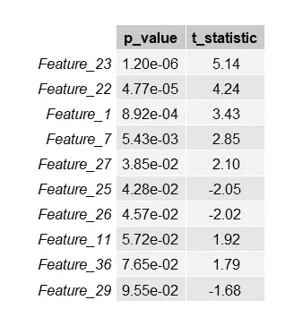
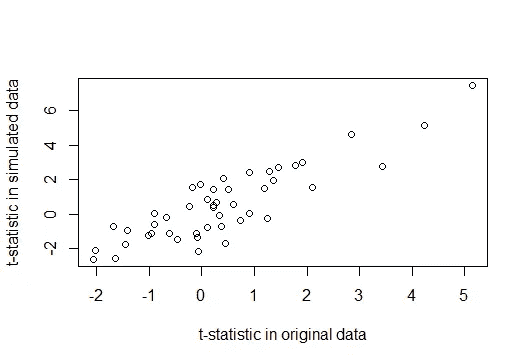
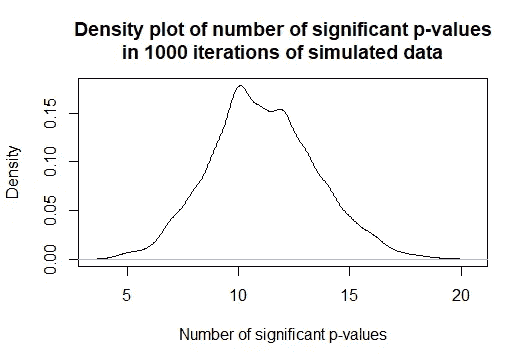
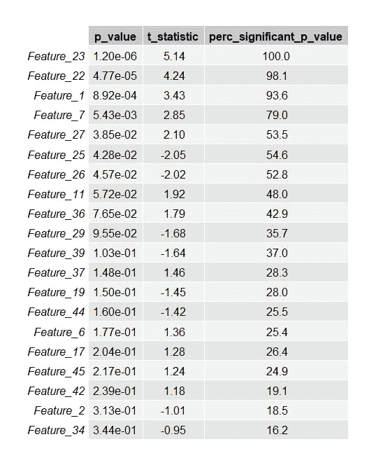

# p 值二分法会如何影响统计测试中得出的结论？

> 原文：<https://towardsdatascience.com/how-might-p-value-dichotomization-affect-the-conclusions-achieved-in-statistical-tests-54ab8f3e5873?source=collection_archive---------10----------------------->

## 具有相似数据属性的模拟数据中显著 p 值缺乏可重复性的探索性分析

研究人员目前主要关注的一个问题是以前和现在的研究结果缺乏可重复性。在当前和未来的研究中，有一种认识认为需要采取措施来减少假阳性的估计数量。然而，对于实现这一目标的最佳战略存在分歧。战略范围从更自愿和理想主义的到更有限制性和务实的。

在获得更具可重复性的结果的过程中，一个激烈的争论是降低甚至消除单变量测试的典型 0.05 临界值(此处[为争论的介绍)。典型的单变量统计分析包括对数据集每个特征的单变量测试(如病例和对照之间的学生 t 检验)中的 p 值进行计算。从几十个要素中，观察到一些具有显著 p 值的要素，因为它们低于截止值。然后，根据所分析的因素，阐述了与这些特征中发现的显著差异相一致的故事。](https://www.nature.com/news/one-size-fits-all-threshold-for-p-values-under-fire-1.22625)

这种策略承认，在显著性和非显著性 p 值的这种二分法过程中，可能会产生一些假阳性和假阴性。一个 p=0.049 的特征的结果和另一个 p=0.051 的特征的结果实际上有多大差别？直观上，差异可以忽略不计。然而，我感觉有一种默契，即一定的任意限制对于删除非信息数据是必要的，这样结果(以及对这些结果的解释)就更容易被潜在的读者理解。基本上是通过分析来避免瘫痪。

我理解这种简化的需要。然而，我认为目前对于这种简化会在多大程度上改变结论缺乏理解。我发现探究由于 p 值的二分法，结果的可重复性有多低很有趣。为此，我使用了 113 个样本(57 个对照样本和 56 个病例样本)和 46 个特征的代谢组学数据集。在下一张表中，我显示了 p 值最低的 10 个要素及其相关的 t 统计量(绝对值大于 1.96 表示 p 值小于 0.05):

所以我们有 7 个显著不同的特征。有了这 7 个特征，我们就产生了一个关于这些差异是如何被所研究的因素解释的好故事，并且我们有了一篇文章。

但是，如果我们模拟与分析的数据集具有相同属性的数据，会发生什么呢？t 检验研究两组正态分布样本的均值之间的差异，考虑每组中样本的数量和标准差。如果我们模拟具有相同特征的数据，我们应该在 t 检验中观察到相似的结果。这种模拟数据应该是后来试图复制相同效果的研究中发现的数据的最佳代表。

这是在原始数据集和模拟数据集中估计的 46 个 t 统计量(每个要素一个)的比较:

当模拟具有相同分布的数据时，模拟的数据将不会与原始数据完全相同。生成的略有不同的数据集解释了观察到的略有不同的 t 统计。

然而，当我们对 p 值进行二分法处理时，原始数据集中的 t 统计量和模拟数据集中的 t 统计量之间的高度相关性会恶化。下图左图中的红线表示 1.96 的界限，它区分了显著和不显著的结果。我们可以观察到，在模拟数据集中有一些值高于 1.96，而在原始数据集中有一些值低于 1.96。因此，模拟数据集中会有几个更重要的 p 值。在下面的右图中，我们可以更好地观察二分法的效果(0 =不显著；1 =显著)。这种二分法在质量较差的模拟数据集和原始数据集之间进行比较。

这些不同的显著和非显著结果的产生帮助我们更好地理解 p-hacking 的本质，这是一组注定要使显著 p 值的数量最大化的实践。通常，我们将 p-hacking 与试图尽可能扭曲数据以生成更多重要 p 值的恶意面孔联系在一起。然而，我们需要理解的是，具有相同分布的重复数据可以产生数量大不相同的显著 p 值。这是在 1000 次模拟数据迭代中发现的显著 p 值数量的密度图:

因此，如果不扭曲数据，而只是在处理后查看“复制数据”，我们可能会发现不同数量的 p 值。提高数据质量的可能措施范围有助于意外地找到一种最大化显著 p 值生成的配置；我们发现*后验*关于这种最大化是如何产生的合理解释，而不是通过数据改进，而不是通过掷骰子直到得到正确的组合。最大限度地减少非自愿的 p-hacking 实践可能需要加强对数据操作的限制，对执行这种操作的必要性进行更深刻的解释，或者如果不是绝对必要的话，简单地删除 p-值二分法。

当将 p 值二分法时，我们实际上是将数值数据转化为二元分类数据。因此，我们可以通过分类性能度量标准(如 ROC 曲线下的[面积](https://en.wikipedia.org/wiki/Receiver_operating_characteristic) (AUROC ))来开发对假阳性和假阴性的直觉。这种度量有助于直观地了解分类模型在不产生假阳性的情况下找到真阳性的能力。

通过 AUROC，我们可以比较在原始数据集中获得的显著和非显著 p 值在模拟数据集中的统计分析中是如何复制的。如果我们对模拟数据进行 1000 次迭代，对得到的 AUROC 值进行分析，我们得到的是得到的 AUROC 值的这个密度图(是“AUROC 值”，不是“AUROC 曲线”；抱歉:)):

你真的会相信预测分类和获得分类之间的分类仅仅比 0.7 好一点的模型吗？这就是在随后的研究中用相同的数据分布获得的显著 p 值的可重复性。

当通过 Benjamini-Hochberg 调整 p 值时，没有发现有意义的改善(发现 1.00 值中的尖峰；然而，这是与非常低数量的有效 p 值的产生相关的假象)。

p 值校正有助于处理执行的测试数量，但可能无法帮助处理将数值变量转换为二进制变量时信息是如何失真的。

对模拟的 AUROC 值的分析应该是 p 值二分法对可重复研究的可能有害后果的另一个例子。

我相信，大多数研究人员至少有一些直觉，知道在这种二分法之后，信息有多糟糕，以及在未来的研究中，结果可能不会总是重现。然而，这种影响的强度可能被低估，因为 p 值和 t 统计的解释很困难。更好地理解这种恶化的可能方法是显示某个特性具有显著 p 值的模拟迭代的百分比。下表比较了 p 值、t 统计量和 1000 次模拟迭代中 p 值显著的百分比:

为什么特征 26 比特征 11 更重要，而特征 26 的显著差异在未来的研究中可能只再现了 4.8%呢？

依我看，像第三个这样的度量标准可以更好地理解每个特性的能力，以区分病例和控制。更容易检测到三个特征可以作为区分病例和对照的单一生物标记。此外，其他几个特征也显示出一定的辨别能力。然而，这种能力似乎是部分的，而是由可能通过特征工程(例如，PCA)或多变量分析来分析的高级机制来调节。试图基于几个特征来叙述一个故事是没有任何意义的，这些特征显示出在具有类似分布的未来数据中再现的能力略好于 50%。此外，故事的质量将会提高，因为需要与其他特征的部分差异保持一致。最后，这种带有部分歧视的其他特征的报告将减少参与 p-hacking 的动机。

我对这些现象背后的统计学基础缺乏了解，这让我不愿意陷入一些武断的结论。然而，我有一种直觉，可以取得一些进展，以确保为解释所取得的成果而创造的故事更加可靠。作为一种选择，我认为至少有必要帮助读者更清楚地了解关于后来研究结果可重复性的实际观点。