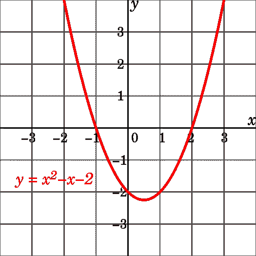
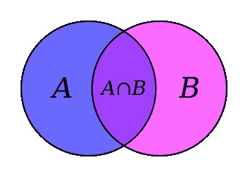
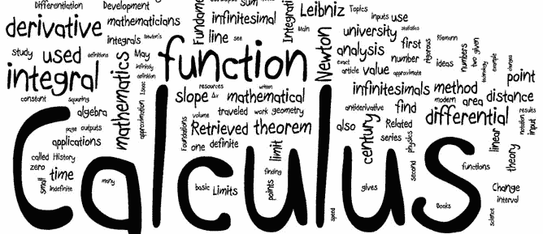
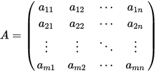

# 一个 IT 工程师需要学多少数学才能进入数据科学/机器学习？

> 原文：<https://towardsdatascience.com/how-much-maths-does-an-it-engineer-need-to-learn-to-get-into-data-science-machine-learning-7d6a42f79516?source=collection_archive---------1----------------------->

**注意**:如果你正在寻找一篇关于数据科学的各种数学资源的更全面的文章，请看看这篇文章。

 [## 数据科学的基本数学

### 成为更好的数据科学家需要掌握的关键主题

towardsdatascience.com](/essential-math-for-data-science-why-and-how-e88271367fbd) 

## 免责声明和序言

一、免责声明，我不是 IT 工程师:-)

我是一名技术开发工程师，从事半导体领域的工作，特别是高功率半导体，日常工作主要是处理半导体物理、硅制造过程的有限元模拟或电子电路理论。当然，在这一努力中有一些数学，但无论好坏，我不需要涉足一个数据科学家所必需的数学。

然而，我有许多 IT 行业的朋友，并观察到许多传统的 IT 工程师热衷于学习或为数据科学和机器学习或人工智能的激动人心的领域做出贡献。

我正在涉足这个领域，学习一些可以应用到半导体器件或工艺设计领域的技巧。但是当我开始深入这些令人兴奋的科目时(通过自学)，我很快发现我不知道/只有一个初步的想法/忘记了我在本科学习的一些基本数学。[在这篇 LinkedIn 文章中，我漫谈一下](https://www.linkedin.com/pulse/whys-hows-studying-mathematics-mldata-science-preamble-sarkar) …

现在，我拥有美国一所著名大学的电子工程博士学位，但如果没有复习一些基本的数学知识，我仍然觉得自己在扎实掌握机器学习或数据科学技术方面的准备不完整。

无意冒犯 IT 工程师，但我必须说，他/她的工作性质和长期培训通常会让他/她远离应用数学世界。(S)他可能每天都在处理大量的数据和信息，但可能不强调这些数据的严格建模。通常，有巨大的时间压力，重点是“*将数据用于你的迫切需要，并继续前进*”，而不是对其进行深入的探测和科学探索。

然而，数据科学应该永远是关于科学的(*而不是*数据)，沿着这条线索，[某些工具和技术变得不可或缺](https://medium.freecodecamp.org/how-machines-learn-a-practical-guide-203aae23cafb)。

> 这些工具和技术——通过探索潜在的动态来模拟一个过程(物理的或信息的),严格估计数据源的质量，训练人们从信息流中识别隐藏模式的感觉，或清楚地理解模型的局限性——是合理的科学过程的标志。

它们通常在应用科学/工程学科的高级研究生课程中讲授。或者，你可以通过类似领域的高质量的研究生水平的研究工作来吸收它们。不幸的是，即使是十年的传统 IT 职业生涯(开发操作系统、数据库或 QA/测试)也无法严格传授这种培训。简单地说，没有必要。

## *它们变化的次数*

直到现在。

您看，在大多数情况下，对 SQL 查询有无可挑剔的了解，对总体业务需求有清晰的认识，并对相应的 RDBMS 的一般结构有所了解，足以执行提取-转换-加载循环，从而为任何称职的 IT 工程师为公司创造价值。

但是，如果有人突然来访，并开始问一个奇怪的问题，如“*你的人工合成测试数据集足够随机吗*”或“*你如何知道下一个数据点是否在你的数据底层分布的 3-sigma 限制内*”，会发生什么呢？或者，即使隔壁隔间的计算机科学毕业生/书呆子偶尔开玩笑说*任何有意义的数据表(也称为矩阵)数学运算的计算负载随着表*的大小(即行数和列数)非线性增长，也会令人恼火和困惑。

> 这类问题越来越频繁和紧迫，因为数据是新的货币。

执行官、技术经理、决策者不再满足于仅仅通过传统 ETL 工具获得的干巴巴的表格描述。他们希望看到隐藏的模式，感受列之间的微妙交互，希望获得完整的描述性和推理性统计数据，这些统计数据可能有助于预测建模，并将数据集的投影能力扩展到远远超出其包含的值的直接范围。

> 今天的数据必须讲一个故事，或者，如果你愿意，唱一首歌。然而，要聆听它美妙的旋律，你必须精通音乐的基本音符，这些是数学真理。

事不宜迟，让我们来看问题的关键。如果一个普通的 IT 工程师想进入商业分析/数据科学/数据挖掘领域，他必须学习/更新的数学基本主题/子主题是什么？我将在下面的图表中展示我的想法。

## 基础代数、函数、集合论、绘图、几何

从根源开始总是一个好主意。现代数学的大厦是建立在一些关键基础上的——集合论、泛函分析、数论等。从应用数学学习的角度来看，我们可以通过一些简洁的模块(排名不分先后)来简化对这些主题的学习:

a)集合论基础，b)实数和复数及基本性质，c)多项式函数，指数，对数，三角恒等式，d)线性和二次方程，e)不等式，无穷级数，二项式定理，f)排列和组合，g)图形和绘图，笛卡尔和极坐标系统，圆锥曲线，h)基本几何和定理，三角形性质。

## 结石

伊萨克·牛顿爵士想要解释天体的行为。但是他没有足够好的数学工具来描述他的物理概念。因此，当他躲在他的乡村农场里躲避英格兰城市爆发的瘟疫时，他发明了这个(或某种现代形式的)数学分支。从那时起，它被认为是任何分析研究的高级学习的门户——纯科学或应用科学，工程学，社会科学，经济学，…

毫不奇怪，微积分的概念和应用出现在数据科学或机器学习领域的许多地方。涉及的最基本主题如下-

a)单变量函数、极限、连续性和可微性，b)中值定理、不定形式和洛必达法则，c)最大值和最小值，d)乘积和链法则，e)泰勒级数，f)积分学的基本和中值定理，g)定积分和反常积分的计算，h)β和γ函数，I)二元函数，极限、连续性、偏导数，j)常微分方程和偏微分方程的基础。

## 线性代数

在**上得到了新朋友建议*脸书*？一个久违的职业联系突然在 ***LinkedIn*** 上加了你？ ***亚马逊*** 突然推荐了一本超赞的言情-惊悚小说给你下次假期阅读？还是 ***网飞*** 为你挖掘出一部纪录片中那颗鲜为人知的宝石，恰好符合你的口味和心情？**

如果你学习了线性代数的基础知识，那么你就拥有了关于[基本数学对象的知识，这是科技行业](http://www.uh.edu/engines/epi2514.htm)所有这些成就的核心，这种感觉难道不好吗？

至少，你会知道控制你在 ***目标*** 上购物的数学结构的基本属性，你如何使用 ***谷歌地图*** ，你在 ***潘多拉*** 上听哪首歌，或者你在 ***Airbnb*** 上租谁的房间。

要研究的基本主题是(无论如何不是有序或详尽的列表):

a)矩阵和向量的基本性质——标量乘法、线性变换、转置、共轭、秩、行列式，b)内积和外积，c)矩阵乘法规则和各种算法，d)矩阵求逆，e)特殊矩阵——方阵、单位矩阵、三角矩阵、关于稀疏矩阵和密集矩阵的概念、单位向量、对称矩阵、埃尔米特矩阵、斜埃尔米特矩阵和酉矩阵，f)矩阵分解概念/LU 分解、高斯/高斯-乔丹消去法、解 Ax=b 线性方程组，g)向量空间、基、跨度、正交性、正交性、线性最小二乘法

这里有一篇很好的关于线性代数的文章。

## 统计和概率

> 只有死亡和税收是确定的，其他都是正态分布。

在关于数据科学的讨论中，牢固掌握统计学和概率的基本概念的重要性怎么强调都不为过。该领域的许多从业者实际上将机器学习称为统计学习。当我在研究我的第一个机器学习 MOOC 时，我看了广为人知的“[统计学习简介](http://www-bcf.usc.edu/~gareth/ISL/)”，并立即意识到我在这个主题上的概念差距。为了填补这些空白，我开始参加其他侧重于基本统计和概率的 MOOCs 课程，并阅读/观看相关主题的视频。这个主题是巨大的和无止境的，因此有重点的规划是至关重要的，以涵盖最基本的概念。我试图尽我所能把它们列出来，但我担心这是我最欠缺的地方。

A)数据汇总和描述性统计，中心趋势，方差，协方差，相关性，B)概率:基本思想，期望，概率演算，贝叶斯定理，条件概率，c)概率分布函数-均匀，正态，二项式，卡方，学生 t 分布，中心极限定理，d)抽样，测量，误差，随机数，e)假设检验，A/B 检验，置信区间，p 值，f)方差分析，g)线性回归，h)功效，效应大小，测试方法，I)研究和实验设计。

这是一篇关于数据科学家统计知识的[必要性的好文章。](https://medium.com/towards-data-science/statistics-review-for-data-scientists-and-management-df8f94760221)

## 专题:最优化理论，算法分析

这些主题与应用数学中的传统论述几乎没有什么不同，因为它们在专业研究领域(理论计算机科学、控制理论或运筹学)中最相关和最广泛使用。然而，对这些强大技术的基本理解在机器学习的实践中可以是如此富有成效，以至于它们在这里值得一提。

例如，几乎每种机器学习算法/技术都旨在最小化受到各种约束的某种估计误差。这是一个最优化问题，通常通过[线性规划](https://en.wikipedia.org/wiki/Linear_programming)或类似的技术来解决。另一方面，理解计算机算法的时间复杂性总是一种非常令人满意和深刻的体验，因为当算法应用于大型数据集时，它变得极其重要。在这个大数据时代，数据科学家通常需要提取、转换和分析数十亿条记录，因此他必须非常小心地选择正确的算法，因为它可以决定惊人的性能或彻底的失败。算法的一般理论和属性最好在正式的计算机科学课程中学习，但要理解如何分析和计算它们的时间复杂性(即，对于给定大小的数据，算法运行需要多长时间)，必须对数学概念有基本的了解，例如 [*【动态编程】*](https://medium.freecodecamp.org/demystifying-dynamic-programming-3efafb8d4296) 或*递归方程*。熟悉数学归纳法 的**[*证明的技巧也会非常有帮助。*](https://en.wikipedia.org/wiki/Mathematical_induction)**

## **收场白**

**害怕吗？作为先决条件要学习的令人费解的主题列表？不要害怕，你会随时随地根据需要学习。但是目标是让你的心灵之窗和门保持敞开和欢迎。**

**甚至还有一门简明的 MOOC 课程让你入门。注意，这是一门初级课程，用于更新您高中或大一水平的知识。这里有一篇[关于 kdnuggets 上 15 门最佳数据科学数学课程的总结文章。](https://www.kdnuggets.com/2015/09/15-math-mooc-data-science.html)**

**但你可以放心，在刷新这些话题之后，其中许多你可能在本科时就已经学习过，甚至学习过新概念，你会感到如此有力量，你一定会开始听到数据唱出的隐藏的音乐。这被称为成为数据科学家的一大飞跃…**

**#数据科学，#机器学习，#信息，#技术，#数学**

**如果您有任何问题或想法要分享，请通过[**tirthajyoti【AT】Gmail . com**](mailto:tirthajyoti@gmail.com)联系作者。此外，您可以查看作者的 [**GitHub 资源库**](https://github.com/tirthajyoti) 中其他有趣的 Python、R 或 MATLAB 代码片段和机器学习资源。也可以[在 LinkedIn 上关注我](https://www.linkedin.com/in/tirthajyoti-sarkar-2127aa7/)。**