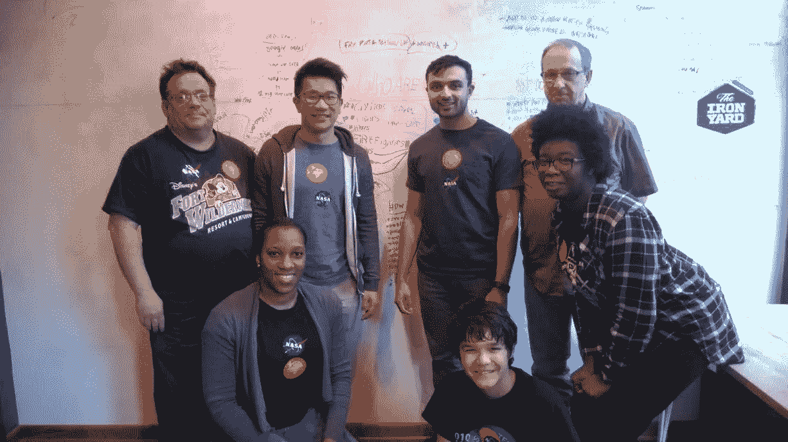
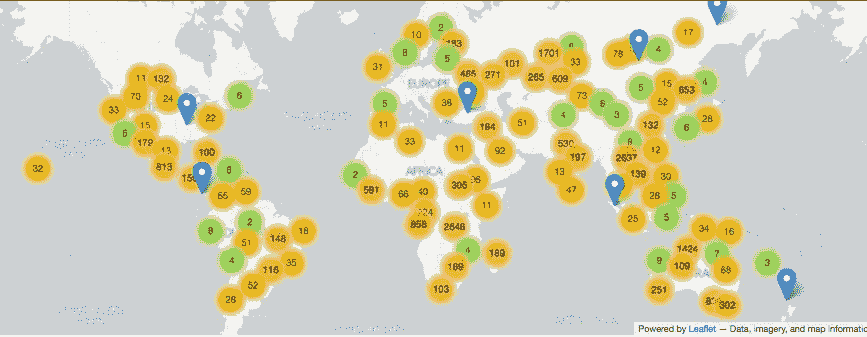

# 我的团队如何在我们的第一次黑客马拉松中赢得人民选择奖

> 原文：<https://towardsdatascience.com/how-my-team-won-the-peoples-choice-award-at-our-first-hackathon-d9ca3778e1d4?source=collection_archive---------3----------------------->

## 现在我们在争夺全球大奖。[投票给余烬警戒！](https://2017.spaceappschallenge.org/vote?q=Ember%20Alert)

From left-to-right and top-to-bottom: Eric MacEwen, Adrian Nip, Tanweer Rajwani, Paul McLaughlin, Kim Andrew, Sam MacEwen, Caroline Dikibo

在 http://www.emberalert.co/[查看我们的网络应用程序](http://www.emberalert.co/)

两个周末前，我参加了我的**第一次**黑客马拉松… **，我的团队赢得了人民选择奖！**现在我们正在角逐全球大奖，而[可能需要您的投票](https://2017.spaceappschallenge.org/challenges/warning-danger-ahead/and-you-can-help-fight-fires/teams/ember-alert/project)。

我们参加了 [2017 休斯敦 NASA 太空应用挑战赛](https://2017.spaceappschallenge.org/)。事情发生的时候，我刚刚进入休斯顿的一个编码训练营 [Digital Crafts](http://www.digitalcrafts.com/) 两周。所以我花了两周时间学习 Python，以及一些非常基础的 HTML/CSS 和 Javascript，这些都是我在训练营的前期工作中学到的。而且，不知何故，我最终加入了一个我拥有最多开发经验的团队。

# 我学到了什么？

> 参加黑客马拉松时，经验水平并不重要，但快速学习的心态至关重要。
> 
> 不要害怕寻求帮助。
> 
> 如果你的黑客技术不是最炫的，也不用担心。现在就做你能做的，如果将来有能力扩展，那就太好了。
> 
> 做好结束时精疲力尽的准备。
> 
> 团队合作让梦想成真。

# 灰烬警报的诞生

黑客马拉松跑了两天。我认识的唯一参加的人是我的高中朋友阿德里安，他也不认识那里的其他人；所以我们直到周六早上到达那里才组队。从一开始，你就可以看到人们开始为他们的团队承担他们的角色。并不是每个人都有突破性的想法。所以“创造者”很早就显现出来了。对我们来说，那就是 Adrian，他的背景是项目管理、工程和创业。他很快就想到了使用无人机为处理野火的人们创建快速反应策略的愿景。任何对使用无人机或灭火感兴趣的人都很快加入了我们的团队。令人惊讶的是，**这是我们所有人的第一次黑客马拉松**除了 Sam 和 Eric，他们之前参加了 NASA 的太空应用挑战赛。

唯一的问题是……我们没有无人驾驶飞机，也不知道如何自动应对火灾。但我们的想法有一个基础:我们想用技术帮助任何人处理火灾。我们的目标消费者既是救火的紧急服务团队，也是想要逃离火灾的平民。

小组形成后，我们急忙跑到各个角落，开始设计我们的黑客。我们很快确定了每个人的优势，并相应地划分了研究。保罗和我是数据人员。阿德里安和埃里克是硬件人员。金和萨姆是设计人员。卡罗琳和我成了开发者。我们花了最初的几个小时研究我们有哪些可用的资源。由于黑客马拉松是由美国国家航空航天局赞助的，我们可以公开访问他们所有的数据集。

**我们很快就意识到，我们最初的计划很难在 48 小时内实现。所以我们开始缩小规模。**我们知道我们既想帮助紧急服务机构，也想帮助平民，但由于我们有最后期限，我们决定把重点放在平民身上。我们知道我们想帮助他们避免处理火灾时的危险情况，所以我们研究了人们在应对火灾时遇到的问题。

我们的黑客很快从无人机扩展到一个网络应用程序，当附近发生火灾时，它会向人们发出警报。我们利用了美国宇航局提供给我们的[活跃火情数据。我们的目标是使用谷歌地图的 API 并利用他们的路由算法。不幸的是，我们的 48 小时的最后期限和缺乏开发经验，使我们无法钻研它谷歌地图。我们满足于使用](https://earthdata.nasa.gov/earth-observation-data/near-real-time/firms/active-fire-data)[leafle JS](http://leafletjs.com/)，一个用 javascript 生成的开源地图 API。经过一点修补和折腾，我能够在传单的地图上绘制美国宇航局的数据集。现在我们有了一个交互式地图，允许用户看到他们附近和世界各地所有活跃的火灾。

[Ember Alert’s interactive map](http://www.emberalert.co/). It displays active fires happening around the world.

**这听起来很简单，但是由于我们组中没有人接触过使用 javascript，我们开始的时候有点像无头鸡。我遇到的最具挑战性的问题是将 NASA 的 CSV 格式的数据转换成与传单兼容的 JSON。幸运的是，我在 github 上找到了一个[项目，我能够在我们的项目中利用它。](https://github.com/perrygeo/leaflet-simple-csv)**

我们项目的第二层是为人们建立一个警报系统，以防附近发生火灾。随着我对后端开发和数据库管理的了解越来越多，这一部分仍然是一个未完成的工作。但这个想法是，人们可以向我们提交他们浏览器的地理位置，以及电子邮件地址或电话号码，每当我们检测到他们附近有火灾时，我们就会提醒他们。这个特性激发了我们项目的名字……Ember Alert。

经过 48 小时的艰苦工作，提出了一个产品创意，并为其开发了一个 MVP，Ember Alert 已经准备好向世界展示了。我们有机会在各种评委面前展示我们的技术。我运用我在高中和大学时的辩论技巧，把我们的项目作为一种工具展示给消费者，让他们避免在火灾中措手不及。我们的黑客得到了评委们的积极回应。给我们的主要建议是将我们的产品定位于保险公司，他们在防止客户房屋被烧毁方面有既得利益。

一开始对我们来说有点过于雄心勃勃的东西，缩小到最终**赢得人民选择奖的黑客！**

[http://www.emeberalert.co/](http://www.emeberalert.co/)

# 下一步是什么？

我计划在我的新兵训练营中继续开发余烬警报。我的目标是在几周内让该产品完全发挥作用，这意味着该应用程序将能够存储人们的地理位置，并在附近发生新的火灾时发送短信。

一个更长期的目标是将 Ember Alert 迁移到谷歌地图的 API，这样我们就可以使用更强大的功能，例如为处于危险中的平民选择离开防火区的安全路径，以及为紧急救援人员选择进入防火区的安全路径。我还想使用气候数据来预测火灾可能蔓延的路径，让我们能够在火灾发生前提醒人们火灾的风险。最终，我希望《余烬警报》也能扩展到其他的自然灾害，但是现在我将专注于火灾。

# **与此同时**

Ember Alert 正在角逐 2017 年美国宇航局太空应用挑战全球人民选择奖。我们需要你的帮助！

在[https://2017.spaceappschallenge.org/vote?q=Ember%20Alert](https://2017.spaceappschallenge.org/vote?q=Ember%20Alert)为余烬警报投票

你必须注册一个账户，但这个过程相当简单。你可以每天投票一次，直到 5 月 22 日。

在 http://www.emberalert.co/[查看我们的网络应用](http://www.emberalert.co/)