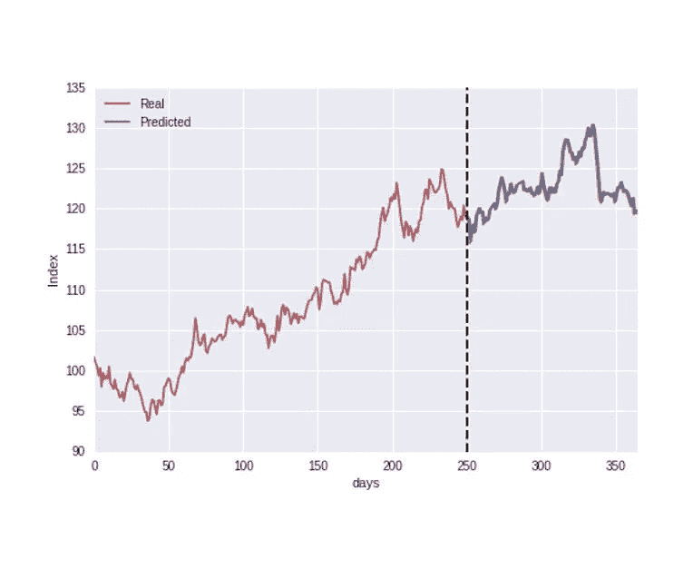
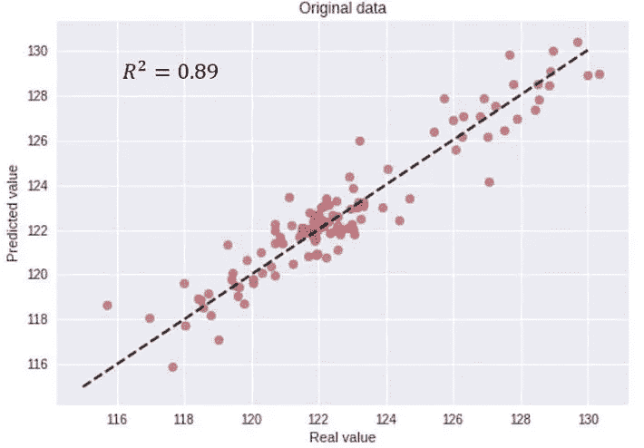
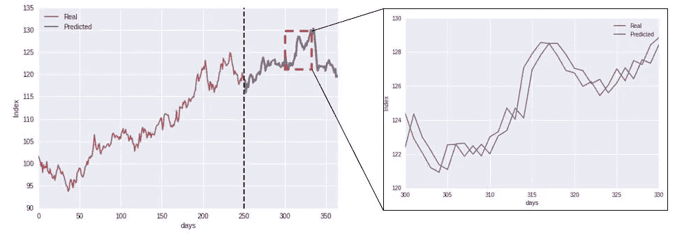
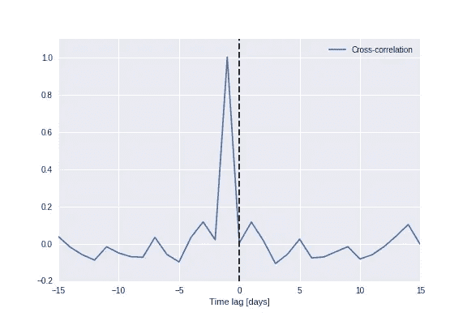
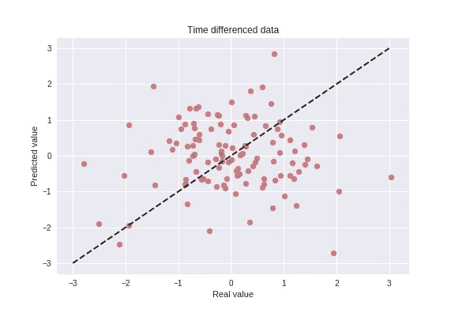

# 如何(不)使用机器学习进行时间序列预测:避免陷阱

> 原文：<https://towardsdatascience.com/how-not-to-use-machine-learning-for-time-series-forecasting-avoiding-the-pitfalls-19f9d7adf424?source=collection_archive---------1----------------------->

在我的其他帖子中，我已经涉及了一些主题，如:[如何将机器学习和物理](/how-do-you-combine-machine-learning-and-physics-based-modeling-3a3545d58ab9)，以及[机器学习如何用于生产优化](/machine-learning-for-production-optimization-e460a0b82237)，[供应链管理](/artificial-intelligence-in-supply-chain-management-predictive-analytics-for-demand-forecasting-80d2d512f155)以及[异常检测和条件监控](https://www.linkedin.com/pulse/how-use-machine-learning-anomaly-detection-condition-flovik-phd/)。但在这篇文章中，我将讨论时间序列预测的机器学习的一些常见陷阱。

时间序列预测是机器学习的一个重要领域。这一点很重要，因为有太多的预测问题涉及到时间因素。然而，虽然时间组件增加了额外的信息，但与许多其他预测任务相比，它也使时间序列问题更难处理。

这篇文章将介绍使用机器学习的[时间序列预测](https://en.wikipedia.org/wiki/Time_series)的任务，以及如何避免一些常见的陷阱。通过一个具体的例子，我将展示一个人如何表面上有一个好的模型，并决定将其投入生产，而在现实中，该模型可能没有任何预测能力，更具体地说，我将重点关注如何评估您的模型准确性，并展示如何简单地依靠常见的误差指标，如[平均百分比误差](https://en.wikipedia.org/wiki/Mean_absolute_percentage_error)、 [R2 评分](https://en.wikipedia.org/wiki/Coefficient_of_determination)等。如果不谨慎应用，可能会产生误导。

# 时间序列预测的机器学习模型

有几种类型的模型可用于时间序列预测。在这个具体的例子中，我使用了一个长短期记忆网络，或简称为 [LSTM 网络](https://en.wikipedia.org/wiki/Long_short-term_memory)，这是一种特殊的神经网络，它根据以前时间的数据进行预测。它在语言识别、时间序列分析等方面非常流行。然而，根据我的经验，在许多情况下，更简单类型的模型实际上提供了同样准确的预测。使用诸如[随机森林](https://en.wikipedia.org/wiki/Random_forest)、[梯度推进回归器](https://en.wikipedia.org/wiki/Gradient_boosting)和[时间延迟神经网络](https://en.wikipedia.org/wiki/Time_delay_neural_network)的模型，可以通过添加到输入的一组延迟来包括时间信息，从而在不同的时间点表示数据。由于它们的顺序性质，TDNN 被实现为一个[前馈神经网络](https://en.wikipedia.org/wiki/Feedforward_neural_network)，而不是一个[递归神经网络](https://en.wikipedia.org/wiki/Recurrent_neural_network)。

# 如何使用开源软件库实现模型

我通常使用 [Keras](https://keras.io/) 来定义我的神经网络模型类型，这是一种高级神经网络 API，用 Python 编写，能够在 [TensorFlow](https://github.com/tensorflow/tensorflow) 、 [CNTK](https://github.com/Microsoft/cntk) 或 [Theano](https://github.com/Theano/Theano) 之上运行。对于其他类型的模型，我通常使用 [Scikit-Learn](http://scikit-learn.org/stable/) ，这是一个免费的软件机器学习库，它具有各种[分类](https://en.wikipedia.org/wiki/Statistical_classification)、[回归](https://en.wikipedia.org/wiki/Regression_analysis)和[聚类](https://en.wikipedia.org/wiki/Cluster_analysis)算法，包括[支持向量机](https://en.wikipedia.org/wiki/Support_vector_machine)、[随机森林](https://en.wikipedia.org/wiki/Random_forests)、[梯度推进](https://en.wikipedia.org/wiki/Gradient_boosting)、[、 *k* -means](https://en.wikipedia.org/wiki/K-means_clustering) 和 [DBSCAN](https://en.wikipedia.org/wiki/DBSCAN)

然而，本文的主题不是如何实现时间序列预测模型，而是如何评估模型预测。由于这一点，我将不会进入模型建设等细节。，因为有大量其他博客帖子和文章涉及这些主题。

# 示例案例:时间序列数据的预测

这种情况下使用的示例数据如下图所示。稍后我会更详细地讨论这些数据，但现在，让我们假设这些数据代表了股票指数的年度演变。数据被分成训练集和测试集，其中前 250 天用作模型的训练数据，然后我们尝试在数据集的最后一部分预测股票指数。

由于我在本文中不关注模型实现，所以让我们直接进入评估模型准确性的过程。仅从视觉上观察上图，模型预测似乎与真实指数非常接近，显示了良好的准确性。然而，更准确地说，我们可以通过绘制真实值与预测值的散点图来评估模型的准确性，如下图所示，还可以计算常见误差指标 [R2 得分](https://en.wikipedia.org/wiki/Coefficient_of_determination)。

从模型预测中，我们获得了 0.89 的 R2 分数，并且实际值和预测值之间似乎很好地匹配。然而，正如我现在将更详细讨论的，这个度量和模型评估可能会非常误导人。

# 这是完全错误的…

从上面的数字和计算的误差度量来看，该模型显然给出了准确的预测。然而，事实并非如此，它只是一个例子，说明了在评估模型性能时，选择错误的准确性度量标准是如何产生误导的。在本例中，为了便于说明，明确选择数据来表示实际上无法预测的数据。更具体地说，我称之为“股票指数”的数据实际上是用一个[随机漫步过程](https://en.wikipedia.org/wiki/Random_walk)建模的。顾名思义，随机漫步完全是一个[随机过程](https://en.wikipedia.org/wiki/Stochastic_process)。由于这个原因，使用历史数据作为训练集来学习行为和预测未来结果的想法是完全不可能的。有鉴于此，这个模型怎么可能给我们如此准确的预测呢？正如我将更详细地讨论的那样，这一切都归结于精度度量的(错误)选择。

# 延时预测和自相关

顾名思义，时间序列数据不同于其他类型的数据，因为时间方面很重要。从积极的方面来看，这为我们提供了在构建我们的机器学习模型时可以使用的附加信息，即不仅输入特征包含有用的信息，而且输入/输出随时间的变化也包含有用的信息。然而，虽然时间组件增加了额外的信息，但与许多其他预测任务相比，它也使时间序列问题更难处理。

在这个具体的例子中，我使用了一个 [LSTM 网络](https://en.wikipedia.org/wiki/Long_short-term_memory)，它根据以前的数据做出预测。然而，当放大一点模型预测时，如下图所示，我们开始看到模型实际上在做什么。

时间序列数据往往在时间上是相关的，并表现出显著的[自相关](https://en.wikipedia.org/wiki/Autocorrelation)。在这种情况下，这意味着时间“ *t* +1”处的索引很可能接近时间“ *t* 处的索引。如上图右侧所示，该模型实际上是在预测时间“ *t* +1”的值时，简单地使用时间“ *t* ”的值作为其预测值(通常称为[持久性模型](https://machinelearningmastery.com/persistence-time-series-forecasting-with-python/))。绘制预测值和实际值之间的 c [交叉相关](https://en.wikipedia.org/wiki/Cross-correlation)(如下图)，我们看到一个明显的峰值，滞后时间为 1 天，表明模型只是使用以前的值作为对未来的预测

# 如果使用不当，准确性指标可能会产生误导

这意味着，当评估模型直接预测值的能力时，常见的误差指标，如[平均百分比误差](https://en.wikipedia.org/wiki/Mean_absolute_percentage_error)和 [R2 分数](https://en.wikipedia.org/wiki/Coefficient_of_determination)都表明预测准确度较高。然而，由于示例数据是通过随机行走过程生成的，因此该模型不可能预测未来的结果。这强调了一个重要的事实，即简单地通过直接计算常见的误差度量来评估模型的预测能力可能会非常误导，并且人们很容易被愚弄而对模型的准确性过于自信。

# 平稳性和差分时间序列数据

一个[平稳时间序列](https://www.otexts.org/fpp/8/1)是指其统计特性如[均值](https://en.wikipedia.org/wiki/Mean)、[方差](https://en.wikipedia.org/wiki/Variance)、[自相关](https://en.wikipedia.org/wiki/Autocorrelation)等。都是不变的。大多数统计预测方法都是基于这样一种假设，即通过使用数学变换，时间序列可以呈现为近似平稳的(即“平稳化”)。一个这样的基本转换是对数据进行[时差处理，如下图所示。](https://www.otexts.org/fpp/8/1)

这种变换的作用是，我们不是直接考虑指数，而是计算连续时间步长之间的*差值*。

定义模型来预测时间步长值之间的*差异*而不是值本身，是对模型预测能力的更强测试。在这种情况下，不能简单地使用数据具有很强的自相关性，并使用时间“ *t* 的值作为“ *t+* 1”的预测。由于这一点，它提供了对模型的更好的测试，以及它是否从训练阶段学到了任何有用的东西，以及分析历史数据是否实际上可以帮助模型预测未来的变化。

# 时差数据预测模型

由于能够预测时间差数据，而不是直接预测数据，这是该模型预测能力的一个更强的指标，让我们用我们的模型来尝试一下。该测试的结果如下图所示，显示了真实值与预测值的散点图。

该图表明模型**不能**根据历史事件预测未来的变化，这是本例中的预期结果，因为数据是使用完全随机的[随机游走过程](https://en.wikipedia.org/wiki/Random_walk)生成的。根据定义，能够预测随机过程[的未来结果](https://en.wikipedia.org/wiki/Stochastic_process)是不可能的，如果有人声称这样做，人们应该有点怀疑…

# 你的时间序列是随机游走吗？

您的时间序列实际上可能是随机游走，检查这一点的一些方法如下:

*   时间序列显示出强烈的时间相关性(自相关),线性衰减或以类似的模式衰减。
*   时间序列是非平稳的，使其平稳表明数据中没有明显的可学习的结构。
*   持久性模型(使用前一时间步的观察值作为下一时间步将发生的情况)提供了可靠预测的最佳来源。

这最后一点对于时间序列预测非常关键。使用[持久性模型](https://machinelearningmastery.com/persistence-time-series-forecasting-with-python/)的基线预测可以快速显示你是否可以做得更好。如果你不能，你可能正在处理一个随机游走(或者接近随机游走)。人类的大脑天生就到处寻找模式，我们必须保持警惕，不要通过开发随机行走过程的精细模型来愚弄自己和浪费时间。

# 摘要

我想通过这篇文章强调的要点是**在评估你的模型在预测准确性方面的表现时要非常小心**。正如上面的例子所示，即使对于一个完全随机的过程，预测未来的结果是不可能的，人们也很容易被愚弄。通过简单地定义一个模型，进行一些预测和计算常见的准确性度量，人们可能看起来有一个好的模型，并决定将其投入生产。然而，在现实中，该模型可能没有任何预测能力。

如果你从事时间序列预测工作，或许认为自己是一名数据科学家，我会敦促你也把重点放在 [*科学家*](https://en.wikipedia.org/wiki/Scientist) 方面。永远要对数据告诉你的东西持怀疑态度，问关键问题，永远不要得出任何草率的结论。科学方法[应该应用于数据科学，就像应用于任何其他种类的科学一样。](https://en.wikipedia.org/wiki/Scientific_method)

在未来，我相信机器学习将会被用在比我们今天所能想象的更多的地方。你认为它会对各个行业产生什么影响？我很想在下面的评论中听到你的想法。

**编辑:根据兴趣和反馈的数量，我决定写一篇相同主题的后续文章:** [**“如何(不)使用机器学习进行时间序列预测:续集”**](https://www.linkedin.com/pulse/how-use-machine-learning-time-series-forecasting-vegard-flovik-phd-1f/)

如果你有兴趣了解更多与人工智能/机器学习和数据科学相关的主题，你也可以看看我写的其他一些文章。你会发现它们都列在我的中型作者简介中，你可以在这里找到。

而且，如果你想成为一个媒体会员，免费访问平台上的所有资料，你也可以使用下面我的推荐链接。(注意:如果您使用此链接注册，我也会收到一部分会员费)

 [## 通过我的推荐链接加入媒体- Vegard Flovik

### 作为一个媒体会员，你的会员费的一部分会给你阅读的作家，你可以完全接触到每一个故事…

medium.com](https://medium.com/@vflovik/membership) 

# 更多来自 Vegard Flovik 媒体:

1.  [蒙特卡洛方法简介](/a-gentle-introduction-to-monte-carlo-methods-98451674018d)
2.  [从物理学到数据科学的转变](/q-a-with-a-data-scientist-1f872518315f)
3.  什么是图论，为什么要关心它？
4.  [用于图像分类的深度迁移学习](/deep-transfer-learning-for-image-classification-f3c7e0ec1a14)
5.  [构建一个能读懂你思想的人工智能](https://www.linkedin.com/pulse/building-ai-can-read-your-mind-vegard-flovik-phd/)
6.  [机器学习:从炒作到现实应用](/machine-learning-from-hype-to-real-world-applications-69de7afb56b6)
7.  [人工智能和大数据隐藏的风险](/the-hidden-risk-of-ai-and-big-data-3332d77dfa6)
8.  [用于供应链管理的人工智能:预测分析和需求预测](/artificial-intelligence-in-supply-chain-management-predictive-analytics-for-demand-forecasting-80d2d512f155)
9.  [如何利用机器学习进行生产优化:利用数据提高绩效](/machine-learning-for-production-optimization-e460a0b82237)
10.  [如何使用机器学习进行异常检测和状态监控](/how-to-use-machine-learning-for-anomaly-detection-and-condition-monitoring-6742f82900d7)
11.  [你是怎么把物理教给 AI 系统的？](/how-do-you-combine-machine-learning-and-physics-based-modeling-3a3545d58ab9)
12.  我们能使用纳米级磁铁构建人工大脑网络吗？

## 人工智能研讨会——从宣传到现实应用