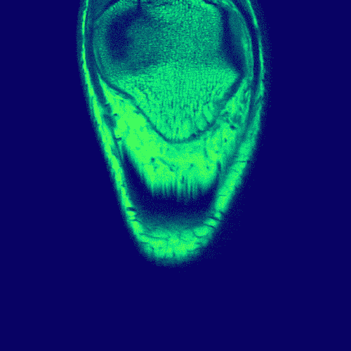
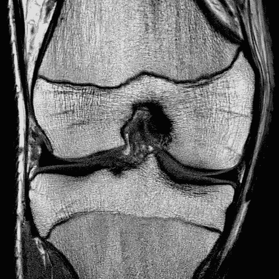
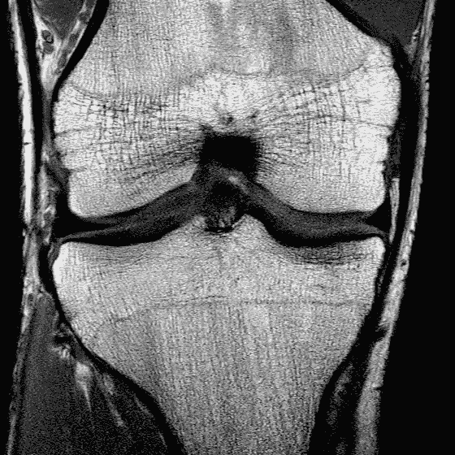
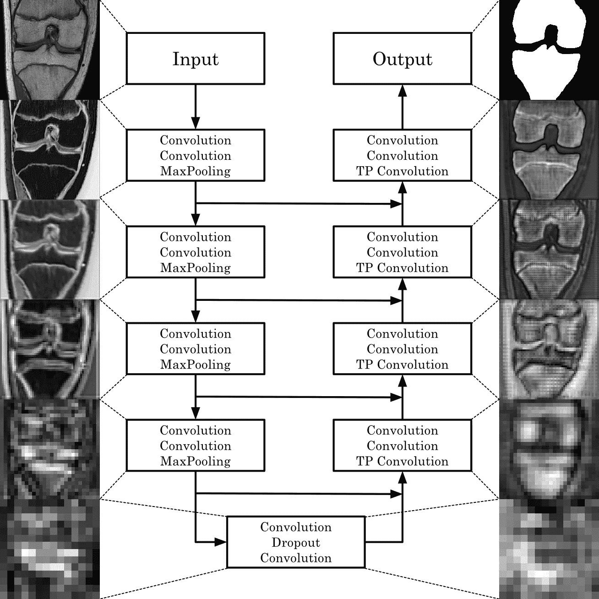
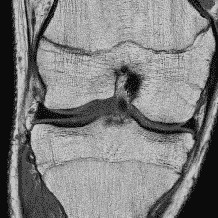
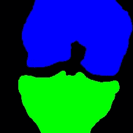
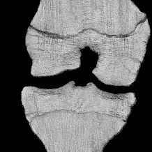

# 我多大了？

> 原文：<https://towardsdatascience.com/how-old-am-i-f62538487d36?source=collection_archive---------9----------------------->

## 使用 3D 膝关节磁共振成像和卷积神经网络进行年龄评估

One of the 145 samples that was part of the data set

你能猜到这个膝盖核磁共振后面的人有多大年纪吗？我给你一个提示。这是一个 14 到 21 岁的德国男性的录音。不知道吗？我喜欢想象这是神经网络在被训练之前看待世界的方式。它完全没有线索。所以，让我来训练你。

在与缺乏合法证件的人打交道时，确定一个人的实际年龄是一个复杂的过程。在庇护申请或刑事诉讼中，情况往往如此。根据法律，儿童和成人的处理方式是不同的，但是我们没有一个准确的方法来确定一个人的年龄。我们今天使用的最佳方法是基于 X 射线，这是一种将患者暴露于电离辐射的侵入性成像技术。这就是为什么许多欧洲国家只允许这些录音作为司法命令的一部分。其他一些方法包括个人采访，以确定心理和生理特征，但它们很费时，也很主观。这就是为什么非常需要一种自动且无创的方法来精确地确定一个人的年龄。

作为德国研究基金会(DFG)的一项研究的一部分，我接触了一组 3D 核磁共振成像数据，显示了德国男性的右膝盖。图像上半部分的股骨是大腿骨，正下方的胫骨是胫骨。在录像的后面，你可以看到另一块骨头在左下角冒出来——腓骨。如果你看得更近，你可以在骨头上发现几乎像裂缝一样的黑色水平线。这些被称为生长板，因为这是你的骨骼实现纵向生长的地方。它们由软骨组成，这就是为什么它们可以在核磁共振成像记录中看到。一旦你停止生长，这些区域会慢慢地开始闭合，直到看不见为止。

Examples of a 14, 17 and 20 year old caucasian male (left to right)

我们在这项研究中使用了膝盖记录，因为我们知道可见的生长板在成年前会关闭。其他研究使用核磁共振成像或手部 x 光，已知手部生长板关闭较早。在上面的图片中，你可以看到黑色水平间隙的宽度是如何与一个人的年龄相关的。

我们记录的个体年龄在 14 到 21 岁之间。如果我们预测每个人的平均年龄是 17.5 岁，我们的误差不会超过 3.5 岁。事实上，我们平均只差 1.2 年，因为数据是正态分布的。这是我试图打破的原始基线。我喜欢把基线看作是你能做出的最聪明最愚蠢的估计。仅预测年龄为 17.5 岁的模型将显示 1.2 岁的平均差异。这也将是完全无用的。

Age distribution of individuals in the data set

在深度学习中，你通常首先尝试的事情之一是使用预先训练好的架构的即插即用方法。即使原始模型是在一个非常不同的数据集上训练的，这通常也能让你走得很远。我拿了我最喜欢的迁移学习架构 VGG16 和它在 ImageNet 上学习的权重。然而，我很快明白这不会让我有任何进展，因为这个模型没有收敛。我尝试了其他各种各样的附加功能，比如更简单的架构、特殊的训练过程或者将回归转化为分类问题。什么都没用。

所以，我退了一步。要么是数据显示没有与年龄相关的特征，要么是这个问题对于我的数据集来说太复杂了。由于数据只包含 145 张图片，第二种可能性似乎并不遥远。在这种情况下，你可以做两件事:

*   获取更多培训数据
*   降低问题的复杂性

在一个完美的世界里，第一种选择肯定是更可取的，但特别是在医疗领域，它有时不是一个选项。当涉及到医疗数据时，我们受到非常严格的隐私法的保护，这是一件好事，除非你正在处理这样的问题。所以我决定降低数据的复杂性。

幸运的是，一个勤奋的人在同一个项目中已经用骨骼分割图标记了一半的数据集。使用基于区域生长的半自动方法，他对每个样本花费了大约 2 个小时。有了这 76 个遮罩，我建立了一个工作流程，在人类膝盖的 3D 核磁共振成像中分割骨骼。我尝试了 2D 和 3D CNN 架构，但 2D 版本显示出更准确的结果，也更快地训练。

The architecture I used with visualizations for different slices

最后，我使用 U-Net 的一个小变体，每个卷积有 32 个恒定数量的输出通道，得到了 **98.0% DSC** 。腓骨是最小的骨头，事情变得有点问题，这就是为什么我决定训练三个独立的模型。我还尝试了一大堆其他的东西，你们可以在我的论文中读到，但是现在，我想就这样。

顺便说一句，你对这种方法如此有效不感到惊讶吗？一开始我的确是。想想吧。我无法在 145 个样本上训练回归器，但在 76 个样本上进行更复杂的分割可以完美地工作。事实证明，分割可以被看作是对每个像素的分类。这意味着对于每个样本，我有*宽度*高度*信息通过网络反向传播。这比简单回归得出的一个数值要多得多。

Input, predicted output and applied mask

通过对输入数据应用蒙版，我去掉了所有我不关心的非骨组织，能够更清晰地聚焦于生长板。我回到最初的问题，但很快发现它仍然不起作用。只有在采用了我的细分架构的收缩端并将其用作预训练模型之后，我才能够超越基线。这种想法不会使模型每次都收敛，但当它收敛时，它的预测是稳定的。

因为这个网络使用了每个体积图像的 2D 切片，所以我现在对每个 MRI 有了多个预测。平均来说，我错了 0.64 ( 0.48)年。显然，这已经是一个非常好的结果，超过了以前的腕骨核磁共振成像研究和使用 X 射线的 boneXpert 算法。

我分析了每张 2D 图像的不同预测，注意到内部切片导致了更高的准确性。我用加权平均值和丢弃外层切片进行了实验。这两个概念都改进了以前的结果，但另一种方法产生了更高的准确性。我设置了一个随机的森林回归器，它将获取多个年龄预测的向量，并为每个 3D MRI 输出一个估计值。这让我在测试集上得到 0.48 ( 0.32)年的平均差异。换句话说，这个工作流程让我评估 14 到 21 岁白人男性的年龄，平均误差为半年。

Slice predictions, combined prediction through random forest and ground truth of one example

这个项目成了我的学士论文。我计划开源代码和论文，这样任何人都可以在未来的工作中使用它。现在，在我发布任何消息之前，我必须等待委员会的意见。我觉得难以置信的是，像我这样没有医学背景的人可以利用人工智能算法为当前的研究做出贡献。这是这个计算机科学领域让我感到惊讶的地方，我希望将来能继续从事像这样令人着迷的项目。

更新:我的[论文](https://github.com/pietz/knee-mri-segmentation/blob/master/thesis/0_Thesis.pdf)和整个[代码](https://github.com/pietz/knee-mri-segmentation)现在已经上线。出于上述隐私原因，数据集不可用。