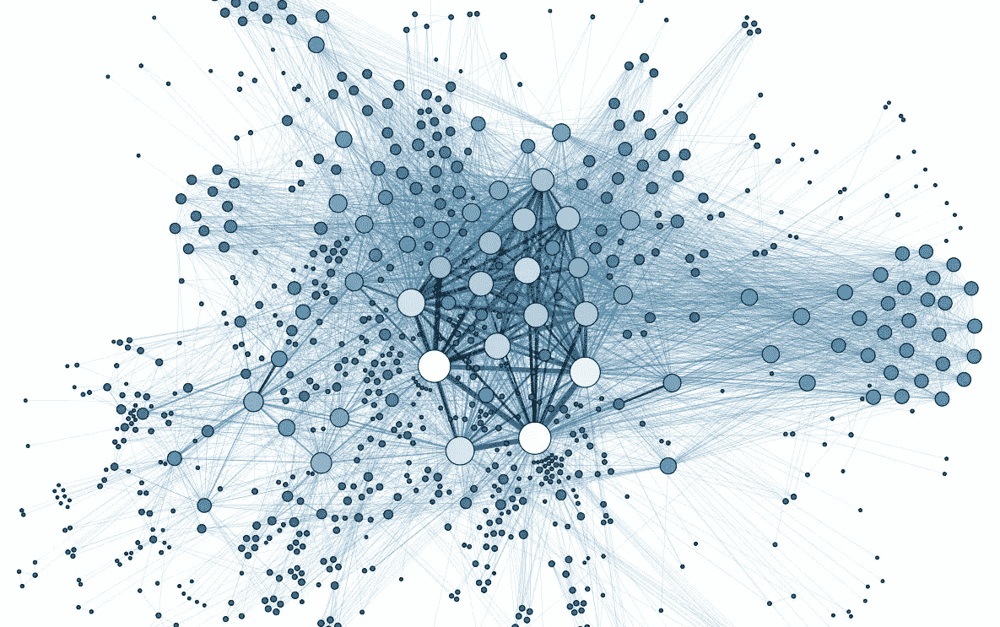
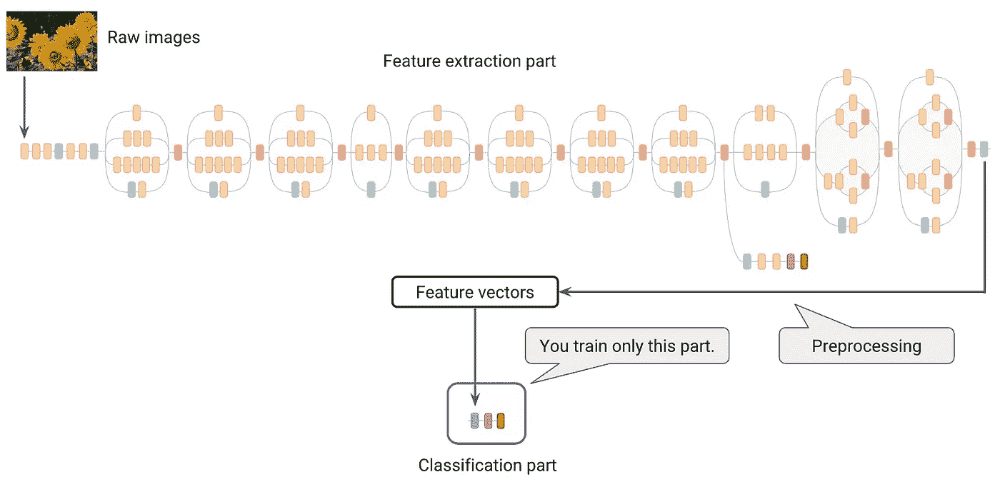

# 开放健康数据如何拯救 NHS

> 原文：<https://towardsdatascience.com/how-open-health-data-can-save-the-nhs-a2f7059af0f7?source=collection_archive---------5----------------------->

在医学人工智能开发者面临的诸多挑战中，获取干净、可验证、真实的医学数据被认为是最大的障碍。在最近的一次在线调查中，我的 Twitter 社区中有 42%的人同意这一观点，认为“数据访问和清理”比临床部署(将模型引入野外的过程)更难，比训练和验证模型(鉴于可用工具的巨大增加，这是一个相对简单的过程)更难。

数据访问和清理被认为是人工智能在临床实践中实现的最大障碍的原因可以归结为三个简单的事实:

1.  监督模型需要大量的医疗数据
2.  医疗数据很难获得
3.  医学数据很难符合事实

目前，围绕医疗人工智能，NHS 内部出现了一种奇怪的先有鸡还是先有蛋的局面。一方面，患者和临床医生对人工智能的潜力感到兴奋，但另一方面，他们通常不希望放弃他们的数据，这些数据将使人工智能得以发展，通常是因为害怕引起公众对不适当的数据共享的愤怒，或者对恶意企业利益的不确定性。显然，有些事情需要改变。

# 充分利用数据

NHS 是世界上最大的国有医疗保健系统。它涵盖了所有年龄层、多民族、多样化的人群，最重要的是，它是基于证据的，并且在很大程度上实现了医疗保健方法的标准化。在它的墙内包含了地球上最丰富的医学数据来源之一。这些数据可以实现新的数据驱动技术，包括人工智能系统，并有可能改变医学。但这些丰富的数据往往被锁在一个庞大的官僚机构后面，无法访问和丢失，阻碍了创新和进步。是时候与英国公众讨论公开他们的数据了。是时候告诉大家数据可以救命了。

> [开放数据](http://openhealthcare.org.uk/open-data-in-the-health-sector/)和内容可以被**任何人**出于**任何目的**自由使用、修改和共享**。**

我一直在提议，为了利用人工智能的力量，大规模医疗数据需要更加开放，鉴于英国从摇篮到坟墓的国有化医疗系统，英国可能是最适合这样做的国家之一。我绝不是唯一认为开放数据很重要的人。在英国,[理解患者数据](https://understandingpatientdata.org.uk/)计划(由英国公共卫生部的 Dame Caldicott 和 Wellcome Trust 支持，由独一无二的[Natalie Banner 博士领导)的使命是教育共享医疗数据的好处。对强大的开放数据共享平台的呼声越来越高，这一倡议在引导公众对话方面做得非常出色。他们不仅关注*为什么*数据可以拯救生命，还关注*如何*。](https://twitter.com/natalie_banner)

对于那些对开放健康数据感兴趣的人来说，甚至有一个学术期刊[关注强调开放数据的可用性和再利用的出版物。然而，在大规模数据共享开始之前，人工智能领域中相对较少的实际案例研究可以作为这些论点的基础，并提供令人信服的数据故事。](https://openhealthdata.metajnl.com/)

# 以身作则

我想简要强调一下我自己在试图展示开放卫生数据的力量时的经历。我在皇家放射科医师学院工作时，我们经常讨论对我们的职业影响最大的人工智能技术是什么——就工作量和体积而言，简单的胸部 x 光检查往往是最大的问题之一。到目前为止，cxr 是 NHS 中最流行的成像研究，据估计，其中 50-80%完全正常。如果我们能开发一个系统，有效而准确地将“正常”的 cxr 与“异常”的 cxr 区分开来，会怎么样？我们能否节省超过 50%的放射科医师 CXR 报告时间？我们能否通过让一线员工获得初步的分诊读数来加快护理点的交付？

为了建立一个人工智能系统，可以从病理学中准确地对正常状态进行分类，你需要大量这样标记的 cxr。不幸的是，你不能走进一家医院，要求数以百万计的标记图像，而且目前没有来自 NHS 患者的标记和公开可用的 CXR 数据集。

值得庆幸的是，在大洋彼岸，美国国立卫生研究院(T0)明白了这一点，并发布了 10 万份完全匿名的 cxr 供公众使用。这个数据集被证明是当前人工智能研究中最有影响力的数据集之一。它已经被 T2 大学、斯坦福大学、麻省理工学院和 T4 大学、谷歌公司等用来创建可以发现病理的算法，并在推动医学图像分析兴趣的增长方面发挥了重要作用。

然而，这些由知名机构进行的大规模研究都集中在寻找特定的病理(肺炎、肋骨骨折等)，而不是执行整体图像分类。这可能是因为构建多类分类器算法是一项远比构建简单的二进制分类器有趣的机器学习任务。这也可能是因为还没有人想到这样做，而是去玩更性感的“人工智能在诊断中击败人类的表现”？

两位对机器学习感兴趣的英国初级医生找到了我，他们想问一个问题:如果我们可以使用非常简单、公开可用的现成算法，并训练他们执行高影响力的放射工作，会怎么样？答案是我们合著的关于 CXR 分流的论文[，在线发表在《临床放射学》上](https://www.clinicalradiologyonline.net/article/S0009-9260(18)30206-X/fulltext)。

他们采用了一个非常受欢迎的开源图像感知模型，称为 [Inception](https://www.tensorflow.org/tutorials/image_recognition) ，该模型已被广泛用于对来自 ImageNet(狗、猫等)的图像进行分类，并使用一种称为迁移学习的技术，他们在来自 NIH 数据集和印第安纳大学[的较小公共数据集的 CXRs 上重新训练该模型。](https://openi.nlm.nih.gov/detailedresult.php?img=CXR111_IM-0076-1001&req=4)

Inception-V3 — developers need only train the last final layers — a technique known as transfer learning.

一旦 cxr 被分成正常和异常(丢弃任何不确定性)，使用 10 的云计算时间，训练初始模型的最后层只需要 6 个小时。他们的结果如下:

Our model yielded sensitivity 94.6% (95% CI: 94.4–94.7%) and specificity 93.4% (95% CI: 87.2–96.9%) with a positive predictive value (PPV) of 99.8% (95% CI: 99.7–99.9%) and negative predictive value (NPV) 27.9% (95% CI: 26–28.9%), all based on a cut value of 0.5.

The ROC curve demonstrated an area under the curve (AUC) of 0.98 (95% CI: 0.97–0.99). Cut-offs were unadjusted from 0.5.

实际上，两个 NHS 的初级医生(没有接受过正式的数据科学培训)建立了一个极其廉价和高度准确的 CXR 分流模型，**他们之所以成为可能，是因为他们能够获得大量的、有标签的开放健康数据**。

现在，我并不是说我们的论文在任何方面都是开创性的——我们当然没有在深度学习领域取得进展，也没有创造出商业化的产品或影响任何现实生活。然而，我们所做的证明了开放的健康数据可以以非常低的成本被用来创造潜在有效的工具。这才是最重要的——通过使用开放数据来创建一个有可能为 NHS 节省大量成本和效率的工具，来展示开放数据的力量。

# 分享是关怀

曾有过几次统一 NHS 数据基础设施的尝试，最著名的是国家信息技术计划(NP fit——不是有史以来最好的缩写)和最近的 Care.data。这两个计划被认为失败的地方在于所涉及的既得企业利益和缺乏数据安全性的细节。NPfIT 崩溃的部分原因是，[几家不同的公司被给予了英国的大块土地来设计基础设施](http://digitalhealthage.com/digital-health-lessons-npfit/)，并且对数据安全性没有给予足够的重视。最终，数十亿英镑被浪费在创建不可互操作的非标准化服务上。 [Care.data 再次失败](http://digitalhealthage.com/digital-health-lessons-npfit/)，原因是公众对他们的数据共享缺乏信任。

我们需要的是一种“自下而上”的数据共享方法，由国家指导方针来管理。如果每个 NHS 信托机构都能够得到关于数据去识别和共享的最佳实践的指导方针，那么他们就可以在当地与患者合作，以确保大规模的数据共享能够适当地进行，并符合当地的需求。例如，如果一家医院需要 CXR 分流算法，他们可以在当地咨询，为当地委托的研究小组提供历史去识别图像和报告，以构建并随后部署这样的算法。通过将大规模数据共享纳入本地研究，NHS 可以为算法建立试验台，这对提供过程的最后一步——临床验证——至关重要。不是所有的算法都行得通，但没关系。快速失败是科技界常用的咒语，如果 NHS 要转向技术来拯救自己，它需要营造一个允许快速失败的环境。

随着时间的推移，医院可以共同努力，确保数据集得到合并，为数据科学家提供更好的培训场所，并为推广到人群提供更好的算法。更好的是，一个中央机构可以委托进行一系列的研究。回到 CXR 的例子——如果说 NHS Digital 和 RCR 想要建立一个全国通用的 CXR 分流算法，他们需要做的就是公开呼吁感兴趣的医院参与进来。参与的医院将分享他们的 CXR 数据的一部分，这些数据可以集中保存(当然是去身份化的),并开放给研究人员使用。像 [Kaggle](https://www.kaggle.com/) 这样的数据科学竞赛已经存在多年，并提供了一个优秀的沙盒，研究人员可以在其中开发、快速失败和迭代。(这实际上是我一直在谈论的一个[英国放射学人工智能网络](https://www.youtube.com/watch?time_continue=2505&v=5QtDcUfLCX8)(大脑)的模型！)

# 现在是时候了

NHS 中有很多关于数据共享的喋喋不休，还有很多会议、辩论和文章(我当然有参与其中的罪恶感！).与此同时，其他国家只是简单地应付着。例如，法国已经宣布将[开始整理超过 5 亿个放射学病例](https://www.evernote.com/shard/s91/sh/36cee396-508f-433d-8285-eaf02474c36b/1489558dbb7d9966ea31f9cd6b16b0e8)用于人工智能研究的唯一目的。许多美国机构已经在准备大规模的数据共享计划，通常是与大型科技公司合作。澳大利亚已经开始建设一个巨大的生物库，这是南半球最大的生物库。

如果英国国民医疗服务体系在采纳和适应方面太慢，那么它只会被甩在后面。我们现在需要努力，开始与患者对话，并为未来做好计划。毕竟，开放的健康数据可能是唯一能拯救我们的病人和国民医疗服务的东西。

*免责声明*:本文所代表的工作是个人的，与我所属的任何公司或组织无关。

如果你和我一样对人工智能在医疗保健中的未来感到兴奋，并想讨论这些想法，请联系我们。我在推特上 [@drhughharvey](http://twitter.com/drhughharvey)

如果你喜欢这篇文章，点击推荐并分享它会很有帮助。

*关于作者:*

哈维博士是一名委员会认证的放射科医生和临床学者，在英国国民医疗服务体系和欧洲领先的癌症研究机构 ICR 接受过培训，并两次获得年度科学作家奖。他曾在 Babylon Health 工作，领导监管事务团队，在人工智能支持的分诊服务中获得了世界第一的 CE 标记，现在是顾问放射科医生，皇家放射学家学会信息学委员会成员，Kheiron Medical 的临床总监，以及人工智能初创公司的顾问，包括 Algomedica 和 Smart Reporting。