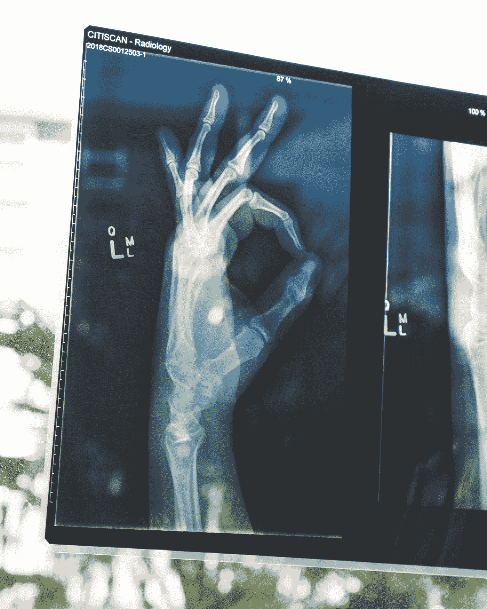
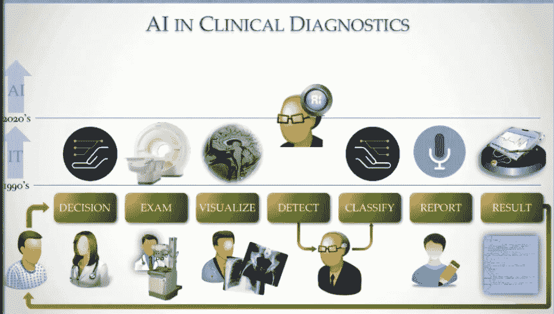
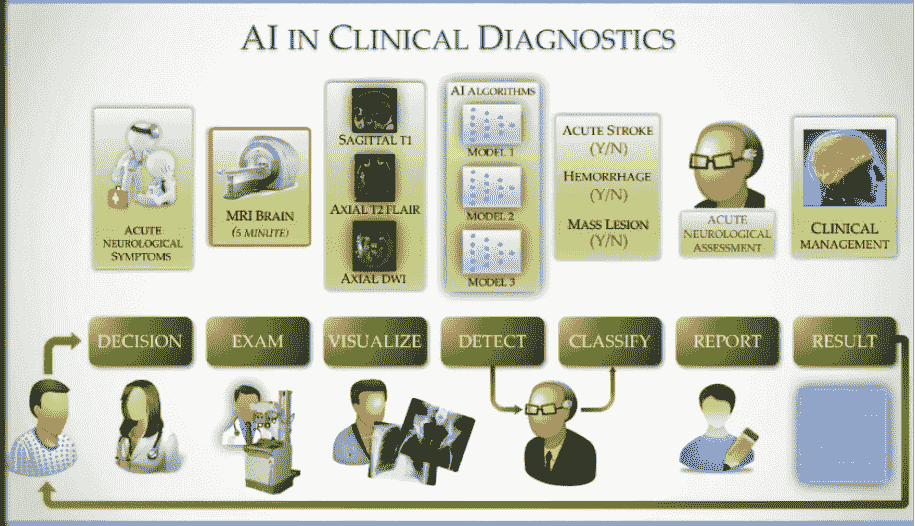

# 放射学和人工智能将如何走到一起

> 原文：<https://towardsdatascience.com/how-radiology-and-ai-will-come-together-36e48bb56870?source=collection_archive---------12----------------------->

Photo by [Owen Beard](https://unsplash.com/photos/DK8jXx1B-1c?utm_source=unsplash&utm_medium=referral&utm_content=creditCopyText) on [Unsplash](https://unsplash.com/search/photos/radiology?utm_source=unsplash&utm_medium=referral&utm_content=creditCopyText)

**放射科医生的机器学习介绍— 10 部分系列**

**第二部**

*作者:* [*达尼洛*](https://www.linkedin.com/in/danilo-pena-01010/)*[*泰·瓦雄*](https://www.linkedin.com/in/tyvachon/)*

**编辑:* [*迈克尔博士*](https://www.linkedin.com/in/michael-doxey-md-73508916a/)*

**万一你错过了第一篇帖子，在这里* *查看一下* [*。*](/introduction-to-our-radiology-ai-series-51d0e54cd3b9)*

*一个高效、准确的住院医生和一个经验丰富的主治医生是一股不可忽视的力量。该团队可以粉碎患者名单，从容应对列车事故。住院医生可以根据需要调出实验室和病史，他们可以在正确的时间通过电话找到正确的人，并处理除最复杂的临床情况之外的所有情况。这需要*年*的训练才能实现。*

*让我们来看看基思·德雷尔博士对临床诊断学的概述。*

*从左下方的患者开始，从左向右移动。*

**

*现在，这个临床工作流程大纲非常笼统，但我们可以跟踪患者进入医疗保健系统的步骤，到提供者订购成像，到放射科医师做他/她最擅长的事情。它很好地概述了患者诊断过程中采取的步骤。下一张图片将提供更多的放射学背景。*

*来自上面的临床路径被缩小以跟随具有急性神经症状的患者。从左至右:症状、影像学、影像解释和临床管理。*

**

*从上面的幻灯片中，我们可以对放射科医师每天都参与的大量功能进行分类，一天多次。过程中的具体点涉及放射科医师的知识，并在整个过程中注重团队合作。在一个复杂的工作环境中，管理一个病人的护理需要整个团队，相互关联的因素。*

*此外，众所周知，工作流中可能会有一些完成起来很繁琐的点，而这些点是可以自动化的。这可以改善放射科医师的工作流程，并且潜在地，提高的效率将转化为改善的患者结果和实际节省的资金。*

*这就是人工智能可以发挥作用的地方。在上面的幻灯片中，人工智能算法进入了**检测** 阶段。一般来说，这是大多数机器学习目前关注的地方。然而，在未来，我们可以想象这样一个世界，其中大多数步骤都可以通过智能算法来增强或辅助，以提高工作流效率。随着本系列文章的深入，这种人机交互的结合将会更加清晰。*

*放射学往往处于技术的最前沿**。“在过去的 30 年里，医学成像已经成为现代医学的一个标志，并彻底改变了医疗保健和医疗行业。”(MRI 和 PACS 系统彻底改变了成像的提供、使用和解释方式。这些为放射学应该处于领先地位的普遍观念铺平了道路。***

*成像技术的创新不仅可以让放射科医生更好地了解潜在的疾病过程，还可以转化为改善患者的结果。*

*那么，人工智能在哪里呢？*

*第一个应用是心脏核磁共振成像。通常，放射科医师(研究员/住院医师)完成绘制心脏流出道轮廓的非常乏味的任务。这可能需要**个小时。现在，理论上，这可以完全自动化。潜在的算法可以像脸书一样，自动检测主动脉根部并画出它的轮廓。对每个需要的大纲重复上述步骤。一旦轮廓完成，流量、狭窄和回流的计算也可以自动化。***

*从主治医师的角度来看，如果你的第四年住院医师一直低估主动脉根部周长，你应该鼓励他们使用你的教育方式和技巧来改进这项特殊的任务。如果你还记得住院医师的话，每个员工都不一样。*

*理想情况下，在这种情况下，算法将优于居民。当你操作图像来纠正任何错误时，算法将自动学习什么是可接受的，什么是错误的。现在把它想象成一个机构或者一群机构的缩小版。它对你来说应该是几乎透明的。它将有一个直观的系统，所以当你做出改变时，它会做一些小的修正，并持续改进。*

*随着智能嵌入到临床工作流程中，这只是将被研究的许多场景中的一个。*

*“*医学成像将人类的视觉扩展到疾病的本质，使新一代更强大的诊断和干预成为可能”(1)。**

*放射科社区是一个独特的医生子集的一部分，我们往往是技术的早期采用者。因此，我们已经准备好站在正在开发的工具的最前沿，这些工具将遍布我们的工作空间。不——我们不需要知道如何对神经网络进行物理编程；我们可以把这个问题留给 Kaggle 开发人员和上一篇文章中提到的其他人。但理解机器学习的基础、潜在动机和含义将非常有帮助。*

**下周:**

*第 3 篇—机器学习和人工智能简介*

***参考文献***

1.  *W.高，谢(2011)。医学影像技术的艺术状态:从创建到存档，然后返回。*开放医学信息学杂志*， *5* (1)，73–85。土井:10.2748386786867*