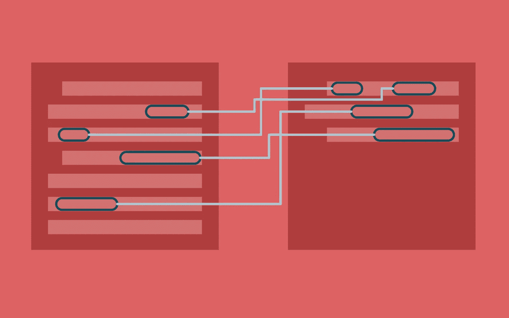

# 文本摘要如何改变我们的教育方式

> 原文：<https://towardsdatascience.com/how-text-summarization-could-change-the-way-we-educate-e1a6b2a21cea?source=collection_archive---------6----------------------->

这篇文章并没有提出新的研究或创新，而是描绘了一幅我们可以用适当的技术实现的画面。

历史上，人类发现计算机是有用的，因为他们将解决问题的更繁琐的方面卸载到这些机器上。人类于是能够将他们的努力重新分配到真正需要他们的地方；到他们能产生影响的地方。白领工人已经被减少到机器还不容易自动完成的任务。

Text summarization could reduce the amount of information that humans have to intake and understand daily

作为一个物种，我们现在在不同的领域严重依赖计算机。数学、制造、定价、[送货/提货物流](https://www.coyote.com/)、搜索和股票交易是让我印象深刻的主要例子。这些计算能力的应用都(至少)有一个共同点:它们都接收*问题*作为输入，并提供*答案*作为输出。

计算机解决问题有两种主要方法:找到一个已有的答案或根据输入计算出一个新的答案。

谷歌是为充满问题的人类带来答案的典型代表。它梳理了数以万亿计的网页，并做了大量有趣的处理，给你带来似乎包含当前问题答案的页面。这对于那些只需要快速找到当前问题答案的人来说是非常有用的。对于程序员来说，这也是一个有用的抽象。谷歌不是试图自己回答所有的问题(就像 WolframAlpha 所做的那样)，而是试图将互联网上已经存在的问题的答案带给用户，以引起用户的注意。

这种解决问题的方法与其他一些旨在为大量变量计算最佳状态的计算领域形成了直接对比。作为一个明显的例子，股票交易机器人不需要一个关于股票市场如何运作的文章的链接，它需要计算一个对许多股票在下一个时间间隔的表现的预测。

# 互联网很大

正如我们之前在探讨谷歌的有用性时提到的，互联网目前估计有超过 60 万亿的页面。这比任何人希望阅读或理解的信息都要多。这证明了我们人类在掌握信息方面的成就。我们现在拥有和创造的数据比人类历史上任何时候都多。最近一次统计(2017 年 3 月)，每分钟有 [300 小时的视频](https://fortunelords.com/youtube-statistics/)被上传到 YouTube。每分钟，[有 35 万条推文被发送](http://www.internetlivestats.com/twitter-statistics/)(2013 年 8 月)。在美国，每年有 [60 万到 100 万本书](https://www.forbes.com/sites/nickmorgan/2013/01/08/thinking-of-self-publishing-your-book-in-2013-heres-what-you-need-to-know/#54ff607014bb)出版。这些数字既是为了吓唬你，也是为了证明信息的创造速度超过了人类的消费速度。

面对大量涌入的新数据，我们怎么可能有望保持领先呢？我们怎么可能希望继续解析这些不断增长的数据呢？我认为，答案是，如果没有新形式的技术来推动我们消费信息的能力达到更高水平，我们就做不到。我觉得我目前正处于信息灵通和信息超载之间。我不认为自己会突破目前每天 45-60 封需要我关注的邮件的水平。

我们需要新的工具来筛选出无用的信息，并为我们提供我们试图学习和理解的信息的最小化版本。

# 最近有趣的工具

有一些工具开始出现，它们意味着扩展人类数据消费的限制。事实证明，这是一个特别困难的问题，正从几个不同的方向着手解决。

在这个问题领域中，更有趣的攻击手段之一实际上是改变消费数据的方法。这一类别的工具不是创建数据集的摘要，或者将相关数据冒泡到顶部，而是试图通过提供范式转变来增强人类的自然消费能力。Spritz 是这种工具的一个有趣的例子。对于门外汉来说，Spritz 是一个快速阅读工具，可以帮助你以高达 1000 wpm 的速度阅读(尽管人们通常不这样做)。它围绕一个中心点排列单词，然后以您指定的任何速度快速闪烁单词。

增加人类可以接受的数据量的最明显的方法是[减少人类需要接受的数据量](https://research.googleblog.com/2016/08/text-summarization-with-tensorflow.html)。现已倒闭的 [Summly](http://www.summly.com/index.html) 就是一个有趣的例子，它扫描最大的新闻来源上发布的新闻故事，将其归结为要点，并自动生成合理的内容摘要。Summly 可以为你提供一个清晰简洁的新闻故事摘要，尽管是以一种更简洁的形式。

# 我们真正需要的是

但是这些方法不足以满足日益增长的解析、合成和管理数据流的压力。导致 2016 年大选个性化“真相”筒仓的信息算法排序是不够的。最近的注意力似乎集中在将“有趣的”文章、网站或图像引入用户的提要上。我们需要能够从不同的来源中综合和提取有意义的信息的工具。

通过解决理解新研究的困难，[蒸馏](http://www.pewinternet.org/2016/12/07/information-overload/)正在做出巨大的努力。这是一份旨在向大众传播机器学习突破的杂志。研究人员和作家一起工作来创建交互式可视化，这将清楚地展示最近研究的有趣部分。这是朝着正确方向迈出的一大步。我们需要重新强调在[信息山](http://distill.pub/2017/research-debt/)上建造一条铺好的道路，我们目前正在其上建造我们的最新产业。

未来普通人可能接触到现代研究的唯一途径是通过像 Distill 这样的出版物。然而，我认为更直接的途径是通过更先进的技术工具。这些工具旨在将文章、科学出版物、书籍中最重要的部分呈现出来，而不仅仅是你可能感兴趣的部分。

我知道在文本提取和自动文本摘要领域有很多[的优秀研究](https://www.researchgate.net/publication/257947528_Text_SummarizationAn_Overview)，但是我们需要将这项研究商品化。目前只有 17 家公司在安吉尔的[内容摘要](https://angel.co/content-summarization)名单上。为什么我们对破坏婚礼策划感兴趣的人比对消费信息创新感兴趣的人多？我们需要建立工具来总结、提取和提炼，而不使读者远离更详细的、潜在的源材料。

# 教育应用

对于任何一个最近上过大学的人来说，你都知道教科书价格真的失控了，自 20 世纪 70 年代以来上涨了 1000%以上。课本冗长，难懂，枯燥。艾伦·唐尼的教科书宣言是对这一趋势的精彩批判。唐尼告诫学生和教科书编写者要愿意接受这种情况。缺乏引人入胜和简明的教科书只会增加现代信息超载的负担。从大量当前不相关的数据中解析可操作数据的行为对各方来说都是浪费。

如果我们能平息这些惊涛骇浪，代之以现代工具来探索各种细节层次的信息，会怎么样？如果我们可以依靠算法生成的最新[公关丑闻](https://i.imgur.com/Ibu6uXF.gif)的年表会怎么样？仔细阅读国情咨文的要点摘要，并快速浏览一个生成的段落摘要，看看是什么让一篇研究论文在其领域的背景下变得新颖？具有这些功能的工具将有可能改变我们对教育的看法。教育可以真正成为一生的追求，而不仅仅是我们生命中前 25%的时间。

这些技术可以很容易地用于创建任何可以想象的主题的个性化课程。你可以快速生成你选择的任何主题的解释材料、教程、工作表、测验、总结、学习指南等等。你完全可以通过自学获得博士学位。鉴于大多数专业工作的极端社会性质和你自己所拥有的研究资金的严重缺乏，这样一个学位的价值是可疑的。

软件工程在专业教育计划中是一个特例，因为你需要跟上现代技术的发展。但我认为，如果这些类型的工具被创造出来并适当地商品化，这种职业再教育的状态应该而且将会成为标准。我们的教育系统本身需要从头开始重新设计，以应对这些变化。如何监控、验证和利用持续的、递增的研究来产生影响？

互联网为我们提供了几乎免费的获取信息的途径，但是要恰当地利用它仍然存在障碍。多分辨率自动文本摘要技术可以真正拆除沿着[经济](https://en.wikipedia.org/wiki/United_States_v._Swartz)和[政治](http://www.greatfirewallofchina.org/)轴形成的人为信息壁垒。

我说的是一个我们还没有找到通往它的道路的未来，但是我鼓励我的读者去思考有能力的、算法化的文本摘要对我们现代世界的深远的、积极的影响。