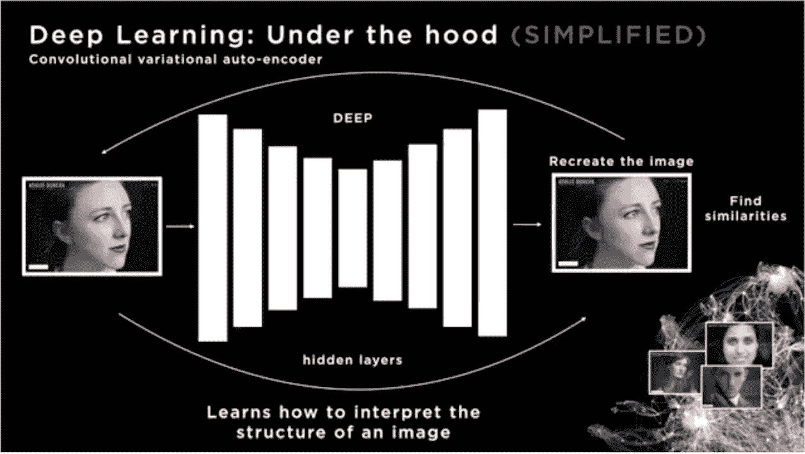
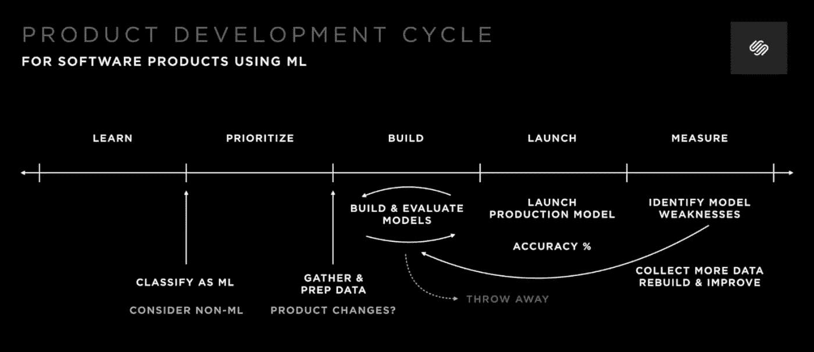

# 大女孩如何构建机器学习产品:由产品中的女性推动的演讲(上)

> 原文：<https://towardsdatascience.com/how-the-big-girls-build-machine-learning-products-a-talk-powered-by-women-in-product-part-i-26c9a2f3e458?source=collection_archive---------12----------------------->

Amy, Sarah, Ronnie, Carla, Elsie, and Inga @ [Squarespace Inc.](https://medium.com/u/21796ef64a5d?source=post_page-----26c9a2f3e458--------------------------------) NYC offices

当我在纽约有一个空闲的晚上时，我做了什么？我浏览了 Eventbritte，发现这个活动由 [Squarespace Inc.](https://www.squarespace.com/) 主办，由[女性产品](http://www.womenpm.org)组织。我知道有关于机器学习的最佳实践的书籍和文章，但是当他们建立依赖于 ML 的产品时，看到不同公司的过程和思路真的很有趣。

你可以从图片中看到与会代表的公司，但以下是发言人:艾米·金([克拉里菲](https://clarifai.com))、莎拉·卡坦扎罗( [Canvas Ventures](http://www.canvas.vc) )、罗尼·法尔肯(谷歌)、卡拉·科瓦尔斯基( [Capital One](http://capitalone.ca) )、埃尔西·凯尼恩( [naralogics](https://naralogics.com) )、因加·陈(Squarespace)。组织者提供了他们每个人的简介，你可以在这里找到他们。

Pretty large audience (many are at the food & drinks bar), tickets were sold out!

这个活动的议程很简单:产品中的女性的开场和欢迎，Inga 在 Squarespace 对机器学习和深度学习的介绍(她在她之前工作的公司叫做[自动化实验室](https://www.automatic.com)也谈到了 ML)，以及最后的小组讨论。

我意识到这篇文章越来越长，所以这一部分将是关于 Squarespace 的，我将在另一篇文章中包括小组讨论的要点。

**注意**:我**没有**这些幻灯片，它们是对事件的记录，我决定截图来支持文字，使其更容易理解。

# ML 和 DL 如何在 Squarespace 中使用

整个事件被记录下来，包括幻灯片，可以在页面底部找到。在这一部分，我想总结一下 Inga 演讲的要点。

对于那些不知道 **Squarespace** 的人来说:这是一个帮助你建立华丽网站的平台，包括内容管理系统、电子商务功能、博客等。就像 Wordpress 一样，但是更好的设计和 UX。看看一些用它建造的网站的实例。(☆▽☆)

## 什么是人工智能(AI)、机器学习(ML) &深度学习(DL)？

> “我希望我的另一半像《发现周刊》一样理解我”——这是 Inga Chen 在解释概念时说过的一句话

*   **人工智能**:人工智能是任何能够执行脑力任务的计算机程序。即使现在人们会想到人形机器人(Westworld 和 stuff)，但其中一个典型的例子是你在象棋比赛中与之对抗的机器人。
*   **机器学习**:使计算机能够自我学习的程序。在 Inga 的幻灯片上，ML 的表示显示了输入(数据)是如何输入到模型(ML 模型)中的，而这个模型将提供一个输出(F-1 分数，置信水平)。经典的例子是它的应用程序来分类垃圾邮件/非垃圾邮件。
*   **深度学习**:常见的误解说 DL > ML，其实 DL 是 ML 的*子集*。它是应用**人工神经网络** (ANNs)来解决需要一层以上的问题。人工神经网络是模仿人脑学习方式的算法。一个经典的例子就是图像的分类:这个图像是狗吗？图像是复杂的数据结构，为了回答这个问题，我们需要将文件分解成例如像素的层，然后其他层计算出眼睛、耳朵、爪子等的形状。在每一层中，都有一个模型(有监督的、无监督的等等)。).这就是 DL 深的原因。

在 Inga 的幻灯片上，你可以将该图与 ML 的图进行比较，ML 的图中没有一个盒子，而是有多个盒子，代表模型的各个层，输入通过这些层直到产生结果。

Machine Learning Model — Inga’s Slides

Deep Learning Model — Inga’s Slides

我喜欢 Inga 在解释深度学习时提供的例子。她谈到了亚马逊 Echo 上安装的语音识别程序 **Alexa** 。它是用来做什么的？嗯，在家开灯/关灯。对于 Alexa 来说，要理解并执行一个看似简单的命令*“Alexa，开灯”*，至少有两个 DL 模型:一个用于将语音转换为文本，另一个用于将文本转换为任务。就像图像一样，声音也是复杂的数据结构。显然，Alexa Echo 至少安装了 6 个麦克风。ヽ( 〇 )ﾉ

## 为什么 ML & DL 对 Squarespace 很重要？

看了一些例子后，你可以想象他们的客户提供了多少内容:从文本到很多很多图片，甚至视频。Squarespace 之所以有一个(强大的)人工智能团队，是因为他们希望利用它为每个用户提供定制化的体验。面对如此庞大的数据量和复杂性，手动处理和得出结论是不可行的。

## Squarespace 的 ML & DL 开发流程

如果你看着这个图表，并且是一个从业者，它可能看起来没什么特别的。尽管如此，我认为令人欣慰的是，我们在学校或学术界学到的东西并不都适用于这种情况，但现实世界中的公司实际上都在遵循类似的最佳实践。

Product Development Cycle Slide by Squarespace Inc.

Inga 确实强调了评估是否需要 ML 或解决问题/满足需求的最佳工具的必要性。这是学习阶段，问自己这样一个问题:你试图达到的目标是否符合 ML 问题。同样的问题可以用其他方法解决吗？如果是的话，这些方法在任何方面都比 ML 好吗？考虑到 ML，DL & AI 都是热门话题，到处都在用流行语，我觉得这些问题真的很重要。很高兴看到公司采用它们，但有时它被用在不该用的地方，想想这些项目的成本会有多高。

下一个关键点是数据收集和准备，这通常是最耗时的步骤，尤其是在开始阶段。其他公司也提到了拥有适当的数据管道以尽可能减少此阶段花费的时间是多么重要。

拥有一个好的数据管道不仅对你的产品的第一次迭代很重要，对实现一个有效的反馈循环也很重要。这就是最后一步收集更多的数据，重建和改善所指的。收集更多的数据并不意味着增加观察，也要给你的用户(可能是你最好的数据源)提供反馈的机会。

这是第一部分，一旦我有更多的时间，我会写第二部分。敬请关注❤

Slideshow with Voice of the Whole Event