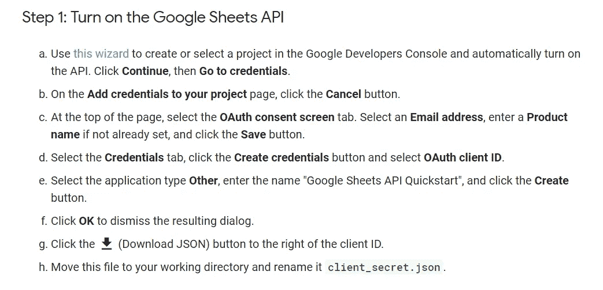
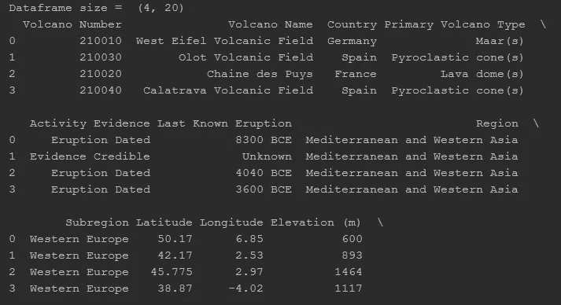

# 如何使用 Python API 访问 Google 工作表数据并转换成 Pandas dataframe

> 原文：<https://towardsdatascience.com/how-to-access-google-sheet-data-using-the-python-api-and-convert-to-pandas-dataframe-5ec020564f0e?source=collection_archive---------3----------------------->

对于我从事的许多数据科学/可视化项目来说，建立一个 SQL 数据库(或类似的东西)是多余的。另一方面，使用本地 Excel 文件会增加共享和复制的难度。Google Sheets 通常是一个很好的中间地带，它提供了一个易于使用的协作平台，有一个熟悉的类似 Excel 的界面。

使用 OAuth 和 Google Python API 访问 Google 工作表数据是一个简单的过程，这要感谢(通常)优秀的 Google 文档。首先，我们需要在 Google Drive 帐户上设置 OAuth 凭证，以便访问工作表。

接下来，我们需要为 Python 安装 Google API 客户端库。我们可以在(理想情况下，在激活的 Python 虚拟环境中)使用 pip 来实现这一点。

显然，在关于访问 Google 工作表数据的教程中，您将需要一个工作表来使用——我将使用我的“火山酒”工作表(基于史密森尼博物馆提供的令人惊叹的[火山活动数据)。在接下来的步骤中，您将需要工作表 ID(可以从 URL 获得),然后是工作表的名称。](https://volcano.si.edu/)

Get the spreadsheet ID from the Google Docs URL

Get the Google Sheet name of interest

现在，创建一个新的 Python 脚本来检索数据(确保‘client _ secret . JSON’文件保存在与脚本相同的工作目录中，或者提供一个显式路径)。用电子表格的相关值更新下面代码中的电子表格 ID 和工作表名称。

Final Python code for accessing Google sheet data and converting to Pandas dataframe

运行该脚本，您应该得到作为 dataframe 返回的工作表数据——请继续关注即将推出的一组教程，这些教程将使用这些火山酒数据来完成 Plotly Dash web 应用程序的创建和部署！

Final Pandas dataframe returned from Google Sheet