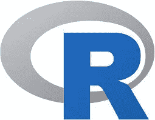
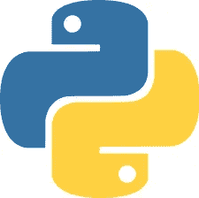

# 如何赢得数据科学面试:R & Python

> 原文：<https://towardsdatascience.com/how-to-ace-data-science-interviews-r-python-3a49982000de?source=collection_archive---------2----------------------->



这是正在进行的数据科学职位面试系列的一部分。你可以看看第一部分，这里涵盖了 SQL、[](https://medium.com/towards-data-science/how-to-ace-data-science-interviews-sql-b71de212e433)**和第二部分，这里涵盖了统计、*[](/how-to-ace-data-science-interviews-statistics-f3d363ad47b)**。***

**数据科学家的日常工作很大一部分涉及在交互式编程环境中操纵、分析和可视化数据。在过去的几年中，两种语言已经成为这些任务的标准选择: [R](https://www.r-project.org/) 和 [Python](https://www.python.org/) 。每个人都有自己的优点和缺点，最终你可能会从了解这两者中受益，但对于面试来说，最好的策略是选择一个，并真正学好它。无论你选择哪种语言，我都会帮你搞定:在这篇文章中，我将介绍每种语言的基础知识，这样你就可以放心地参加面试，准备好白板演示了。**

# **选择一种语言**

**正如我上面提到的，我能给你的最好的建议是不要因为试图学习所有的东西而分散你的精力。我参加的每一次数据科学面试，无论是作为面试官还是被面试者，都允许应聘者用两种语言中的任何一种来解决问题。所以最终学习任何一种都是完全没问题的。以下是如何做出选择的一些通用指南。**

**Python 是一种多用途、全功能的编程语言(从技术上来说，R 也是，不过我们一会儿就会谈到这一点)。它的设计目的是实现与 C 和 Java 等其他编程语言相同的功能。但是与 C 不同，Python 有很多现代的便利，比如自动内存管理和动态类型化 T21。在我看来，Python 在数据科学方面的优势在于它能够作为生产系统的真正后端语言，这意味着你作为数据科学家所做的任何建模都可以在一个真实的网站或软件产品上轻松实现。换句话说，如果你的主要兴趣是编写或原型化生产代码，我会选择 Python。**

**另一方面，r 感觉更像一种分析语言。虽然 R 支持所有标准的 CS 数据结构和技术，如数组和 for 循环，但当您处理矩形数据集时，就像您在典型的电子表格程序中看到的那样，它确实表现出色。与电子表格不同的是，你仍然可以利用计算机科学的概念，比如迭代和抽象(下面将详细介绍)，这使得它比 Excel 等工具强大几个数量级。此外，R 是学术界定量研究人员的事实上的语言，这意味着最前沿的统计技术通常在它们进入任何其他地方(包括 Python)之前很久就以 R 包的形式提供了。因此，如果您的主要工作流涉及进行离线分析和数据可视化，尤其是如果您想要访问最先进的统计软件包，R 就是您想要的地方。**

**但是，同样，你不能真的出错——两者都非常有用，而且有可能你可以让任何一种语言完成你试图完成的任何数据科学任务。**

# **选择一个环境**

**一旦你选择了一种语言，帮你自己一个忙，熟悉这种语言的最佳交互环境。在组织和保存代码、可视化数据以及管理包方面，这将使您的生活变得更加轻松。**

**在 R 你想去下载免费版本的 RStudio。与使用命令行或其他 IDE 相比，使用 RStudio 进行数据分析要容易得多，这一点我实在说不出什么好的。它管理软件包，提供对帮助文件的访问，显示可视化，并为您提供一个漂亮的、可定制的文本编辑器以及您的控制台。整个环境被组织成一个四窗格的格式，因此您可以一次查看所有内容。**

**对于 Python，请前往 [Jupyter](http://jupyter.org/) ，用他们的笔记本进行设置。这是一个与 RStudio 非常不同的环境，但同样有用。Jupyter 没有提供本地 IDE，而是提供了一个基于浏览器的笔记本，可以让你将代码分成可执行的块，这样你就可以一次运行一段代码并进行分析。输出内联显示在生成它的代码的正下方，因此很清楚哪个输出来自哪个分析。此外，由于 Jupyter 笔记本是基于浏览器的，因此很容易与他人分享，使您的所有工作更具可重复性。**

# **编程基础**

**无论你选择哪种语言，你都需要了解编程的基础——数据类型和结构、迭代和抽象。有可能，但不太可能，你会直接得到关于这些概念的问题，因为通常这种类型的东西是留给软件工程面试的。但是，您肯定需要熟悉这些概念，以解决您在典型的数据科学面试中可能会遇到的任何白板或带回家的挑战。**

**[**数据类型**](https://en.wikipedia.org/wiki/Data_type) 只是描述被存储信息类型的一种方式。在 Python 中，选项是数字，可以是整数、长整数或浮点数；一个布尔值，一个二进制的真或假；和一个字符串，它是字符的组合。在 R 中，所有这些相同的类型都存在于添加了[因子](https://www.r-bloggers.com/data-types-part-3-factors/)的情况下:一个有序的变量，其级别由不同的字符串表示。**

**就不同的数据类型如何存储和编码而言，这个话题很有深度，但一般来说，面试时你不需要知道这些东西。请注意，任何给定的数据单元都需要属于这些类型之一，这些类型将决定您能够对数据执行什么操作。例如，你可以将两个数值变量相乘，但是当然你不能对两个字符串做同样的事情。**

****数据结构**是将每个原子数据块(如数字或字符串)组合成一个对象的方法。Python 有列表(在其他语言中通常称为数组)和元组，这两者都是数据的有序集合。它还有一个称为集合的东西，这是一个没有重复的无序变量集合。最后，Python 有字典，它代表了键值对的有序集合。r 有向量(类似于 Python 列表，除了所有元素需要共享一个类型)、列表、矩阵和数据框。**

****迭代**是计算机科学中的一个重要概念，它与数据结构紧密相连——本质上是对数据结构中的每一项执行操作的一种方式。这里的两大类别是向量化操作和循环。矢量化函数只是将单个函数应用于数据结构的每个元素并返回一个元素的一种方式。**

**例如，您可以获取一个包含五个不同数字的列表或向量，并返回一个包含每个数字的平方根的新向量。另一方面，循环允许您编写代码块，为给定结构中的每一项执行该代码块。这通常比较慢，但是稍微灵活一些，因为您可以执行任意代码，输出可以是任何内容。**

**在 R 和 Python 中，循环以几乎相同的形式存在。另一方面，矢量化函数在两种语言中都有多种形式，并且差别很大。在 R 中，有整个矢量化函数家族`apply`，你可以在这里读到关于[的内容。在 Python 中，Numpy 包中有](https://www.datacamp.com/community/tutorials/r-tutorial-apply-family)[列表理解](http://www.pythonforbeginners.com/basics/list-comprehensions-in-python)和`vectorize`以及其他选项。这可能看起来很多，但是一旦你学会了这个概念，你会发现所有这些不同的选项只是应用同一个基本概念的不同方式:取一个数据结构，用它的每个元素做一些事情。**

****抽象**，大部分是以函数的形式，是一种编写代码块的方法，通过提供不同的输入可以重用。例如，您可以编写一个函数，它接受一个数字输入，并将其自身相乘以获得平方值。然后，您可以向您的函数传递任何数字以获得平方输出——理论上，这样做比每次需要手动平方数字更简洁。虽然这个示例可能不会节省太多时间或代码，但是函数可能会变得更加复杂，此时为重复任务编写函数可以使代码更加易读和简洁。Python 和 R 都允许用户定义函数，只是语法略有不同。**

**如果这一节感觉有很多新信息，我建议从基本的 R 或 Python 教程开始。 [DataCamp](https://www.datacamp.com/courses/free-introduction-to-r) 有一个很好的 R 用的，CodeAcademy 有一个很好的 Python 用的。**

# **数据操作**

**数据操作代表了典型面试问题的一大类。和 SQL 一样，一个标准的面试官会给你提供一个样本数据集，要求你输出一个具体的结果。**

**对于这种类型的面试来说，重要的是你要有扎实的数据操作 R 或 Python 包的基础，因为试图解决这些问题是困难和低效的。**

**在 Python 中，这意味着了解 [Pandas](https://pandas.pydata.org/) ，这是一个包，它提供了一个完整的框架来操作数据框，即具有行和列的矩形数据集。Pandas 拥有你操作和重构数据所需的所有操作符，以及过滤、聚集、连接等方法。**

**虽然 R 本身支持矩阵和数据框形式的矩形数据集，但是学习 [dplyr](https://cran.r-project.org/web/packages/dplyr/dplyr.pdf) 或 [data.table](https://cran.r-project.org/web/packages/data.table/data.table.pdf) 仍然会让您的生活更加轻松。这些包中的每一个都为操作数据框提供了一个比 base R 更好的界面:dplyr 更直观，可读性更好，而 data.table 更快，语法更简洁。**

**一旦你掌握了其中的一个软件包，用白板演示这类面试问题就非常类似于准备 SQL 面试，就像我在[我之前的帖子](/how-to-ace-data-science-interviews-sql-b71de212e433)中描述的那样。所有相同的概念都适用:组合、过滤、聚合和连接。和 SQL 一样，在你写的时候，通过讲述你的代码来帮助你的面试官，这样他们知道你在想什么，并且在你没有得到最终答案的情况下，他们可以给你部分的信任。**

# **统计数字**

**统计学是另一类你可能会被要求在白板上讨论的问题。有点讽刺的是，这实际上是最容易的部分，因为这些语言中复杂的统计函数通常被抽象成一个易于使用的单行函数。**

**base R 中包含了许多基本的统计函数。例如，一个简单的线性回归，如果您从头开始编写，可能需要花费几个小时，但只需:**

```
**model <- lm(y ~ x1 + x2, data = df)**
```

**在 Python 中，你至少需要 [Numpy](http://www.numpy.org/) 和 [Scipy](https://www.scipy.org/) 包来确保你拥有基本的统计函数，但是像 R 一样，一旦安装了这些包，你就可以开始了。**

**当然，您仍然需要理解底层的统计数据，以便很好地利用这些强大的工具。如果您需要加快速度，我建议您在这里查看我的文章，并查看您最终使用的软件包的文档。通常，这些文档还会链接到深入研究特定技术的原始学术论文，如果你想要更深入的理解，这会很有帮助。**

# **形象化**

**除了白板问题之外，许多数据科学面试都会有一个带回家的部分，要求你获取一个样本数据集，分析它并得出一些结论。通常你会发回你的代码，一些说明性的文本和可视化。为了成功地通过这一关，上面讨论的数据操作和统计是至关重要的，但是我们还没有谈到可视化。**

**对于每一个 R 和 Python 来说，可视化你的数据实际上只有一个选择:在 Python 中你想学习 [matplotlib](https://matplotlib.org/) ，在 R 中你想学习 [ggplot2](https://cran.r-project.org/web/packages/ggplot2/ggplot2.pdf) 。这两个库都为创建好看的数据可视化提供了灵活的接口，远远优于这两种语言的基本功能。**

**不幸的是，我发现这两个可视化软件包的语法都有点麻烦和不直观，特别是对新程序员来说，但是一些实践应该会让你达到你需要的地方。我会避免从堆栈溢出或其他地方复制和粘贴语法的诱惑，因为这只会推迟学习语法如何工作的底层结构的必要性。当你掌握了其中的一个技巧后，你理解了其中的具体细节，这将使你更快地生成可视化效果，而不必求助于谷歌。**

**带回家作业中可视化的一些小技巧:给你的图表加标题，给你的坐标轴加零和标签，包括误差线(如果适用的话)，选择一些颜色并坚持使用它们。例如，如果你在一个图表中把 iOS 数据点做成红色，把 Android 数据点做成蓝色，那么在所有后续的图表中做同样的事情。另外，保持可视化简单:通常你只需要条形图、折线图和散点图。**

# **包扎**

**像统计学一样，你可以真正深入到编程概念，并开始感到不知所措。但是实际上，一旦你了解了你所喜欢的编程语言的基础，你就可以轻松地使用一些关键工具了:数据操作、统计和可视化。关注这三个方面，你就能为下一个面试官抛给你的任何问题做好准备。**

***我是一名数据科学家和研究人员，在科技行业工作，并在* [*Medium*](http://medium.com/@carsonforter) *上撰写相关文章。也可以关注我的* [*推特*](https://twitter.com/carsonforter) *。如果您喜欢这篇文章，请点击下面的关注按钮，了解我的数据科学文章。***