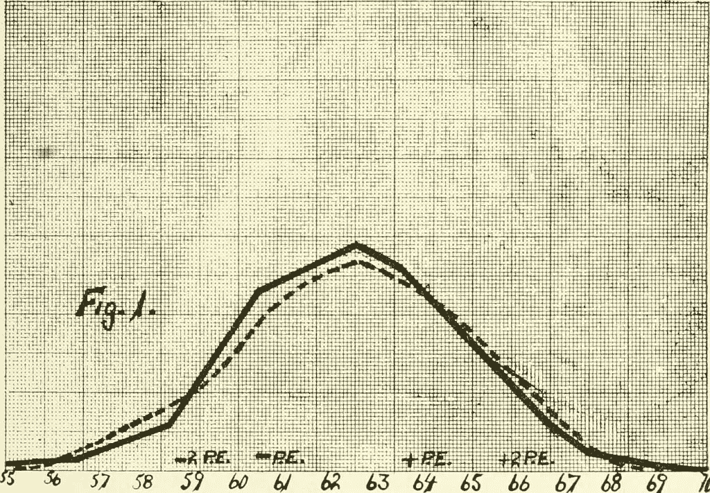

# 如何在数据科学面试中胜出:统计学

> 原文：<https://towardsdatascience.com/how-to-ace-data-science-interviews-statistics-f3d363ad47b?source=collection_archive---------2----------------------->

这是正在进行的数据科学职位面试系列的一部分。可以查看一下第一部分，这里涵盖 SQL、**，第三部分关于 R 和 Python* [*这里*](https://medium.com/@carsonforter/how-to-ace-data-science-interviews-r-python-3a49982000de) *。**

*对于从事或试图从事数据科学工作的人来说，统计学可能是你需要发展的最大和最令人生畏的知识领域。这篇文章的目标是把你需要知道的东西减少到有限数量的具体想法、技术和方程式。*

*当然，这是一个雄心勃勃的目标——如果你打算长期从事数据科学，我仍然希望在你的职业生涯中继续学习统计概念和技术。但我的目标是为你提供一个基线，让你通过面试，尽可能短而轻松地实践数据科学。我将用关键术语和资源来结束每一节，以便进一步阅读。让我们开始吧。*

# *可能性*

*概率是统计学的基础，经常在面试中出现。学习基础知识是值得的，不仅仅是因为这样你就可以通过面试官喜欢问的典型概率脑筋急转弯，还因为它会增强和巩固你对所有统计学的理解。*

*概率是关于随机过程的。经典的例子是像掷硬币和掷骰子这样的事情——概率为你提供了一个框架来确定一些事情，比如你希望在一定次数的投掷中掷出多少个 6，或者在没有正面朝上的情况下掷出 10 个公平硬币的可能性。虽然这些例子可能看起来很抽象，但它们实际上是分析人类行为和处理非确定性过程的其他领域的重要思想，因此对数据科学家来说至关重要。*

*我喜欢的学习或重新学习概率的方法是从[组合学](https://www.dartmouth.edu/~chance/teaching_aids/books_articles/probability_book/Chapter3.pdf)开始，这将提供一些关于随机过程如何表现的直觉，然后继续我们如何从这些过程中推导出期望和方差的规则。熟悉这些话题会让你通过一次典型的数据科学面试。*

*为了专门准备你可能会被问到的概率问题，我会找一些示例问题(这是一个合理的列表，但还有许多其他问题)并在白板上完成它们。练习制作[概率树](http://www.statisticshowto.com/how-to-use-a-probability-tree-for-probability-questions/)来帮助形象化和思考问题。*

***阅读内容**:[的第 1-4 章和第 6-8 章这个概率介绍](https://www.dartmouth.edu/~chance/teaching_aids/books_articles/probability_book/amsbook.mac.pdf)将涵盖你需要知道的几乎所有内容。*

***关键思想**:随机变量、连续变量与离散变量、排列、组合、期望值、方差*

# *概率分布*

*与上述主题密切相关的是概率分布。概率分布就是描述随机变量的单个观察值等于特定值或值范围的可能性的分布。换句话说，对于任何给定的随机过程，都有一系列可能的值，并且随机过程的单次抽取有可能采用这些值中的一个。概率分布为给定过程的所有可能值提供了可能性。*

*与概率一样，了解分布是理解推断和预测统计的先决条件，但你也可能会收到专门关于它们的面试问题。最典型的例子是:您有一个行为类似于 X 的流程——您将使用什么分布来建模该流程？回答这些类型的问题只是将随机过程映射到合理的分布，这篇博文很好地解释了如何做到这一点。*

***读什么**:上面提到的概率介绍[的第 5 章，还有这篇关于常见分布的](https://www.dartmouth.edu/~chance/teaching_aids/books_articles/probability_book/amsbook.mac.pdf)[博文](http://blog.cloudera.com/blog/2015/12/common-probability-distributions-the-data-scientists-crib-sheet/)*

***关键思想**:概率密度函数、累积分布函数、偏斜度、峰度、均匀分布、正态(高斯)分布、博文中描述的其他分布*

# *中心极限定理和假设检验*

*一旦你掌握了概率和分布，你就可以专注于科学家是如何进行推理的。关键在于，一旦你有了描述概率分布行为的工具，我们用来总结数据(通常只是平均值)的描述性统计就可以被建模为随机变量的集合。*

*方便的是，有一个定理告诉我们，给定一个足够大的样本，随机变量的均值会变成正态分布。这被称为中心极限定理(CLT)，我已经在[这里](/the-only-theorem-data-scientists-need-to-know-a50a263d013c?source=linkShare-24104a01fc98-1513702689)写了一些细节。如果您已经学习了这方面的内容，那么这篇文章是一个很好的入门或复习的地方。*

*使用 CLT，我们可以评估给定均值来自特定分布的可能性，这种想法允许我们测试假设。例如，我们可能有一组人的平均身高，并想测试其来自一个平均身高大于 6 英尺的随机过程的假设。知道均值是正态分布的，就可以评估这个命题，并拒绝或未能拒绝我们的假设。*

*假设检验的面试问题要么是将某些场景映射到适当的检验，要么是阐述假设检验的一些关键思想:p 值、标准误差等。下面的阅读材料将涵盖后一种类型的问题，但对于前一种练习是最好的方法。获取一些[样本数据集](https://stat.ethz.ch/R-manual/R-devel/library/datasets/html/00Index.html)并尝试提出实际问题，然后阐明假设并选择测试来评估它们。假设你必须向面试官解释这些决定，并相应地练习这些解释。*

***读什么**:Coursera 课程[的前三段视频](https://www.coursera.org/specializations/statistics)和 dartmouth probability book 中关于假设检验的章节[。](https://www.dartmouth.edu/~chance/teaching_aids/books_articles/probability_book/amsbook.mac.pdf)*

***关键思想**:中心极限定理、样本统计分布、标准误差、p 值、单尾和双尾检验、一型和二型误差、T 检验、其他假设检验*

# *随机化和推断*

*继续上面的想法，测试人口平均身高等于 6 英尺的假设是合理的，但作为数据科学家，你更经常对因果问题感兴趣。也就是你想知道做 X 会不会导致 y。*

*例如，一个类似这样的问题:“住在加州会让你变高吗？”更像是科学家想要回答的问题。天真的方法是测量加州人的身高，并测试他们的平均身高大于非加州人的平均身高的假设。然而不幸的是，简单地测量和比较观察到的数据总是会对真正的因果关系产生有偏见和不正确的估计。在这个例子中，有许多与居住在加州相关的事情也会影响人们的身高，所以我们实际上并不知道居住在加州是否会让人变高，或者这些其他事情是否有责任。*

*解决这个问题的方法是随机化。我们可以随机分配人们住在加州或不住在加州，然后测量这些人的身高。这确保了待遇是两组之间唯一有系统差异的东西，所以身高的任何差异一定是住在加利福尼亚的结果。*

*这就是企业进行实验的原因，或者如他们在行业 A/B 测试中所称的那样。当您想要了解决策或产品对业务指标的真正因果影响时，随机实验是对结果有信心的唯一方法。*

*不像概率或分布，除了非常专业的角色，你面试的任何一部分都不太可能关注因果关系。也就是说，理解为什么相关性并不意味着因果关系，以及相对于使用观察数据，何时有必要进行真正的随机测试非常重要，并且肯定会成为数据科学面试过程中出现的话题。你在这方面的准备可能仅限于阅读，而不是白板或解决问题，但它仍然非常重要。*

***读什么**:我有两篇相关的文章，应该会有帮助:[一篇关于非实验数据的极限](https://medium.com/@carsonforter/whats-observational-data-for-c70cecf2055d)，另一篇[关于如何分析 A/B 测试数据](https://medium.com/@carsonforter/how-to-work-with-a-b-test-data-96121b89d1a4)。这篇关于网络实验的文章应该很好地完善了基础知识。*

*如果你想更深入一点，哥伦比亚大学有一些关于因果统计推断的好材料。除此之外，它还介绍了潜在结果框架和 Rubin 因果模型，我强烈推荐给任何对实验感兴趣的人。*

***关键观点**:随机化、因果关系、偏见、自我选择、概化、潜在结果、鲁宾因果模型*

# *预测和机器学习*

*最后，我们来预测。这是很多人最感兴趣的东西——它包括图像识别、视频推荐、网络搜索和文本翻译等各种主题。显然，这是一个巨大的领域，但我假设你面试的是一个更通才的职位，在这种情况下，任何领域的专业知识都不会被假定。*

*相反，你希望能够解决面试官抛给你的任何特定的预测问题，并提供一个合理的方法来开始解决它。这通常意味着你需要准备好讨论如何选择一个模型，评估该模型的有效性，然后改进该模型。面试时，我会把问题分解成这三个步骤。*

*当选择一个模型时，你的决定主要基于以下几点:结果变量的类型和分布，因变量和自变量之间关系的性质，你拥有的数据量，期望的可解释性水平。同样，这里没有正确的答案(尽管经常有错误的答案)，所以你只是希望能够对你要做的决定和它们所暗示的权衡进行明智的讨论。*

*您可能还会被问到您希望在模型中包含哪种特征作为独立变量(预测值)。这主要是一个领域知识的练习:它更多的是关于理解行业和哪些数据可能预测感兴趣的结果，而不是关于统计。讨论还可能涉及特征工程，这将涉及如何以及何时转换变量的一些直觉，以及选择预测器的数据驱动方式(即正则化、降维以及自动特征选择)。*

*评估模型是一门相对简单的艺术，它涉及到用来验证模型和减轻任何过度拟合问题的维持数据集。关于这个主题的 wiki 可能足以作为一个基线。此外，您希望熟悉不同的评估指标:准确性、ROC 曲线、混淆矩阵等。这种东西是很少开放的，我不期望进入它的微观细节。粗略地了解一下为什么需要维持集以及不同评估指标的优缺点就足够了。*

*第三步是改进，主要是对特征工程主题进行重新组合，并决定是否有必要收集更多的数据。面试时，确保你第一次尝试一个模型时，给你留下了改进的空间——否则你将很难回答接下来不可避免的关于如何改进的问题。*

***读什么**:学习统计学习的所有[元素](https://web.stanford.edu/~hastie/Papers/ESLII.pdf)足以通过面试。*

***关键思想**:回归与分类、线性与非线性、监督与非监督、特征工程、交叉验证、ROC 曲线、精确召回、偏差-方差权衡、提升、打包*

# *请不要死记模型*

*我概述了一种学习数据科学面试统计学的方法，从基础开始，逐步发展到更高级的技术。这不是武断的——这是因为理解数学构建模块将允许你有效地推理不同的模型，做出好的决定，并明智地谈论你以前从未想过的话题或技术。*

*相反的方法，不幸的是我和其他人尝试过的方法，是从金字塔的顶端开始，只是记住不同的技术。这是难以置信的无效，因为你最终很难理解一堆脱离上下文的孤立想法，因为你缺乏将所有东西粘在一起并允许你思考新想法的基础知识。所以请不要这样。从概率开始，转向分布，然后处理推理和预测。你会过得更轻松的，我保证。*

*一如既往，我很乐意回答问题，并在下面的评论中接受反馈。我肯定我在试图涵盖如此广泛的主题时错过了许多东西，所以请随意说出。祝你面试好运！*

# *额外学分:时间序列，贝叶斯*

*这一部分只是为了突出我没有涉及的内容。我已经谈到了相当传统的推理和预测方法，但是还没有涉及到两个大的统计学领域，这两个领域以非常不同的方式处理这些问题。*

*一个是时间序列数据的分析，研究一段时间内的数据，以及当数据生成过程不是静态的时你需要应用的特殊技术。第二种是贝叶斯统计，它采用一种完全不同的统计方法，决定将某个领域的先验知识纳入概率评估。这两个领域都很重要，值得了解，但是对于一个典型的多面手面试来说，深入这两个领域中的任何一个都是不寻常的。*

*如果你现在对学习贝叶斯统计感兴趣，我推荐[这篇 datascience.com 邮报](https://www.datascience.com/blog/introduction-to-bayesian-inference-learn-data-science-tutorials)作为初学者友好的介绍。时间序列在[本帖](https://www.analyticsvidhya.com/blog/2015/12/complete-tutorial-time-series-modeling/)中有所介绍。*