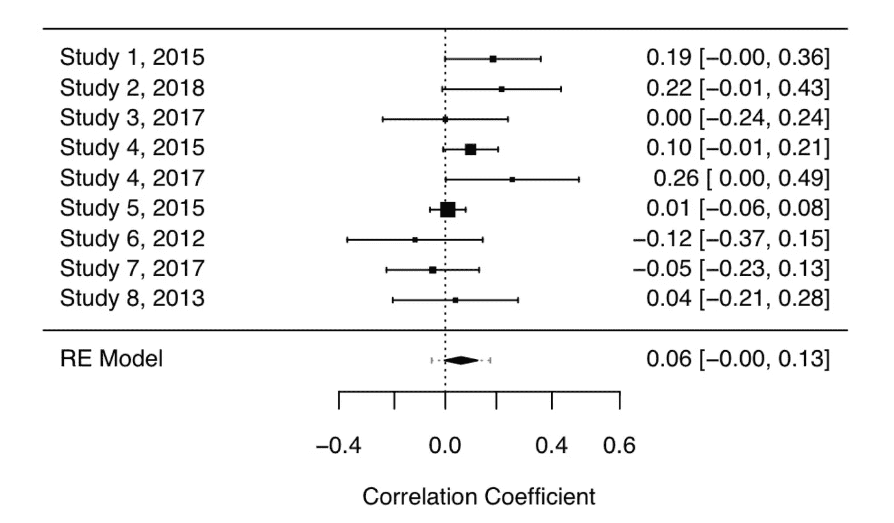
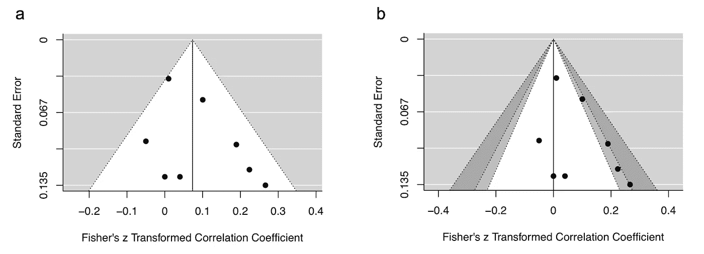

# 荟萃分析中的三个常见错误

> 原文：<https://towardsdatascience.com/how-to-avoid-three-common-mistakes-in-meta-analysis-eb64427e8569?source=collection_archive---------7----------------------->

元分析已经成为一种流行的工具，用来综合研究一个普通研究问题的大量工作的数据。由于这提供了一种假定的客观方法来总结大量数据，它已经成为制定健康指南时证据的黄金标准。

然而，荟萃分析中有几个问题会导致不准确。由于这些限制，元分析——或者借用早期批评者[的一个术语“超级愚蠢”——几乎自该方法问世以来就一直受到批评。](http://psycnet.apa.org/doiLanding?doi=10.1037%2F0003-066X.33.5.517.a)

有几个工具有助于确保元分析的质量，这将在本文稍后概述。但是首先，让我们考虑一下这个(虚构的)摘录，它来自一个荟萃分析的结果部分，我将用它来简要说明荟萃分析中的三个常见问题:

> “正如假设的那样，综合七项研究的八个效应大小的荟萃分析表明，社交媒体的使用与自我报告的焦虑水平正相关[r = .073，95% CI ( .004，0.142]；p = .038 图 1A】。Egger 的回归测试表明没有发表偏倚的证据(p = .19 图 1B)。”

**Figure 1\. The relationship between social media usage and self-reported anxiety.** The forest plot (a) visualises point estimates for a set of hypothetical studies with filled squares. The diamond reflects the estimated summary effect size. The funnel plot (b) illustrates each effect size against its standard error

当这位虚构的作者——他恰好也在发行一本关于社交媒体危险的书——最初搜索研究时，他们实际上找到了 9 项符合入选标准的研究。然而，九项研究的荟萃分析的汇总效应大小[*r*= . 062，95%可信区间(- .004，0.127)]与. 061 的*p*值相关(图 2)。

**Figure 2**. **The original set of studies for the assessment of the relationship between social media usage and self-reported anxiety.** Upon realising that the removal of study six would result in a statistically significant result, our fictitious researcher removed this study using a post hoc justification. Meta-analysis pre-registration would have prevented a post hoc adjustment of exclusion criteria dressed up as being *a priori*

由于这一结果会阻碍出版(和图书销售)的机会，他们进一步研究了研究六，该研究报告称社交媒体使用和焦虑水平之间存在负相关。这项研究恰好是纳入荟萃分析的最早研究。

研究六没有包括 Instagram 的使用(在 2012 年开始流行)，所以他们调整了资格标准，只包括 2013 年以来发表的研究，这是由(事后)假设证明的，即 Instagram 的使用与焦虑最相关。

Is Instagram usage associated with anxiety? Probably not, but our fictitious author used this idea as a post hoc justification for removing a study from their meta-analysis

随着研究的删除，荟萃分析变得具有统计学意义。虽然这个虚构的场景乍一看似乎很极端，但在 2000 多名接受调查的心理学家中，近 40%的人承认，在考虑了这样做的影响后，他们已经排除了数据。

## 预注册您的分析计划

荟萃分析预注册为分析灵活性提供了一种补救措施，因为它提供了研究者分析意图的先验记录。在上面的例子中，排除标准在分析之前就已经指定了。

对预注册分析的一个常见批评是它们没有提供分析的灵活性。然而，这是不正确的，因为预先登记并没有将研究人员锁定在特定的计划中，而是有助于清楚地描述预先计划的和探索性的分析。

在上面的例子中，研究者可以自由地报告他们的分析，但是他们必须陈述他们的推理，这充其量是站不住脚的。作为指导，系统评价和荟萃分析方案的首选报告项目( [PRISMA-P](http://www.prisma-statement.org/Extensions/Protocols.aspx) )文件提供了荟萃分析方案中应解决的项目列表。

荟萃分析预注册有多种选择。首先，遵循 PRISMA-P 指南的带时间戳的荟萃分析协议可以上传到[开放科学框架](http://osf.io)。

第二，如果荟萃分析调查了一个健康相关的结果，它可以在 [PROSPERO](https://www.crd.york.ac.uk/prospero/) 预先注册。PROSPERO 网站通过一步一步的登记表来指导研究人员，该登记表用于生成预注册记录。这些记录可以修改，但任何更改都有时间戳。

第三，元分析方案可以提交给许多期刊进行同行评议，如[系统综述](https://systematicreviewsjournal.biomedcentral.com/)。虽然同行评审过程显然比上传方案花费更多的时间，但它可以提供重要的反馈，从而改善荟萃分析。

第四，可以使用[注册报告](https://cos.io/rr/)格式提交荟萃分析，其中荟萃分析分两个阶段进行审查。在第一阶段，荟萃分析介绍和方法部分在数据收集前进行同行评议。如果研究原理和方法被认为是合适的，杂志将提供最终论文的临时验收。

An overview of the Registered Reports format (Source: [Center for Open Science](https://cos.io/rr/))

一旦收集和分析了数据，论文再次提交给第二阶段审查，第二阶段审查包括与第一阶段相同的导言和方法，但增加了结果和结论。在第二阶段的审查中，重点是结果和解释是否符合预先批准的方法。

重要的是，论文的接受不取决于结果的统计学意义。截至 2018 年 8 月，有 [42 种期刊](https://cos.io/rr/)提供注册报告荟萃分析，其中大多数期刊发表生物行为科学的研究。

## 出版偏差

在荟萃分析中，发表偏倚是一个[公认的问题](https://www.ncbi.nlm.nih.gov/pubmed/21784880)。由于有统计学意义的研究更有可能被发表，对于任何给定的研究领域，很可能有几个不重要的研究被搁置在研究者的文件抽屉里，这对荟萃分析没有帮助。

How much data is left to be forgotten in file drawers or lab archives?

因此，荟萃分析汇总效应大小可能不能最好地代表“真实”效应大小。评估发表风险的一种常见方法是构建漏斗图，根据方差(例如，标准误差)的测量值绘制影响大小。对称的漏斗图表明发表偏倚的风险较低。尽管目测漏斗图来评估不对称的证据存在固有的主观性，但许多研究人员仍然依赖这一工具。

现在让我们回到我们想象中的书房。由于我们虚构的研究人员意识到主观漏斗图评估的问题，他们通过构建漏斗图客观地评估了不对称性。由于[研究人员不擅长从漏斗图中识别不对称](https://www.ncbi.nlm.nih.gov/pubmed/16085192)，他们遵循建议，进行了艾格回归测试来补充漏斗图(图 1A)。

It can be hard to subjectively decide whether a funnel plot looks asymmetrical, especially if there’s a conflict of interest

统计显著性检验表明漏斗图不对称。在这种情况下，测试没有统计学意义( *p* = .19)。因此，我们的研究人员得出结论，不存在发表偏倚的风险。然而，仔细观察这些数据会发现，这个结论很可能是不正确的。

对漏斗图及其相关测试的一个常见误解是，它们测量的是发表偏倚，而实际上它们测量的是 [*小研究*偏倚](https://www.ncbi.nlm.nih.gov/pubmed/21784880)。这种类型的偏倚可能包括发表偏倚，但也包括通常与小型研究相关的其他类型的偏倚，如研究质量。

一个相对简单的漏斗图修改，称为轮廓增强漏斗图，可以帮助更好地理解与小研究偏倚相比的发表偏倚的风险。对于给定范围的效应大小和方差，可以计算出每一点的统计显著性水平。因此，可以在漏斗图上显示统计显著性的范围(例如， *p* = .05 至. 01)。

将我们的原始漏斗图(图 3A)与轮廓增强漏斗图(图 3B)进行比较，发现尽管没有漏斗图不对称的明显证据，但一半包含的效应大小的*p*-值非常接近. 05。可用的 *p* 值的一半如此接近 0.05 是非常不可能的。要么这些重要的研究也是选择性分析的结果，要么存在一些未发表的研究。

**Figure 3\. A comparison of conventional meta-analysis funnel plots vs. contour-enhanced funnel plots.** Compared to the original funnel plot (a), which is also presented in Fig 1B, a contour enhanced funnel plot (b) visualises ranges of statistical significance. The gray-shaded region corresponds to p-values between .10 and .05, whereas the dark gray-shaded region corresponds to p-values between .05 and .01

已经开发了几种措施来纠正荟萃分析中的偏差，如 [p 曲线](https://www.ncbi.nlm.nih.gov/pubmed/26186117)、 [p 均匀](https://www.ncbi.nlm.nih.gov/pmc/articles/PMC5117126/)和[三参数选择模型](https://www.ncbi.nlm.nih.gov/pubmed/27694467)，后者展示了[优越的性能](https://osf.io/jn6x5/)。但是如果没有未发表的研究，这些方法充其量只能是估计。这种情况的一个合理的解决方案是进行元分析，只包括预先注册的实证研究，如 Gronau 及其同事最近关于“权力姿态”的元分析。

The idea that adopting an ‘expansive’ body posture makes people feel more powerful makes for a nice story (and TED talk) but the evidence supporting this effect is shaky

现在我们来看看荟萃分析中的最后一个常见问题:效应大小依赖性。请注意，在之前的荟萃分析例子中，有八个效应量，但只有七项研究？这是因为从研究四中提取了两个效应大小(图 1A)。这是一个常见的现象，因为论文有时会报告几个结果指标。

然而，由于这些效应大小来自相同的研究人群，它们在统计上是相关的。由于典型的荟萃分析程序假设效应大小在统计上是独立的，合并相关的荟萃分析会导致[有偏的结果](https://www.amazon.com/Methods-Meta-Analysis-Correcting-Research-Findings/dp/141290479X)。

有几种方法可以解决荟萃分析中的统计相关性问题。首先，您可以简单地为每个研究选择一个效应大小。虽然简单明了，但需要一个预先指定的系统来帮助选择所选的效果大小，否则很容易选择最大的效果。此外，这种方法从您的分析中排除了潜在的有价值的效应大小。要包括一项研究中的多种效应，可以对效应进行统计汇总。但要做到这一点，你需要包括一个研究内相关性的测量，这几乎从来没有在论文中报道过。

如果论文包含原始数据，可以计算出几乎同样罕见的研究内相关性。因此，如果采用这种方法，研究人员几乎总是需要估计研究内的相关性。或者，[稳健方差估计](https://www.ncbi.nlm.nih.gov/pubmed/26056092)可用于说明效应大小依赖性，无需了解研究内相关性。

元分析是更好地理解不同研究领域的重要工具。这种方法可以提供一个研究领域的更客观的总结，而不是简单地“计票”重要和不重要结果的数量。

但是就像几乎所有的统计工具一样，如果使用不当，元分析会导致不准确的推论。通过这篇文章，我希望已经提供了一个简要的概述，强调了元分析中的一些常见问题和这些问题的实际解决方案。

这是一篇文章的编辑版本，这篇文章将发表在由挪威科技大学的学生创办的心理学杂志《NTNU 》上。[这里的](https://osf.io/5skuv/)是一篇可引用的文章的预印本，执行本文所述分析的 R 脚本和数据可从[这里的](https://osf.io/3vjm5/)获得。我感谢 Psykologisk Tidsskrift 的编辑好心地允许我以博客的形式转贴这篇文章。