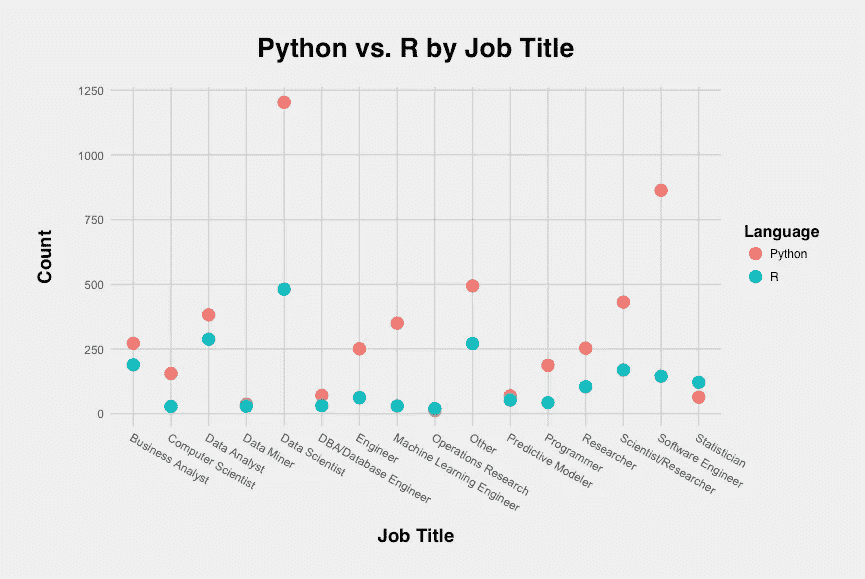
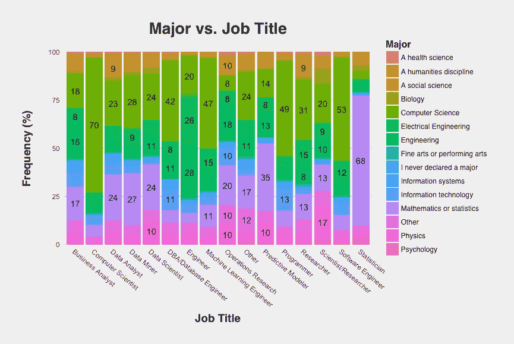
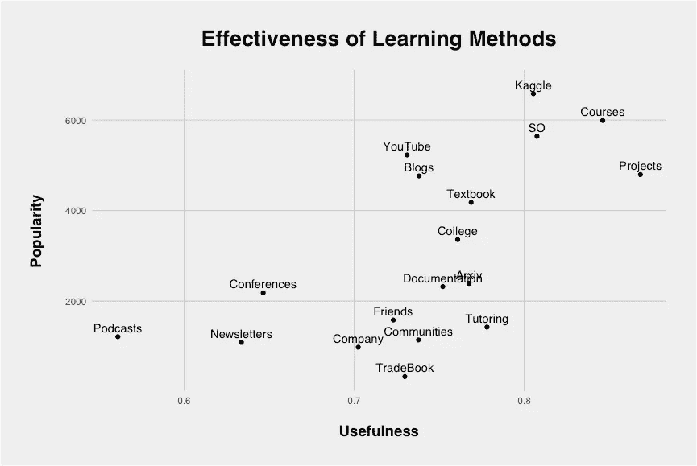
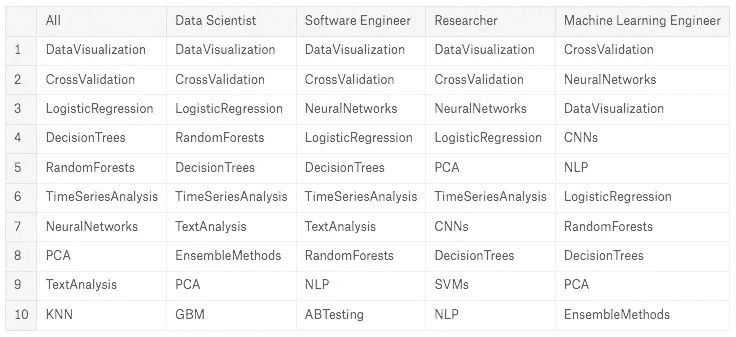

# 如何成为一名数据科学家

> 原文：<https://towardsdatascience.com/how-to-become-a-data-scientist-8c0ea546ab81?source=collection_archive---------1----------------------->

几周前，我编写并发布了我的第二个 Kaggle 内核。我被[他们的“ML 和数据科学的状态”调查](https://www.kaggle.com/surveys/2017)所吸引，并认为我将能够提取一些有趣的见解。考虑到大多数编写内核的人很可能是已经建立的数据科学家，我想大多数编写内核的人会对如何开始之外的事情感兴趣。

令我惊讶的是，我赢得了他们每周一次的[内核奖](https://www.kaggle.com/about/datasets-awards/kernels)，我的内核最终得到了比我写它时想象的更多的关注。

无论如何，我写这篇文章是为了分享我通过编写内核所学到的东西。让我们开始吧。

# 程序设计语言

据我所知，有两种语言在数据科学社区中使用得最多，它们是 Python 和 R。我个人更喜欢 R，但我很好奇这在现实世界中是如何进行的。

在这里，我根据职位比较了在工作中选择 Python 或 R 作为主要编程语言的受访者人数。事实证明，除了统计学家和运筹学之外，Python 几乎在每一个角色中都胜出。然而，在这两个角色中，尤其是对于运筹学来说，样本量很小，结果可能不太显著。

# 专业和可能的职位

我还在上高中，所以当然还没到必须申报专业的时候。我很想知道什么专业倾向于扮演什么角色，所以我制作了一个图表来比较大学专业和职位。

当然，计算机科学专业的学生会成为计算机科学家、程序员和软件工程师。数学专业进入预测建模，数据科学和统计学，物理专业倾向于研究。

我个人喜欢这张图的地方是，我仔细检查了这张图，以确保每个职位至少有一个人来自曾经的专业。对我来说，这说明只要激情还在，你在学校学的东西不应该束缚你去做你想做的事情。

# 学习资源

学习数据科学的在线资源永远不会短缺。有时候，这些资源的数量可能会让人不知所措，所以我很好奇，想看看调查的受访者认为哪些是最有用的。

事实证明，人们发现创建项目、参加课程和参加 Kaggle 挑战是学习数据科学最有用的方式。这确实反映了我所认为的真实情况；我喜欢做兼职项目，亲眼目睹了它们如何帮助我成长为一名工程师。

# 重要的工作技能

调查中的另一个问题是问受访者他们认为什么技能在工作中最有用。我用这个问题的数据重新创建了上一个问题的图表，来看看这些技能是如何相互叠加的。

Python 和统计学知识无疑被认为是最有用的工作技能。r 在这里有点落后于 Python，这反映了我们在第一张图中看到的情况。让我感到有趣的一件事是，MOOCs(大规模开放在线课程)在有用性方面得分最低，而在最后一张图中，课程被认为是学习数据科学最有用的资源之一。可能受访者没觉得 MOOCs 应该作为求职时的一个认证？我不能肯定地说，但是那是我最好的猜测。

# 现实世界中的傻瓜

受访者还被问及他们认为哪些技术在工作中最有用。我创建了一个表格，对所有受访者以及特定角色进行了分析。

与我们到目前为止所看到的一样，Python 被评为整个行业的头号技术，在这里展示的每个角色中都是如此。r 紧随其后，在业界排名第三，SQL、Jupyter、Unix 和 TensorFlow 在每个角色中都有出现。这向我表明，这些可能是在不久的将来要掌握的最重要的技术。

# 现实世界中的方法

与上一个问题类似，受访者被问及他们在工作中最常用的数据科学方法。

在这里，我们可以看到数据可视化、交叉验证、逻辑回归和决策树被用于每个角色。自然语言处理和神经网络被机器学习工程师更频繁地使用是可以理解的，而其他角色则有其他特定于他们的方法。

# 结论

我喜欢处理这么大的数据集，它最终非常适用于我将来可能要做的事情。如果你是一名数据科学家新手，并且正在寻找着手点，我的图表强烈支持几条建议:

1.  **学习 Python。**Python 和 R 已经存在了几十年，但正如我们在第一张图中看到的，Python 在基本场景中胜出。我们也可以在第四个和第五个显示中看到这一点。老实说，我相信你很难找到一家完全不使用 Python 的公司，所以你应该准备好了。
2.  **主修计算机科学或数学。**正如我在创建第二个图表后提到的，每个专业在每个职位上都有一定的影响力。但是从柱状图上可见的比例来看，几乎每个角色中，CS 专业和数学专业都是最丰富的。虽然这不是必须的，但是这两个专业中的一个或两个可能会给你一点优势。
3.  **做项目，上课程，参加 Kaggle 挑战。**正如我们在第三张图中看到的，在学习数据科学的有用方法方面，有几个明显的赢家，这三个赢家赢了很多。我个人同意他们所有人的观点，并且将来肯定会继续这样做。
4.  **了解最广泛使用的工具。**我们似乎有无限多的工具可用，但这项调查让我们看到了被认为是最重要的工具。这里列出的工具太多了，所以如果您想知道从哪里开始，一定要进一步分析上面的表格。

我希望这能帮助你弄清楚从哪里开始！如果你有兴趣看看我是如何使用调查的数据集创建这些图表的，你可以在这里查看我的内核。如果你有任何问题要问我，我很乐意回答。祝你好运！