# 如何构建数据科学产品组合

> 原文：<https://towardsdatascience.com/how-to-build-a-data-science-portfolio-5f566517c79c?source=collection_archive---------0----------------------->

A portfolio is one way to show people you are that data science unicorn.

**如何在数据科学领域找到工作？**了解足够多的统计学、机器学习、编程等知识以便能够找到工作是很困难的。我最近发现的一件事是，相当多的人****可能拥有找到工作所需的技能，但没有作品集**。虽然简历很重要，但拥有一份公开证明你数据科学技能的作品集可以为你的工作前景创造奇迹。即使你有推荐人，向潜在雇主展示你能做什么而不是仅仅告诉他们你能做什么也是很重要的。这篇文章将包含各种数据科学专业人士(数据科学经理、数据科学家、社交媒体图标或其组合)和其他人讨论投资组合中应该包含什么以及如何引起注意的链接。就这样，让我们开始吧！**

## **投资组合的重要性**

**除了通过制作文件夹来学习的好处，文件夹也很重要，因为它可以帮助你找到工作。出于本文的目的，让我们将投资组合定义为您的数据科学技能的公开证据。我是从数据营的首席数据科学家大卫·罗宾逊那里得到这个定义的，当时他在模式分析博客上接受了玛丽莎·杰玛的采访。当他被问到他在工业界的第一份工作时，他说，**

> **对我来说，最有效的策略是做公共工作。在博士后期，我写了很多博客，做了很多开源开发，这些都有助于向公众证明我的数据科学技能。但我获得第一份行业工作的方式是公共工作中一个特别值得注意的例子。在我读博士期间，我是编程网站 Stack Overflow 的活跃回答者，该公司的一名工程师偶然发现了我的一个答案(一个解释 beta 分布背后的直觉的答案)。这个回答给他留下了深刻的印象，他(通过 Twitter)联系了我，几场面试后[我被录用了](http://varianceexplained.org/r/year_data_scientist/)。**

**你可能会认为这是一个奇怪的现象，但是你会发现你越活跃，发生这种事情的机会就越大。来自[大卫的博客文章](http://varianceexplained.org/r/start-blog/)，**

> **你做的公开工作越多，发生这种意外的可能性就越大:有人注意到你的工作并给你指出一个工作机会，或者有人在面试你时听说过你做过的工作。**

**人们经常忘记软件工程师和数据科学家也在谷歌上搜索他们的问题。如果这些人通过阅读你的公共作品解决了他们的问题，他们可能会对你有更好的看法，并向你伸出援手。**

## **绕过经验要求的投资组合**

**即使是初级职位，大多数公司都希望员工至少有一点点实际生活经验。你可能见过像下面这样的迷因。**

**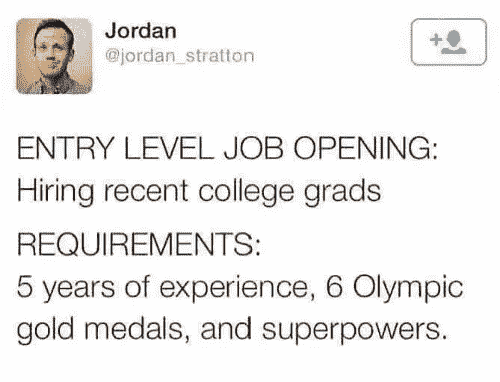**

**问题是，如果你需要经验来获得第一份工作，你如何获得经验？如果有答案，答案是**项目**。项目也许是工作经验的最佳替代品，或者如[威尔·斯坦顿](https://will-stanton.com/creating-a-great-data-science-resume/)所说，**

> **如果你没有任何数据科学家的经验，那么你绝对*必须*做独立项目。**

**事实上，当[杰奎琳·诺利斯](https://medium.com/@skyetetra) [面试候选人](https://medium.com/@skyetetra/hiring-data-scientists-my-interview-questions-56d5ae3fc621)时，她想听的是对你最近面临的一个问题/项目的描述。**

> **我想听听他们最近参与的一个项目。我问他们这个项目是如何开始的，他们如何确定它值得花时间和精力，他们的过程和他们的结果。我还问他们从这个项目中学到了什么。我从这个问题的答案中获益匪浅:如果他们能讲述一个故事，这个问题如何与更大的图景联系起来，以及他们如何解决做某事的困难。**

**如果你没有一些数据科学相关的工作经验，这里最好的选择是谈谈你曾经从事过的一个数据科学项目。**

## **投资组合中包含的项目类型**

**数据科学是一个如此广阔的领域，以至于很难知道招聘经理希望看到什么样的项目。Quora 的数据科学经理 William Chen 在 Kaggle 的 CareerCon 2018 ( [视频](https://youtu.be/xrhPjE7wHas?t=30m9s))上分享了他对这个主题的想法。**

> **我喜欢那些人们表现出他们对数据感兴趣的项目，而不仅仅是家庭作业。任何种类的期末项目，你探索一个有趣的数据集，发现有趣的结果…努力写下…我真的很喜欢看到真正好的写下人们发现有趣和新奇的事情…有一些可视化和分享他们的工作。**

**很多人认识到创建项目的价值，但很多人想知道的一个问题是，你从哪里获得有趣的数据集，你用它做什么？Airbnb 的数据科学家杰森·古德曼(Jason Goodman)有一个关于建立数据组合项目的帖子[建议](https://medium.com/@jasonkgoodman/advice-on-building-data-portfolio-projects-c5f96d8a0627)，他谈到了许多不同的项目想法，并对你应该使用什么样的数据集提出了很好的建议。他还附和了威廉关于使用有趣数据的观点。**

> **我发现最好的项目组合与其说是做花哨的建模，不如说是处理有趣的数据。很多人用金融信息或 Twitter 数据做事情；这些可以工作，但是数据本身并不那么有趣，所以你要努力工作。**

**他在文章中的另一个观点是，网络抓取是获取有趣数据的一个很好的方式。如果你有兴趣学习如何用 Python 通过 webscraping 构建自己的数据集，你可以在这里看到我的帖子[。如果你来自学术界，需要注意的是，你的论文可以算作一个项目(一个非常大的项目)。你可以在这里](/using-scrapy-to-build-your-own-dataset-64ea2d7d4673)听到[威廉陈](https://twitter.com/wzchen)谈论它[。](https://youtu.be/xrhPjE7wHas?t=31m15s)**

**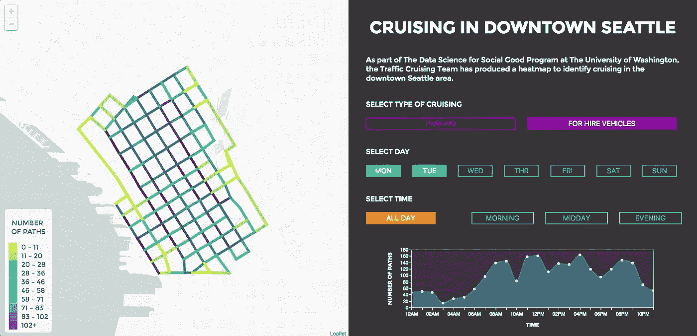**

**Traffic Cruising Data Science for Social Good Project ([https://github.com/uwescience/TrafficCruising-DSSG2017](https://github.com/uwescience/TrafficCruising-DSSG2017)). This is an example of a project I personally find interesting, but there are so many interesting projects out there. Credit ([Orysya Stus](https://github.com/OrysyaStus), [Brett Bejcek](https://github.com/bmbejcek), [Michael Vlah](https://github.com/vlahm), [Anamol Pundle](https://github.com/anamol))**

## **不包括在投资组合中的项目类型**

**我发现，在很多投资组合/简历建议中，有一件事非常普遍(在这篇博文中多次出现),那就是不要在你的投资组合中有共同的项目。**

**[Jeremie Harris](https://towardsdatascience.com/@jeremie_sharpestminds) 在[中提到了不被聘用为数据科学家的 4 种最快方法](/the-4-fastest-ways-not-to-get-hired-as-a-data-scientist-565b42bd011e)，**

> **很难想出一个比在你突出的个人项目中突出你在琐碎的概念证明数据集上所做的工作更快的方式来让你的简历被扔进“肯定没有”的一堆。**
> 
> **当你有疑问时，这里有一些对你伤害大于帮助的项目:**
> 
> ***在[泰坦尼克号数据集](https://www.kaggle.com/c/titanic)上的生存分类。**
> 
> ***在 [MNIST 数据集](https://www.tensorflow.org/versions/r1.2/get_started/mnist/pros)上的手写数字分类。**
> 
> ***使用 [iris 数据集](https://archive.ics.uci.edu/ml/datasets/iris)进行花卉种类分类。**

**下图显示了泰坦尼克号(A)、MNIST 号(B)和虹膜号(C)数据集的部分分类示例。没有太多的方法可以使用这些数据集来区分你和其他申请人。确保列出新颖的项目。**

****

**Titanic (A), MNIST (B), and iris (C) classification**

## **投资组合是迭代的**

**法维奥·瓦兹奎有一篇[的优秀文章](/how-to-get-a-job-as-a-data-scientist-f417078fe13e)，他在文章中讲述了自己是如何获得数据科学家这份工作的。当然，他的建议之一是要有一个投资组合。**

> **T4 有一个投资组合。如果你正在寻找一份严肃的数据科学的有偿工作，做一些有真实数据的项目。如果你能把它们发布在 GitHub 上。除了 Kaggle 比赛，找一些你喜欢的事情或者你想解决的问题，用你的知识去做。**

**另一个有趣的发现是，在求职过程中，你必须不断进步。**

> **我申请了将近 125 份工作(真的，也许你申请了更多)，我只收到了 25-30 份回复。有些人只是说:谢谢，但是不用了。我接受了将近 15 次采访。我从每一个人身上学到了东西。变好了。我不得不面对许多拒绝。一些我实际上没准备好的事情。但我喜欢接受采访的过程(说实话，并不是所有人)。我学习了很多，每天编程，看了很多文章和帖子。他们帮了大忙。**

**随着你了解更多，提高自己，你的作品集也应该更新。这一观点在许多其他建议文章中得到了回应。正如杰森·古德曼所说，**

> **当你公开发布的时候，这个项目还没有完成。发布后，不要害怕继续添加或编辑您的项目！**

**这个建议在你找工作的时候尤其正确。有很多像 Airbnb 的数据科学家 Kelly Peng 这样的成功人士的故事，他们真的坚持不懈，不断工作和改进。在她的一篇博客文章中，她回顾了她申请和面试了多少个职位。**

> **应用:475**
> 
> **电话采访:50 次**
> 
> **完成数据科学带回家的挑战:9**
> 
> **现场面试:8 次**
> 
> **优惠:2**
> 
> **花费的时间:6 个月**

**她明明申请了很多工作，还一直在坚持。在她的文章中，她甚至提到你需要从面试经历中不断学习。**

> **记下你被问到的所有面试问题，尤其是那些你没有回答的问题。你可以再次失败，但不要在同一个地方失败。你应该一直学习和提高。**

****

***If you aren’t getting interviews yet, apply for more jobs and keep on finding ways to learn and improve.**

## **将作品集整合到一页简历中**

**有人发现你的作品集的方法之一通常是通过你的简历，所以这是值得一提的。数据科学简历是关注你的技术技能的地方。你的简历是一个简洁地展示你的资格和适合那个特定角色的机会。招聘人员和招聘经理浏览简历的速度非常快，你只有很短的时间来留下印象。改进你的简历可以增加你获得面试的机会。你必须确保简历中的每一行和每一部分都有价值。**

**Quora 的数据科学经理 William Chen(T1)给了 9 个让你的数据科学简历变得更好的技巧。**注意在下面他的要点的简要总结中，项目和投资组合是要点 6、7、8，甚至可以说是要点 9** 。**

1.  **长度:保持简单，最多一页。这给你快速浏览带来最大的影响。推荐一份简单的单栏简历，因为它很容易浏览。**

**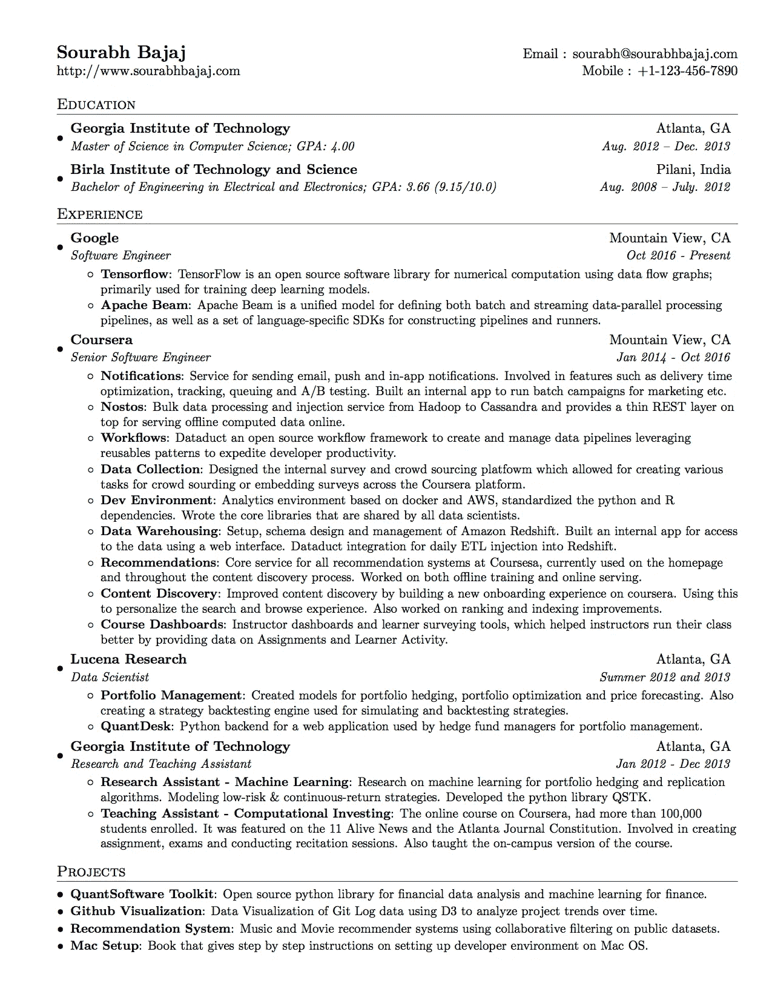**

**Sample Resume used in Video (latex: [https://github.com/sb2nov/resume](https://github.com/sb2nov/resume))**

****2。目标**:不包括一个。他们不会帮你把自己和其他人区分开来。他们从更重要的东西(技能、项目、经验等)那里拿走了空间。求职信是非常有选择性的，除非你真的个性化它。**

**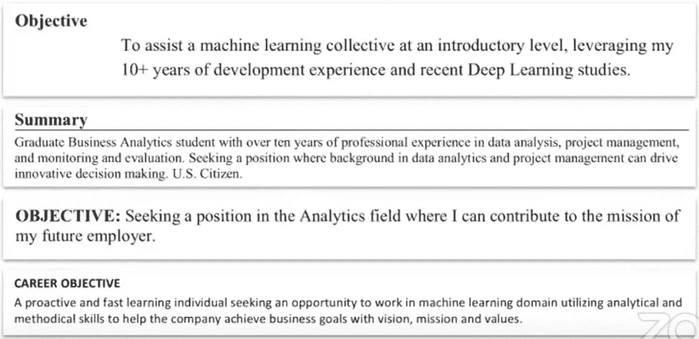**

**Objectives don’t help you distinguish yourself from other people. A lot of them say very similar things.**

****3。课程**:列出**适用于职位描述的相关课程**。**

**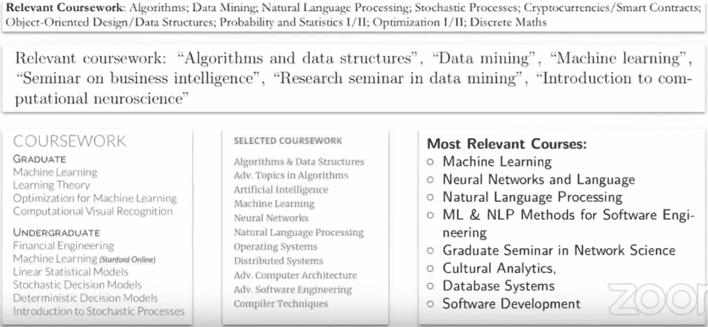**

**Examples of relevant coursework displayed on various resumes.**

****4。技能**:不要给你的技能打分。如果你想对自己的技能进行评分，使用诸如熟练或熟悉之类的词语。你甚至可以完全排除评估。**

**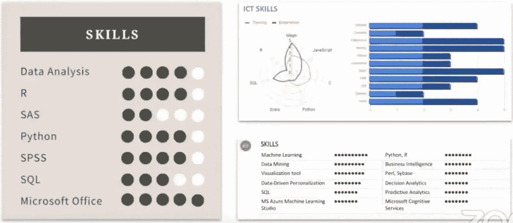**

**Don’t give numerical ratings for your skills**

****5。技能:一定要列出工作描述中提到的技术技能。你列出技能的顺序可以暗示你最擅长什么。****

**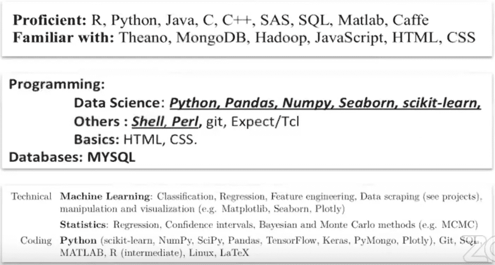**

**Examples of how you can list your skills on your resume**

****6。项目**:不要列出常见的项目或作业。它们对区分你和其他申请人没什么帮助。列出新颖的项目。**

**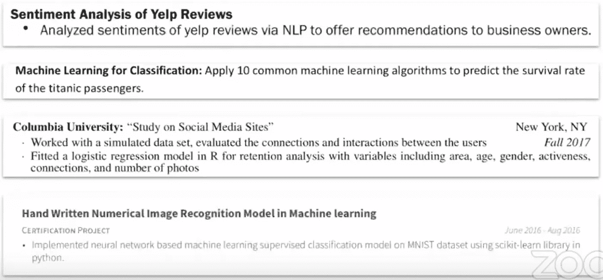**

**7。项目 : 显示结果并包含链接。如果你参加了 Kaggle 竞赛，请填写百分比排名，因为这有助于阅读你简历的人了解你在竞赛中的位置。在项目部分，总会有链接到评论和论文的空间，因为它们可以让招聘经理或招聘人员更深入地挖掘(偏向于现实世界中的棘手问题，在那里你可以学到新东西)。**

****

**Good example project sections**

**请注意，在上面的一个项目部分，一个人有一个额外的博客链接，可以让招聘人员或招聘经理了解更多信息。这是从你的简历中链接到你的投资组合的不同部分的一种方法。**

****8。投资组合:**填充我们您的在线状态。最基本的是 LinkedIn 个人资料。这有点像一份扩展的简历。Github 和 Kaggle 简介可以帮助展示你的作品。填写每个个人资料，并包括其他网站的链接。填写 GitHub 存储库的描述。包括你的知识分享简介/博客(medium，quora)的链接。数据科学特别是关于知识共享和交流数据对其他人的意义。你不需要做所有的事情，但是选择一些去做(稍后会有更多的介绍)。**

****9。经验**:让你的经验适合这份工作。经验是你简历的核心，但是如果你没有工作经验你会怎么做？把你的简历集中在独立的项目上，比如顶点项目、独立研究、论文工作或 Kaggle 竞赛。如果你没有工作经验可以写进简历，这些都是工作经验的替代品。避免把不相关的经历写进简历。**

****

**如果你想知道听到数据科学经理审阅投资组合和简历，这里有 Kaggle 的 CareerCon 2018 的链接([视频](https://www.youtube.com/watch?v=kBR0EtGOkzc)，[简历审阅](https://drive.google.com/drive/u/0/folders/1hqrBBZAxnhckto-gU1EKtXeesmtQqX9i))。**

## **社交媒体的重要性**

**这与投资组合部分的重要性非常相似，只是分成了子部分。拥有一个 Github 页面、一个 Kaggle 简介、一个 Stack Overflow 等可以为你的简历提供支持。对招聘经理来说，在网上填写个人资料是一个好信号。**

**正如大卫·罗宾逊所说，**

> **一般来说，当我评估一个候选人时，看到他们公开分享的东西，我会很兴奋，即使这些东西还没有润色或完成。分享任何东西总比什么都不分享好。**
> 
> ***数据科学家之所以喜欢看公共作品，是因为正如* [*威尔·斯坦顿*](https://will-stanton.com/2015/07/15/creating-a-great-data-science-resume/) *所说，***
> 
> **数据科学家使用这些工具来分享他们自己的工作，并找到问题的答案。如果你使用这些工具，那么你就是在向数据科学家发出信号，表明你是他们中的一员，即使你从未做过数据科学家。**

**很多数据科学都是关于交流和呈现数据的，所以拥有这些在线资料是很好的。除了这些平台有助于提供宝贵的经验之外，它们还能帮助你获得关注，让人们看到你的简历。人们可以通过各种渠道在网上找到你的简历(LinkedIn、GitHub、Twitter、Kaggle、Medium、Stack Overflow、Tableau Public、Quora、Youtube 等)。你甚至会发现不同类型的社交媒体可以互相交流。**

## ****Github****

**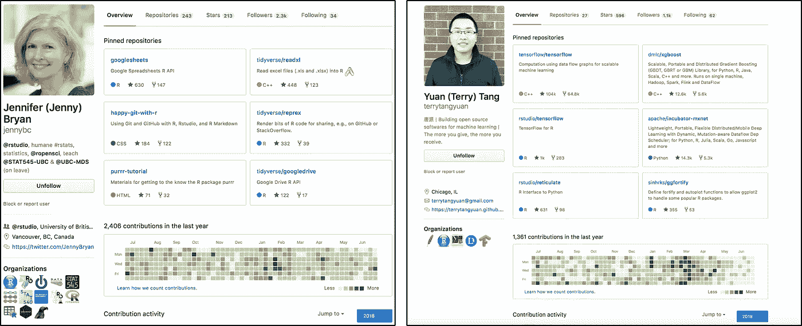**

**Github profiles of [Jennifer Bryan](https://github.com/jennybc) and [Yuan (Terry) Tang](https://github.com/terrytangyuan)**

**Github 档案是一个强有力的信号，表明你是一个有能力的数据科学家。在简历的项目部分，人们通常会留下 GitHub 的链接，那里存储着他们项目的代码。你也可以在那里写文章和减价。GitHub 让人们看到你构建了什么，以及你是如何构建的。在一些公司，招聘经理会看应聘者的 GitHub。这是向雇主展示你不是假阳性的另一种方式。如果你花时间建立你的 GitHub 档案，你会比其他人得到更好的评价。**

**值得一提的是，你需要有一些 README.md 的项目描述，因为很多**数据科学是关于交流结果的**。确保 README.md 文件清楚地描述了您的项目是什么、它做什么以及如何运行您的代码。**

## ****卡格尔****

**参加 Kaggle 竞赛、创建内核以及参与讨论都是展示数据科学家能力的方式。需要强调的是，Kaggle 并不像 Colleen Farrelly 在 quora 问题中提到的那样是一个工业项目。Kaggle 竞赛负责提出一项任务，为您获取数据，并将其整理成某种可用的形式。它的作用是让你练习分析数据和提出模型。注意， [Kaggle 特级大师继续参加 Kaggle 比赛](https://www.quora.com/What-motivates-Kaggle-Grandmasters-with-many-competitions-under-their-belt-to-continue-actively-participating-in-competitions)是有充分理由的。热沙玛·谢赫有一篇[关于 Kaggle 与否的文章](https://reshamas.github.io/to-kaggle-or-not/)，她在文中谈到了 Kaggle 比赛的价值。从她的岗位上，**

> **没错，参加一场 Kaggle 比赛并不能证明一个人有资格成为数据科学家。上一堂课或参加一个会议辅导或分析一个数据集或阅读一本数据科学方面的书也是如此。参加竞赛可以增加你的经验，扩大你的投资组合。它是对您其他项目的补充，而不是对您的数据科学技能的唯一试金石。**

**我完全同意热沙玛对此的看法。特别是，参加某方面的课程并不能让你成为某方面的专家，也不能给你一份工作。我实际上已经为数据可视化制作了一门名为 [Python 的课程](https://www.linkedin.com/learning/python-for-data-visualization/value-of-data-visualization)，并且我深入研究了关于 Pandas、Matplotlib 和 Seaborn 的内容。它不会马上给你一份工作，也不会让你马上成为 Matplotlib 或 Seaborn 方面的专家，但它会让你的知识更丰富，教会你图书馆如何工作，并帮助你建立自己的作品集。你做的每一件事都能让你更有竞争力。**

## ****领英****

**与受长度限制的简历不同，LinkedIn 简介允许你更深入地描述你的项目和工作经历。Udacity 有一个关于在 LinkedIn 上建立良好个人资料的[指南](https://career-resource-center.udacity.com/linkedin-github-profiles/how-to-stand-out-on-linkedin)。LinkedIn 的一个重要部分是他们的搜索工具，为了让你出现，你必须在你的个人资料中有 [*相关关键词*](https://www.job-hunt.org/linkedin-job-search/linkedin-keywords.shtml) 。招聘人员经常在 LinkedIn 上搜索人员。LinkedIn 可以让你看到哪些公司搜索过你，哪些人浏览过你的个人资料。**

****

**Checking where your searchers work and how many times people have viewed your profile.**

**除了公司找到你并向你发送信息，LinkedIn 还有许多功能，如[请求推荐](https://blog.linkedin.com/2018/march/19/introducing-ask-for-a-referral-making-it-easier-to-find-your-way-in)。 [Jason Goodman](https://medium.com/@jasonkgoodman) 在他的文章[中对申请数据科学工作的建议](https://medium.com/@jasonkgoodman/advice-on-applying-to-data-science-jobs-6e62b25518e5)使用 LinkedIn 来**间接**请求推荐。**

> **我从来没有，从来没有，从来没有在没有工作人员介绍的情况下申请过任何公司…一旦我对一家公司感兴趣，我会使用 LinkedIn 在该公司找到第一或第二级关系。我会写信给那个联系人，询问他们在公司的经历，如果可能的话，他们是否能帮我联系到数据科学团队的某个人。只要有可能，我就亲自开会(喝咖啡或吃午饭)，而不是打电话。顺便说一句，特雷·考西最近写了一篇很棒的文章,讲述了如何要求这类会面。我从来不会直接找工作，但他们通常会要我的简历，并提出让我做内部推荐人，或者让我联系招聘经理。如果他们觉得这样做不舒服...我只是感谢他们的时间，然后继续前进。**

**请注意，他没有马上要求推荐。虽然申请公司时常见的工作建议是获得推荐，但非常重要的是要注意，你仍然需要一份投资组合、经验或某种证明你可以做一份工作。Jason 甚至在他写的和[其他文章中提到了投资组合的重要性。](https://medium.com/@jasonkgoodman/advice-on-building-data-portfolio-projects-c5f96d8a0627)**

**[阿曼·达尔米亚](https://blog.usejournal.com/@amandalmia18)通过[在多家人工智能公司和初创公司](https://blog.usejournal.com/what-i-learned-from-interviewing-at-multiple-ai-companies-and-start-ups-a9620415e4cc)的面试，也学到了类似的东西。**

> **人际关系网是*而不是*给人们发信息让他们给你推荐*。当我刚开始的时候，我经常犯这样的错误，直到我偶然发现一篇文章，它讲述了通过主动提供帮助来与人建立真正联系的重要性。***

**他的另一个观点是，LinkedIn 非常适合让你的内容/投资组合公开。**

> **人际交往的另一个重要步骤是让你的内容传播出去。例如，如果你擅长某件事，写博客并在脸书和 LinkedIn 上分享。这不仅能帮助别人，也能帮助你。**

## ****媒体和/或其他博客平台****

**拥有某种形式的博客是非常有益的。很多数据科学都是关于交流和呈现数据的。写博客是实践这一点并展示你能做到这一点的一种方式。撰写关于项目或数据科学主题的文章可以让您与社区分享，并鼓励您写出您的工作流程和想法。这是面试时很有用的技巧。**

**正如大卫·罗宾逊所说，**

***博客是你练习相关技能的机会。***

*   *****数据清理*** *:使用各种数据集的一个好处是，你学会了“随取随用”，无论是以期刊文章* *的* [*补充文件的形式，还是以电影剧本*](http://varianceexplained.org/r/tidy-genomics/) 的**
*   *****统计学*** *:处理不熟悉的数据可以让你将统计方法付诸实践，写一些交流和教授概念的帖子有助于建立你自己的理解***

*   *********沟通*** *:你获得了写作的经验，也获得了构建数据驱动论点的练习。这可能是博客发展的最相关的技能，因为很难在其他地方实践，而且这是任何数据科学职业的基本部分*******

****通过写博客，你可以练习与他人交流发现。这也是宣传自己的另一种形式。关于[使用 Scrapy 构建自己的数据集](/using-scrapy-to-build-your-own-dataset-64ea2d7d4673)的博客，讽刺的是[使用 Conda](/environment-management-with-conda-python-2-3-b9961a8a5097) 的 Python 环境管理教会了我很多，也让我获得了很多平时不会得到的机会。最近，我的 [boxplot 博客](/understanding-boxplots-5e2df7bcbd51)给我带来了为数据可视化课程创建自己的 [Python 的机会。我发现的一个主要好处是，在人们批评我的项目并提出改进建议的整个过程中(尽管博客的评论部分),面试官不会第一个指出这些相同的缺陷。更明显的好处是，通过写博客，你倾向于阅读更多的数据科学/机器学习博客帖子，从而学到更多。](https://www.linkedin.com/learning/python-for-data-visualization/value-of-data-visualization)****

****至于在什么平台上写博客，我推荐用 Medium。 [Manali Shinde](https://medium.com/@emessence1) 在她的博客文章[如何从零开始构建数据科学作品集](https://medium.com/one-datum-at-a-time/how-to-construct-a-data-science-portfolio-from-scratch-de0b70e58bc1)中有一个关于她为什么选择 Medium 作为博客的非常好的观点。****

> ****我想到在 WordPress 或 Squarespace 等平台上创建自己的网站。虽然这些平台可以托管你自己的投资组合，但我希望有一个地方可以让我获得一些知名度，并有一个很好的标签系统来吸引更多的观众。幸运的是，正如我们所知，Medium 有这些选项(而且也是免费的)。****

****如果你不知道该写些什么，我建议你看看大卫·罗宾逊的建议。****

********

****[https://twitter.com/drob](https://twitter.com/drob)****

## ****推特****

****活跃在 Twitter 上是一种很好的方式来识别你所在领域的人，并与他们互动。你也可以在 Twitter 上推广你的博客，这样你的作品集就能更加引人注目。在 twitter 上有很多与人互动的机会。其中一个人在她著名的博客文章“[中说:](https://reshamas.github.io/first-data-science-job/) [Reshama Shaikh](https://twitter.com/reshamas) 我如何获得我的第一份数据科学工作？“是，****

> ****[大卫·罗宾逊](https://twitter.com/drob)慷慨地提出转发你的第一篇数据科学帖子。拥有 2 万多名粉丝，这是一个无法拒绝的提议。****

****除了自我推销，Twitter 还可以用于其他方面。[数据科学 Renee](https://twitter.com/BecomingDataSci) 有一个帖子“[如何使用 Twitter 学习数据科学(或任何东西)](https://www.becomingadatascientist.com/2015/10/04/how-to-use-twitter-to-learn-data-science-or-anything/)”，对使用 Twitter 学习技能颇有见地。她文章中的另一个要点是，她的 Twitter 对她的社交网络和获得机会有多大帮助。****

> ****我被播客和博客邀请接受采访(其中一些应该很快就会出现)，提供合同工作，并免费参加一个会议，可惜我不能去，但很高兴被考虑参加。业内“有名”的人现在都以某种方式来找我合作。****

## ****Tableau 公共****

****并非每个数据科学工作都使用 Tableau 或其他 BI 工具。但是，如果你申请的是使用这些工具的工作，需要注意的是，有一些网站可以让你把仪表盘放在那里供公众使用。例如，如果你说你正在学习或了解 Tableau，在 [Tableau Public](https://public.tableau.com/en-us/s/) 上放几个仪表盘。虽然许多公司可能不介意你在工作中学习 Tableau，但公开证明你的 Tableau 技能会有所帮助。如果你想看 Tableau 公开简介的好例子，请参见[Orysya Stus’](https://public.tableau.com/profile/orysya.stus#!/)和 [Brit Cava 的](https://public.tableau.com/profile/brit4337#!/)简介。****

****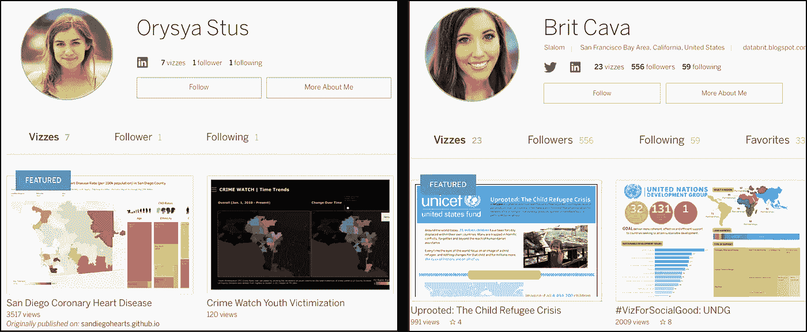****

## ****结论****

****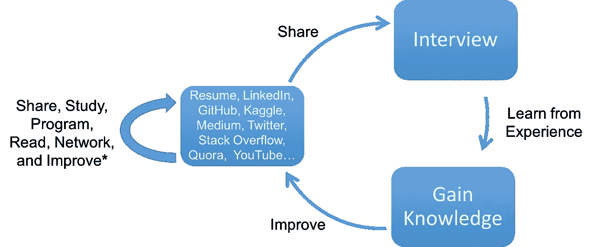****

****Remember a portfolio is a process. Keep on improving.****

****拥有一份出色的简历一直是求职者向潜在雇主传递技能的主要工具。如今，有不止一种方法可以展示你的技能并得到一份工作。公开证据组合是获得你通常不会得到的机会的一种方式。强调投资组合是一个迭代的过程是很重要的。随着你知识的增长，你的投资组合应该随着时间的推移而更新。永远不要停止学习或成长。甚至这篇博文也会随着反馈和知识的增长而更新。如果你想要面试建议/指南/课程，现在就来看看 [Brandon Rohrer 关于如何在数据科学面试中生存的建议](https://www.kdnuggets.com/2018/03/survive-data-science-interview.html)、[Sadat](https://medium.com/@sadatnazrul)、[面试指南](/data-science-interview-guide-4ee9f5dc778)，或者我的[关于获得数据科学工作课程的 15 条建议](https://www.linkedin.com/learning/15-tips-for-landing-a-data-science-job/introduction)。如果你想要一些通用的数据科学职业建议，我在这里写了一篇关于它的文章。如果你对教程有任何问题或想法，欢迎在下面的评论中或通过 [Twitter](https://twitter.com/GalarnykMichael) 联系。****