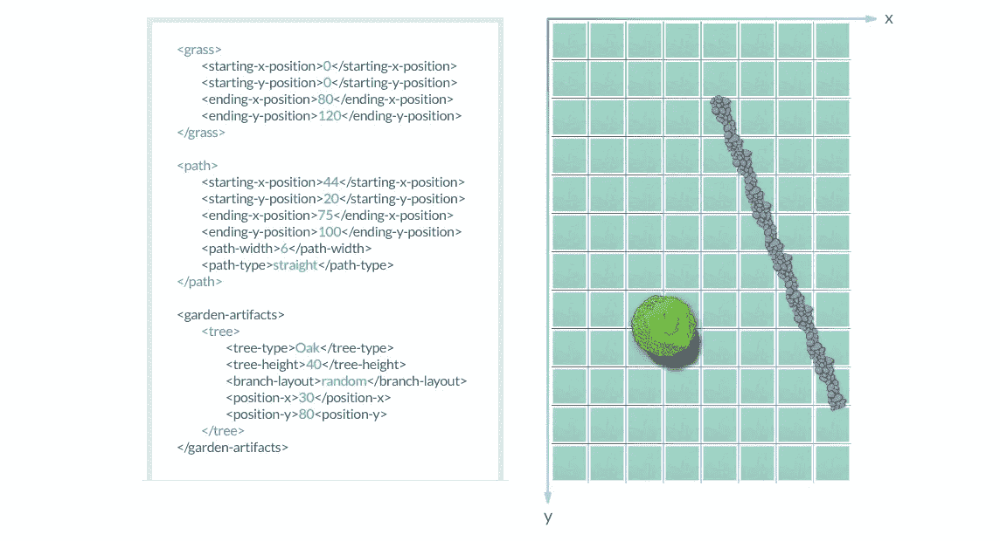

# 如何使用机器学习构建动态花园

> 原文：<https://towardsdatascience.com/how-to-build-a-dynamic-garden-using-machine-learning-d589468f7c04?source=collection_archive---------4----------------------->

PIcture by jjekafluf

## 让我们建造一个虚拟花园吧！

这是未来，我们已经在构建大脑接口方面取得了重大进展。我们用它来扩大我们的视野，有时，改变我们对世界的看法。

一个有事业心的园丁决定打造终极花园体验。一片空白的土地。一块空白的画布，等待着被园林设计师的眼光填满。花园的元素可以由花园的设计师来控制。它是动态的，对用户来说是个性化的。设计师如何利用机器学习来建造这样的花园？

让我们训练一个模型，它将挑选一个花园配置显示给用户。这个模型为一个目标而优化。一般的方法是:

> 1.选择一个目标。让我们选择“回访的高概率”也就是留存率。
> 
> 2.对影响目标的因素形成一个假设。这些成为 ML 模型中的特征。例如:花园的配置，参观时花园中的总人数，您是否独自一人，您的年龄，天气，您是否带着孩子参观等。就本文的目的而言，让我们假设我们拥有任何我们想象出来的数据，比如一个人当前的情绪。
> 
> 3.由于存在大量的配置，[可能无法从单个配置中高精度地预测](https://medium.com/dynamic-game-difficulty/whoa-whoa-ml-knows-whats-fun-now-95b219b9ff3b)目标。为了让用户满意，找到配置的中间表示。因为我们可以了解用户的心情，所以当用户在花园里散步时，我们就可以测量快乐程度。我们建立了一个“幸福旅程”,并以某种方式量化它。然后，我们将这一幸福之旅作为模型中的一个特征来预测目标
> 
> 4.当一个用户进入花园，你就知道为了目标优化需要给用户的幸福旅程。
> 
> 5.使用类似近似[动态规划](https://en.wikipedia.org/wiki/Dynamic_programming)的方法来决定使用什么样的花园配置来实现幸福之旅

使用这样的配置可以完整地描述一个花园。

一个神气的 MBA 学生出现了。

> *“有没有想过加一家奶茶店？*
> 
> 你会赚更多的钱
> 
> *“好主意。让我开始试验那个"*

我们现在有了一个新目标——最大化奶茶店的收入。我们重复这一过程，现在有两个模型——一个是为了留住客户而优化，另一个是为了最大化奶茶店的收入。

# **试验不同的模型**

一起运行这些模型可能会导致配置冲突。例如，如果天气很热，茶叶店的收入模式可能会导致一种配置，即到处摆放香草植物，让你对海绵蛋糕产生饥饿感。保留模式可能会在花园里留下一块空地来晒太阳(这在伦敦很常见)，同时被芒果树包围。一个人如何分清轻重缓急？这里有三种可能的方法。

## **按照优先级顺序堆叠排名目标**

可以使用目标的基本排序。如果有冲突，选择保留而不是货币化。但是现实生活更复杂。在免费游戏中，留存率和盈利率通常成反比。如果你在游戏中引入更多的货币化触发和货币紧缩，你可能会增加货币化，但你会减少保留。我经常与其他项目经理进行激烈的辩论——“ARPDAU(每日活跃用户平均收入)的增加是因为人们离开游戏，还是因为更多的人在游戏中消费。到底是哪个，哪个更好？”

## **一切事物的度量**

平衡相互冲突的目标的一种方法是找到一个总括性的度量标准，它包含了您所关心的所有其他度量标准。这可能是收入或终身价值(LTV)。一组用户的 LTV 方程是(%仍在游戏中的用户)x(每个用户在游戏中花费的钱)，随时间积分，即留存 x 货币化。这在理论上听起来是一个很棒的主意——让我们在游戏中尽一切努力最大化 LTV，我们就完成了！

如果我们以 LTV 为目标训练一个模型，我们依靠这个模型来学习留存和货币化之间的关系。这是一种危险的情况，因为很难做出产品体验的改变，也很难在更细粒度的度量上测试它们的有效性。例如:与花园中的桉树接触。

这种模式将强化过去一直行之有效的留存和货币化之间的权衡，但这种权衡可能不符合产品的战略重点。“我们需要达到本月的收入目标，尽一切努力”或“让我们专注于让我们的早期用户漏斗正确”。

## **型号重量**

这是堆栈排序方法的一个细微版本。假设我们有一个留存模型(模型 A)和一个货币化模型(模型 B)，这些模型预测的概率在 0 到 1 之间。如果我们将留存率排在货币化之前，我们给模型 A 的权重为 1，给模型 B 的权重为 0。这个产品决策可以封装成 1 x 模型 A + 0 x 模型 b。

**模型权重可以概括为:**

# **产品决策**

得出正确的重量是一个主观的产品决策。“对于第一次来花园的用户，我们不要试图在他们第一次访问时让他们进入茶叶店”或“每次用户访问时增加 5%的货币化模型权重，这样我们每次访问都会增加货币化的可能性”。

最棒的是，没人知道什么会奏效。“工作”的定义到底是什么——在一个目标相互竞争的机器学习环境中，你如何定义成功？事先不可能知道，因为用户的体验与产品决策只差一步。我们为模型设定权重，这些权重的组合会产生特定类型的用户行为。这个用户行为充当模型的训练数据。这就形成了一个非常紧密的学习循环。

这种学习循环的美妙之处在于，现在可以通过提供个性化的用户体验来进行实验。

机器学习模型中的实验通常与尝试不同的算法、调整参数、改变训练特征等相关联，以优化目标。当使用[机器学习来改变核心产品体验](https://medium.com/dynamic-game-difficulty/machine-learning-for-core-product-experience-970ce4352e0f)时，学习循环允许产品经理和数据科学家对用户体验本身进行实验。这是非常有益的，因为产品一直在变化——新的功能被构建，新的内容被发布，不同类型的用户出现来使用你的产品。

> ***“产品变了，车型需要跟上”***

持续实验的文化对于使用 ML 进行产品体验至关重要。可以通过尝试不同的模型权重来试验产品决策。新的模型是用不同的特性组合构建的，新的目标是添加的，产品其他方面的变化将改变模型的行为。实验是 ML 产品管理的关键。

***接下来:E* 探索难度空间 *(链接下周五)***