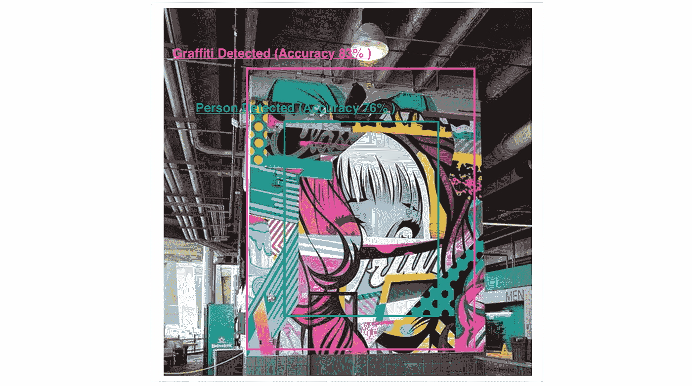
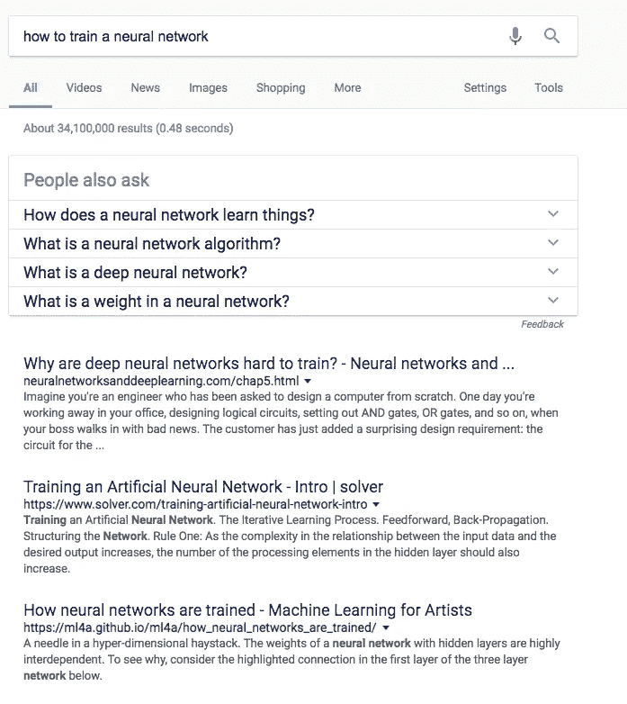
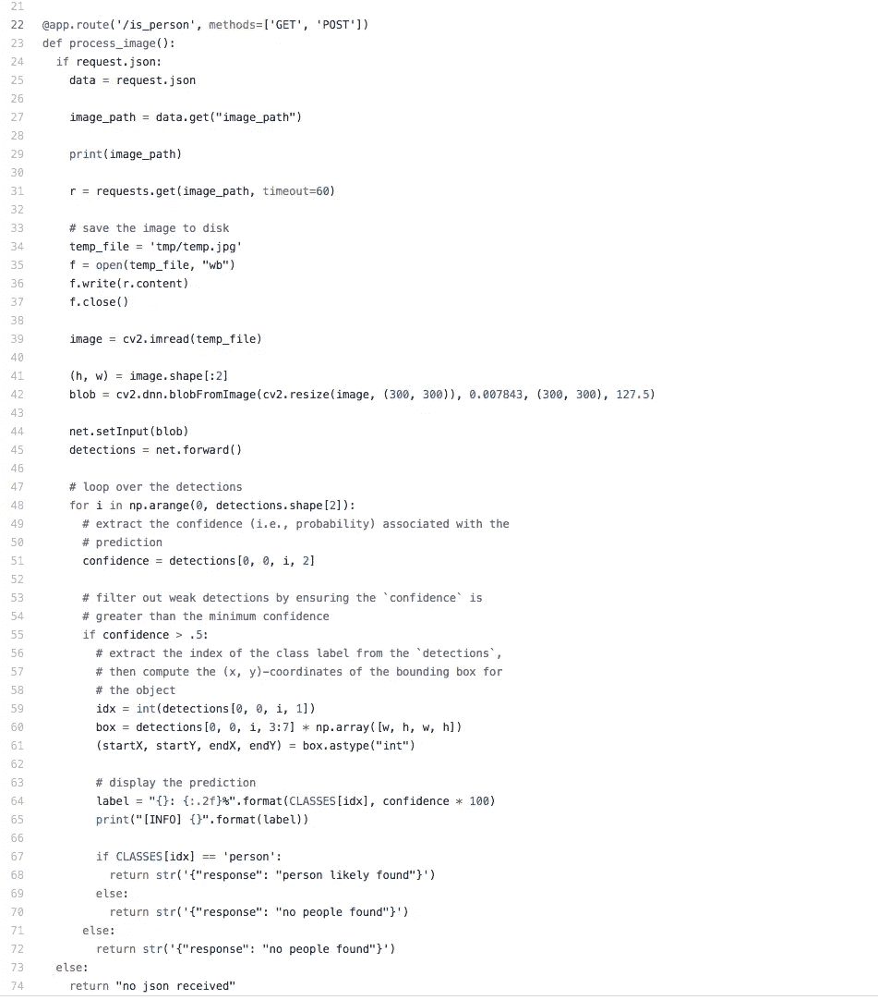
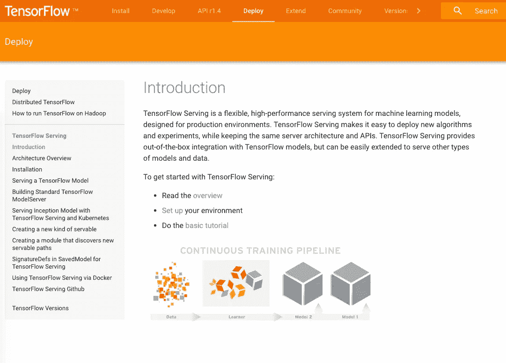

# 我如何使用 Flask 构建一个基于 REST 端点的计算机视觉任务

> 原文：<https://towardsdatascience.com/how-to-build-a-machine-learning-as-a-rails-developer-739cc57ea01c?source=collection_archive---------2----------------------->

这是我熟悉计算机视觉和机器学习技术的过程的后续。作为一名 web 开发人员(理解为“rails 开发人员”)，我发现这个不断发展的领域令人兴奋，但是不要每天都使用这些技术。这是探索这一领域的两年旅程的第三个月。如果你还没有阅读，你可以在这里看到[第一部分:从 webdev 到计算机视觉和地理](/my-next-two-years-de448d3141a)和[第二部分:两个月探索深度学习和计算机视觉](/two-months-exploring-deep-learning-and-computer-vision-3dcc84b2457f)。

# 总体思路

Rails 开发人员擅长毫不费力地快速构建 web 应用程序。在支架、清晰的模型-视图-控制器逻辑和大量的 ruby gems 之间，具有复杂逻辑的 Rails 应用程序可以在很短的时间内完成。例如，我会毫不犹豫地构建一些需要用户帐户、文件上传和各种数据源的东西。我甚至可以用优秀的文档使它高度可测试。在 Devise、Carrierwave(或许多其他文件上传 gem)、Sidekiq 和所有其他可访问的 gem 之间，我将在 15 分钟内在 Heroku 上启动并运行。

现在，加上一个计算机视觉或机器学习任务，我就不知道该去哪里了。即使我在探索这个领域，除了单词联想或图像分析，我仍然很难找到机器学习概念(神经网络和深度学习)的实际应用。也就是说，有趣的想法(我还没有找到实际应用)是围绕趋势检测和生成对抗网络。

Google search for “how to train a neural network”

作为一名软件工程师，我发现很难理解机器学习在我构建的应用程序中的实用价值。有很多关于模型(机器学习意义上，而不是 web 应用程序/数据库意义上)、神经网络架构和研究的文章，但我没有看到像我这样的 web 开发人员的实际应用。因此，我决定将我已经思考了一段时间的项目的一小部分构建出来。

该项目旨在检测 Instagram 上的优秀涂鸦。最初的想法是使用机器学习来限定“好的涂鸦”看起来是什么样的，然后运行机器学习模型来检测和收集图像。从概念上来说，这个想法听起来很棒，但我不知道如何“训练一个机器学习模型”，我对从哪里开始没有什么感觉。

我开始构建项目的一个简单部分，因为我知道我需要在好的涂鸦上“训练”我的“模型”。我挑选了一些优秀涂鸦艺术家的 Instagram 账户，我知道我可以在那里找到高质量的图像。在抓取 Instagram 账户(由于 Instagram 的 API 限制，这比预期的时间长得多)并分析图片后，我意识到手头的一个大问题。所选的账户很棒，但有许多非涂鸦的图像，主要是人。为了得到“好的涂鸦”图像，我首先需要过滤出人的图像。

The application I built to crawl Instagram created a frontend that displayed graffiti.

通过查看这些图片，我发现每 10 张图片中有多达 4 张是一个人的或者里面有一个人。结果，在开始“训练”一个“好涂鸦”的“模型”之前，我只需要得到一组不包含任何人的图片。

(对非机器学习人员的补充说明:我在某些单词周围使用引号，因为你和我可能对这些单词的实际意思有相同的理解。)

与其有一个复杂的机器学习应用程序来完成一些复杂的神经网络-深度学习-人工智能-随机梯度下降-线性回归-贝叶斯机器学习魔法，我决定简化这个项目，建立一些检测照片中的人并标记他们的东西。我意识到，我之前读过的许多机器学习教程的例子都向我展示了如何做到这一点，所以问题是要让那些教程真正有用。

—

# 应用程序(带有代码链接)

我将 Ruby on Rails 用于管理数据库和呈现内容的 web 应用程序。我使用 Ruby 通过 Redis 库 Sidekiq 完成了 Instagram 的大部分图片抓取。这使得运行延迟任务变得容易。

[The PyImageSearch article used as reference is great and can be found at](https://www.pyimagesearch.com/2017/09/11/object-detection-with-deep-learning-and-opencv/) [https://www.pyimagesearch.com/2017/09/11/object-detection-with-deep-learning-and-opencv/](https://www.pyimagesearch.com/2017/09/11/object-detection-with-deep-learning-and-opencv/)

对于机器学习逻辑，我有一个使用 OpenCV 进行对象检测的代码示例，来自 PyImageSearch.com 教程的[。该代码示例并不完整，因为它检测了定型图像模型中 30 个不同项目中的一个，其中一个是人，并在检测到的对象周围画了一个框。在我的例子中，我稍微修改了这个例子，并把它放在一个基于 Flask 的简单 web 应用程序中。](https://www.pyimagesearch.com/2017/09/11/object-detection-with-deep-learning-and-opencv/)

[Link to Github: The main magic of the app](https://github.com/rememberlenny/Flask-Person-Detector/blob/master/server.py)

我制作了一个 Flask 应用程序，其端点接受带有图像 URL 的 JSON blob。应用程序下载了图像 URL，并通过在检测到的对象周围绘制一个边界框的代码示例对其进行处理。我只关心检测人的代码示例，所以我创建了一个基本条件，为检测人给出特定的响应，为其他所有事情给出一般的响应。

这个简单的端点就是机器学习的魔力。可悲的是，这也是我第一次看到复杂的机器学习“东西”如何与 web 应用程序的其余部分集成的实际可用的例子。

对于那些感兴趣的人来说，这些代码如下。

 [## 记住 lenny/Flask-Person 探测器

### 基于 Flask 的 web 应用程序，使用 OpenCV 的深度神经网络提供了一个 REST 端点…

github.com](https://github.com/rememberlenny/Flask-Person-Detector) 

—

# 总结体会

我很惊讶我以前没有见过一个简单的基于 Flask 的深度神经网络的实现。我还觉得基于这种实现，当不涉及训练模型时，将机器学习应用到任何应用程序中就像拥有一个具有有用功能的库一样。我假设在未来，模型和利用模型的库的分离将会被简化，类似于一个库如何被“导入”或者使用捆绑器添加。我的猜测是这些工具中的一些是存在的，但是我还没有深入了解它们。

[https://www.tensorflow.org/serving/](https://www.tensorflow.org/serving/)

通过回顾如何访问对象检测逻辑，我发现了一些似乎相关的服务，但最终并不是我所需要的。具体来说，有一个名为 [Tensorflow Serving](https://www.tensorflow.org/serving/) 的工具，它似乎应该是 Tensorflow 的一个简单的 web 服务器，但还不够简单。这可能是我所需要的，但是拥有一个单独运行 Tensorflow 的服务器或 web 应用程序的想法很难实现。

## 基于 Web 服务的机器学习

我在网上找到的很多机器学习的例子都是非常完备的例子。示例从问题开始，然后提供在本地运行示例的代码。通常，图像是由 file path 通过命令行界面提供的输入，而输出是 python 生成的窗口，显示经过处理的图像。作为一个 web 应用程序，这不是很有用，所以创建一个 REST 端点似乎是一个基本的下一步。

将机器学习逻辑构建到 REST 端点中并不难，但是需要考虑一些事情。在我的例子中，服务器运行在一台台式计算机上，有足够的 CPU 和内存来快速处理请求。情况可能并不总是这样，所以未来的端点可能需要使用 Redis 之类的东西异步运行任务。这里的 HTTP 请求很可能会挂起并超时，因此对于慢速查询，需要考虑一些基本的微服务逻辑。

## 二元期望和机器学习品牌

最终应用程序的一个大问题是，处理后的涂鸦图像有时会被错误地标记为人。当这幅画包含看起来像一个人的特征时，例如一张脸或身体，物体分类器错误地标记了这幅画。相反，有时人的照片没有正确地将图像标记为包含人。

[GRAFFITI ONLY] List of images that were noted to not have people. Note the images with the backs of people.

Web 应用程序需要二元结论来采取行动。图像分类器将提供关于检测到的物体是否存在的百分比等级。在较大的对象检测模型中，分类器将有一个以上的对象被推荐为可能被检测到。例如，照片中有 90%的可能性是一个人，有 76%的可能性是一架飞机，有 43%的可能性是一只巨大的香蕉。当处理响应的应用程序只需要知道某些东西是否存在时，这不是很有用。

[PEOPLE ONLY] List of images that were classified as people. Note the last one is a giant mural with features of a face.

这带来了质量在任何基于机器学习的过程中的重要性。假设很少有对象分类器或基于图像的过程是 100%正确的，那么 API 的质量是很难衡量的。当谈到这些对象分类器 API 的商业实现时，服务的品牌将在很大程度上受到少数请求的边缘情况的影响。因为机器学习本身是如此不透明，服务提供商的品牌在确定这些服务的可信度方面将更加重要。

相反，由于机器学习任务的质量差异如此之大，一个品牌可能很难向用户展示其价值。当解决机器学习任务的二进制质量与美元金额挂钩时，例如每个 API 请求，免费做某事的能力将很有吸引力。从价格的角度来看，滚动自己的免费对象分类器会比使用第三方服务更好。在成为明显优于自托管实现的首选之前，品牌机器学习服务市场还有很长的路要走。

## 物体分类的特异性非常重要

最后，当涉及到任何机器学习任务时，特异性是你的朋友。具体来说，当谈到涂鸦时，很难界定形式各异的东西。涂鸦本身是一个包含大量视觉作品的类别。甚至一个人可能很难界定什么是涂鸦，什么不是涂鸦。与检测人脸或水果相比，类别的特异性非常重要。

WordNet 和 ImageNet 的卓越之处在于类别特异性的力量。通过用词和词与词之间的关系对世界进行分类，有一种方法可以证明图像的相似性和差异性。例如，鸽子是一种鸟，但不同于鹰。与此同时，它与飞机或蜜蜂完全不同。这些事物之间的关系允许对它们进行清楚的分类。涂鸦中不存在这种特异性，但需要这种特异性来适当地改进对象分类器。

# 最终决赛

总的来说，这个应用程序运行良好，非常有帮助。这消除了更多关于机器学习和图像识别服务如何工作的神秘。正如我上面提到的，这个过程也让我更加意识到这些服务的不足和这个领域尚未定义的地方。我绝对认为这是所有软件工程师都应该学会的。在可用的工具变得简单易用之前，我想复杂的生态系统将会有一个很好的导航期。类似于网络标准形成之前的浏览器战争，机器学习提供商之间将会有很多争夺市场份额的竞争。你已经可以在亚马逊、谷歌和苹果等大公司的服务之间看到这一点。在软硬件层面，这一点在 Nvidia 的 CUDA 和 AMD 的价格吸引力之间也非常明显。

更多即将推出！