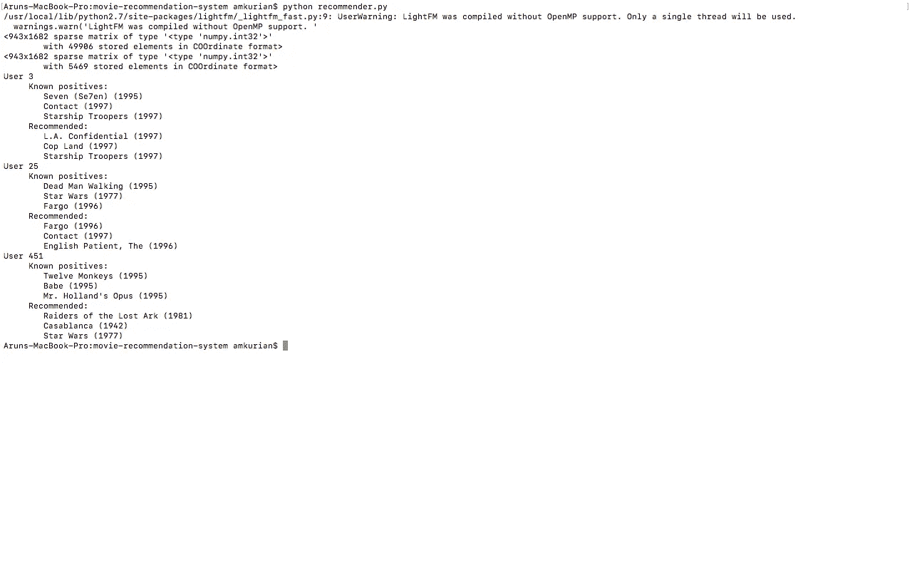

# 如何使用 LightFm 在 Python 中构建电影推荐系统

> 原文：<https://towardsdatascience.com/how-to-build-a-movie-recommender-system-in-python-using-lightfm-8fa49d7cbe3b?source=collection_archive---------3----------------------->

在这篇博文中，我们将用 python 创建一个电影推荐系统，根据用户的观看历史向他们推荐新电影。在我们开始之前，让我们快速了解一下什么是推荐系统。


courtesy: [https://ghanatalksbusiness.com/use-ratings-carefully-performance-reviews/](https://ghanatalksbusiness.com/use-ratings-carefully-performance-reviews/)

# 推荐系统

你可能还不知道推荐系统的定义，但你肯定遇到过。这是因为推荐系统在互联网上无处不在。推荐系统的目的是根据用户的兴趣或使用历史向他们推荐一些东西。所以，下次亚马逊向你推荐一种产品，或者网飞向你推荐一个电视节目，或者在你的 feed 上展示一个很棒的帖子，要明白在引擎盖下有一个推荐系统在工作。

有两种类型的推荐系统。他们是

1.  基于内容的推荐系统
2.  协同推荐系统

## 基于内容的推荐系统

[基于内容的推荐系统](https://www.analyticsvidhya.com/blog/2015/08/beginners-guide-learn-content-based-recommender-systems/)对用户产生的数据进行处理。数据可以显式生成(如点击赞)，也可以隐式生成(如点击链接)。该数据将用于为用户创建用户简档，该用户简档包含用户交互的项目的元数据。它接收的数据越多，系统或引擎就变得越精确。

## 协同推荐系统

[一个协作推荐系统](/collaborative-filtering-based-recommendation-systems-exemplified-ecbffe1c20b1)根据相似用户对商品的喜欢程度做出推荐。这个系统会把爱好相似的用户分组。除了用户相似性之外，推荐系统还可以使用项目相似性来执行协同过滤(比如“喜欢这个项目 X 的用户也喜欢 Y”)。

大多数系统将是这两种方法的结合。

以免开始编码

# 电影推荐系统

首先，我们需要安装一些软件包。

## LightFm

[LightFM](https://github.com/lyst/lightfm/tree/master/lightfm) 是许多流行推荐算法的 Python 实现。LightFM 包括 BPR 和 WARP 排序损失的实现(**损失函数**是预测模型在预测预期结果方面表现如何的度量。).

**BPR:贝叶斯个性化排序成对损失:**最大化正例与随机选择的负例之间的预测差异。当只有积极的互动存在时，这是有用的。

**WARP:加权近似秩成对损失:**通过重复采样负样本直到找到违反秩的样本，最大化正样本的秩

LightFm 还包含大量与电影分级相关的数据集。我们将研究这个数据集。所以我们也将安装这个库。

> pip 安装灯 fm

接下来，我们将安装两个数学运算包，即 **numpy** 和 **scipy**

> pip 安装数量
> 
> 安装 scipy

我们将创建一个名为 recommender.py 的 python 文件。

我们可以从将库导入这个文件开始

```
import numpy as npfrom lightfm.datasets import fetch_movielensfrom lightfm import LightFM
```

**fetch_movielens** 方法是来自 lightfm 的方法，可用于获取电影数据。我们可以获取最低评级为 4 的电影数据。

```
data = fetch_movielens(min_rating = 4.0)
```

“数据”变量将包含电影数据，分为许多类别测试和训练。

> 在监督学习中，使用包含结果的训练数据集来训练机器。然后使用没有结果的测试数据集来预测结果。训练数据是用于构建模型的数据，测试数据是用于测试模型的数据。

我们可以通过打印这些数据来检查这一点

```
print(repr(data[‘train’]))
print(repr(data[‘test’]))
```

我们可以看到，训练数据量远大于测试数据量。这是因为通常当您将数据集分为定型集和测试集时，大部分数据都用于定型。

接下来，我们将创建一个带有“扭曲”损失函数的 lightfm 模型

```
model = LightFM(loss = ‘warp’)
```

现在，我们可以使用训练数据来训练这个模型，其中历元或迭代值为 30。

```
model.fit(data[‘train’], epochs=30, num_threads=2)
```

现在，让我们构建处理这些数据的函数，为任意数量的用户推荐电影。我们的函数将接受**模型**、**数据**和一组**用户标识**。

```
def sample_recommendation(model, data, user_ids):
```

在函数定义中，首先，我们需要得到所有用户和电影的数量。

```
n_users, n_items = data[‘train’].shape
```

接下来，我们需要迭代 user_ids。

```
for user_id in user_ids:
```

对于每个用户，我们需要找到他们喜欢的已知的正面或电影。这可以从我们掌握的数据中得到。

```
known_positives = data[‘item_labels’][data[‘train’].tocsr()[user_id].indices]
```

接下来，我们需要找到用户喜欢的电影。这可以通过 LightFm 的**预测**方法来完成。该函数的参数是 numpy arrange 的 **user_id** 和 **n_items** 变量 arrange

```
scores = model.predict(user_id, np.arange(n_items))
```

我们现在可以根据最喜欢到最不喜欢的顺序对分数进行排序。

```
top_items = data[‘item_labels’][np.argsort(-scores)]
```

现在预测已经完成，我们可以打印前 3 个已知的阳性和 3 个预测。

```
print(“User %s” % user_id)print(“ Known positives:”)for x in known_positives[:3]:
 print(“ %s” % x)print(“ Recommended:”)for x in top_items[:3]:
 print(“ %s” % x)
```

这样，我们的**样本 _ 推荐**方法就变成了

```
def sample_recommendation(model, data, user_ids):
    n_users, n_items = data['train'].shape
    for user_id in user_ids:
        known_positives = data['item_labels'][data['train'].tocsr()                                    
                          [user_id].indices]

        scores = model.predict(user_id, np.arange(n_items))

        top_items = data['item_labels'][np.argsort(-scores)]

        print("User %s" % user_id)
        print("     Known positives:")

        for x in known_positives[:3]:
            print("        %s" % x)

        print("     Recommended:")

        for x in top_items[:3]:
            print("        %s" % x)
```

我们可以通过调用程序中的函数，提供三个随机的 user _ ids 来完成。

```
sample_recommendation(model, data, [3, 25, 451])
```

让我们通过命令在终端中运行代码

> python recommender.py

我们得到了输出



凉爽的...我们可以看到我们的系统向我们的用户推荐电影。

这是一个推荐系统可以多么容易实现的例子。希望你觉得有用。

代码可以在[https://github.com/amkurian/movie-recommendation-system](https://github.com/amkurian/movie-recommendation-system)找到