# 如何用 Go 构建一个简单的人工神经网络

> 原文：<https://towardsdatascience.com/how-to-build-a-simple-artificial-neural-network-with-go-ac2e8c49ae37?source=collection_archive---------11----------------------->

## 从基础数学到用它识别笔迹的一步一步

我在职业生涯中写过很多计算机程序，大部分时间是为了解决各种问题或者执行一些任务(或者有时候只是为了好玩)。在大多数情况下，除了 bug 之外，只要我非常清楚地告诉计算机该做什么(无论我使用哪种编程语言)，它就会乖乖地听从我的指令。

这是因为计算机程序非常擅长执行算法——遵循精确且经常重复的既定步骤和模式的指令。在大多数情况下，它们对我们处理数字运算或重复枯燥的工作很有帮助。

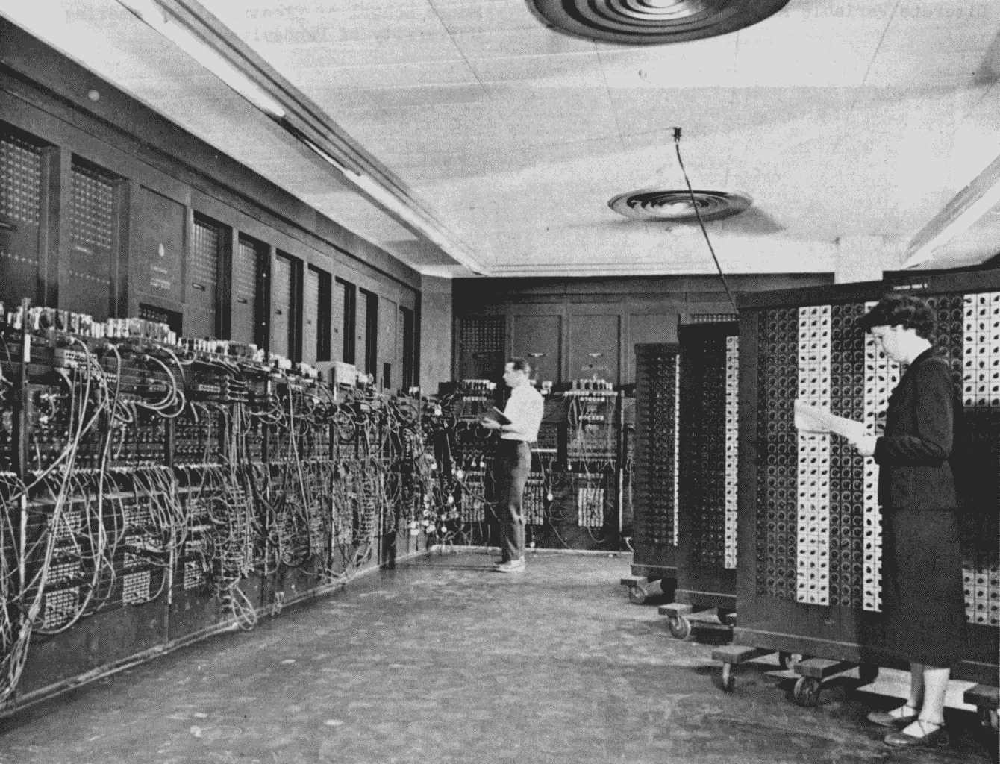

The ENIAC was one of the first general-purpose, programmable computers ever made (public domain from [https://commons.wikimedia.org/wiki/File:Eniac.jpg](https://commons.wikimedia.org/wiki/File:Eniac.jpg))

然而，计算机程序不擅长做的事情是那些没有很好定义的任务，并且不遵循精确的模式。


In the 60s, Marvin Minsky assigned a couple of undergrads to spend the summer programming a computer to use a camera to identify objects in a scene. He figured they’d have the problem solved by the end of the summer. Half a century later, we’re still working on it. (from [Explain XKCD — 1425: Tasks](https://www.explainxkcd.com/wiki/index.php/1425:_Tasks))

那么我们如何使用计算机来完成这样的任务呢？想想你如何完成这项任务。你可能在年轻的时候了解过鸟类，你被告知某些动物是鸟类，而某些动物不是，大部分是通过在现实生活中或通过图画书看到的。当你做错的时候，你会被告知并且记住。久而久之，你就有了一个*心理模型*，知道什么是鸟，什么不是。每次你看到一只鸟的某些部分(有爪的脚，有羽毛的翅膀，锋利的喙)你甚至不需要再看到整个动物，你会通过与你的心理模型进行比较来自动正确地识别它。

那么我们如何用计算机程序做到这一点呢？基本上我们做同样的事情。我们试图创建一个*模型*，通过试错过程，我们可以用它来比较输入。由于计算机程序都是数学，你可以猜到这将是我们将要谈论的一个*数学模型*。

# 猜谜游戏

让我们举一个简单的例子，创建一个接受输入并试图预测输出的黑盒。

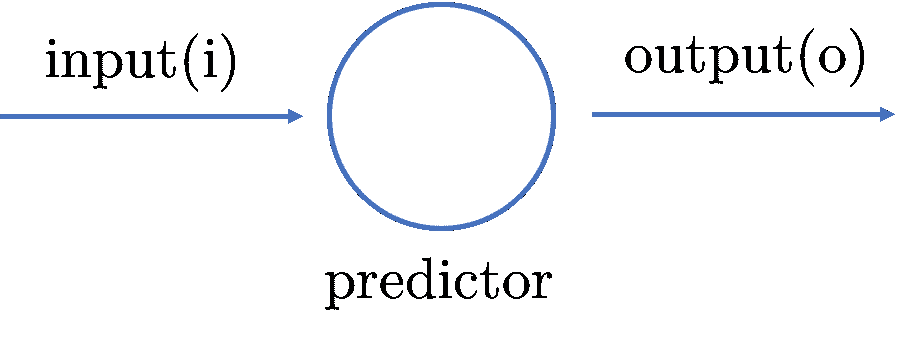

A simple predictor

我们给它一个输入，然后从这个预测器得到输出。既然我们知道实际输出应该是什么，我们就可以知道预测输出与实际输出有多大的不同。实际输出和预测输出之间的差异成为*误差*。

当然，如果预测器是静态的，不能改变，那就没什么意义了。当我们向预测器提供输入时，会产生一个带有错误的输出，这就是故事的结尾。不是很有用。

为了让我们的预测器更有用，让我们给它一个可配置的参数，我们可以用它来影响输出。因为它只有在没有错误的情况下才能正确预测，所以我们希望更改参数，以便随着我们不断向预测器提供数据，错误会缩小。目的是得到一个预测器，它在大多数情况下预测正确的输出，而实际上不需要给预测器明确的指令。

换句话说，这很像一个数字猜谜游戏。

让我们从更实际的角度来看这个问题。假设我们有一个带有简单数学公式`o = i x c`的预测器，其中`o`是输出，`i`是输入，`c`是可配置参数。

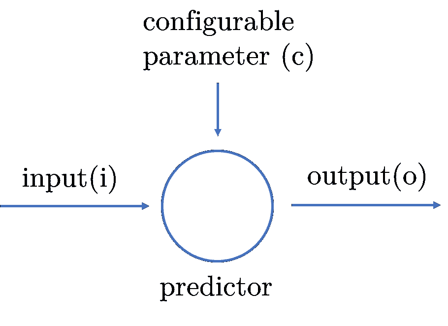

A simple predictor with a configurable parameter

我们还得到了一个给定输入的确认有效输出，即我们知道`i`是否为 10，`o`是否为 26。我们如何使用预测器找到`c`？

首先，我们需要进行随机预测，假设`c`是 2。让我们输入 10，启动预测器。输出`o`为 20。由于误差`e = t - o`其中`t`是真值(或目标)，这意味着`e = 26 - 20 = 6`。我们的误差`e`是 6，我们想达到 0，所以我们再试一次。

让我们把`c`设为 3。然后输出为`30`并且`e`现在为`-4`。哎呀，我们超过了！我们倒回去一点，让`c`为 2.5。这使得`o`为 25，而`e`为 1。最后，我们尝试将`c`设为 2.6，我们得到的误差`e`为 0！

一旦我们知道`c`是什么，我们就可以使用预测器来预测其他输入的输出。假设输入`i`现在是 20，那么我们可以预测`o`是 52。

正如你所看到的，这种方法试图迭代地寻找答案，并不断改进自己，直到我们找到最佳答案。这本质上就是[机器学习](https://sausheong.github.io/posts/how-to-build-a-simple-artificial-neural-network-with-go/[A%20Beginner%E2%80%99s%20Guide%20to%20AI/ML%20%F0%9F%A4%96%F0%9F%91%B6%20%E2%80%93%20Machine%20Learning%20for%20Humans%20%E2%80%93%20Medium](https://medium.com/machine-learning-for-humans/why-machine-learning-matters-6164faf1df12))是什么。计算机程序试图迭代地寻找答案，并通过它的错误“学习”,直到它获得一个可以产生最佳答案的模型。一旦它有了正确的模型，我们就可以使用该模型来正确地猜测答案。这非常类似于我们人类所做的(从过去的错误中学习并纠正自己)，但我们具体是如何做的呢？

# 人类是如何做到的

让我们出去一点。我们谈了一点机器如何利用数学函数学习。人类如何做同样的事情(正如多年来的研究表明的那样)是使用一种叫做 [*神经元*](https://sausheong.github.io/posts/how-to-build-a-simple-artificial-neural-network-with-go/[Understanding%20Neurons%E2%80%99%20Role%20in%20the%20Nervous%20System](https://www.verywellmind.com/what-is-a-neuron-2794890)) 的东西。

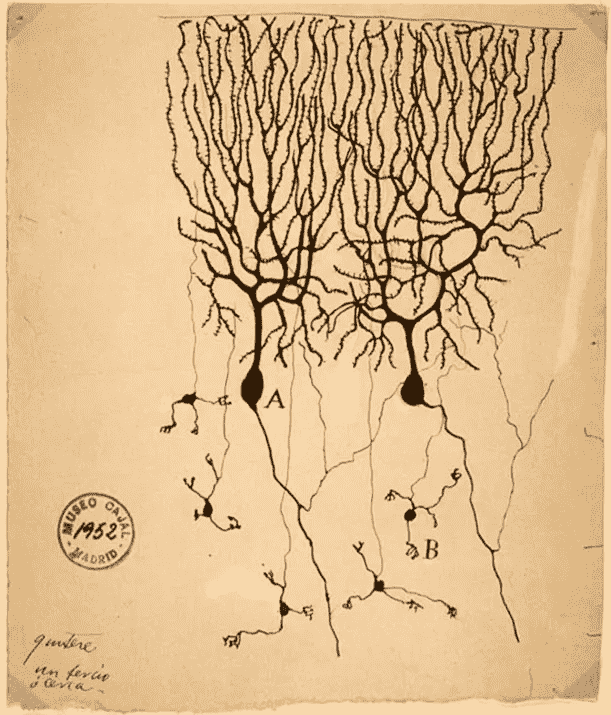

Drawing of neurons in the pigeon cerebellum, by Spanish neuroscientist Santiago Ramón y Cajal in 1899 (public domain from [https://commons.wikimedia.org/wiki/File:PurkinjeCell.jpg](https://commons.wikimedia.org/wiki/File:PurkinjeCell.jpg))

神经元或神经细胞是一种接收信息、处理信息并通过电信号和化学信号进行传输的细胞。我们的大脑和脊髓(我们的中枢神经系统的一部分)由神经元组成。

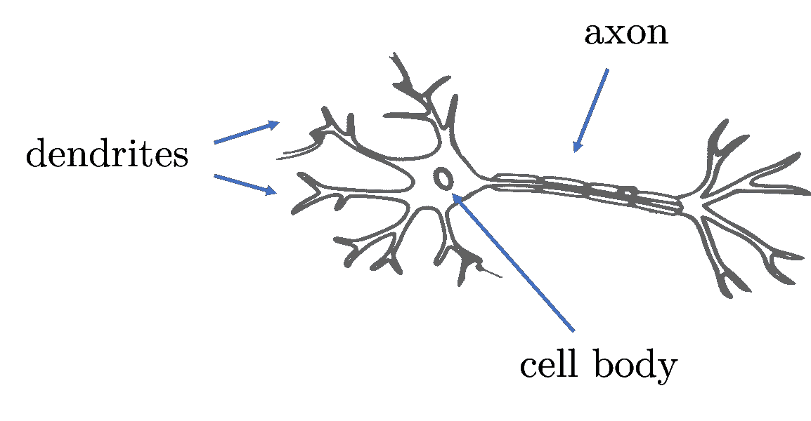

A neuron with dendrites, a cell body and an axon

神经元由细胞体、树突和轴突组成，可以相互连接形成神经网络。在神经网络中，神经元的轴突连接到下一个神经元的树突，突触信号从一个神经元通过其轴突传输，并由下一个神经元通过其树突接收。轴突和树突之间的连接是突触。

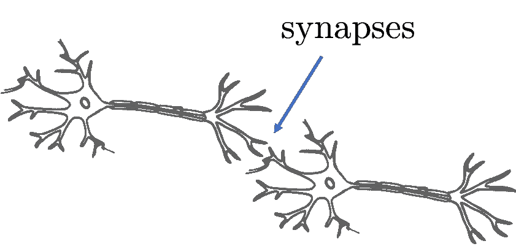

Synapses are the connections between neurons

通过树突传入的信号根据突触连接的使用频率而加强或减弱，这些加强或减弱的信号在细胞体中汇集在一起。

如果接收到的汇集信号足够强，它将触发一个新的信号，通过轴突发送到其他神经元。

如你所见，神经元工作方式有点类似于我们之前的预测器。它通过树突处理大量输入，通过轴突输出。每个输入都与突触连接的强度(或权重)配对，而不是一个可配置的参数。

有了这些信息，让我们回到我们的预测器并做一些改变。

# 人工神经元

我们从建立一个模拟真实生物神经元的人工神经元开始。这个人工神经元是我们升级的预测器。

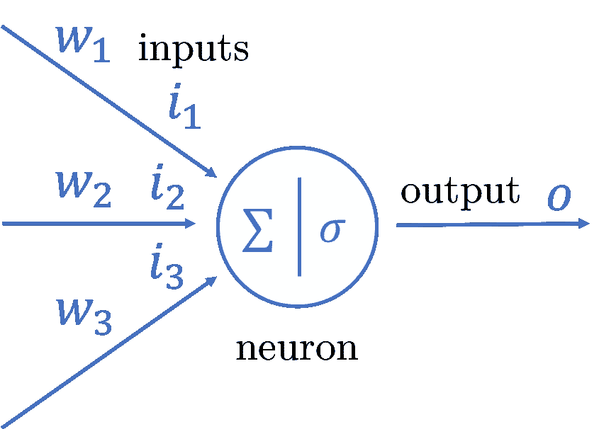

An artificial neuron mimicking a biological one

我们有一堆输入，而不是单个输入，每个输入都有一个权重(代替一个可配置的参数)。这些修改后的输入被累加并通过触发或[激活功能](https://sausheong.github.io/posts/how-to-build-a-simple-artificial-neural-network-with-go/[Understanding%20Activation%20Functions%20in%20Neural%20Networks](https://medium.com/the-theory-of-everything/understanding-activation-functions-in-neural-networks-9491262884e0))传递，该功能确定是否应该发送输出。

那么，为什么会有激活功能呢(除了生物神经元的行为方式相同这一事实之外)？有几个很好的理由，但最重要的一个是激活函数将非线性引入网络。没有激活函数(或线性激活函数)的神经网络基本上只是一个[线性回归](https://sausheong.github.io/posts/how-to-build-a-simple-artificial-neural-network-with-go/[Introduction%20to%20Linear%20Regression](http://onlinestatbook.com/2/regression/intro.html))模型，不能完成更复杂的任务，如语言翻译和图像分类。稍后您将看到非线性激活函数是如何实现反向传播的。

现在，我们将假设使用一个普通的激活函数， [sigmoid 函数](https://sausheong.github.io/posts/how-to-build-a-simple-artificial-neural-network-with-go/[Sigmoid%20function](https://ipfs.io/ipfs/QmXoypizjW3WknFiJnKLwHCnL72vedxjQkDDP1mXWo6uco/wiki/Sigmoid_function.html))。

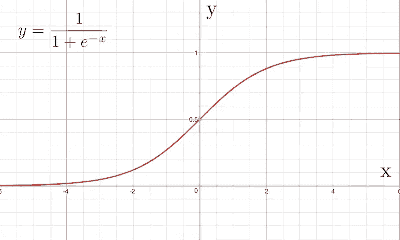

Sigmoid function

关于这个函数值得注意的有趣的事情是，输出总是在 0 和 1 之间的范围内，但从来没有达到任何一个。

# 人工神经网络

就像我们有神经元形成神经网络一样，我们也可以将我们的人工神经元连接起来，形成人工神经网络。

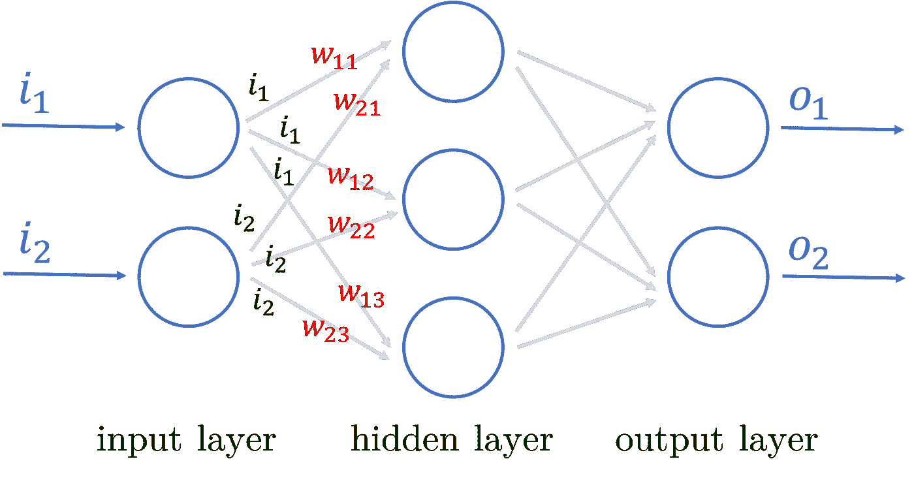

Artificial neural network with 3 layers

现在看起来有点复杂了！

然而，我们只是将神经元堆叠在不同的层中。所有输入都通过输入层进入，输入层将其输出发送到隐藏层，隐藏层又将其输出发送到最终输出层。虽然来自每个节点的输出是相同的(只有一个输出)，但是到下一层中神经元的连接被不同地加权。例如，隐藏层中第一个节点的输入将是`(w11 x i1) + (w21 x i2)`。

# 用矩阵简化

如果我们必须一次计算一个，计算这个网络中的最终输出可能会有点乏味，特别是如果我们有很多神经元。幸运的是，有一个更简单的方法。如果我们将输入和权重表示为矩阵，我们可以使用矩阵运算来简化计算。事实上，我们不再需要做单个神经元的输入求和和输出激活，我们只需一层一层地做。


Using matrices

正如您将看到的，这将对代码的后续部分有很大帮助。

我们使用了[矩阵点积](https://sausheong.github.io/posts/how-to-build-a-simple-artificial-neural-network-with-go/[How%20to%20Multiply%20Matrices](https://www.mathsisfun.com/algebra/matrix-multiplying.html))来处理输入和权重的乘法和求和，但是对于激活函数，我们需要对每个矩阵元素应用 sigmoid 函数。我们将不得不对每个隐藏层和输出层做同样的操作。

# 调整重量

在这个时候，你可能会意识到，我们的神经网络(在概念上)只是神经元的一个更大的版本，因此非常像我们之前的预测器。就像我们的预测器一样，我们希望训练我们的神经网络，通过向它传递输入和已知输出来从它的错误中学习。然后利用已知和实际输出之间的差异(误差),我们改变权重以最小化误差。

然而，你可能会意识到，神经网络比我们的预测器要复杂得多。首先，我们有多层排列的多个神经元。因此，虽然我们知道最终目标输出，但我们不知道中间不同层的中间目标输出。第二，虽然我们的预测器是线性的，但是我们的神经元通过一个非线性的激活函数，所以输出是非线性的。那么我们如何改变不同连接的权重呢？


Weights and outputs in artificial neuron

我们从前面的预测器中知道，我们希望通过改变连接隐藏层和输出层之间的各种输出权重来最小化最终输出误差`Ek`。

这很好，但是我们如何通过改变输入变量来最小化一个函数的值呢？

让我们从不同的角度来看这个问题。我们知道最后的输出误差`Ek`是:


然而，仅仅从`tk`中减去`ok`并不是一个好主意，因为这通常会导致负数。如果我们试图找出网络的最终输出误差，我们实际上是将所有误差相加，因此如果其中一些误差是负数，就会导致错误的最终输出误差。一种常见的解决方案是使用*平方误差*，顾名思义就是:


同时我们知道:


因此，我们知道(粗略地说)，如果我们将`Ek`与`wjk`对应起来，我们将得到一系列数值(蓝线)绘制在图表上(实际上这是一个多维图表，但为了保持我们的集体理智，我将使用一个二维图表):

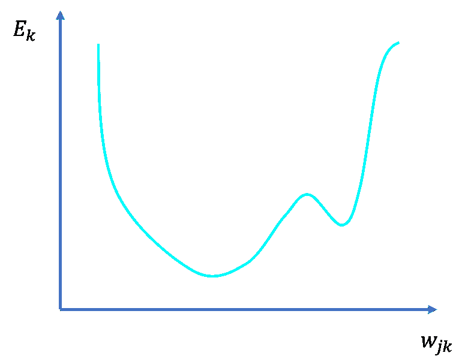

Charting final output error to weights

如你所见，为了达到最小值`Ek`,我们沿着梯度或负梯度向下。换句话说，我们试图找到负梯度，相应地改变权重，然后再次找到负梯度，直到我们到达最小点`Ek`。这个算法叫做 [*梯度下降*](https://sausheong.github.io/posts/how-to-build-a-simple-artificial-neural-network-with-go/[An%20Introduction%20to%20Gradient%20Descent%20and%20Linear%20Regression](https://spin.atomicobject.com/2014/06/24/gradient-descent-linear-regression/)) 。


Gradient descent

你可能还记得中学微积分，为了找到函数中点的梯度，我们使用[微分](https://sausheong.github.io/posts/how-to-build-a-simple-artificial-neural-network-with-go/[Introduction%20to%20Derivatives](https://www.mathsisfun.com/calculus/derivatives-introduction.html))来得到函数的导数。这让我们能够发现我们需要调整`wjk`到什么程度。为了找到`Ek`的最小值，我们从`wjk`中减去这个量，并重复这样做。

让我们做数学。

为了计算输出权重`wjk`所需的变化，我们应该计算最终输出误差`Ek`相对于输出权重`wjk`的导数。这意味着:

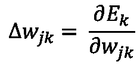

这很好，但是我们如何使用其他变量得到我们的结果呢？为此我们需要使用 [*链式法则*](https://sausheong.github.io/posts/how-to-build-a-simple-artificial-neural-network-with-go/[Chain%20rule%20-%20Wikipedia](https://en.wikipedia.org/wiki/Chain_rule)) :

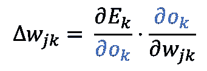

这看起来稍微好一点，但是我们可以更进一步:


我们开始工作吧。首先，我们需要找到`Ek`相对于最终输出`ok`的导数。

从前面，我们知道`Ek`是平方误差:


但是为了更好的区分，我们把它缩小了一半(我知道这有点像作弊，但这让我们的生活更轻松):


它的导数是:


这很简单！让我们看看最终输出`ok`相对于中间输出和权重`sumk`的乘积总和的导数。我们知道求和是通过一个 sigmoid 函数`sig`来得到最终输出`ok`:


因此，最终输出`ok`相对于总和`sumk`的导数为:


这是因为我们知道 sigmoid 的导数是:

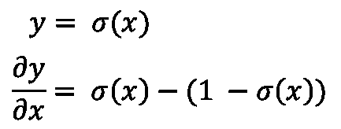

我前面提到过，我们使用 sigmoid 函数是有充分理由的——简单微分就是其中之一！这一点的证明可以在[这里](https://sausheong.github.io/posts/how-to-build-a-simple-artificial-neural-network-with-go/[How%20to%20Compute%20the%20Derivative%20of%20a%20Sigmoid%20Function%20(fully%20worked%20example)%20-%20kawahara.ca](http://kawahara.ca/how-to-compute-the-derivative-of-a-sigmoid-function-fully-worked-example/))找到。现在既然:


我们可以将等式进一步简化为:


最后，我们想找到总和`sumk`相对于输出权重`wjk`的导数。我们知道总和是输出权重`wjk`和先前输出`oj`的乘积之和:


因此，总和`sumk`相对于输出权重`wjk`的导数为:


现在我们有了所有的 3 个导数，让我们把它们放在一起。之前，我们说过:


因此:


这样我们就有了改变输出层权重的公式。隐藏层的权重是多少？我们简单地使用相同的等式，但是后退一层。该算法被称为 [*反向传播*](https://sausheong.github.io/posts/how-to-build-a-simple-artificial-neural-network-with-go/[Neural%20networks%20and%20deep%20learning](http://neuralnetworksanddeeplearning.com/chap2.html)) ，因为它从最终输出反向计算权重。

但是等等。我们没有隐藏层的目标输出。那么我们如何得到隐藏层的误差呢？我们必须找到另一种方法。

# 反向传播误差

仔细想想，输出层的误差是由隐藏层的误差根据前一个隐藏层的连接造成的。换句话说，隐藏层的误差组合形成了输出层的误差。由于权重代表输入的重要性，它也代表误差的贡献。

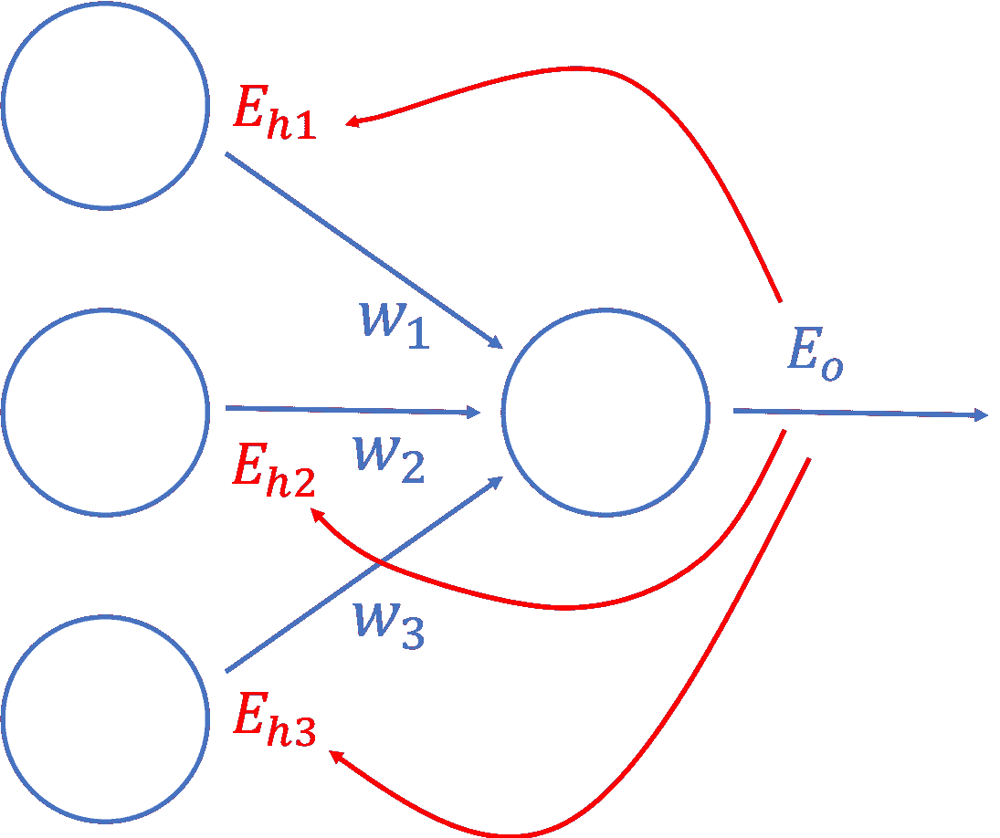

Contribution of errors

因此，我们可以使用重量的比率来计算每个重量的变化。因为分母是常数，我们可以通过去掉分母来进一步简化。


Back propagating errors

现在，让我们看看如何使用矩阵从输出层反向传播误差。


一旦我们有了隐藏层的误差，我们就可以使用和以前一样的等式，但是用隐藏的输出误差代替最终的输出误差。

# 学习率

因此，人工神经网络通过使用梯度下降的反向传播进行学习。在梯度下降迭代过程中，经常很容易超调，这导致移动太快并跨过最小值`wjk`。为了防止这种情况，我们使用一个*学习率* `l`来缩小我们想要为权重改变的量。这导致我们之前等式的改变:


`l`通常是一个很小的值，因此我们在超过最小值时会更加小心，但也不能太小，否则训练时间会很长。有很多关于设定最佳学习率的研究文献。

# 偏见

对于我们当前的神经网络，激活函数是在 0.5 处穿过`y`的 s 形曲线。对权重的任何改变仅仅改变了 s 形的陡度。因此，神经元的触发方式是有限制的。例如，当`x`为 2 时，让 sigmoid 返回 0.1 的低值是不可能的。

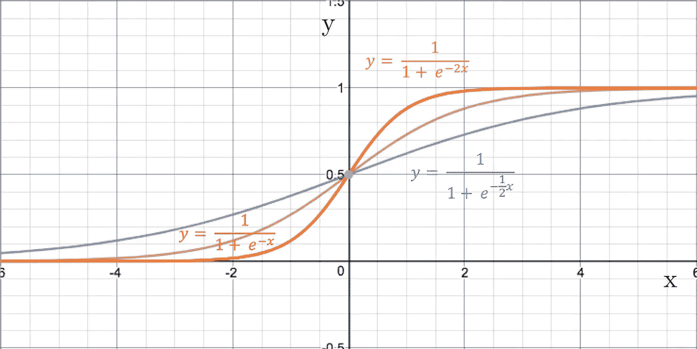

Sigmoid functions without bias

然而，如果我们给`x`加上一个 [*偏置*](https://sausheong.github.io/posts/how-to-build-a-simple-artificial-neural-network-with-go/[Make%20Your%20Own%20Neural%20Network:%20Bias%20Nodes%20in%20Neural%20Networks](http://makeyourownneuralnetwork.blogspot.sg/2016/06/bias-nodes-in-neural-networks.html)) 值，事情就完全变了。

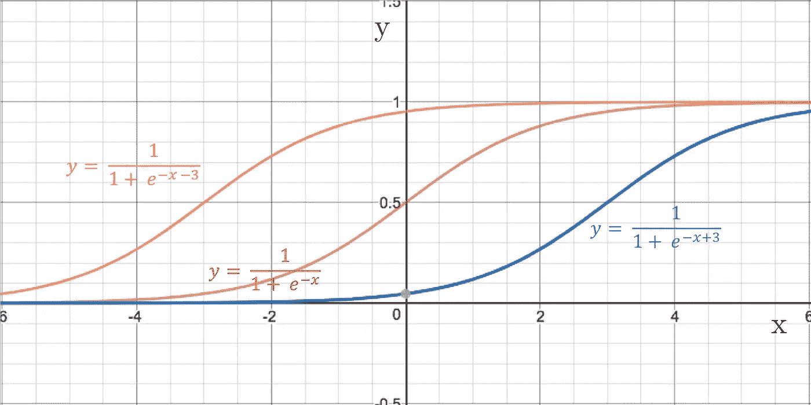

Sigmoid functions with bias

我们如何做到这一点是通过在神经网络中添加一个叫做*偏置神经元*的东西。这个偏置神经元总是输出 1.0，并且被添加到一个层，但是没有任何输入。


Artificial neural network with bias

不是所有的神经网络都需要偏向神经元。在我们稍后要写的简单神经网络中，我们不会使用任何偏向神经元(并且它工作得相当好)。

# 终于有代码了！

所以我们终于来了！在所有的概念和数学之后，我们现在要开始一些实现！

这篇文章中的代码片段并不完整，所以不要简单地从这里剪切和粘贴来运行它。这里的所有代码都可以在这个 Github 资源库中找到:

[https://github.com/sausheong/gonn](https://github.com/sausheong/gonn)

与 Python 不同，Go 目前在机器学习的库方面没有太多支持。然而有一个非常有用的库叫做 [Gonum](https://sausheong.github.io/posts/how-to-build-a-simple-artificial-neural-network-with-go/[Gonum](https://www.gonum.org/)) ，它提供了我们最需要的东西——矩阵操作。

此外，虽然 Gonum 有非常好的包，但我认为 Gonum 中的一些怪癖使它变得不必要的冗长，所以我创建了自己的助手函数来克服它。

# 矩阵助手

我们将首先从助手函数开始。Gonum 用于矩阵操作的主包叫做`mat`。我们将使用的主要是`mat.Matrix`接口及其实现`mat.Dense`。

`mat`包有一个怪癖，它要求我们在对矩阵执行操作之前，先创建一个包含正确行和列的新矩阵。对多个操作这样做相当烦人，所以我用自己的函数包装了每个函数。

例如，Gonum `Product`函数允许我们对两个矩阵执行点积运算，我创建了一个助手函数，它找出矩阵的大小，创建它并在返回结果矩阵之前执行运算。

这有助于节省大约 1-3 行代码，具体取决于操作。

```
func dot(m, n mat.Matrix) mat.Matrix {
	r, _ := m.Dims()
	_, c := n.Dims()
	o := mat.NewDense(r, c, nil)
	o.Product(m, n)
	return o
}
```

`apply`功能允许我们对矩阵应用函数。

```
func apply(fn func(i, j int, v float64) float64, m mat.Matrix) mat.Matrix {
	r, c := m.Dims()
	o := mat.NewDense(r, c, nil)
	o.Apply(fn, m)
	return o
}
```

`scale`功能允许我们缩放矩阵，即将矩阵乘以标量。

```
func scale(s float64, m mat.Matrix) mat.Matrix {
	r, c := m.Dims()
	o := mat.NewDense(r, c, nil)
	o.Scale(s, m)
	return o
}
```

`multiply`函数将 2 个函数相乘(这不同于点积`)。

```
func multiply(m, n mat.Matrix) mat.Matrix {
	r, c := m.Dims()
	o := mat.NewDense(r, c, nil)
	o.MulElem(m, n)
	return o
}
```

`add`和`subtract`功能允许增加或减少一个功能。

```
func add(m, n mat.Matrix) mat.Matrix {
	r, c := m.Dims()
	o := mat.NewDense(r, c, nil)
	o.Add(m, n)
	return o
}func subtract(m, n mat.Matrix) mat.Matrix {
	r, c := m.Dims()
	o := mat.NewDense(r, c, nil)
	o.Sub(m, n)
	return o
}
```

最后，`addScalar`函数允许我们向矩阵中的每个元素添加一个标量值。

```
func addScalar(i float64, m mat.Matrix) mat.Matrix {
	r, c := m.Dims()
	a := make([]float64, r*c)
	for x := 0; x < r*c; x++ {
		a[x] = i
	}
	n := mat.NewDense(r, c, a)
	return add(m, n)
}
```

# 神经网络

开始了。

我们将创建一个非常简单的 3 层前馈神经网络(也称为多层感知器)。我们从定义网络开始:

```
type Network struct {
	inputs        int
	hiddens       int
	outputs       int
	hiddenWeights *mat.Dense
	outputWeights *mat.Dense
	learningRate  float64
}
```

字段`inputs`、`hiddens`和`output`定义了每个输入、隐藏和输出层中的神经元数量(记住，这是一个 3 层网络)。`hiddenWeights`和`outputWeights`字段是矩阵，分别表示从输入层到隐藏层以及从隐藏层到输出层的权重。最后，学习率是网络的学习率。

接下来，我们有一个简单的方法来创建神经网络。

```
func CreateNetwork(input, hidden, output int, rate float64) (net Network) {
	net = Network{
		inputs:       input,
		hiddens:      hidden,
		outputs:      output,
		learningRate: rate,
	}
	net.hiddenWeights = mat.NewDense(net.hiddens, net.inputs, randomArray(net.inputs*net.hiddens, float64(net.inputs)))
	net.outputWeights = mat.NewDense(net.outputs, net.hiddens, randomArray(net.hiddens*net.outputs, float64(net.hiddens)))
	return
}
```

输入、隐藏和输出神经元的数量以及学习速率从调用者传入以创建网络。然而，隐藏和输出权重是随机创建的。

如果您还记得上面的内容，我们创建的权重是一个矩阵，其列数由来自层的*表示，行数由*到*层表示。这是因为权重中的行数必须与*到*层中的神经元数量相同，列数必须与*层中的*的神经元数量相同(以便与*层中的*的输出相乘)。花点时间再看看下面的图表——它会更有意义。*


Neural network and matrices

用一组随机数字初始化权重是一个重要的参数。为此，我们将使用函数`randomArray`来创建 float64 的随机数组。

```
func randomArray(size int, v float64) (data []float64) {
	dist := distuv.Uniform{
		Min: -1 / math.Sqrt(v),
		Max: 1 / math.Sqrt(v),
	} data = make([]float64, size)
	for i := 0; i < size; i++ {
		data[i] = dist.Rand()
	}
	return
}
```

`randomArray`函数使用 Gonum 中的`distuv`包在`-1/sqrt(v)`和`1/sqrt(v)`之间创建一组均匀分布的值，其中`v`是来自层的*的大小。这是一个相当常用的分布。*

现在我们有了神经网络，我们可以要求它做的两个主要功能是用一组训练数据训练自己，或者根据一组测试数据预测值。

从我们之前的努力工作中，我们知道预测意味着通过网络的前向传播，而训练意味着首先是前向传播，然后是后向传播，以使用一些训练数据来改变权重。

因为训练和预测都需要前向传播，所以让我们先从它开始。我们定义了一个名为`Predict`的函数，使用训练好的神经网络来预测这些值。

```
func (net Network) Predict(inputData []float64) mat.Matrix {
	// forward propagation
	inputs := mat.NewDense(len(inputData), 1, inputData)
	hiddenInputs := dot(net.hiddenWeights, inputs)
	hiddenOutputs := apply(sigmoid, hiddenInputs)
	finalInputs := dot(net.outputWeights, hiddenOutputs)
	finalOutputs := apply(sigmoid, finalInputs)
	return finalOutputs
}
```

我们首先从输入开始，通过创建一个名为`inputs`的矩阵来表示输入值。接下来，我们通过应用隐藏权重和输入之间的点积来找到隐藏层的输入，创建一个名为`hiddenInputs`的矩阵。换句话说，给定一个 2 神经元输入层和一个 3 神经元隐藏层，我们得到的是:


接下来，我们将激活函数`sigmoid`应用于隐藏输入，以产生`hiddenOutputs`。

```
func sigmoid(r, c int, z float64) float64 {
	return 1.0 / (1 + math.Exp(-1*z))
}
```

我们对最终输入和最终输出重复这两个动作，分别产生`finalInputs`和`finalOutputs`，预测就是最终输出。

这就是我们如何使用正向传播算法进行预测。让我们看看我们在训练中是如何进行前向和后向传播的。

```
func (net *Network) Train(inputData []float64, targetData []float64) {
	// forward propagation
	inputs := mat.NewDense(len(inputData), 1, inputData)
	hiddenInputs := dot(net.hiddenWeights, inputs)
	hiddenOutputs := apply(sigmoid, hiddenInputs)
	finalInputs := dot(net.outputWeights, hiddenOutputs)
	finalOutputs := apply(sigmoid, finalInputs) // find errors
	targets := mat.NewDense(len(targetData), 1, targetData)
	outputErrors := subtract(targets, finalOutputs)
	hiddenErrors := dot(net.outputWeights.T(), outputErrors) // backpropagate
	net.outputWeights = add(net.outputWeights,
		scale(net.learningRate,
			dot(multiply(outputErrors, sigmoidPrime(finalOutputs)),
				hiddenOutputs.T()))).(*mat.Dense)

	net.hiddenWeights = add(net.hiddenWeights,
		scale(net.learningRate,
			dot(multiply(hiddenErrors, sigmoidPrime(hiddenOutputs)),
				inputs.T()))).(*mat.Dense)
}
```

正向传播部分与`Predict`功能完全相同。我们在这里没有调用`Predict`,因为我们仍然需要其他的中间值。

获得最终输出后，我们需要做的第一件事是确定输出误差。这相对简单，我们简单地从最终输出中减去我们的目标数据，得到`outputErrors`:


隐藏层隐藏的错误有点棘手。还记得这个吗？


我们使用反向传播通过在输出权重和输出误差的转置上应用点积来计算隐藏误差。这会给我们`hiddenErrors`。

现在我们有了误差，我们简单地使用我们之前推导的公式(包括学习率)来改变我们需要做的权重:


请记住，我们是从重量中减去这个数字。因为这是一个负数，我们最后把它加到权重上，这就是我们所做的。

为了简化计算，我们使用了一个`sigmoidPrime`函数，它无非是做`sigP = sig(1 - sig)`:

```
func sigmoidPrime(m mat.Matrix) mat.Matrix {
	rows, _ := m.Dims()
	o := make([]float64, rows)
	for i := range o {
		o[i] = 1
	}
	ones := mat.NewDense(rows, 1, o)
	return multiply(m, subtract(ones, m)) // m * (1 - m)
}
```

你可能还会看到，我们正在做前一个输出转置的点积——这是因为我们在跨层相乘。

最后，我们这样做两次，为我们的神经网络获得新的隐藏和输出权重。

这就是对`Train`函数的总结。

# 保存培训结果

在我们继续使用神经网络之前，我们将看看如何保存我们的训练结果并加载它以供以后使用。我们当然不希望每次想做预测时都要从头开始训练——训练网络通常需要很长时间。

```
func save(net Network) {
	h, err := os.Create("data/hweights.model")
	defer h.Close()
	if err == nil {
		net.hiddenWeights.MarshalBinaryTo(h)
	}
	o, err := os.Create("data/oweights.model")
	defer o.Close()
	if err == nil {
		net.outputWeights.MarshalBinaryTo(o)
	}
}// load a neural network from file
func load(net *Network) {
	h, err := os.Open("data/hweights.model")
	defer h.Close()
	if err == nil {
		net.hiddenWeights.Reset()
		net.hiddenWeights.UnmarshalBinaryFrom(h)
	}
	o, err := os.Open("data/oweights.model")
	defer o.Close()
	if err == nil {
		net.outputWeights.Reset()
		net.outputWeights.UnmarshalBinaryFrom(o)
	}
	return
}
```

`save`和`load`函数是彼此的镜像，我们使用 Gonum `mat`包中的一个方便的函数将权重矩阵编组为二进制形式，并将相同的形式解组回矩阵。这很普通——唯一值得注意的是，当我们从二进制数据解组回权重矩阵时，我们需要首先将矩阵重置为零值，以便可以重用。

# 使用我们的神经网络

我们终于来了——使用神经网络！

# MNIST 手写识别

让我们从机器学习的“hello world”开始——使用 MNIST 数据集来识别手写数字。MNIST 数据集是一组用于训练的 60，000 个扫描的手写数字图像和用于测试的 10，000 个类似图像。它是 NIST(国家标准与技术研究所)的一个更大的集合的子集，已经过大小标准化和居中。这些图像是黑白的，28 x 28 像素。原始数据集以一种更难处理格式存储，所以人们想出了更简单的 CSV 格式的数据集，这就是我们正在使用的。


MNIST dataset

在 CSV 格式中，每一行都是一幅图像，除了第一列以外的每一列都代表一个像素。第一列是标签，这是图像应该表示的实际数字。换句话说，这就是目标输出。由于有 28 x 28 个像素，这意味着每行有 785 列。

让我们从培训开始。我们创建一个名为`mnistTrain`的函数，它接收一个神经网络，并使用它来训练 MNIST 数据集:

```
func mnistTrain(net *Network) {
	rand.Seed(time.Now().UTC().UnixNano())
	t1 := time.Now() for epochs := 0; epochs < 5; epochs++ {
		testFile, _ := os.Open("mnist_dataset/mnist_train.csv")
		r := csv.NewReader(bufio.NewReader(testFile))
		for {
			record, err := r.Read()
			if err == io.EOF {
				break
			} inputs := make([]float64, net.inputs)
			for i := range inputs {
				x, _ := strconv.ParseFloat(record[i], 64)
				inputs[i] = (x / 255.0 * 0.99) + 0.01
			} targets := make([]float64, 10)
			for i := range targets {
				targets[i] = 0.01
			}
			x, _ := strconv.Atoi(record[0])
			targets[x] = 0.99 net.Train(inputs, targets)
		}
		testFile.Close()
	}
	elapsed := time.Since(t1)
	fmt.Printf("\nTime taken to train: %s\n", elapsed)
}
```

我们打开 CSV 文件并读取每条记录，然后处理每条记录。对于我们读入的每条记录，我们创建一个表示输入的数组和一个表示目标的数组。

对于`inputs`数组，我们从记录中取出每个像素，并将其转换为 0.0 到 1.0 之间的值，0.0 表示没有值的像素，1.0 表示完整的像素。

对于`targets`数组，数组的每个元素代表索引成为目标数字的概率。例如，如果目标数字是 3，那么第 4 个元素`targets[3]`将具有 0.99 的概率，而其余的将具有 0.01 的概率。

一旦我们有了输入和目标，我们就调用网络的`Train`函数，并将输入和目标传递给它。

你可能会注意到我们在“时代”中运行这个。基本上，我们所做的是运行多次，因为我们运行训练的次数越多，神经网络的训练就越好。然而，如果我们过度训练它，网络将*过度适应*，这意味着它将很好地适应训练数据，最终将在处理它以前从未见过的数据时表现不佳。

预测手写图像基本上是同样的事情，除了我们只使用输入来调用`Predict`函数。

```
func mnistPredict(net *Network) {
	t1 := time.Now()
	checkFile, _ := os.Open("mnist_dataset/mnist_test.csv")
	defer checkFile.Close() score := 0
	r := csv.NewReader(bufio.NewReader(checkFile))
	for {
		record, err := r.Read()
		if err == io.EOF {
			break
		}
		inputs := make([]float64, net.inputs)
		for i := range inputs {
			if i == 0 {
				inputs[i] = 1.0
			}
			x, _ := strconv.ParseFloat(record[i], 64)
			inputs[i] = (x / 255.0 * 0.99) + 0.01
		}
		outputs := net.Predict(inputs)
		best := 0
		highest := 0.0
		for i := 0; i < net.outputs; i++ {
			if outputs.At(i, 0) > highest {
				best = i
				highest = outputs.At(i, 0)
			}
		}
		target, _ := strconv.Atoi(record[0])
		if best == target {
			score++
		}
	} elapsed := time.Since(t1)
	fmt.Printf("Time taken to check: %s\n", elapsed)
	fmt.Println("score:", score)
}
```

我们得到的结果是一组概率。我们找出概率最高的元素，该数字应该是该元素的索引。如果是的话，我们就认为这是一场胜利。胜利的最终计数是我们的最终得分。

因为我们有 10，000 张测试图像，如果我们能够准确地检测到所有这些图像，那么我们将拥有 100%的准确性。我们来看一下`main`函数:

```
func main() {
	// 784 inputs - 28 x 28 pixels, each pixel is an input
	// 200 hidden neurons - an arbitrary number
	// 10 outputs - digits 0 to 9
	// 0.1 is the learning rate
	net := CreateNetwork(784, 200, 10, 0.1) mnist := flag.String("mnist", "", "Either train or predict to evaluate neural network")
	flag.Parse() // train or mass predict to determine the effectiveness of the trained network
	switch *mnist {
	case "train":
		mnistTrain(&net)
		save(net)
	case "predict":
		load(&net)
		mnistPredict(&net)
	default:
		// don't do anything
	}
}
```

这非常简单，我们首先创建一个神经网络，在输入层有 784 个神经元(每个像素是一个输入)，在隐藏层有 200 个神经元，在输出层有 10 个神经元，每个神经元对应一个数字。

然后用 MNIST 训练集训练网络，用测试集预测图像。这是我测试时得到的结果:


用 60，000 幅图像和 5 个时期训练网络需要 8 分钟，用 10，000 幅图像测试需要 4.4 秒。结果是 9772 幅图像被正确预测，准确率为 97.72%！

# 预测单个文件

现在，我们已经测试了我们的网络，让我们看看如何使用它对个别图像。

首先，我们从 PNG 文件中获取数据。为此，我们创建了一个`dataFromImage`函数。

```
func dataFromImage(filePath string) (pixels []float64) {
	// read the file
	imgFile, err := os.Open(filePath)
	defer imgFile.Close()
	if err != nil {
		fmt.Println("Cannot read file:", err)
	}
	img, err := png.Decode(imgFile)
	if err != nil {
		fmt.Println("Cannot decode file:", err)
	} // create a grayscale image
	bounds := img.Bounds()
	gray := image.NewGray(bounds) for x := 0; x < bounds.Max.X; x++ {
		for y := 0; y < bounds.Max.Y; y++ {
			var rgba = img.At(x, y)
			gray.Set(x, y, rgba)
		}
	}
	// make a pixel array
	pixels = make([]float64, len(gray.Pix))
	// populate the pixel array subtract Pix from 255 because 
	// that's how the MNIST database was trained (in reverse)
	for i := 0; i < len(gray.Pix); i++ {
		pixels[i] = (float64(255-gray.Pix[i]) / 255.0 * 0.99) + 0.01
	}
	return
}
```

图像中的每个像素代表一个值，但我们不能使用普通的 RGBA，而是需要一个`image.Gray`。从`image.Gray`结构中，我们得到了`Pix`值，并将其转换为`float64`值。MNIST 图像是黑底白字，所以我们需要从 255 减去每个像素值。

一旦我们有了像素阵列，事情就很简单了。我们使用一个`predictFromImage`函数，它接收神经网络并从图像文件中预测数字。结果是一个概率数组，其中索引是数字。我们需要做的是找到索引并返回它。

```
func predictFromImage(net Network, path string) int {
	input := dataFromImage(path)
	output := net.Predict(input)
	matrixPrint(output)
	best := 0
	highest := 0.0
	for i := 0; i < net.outputs; i++ {
		if output.At(i, 0) > highest {
			best = i
			highest = output.At(i, 0)
		}
	}
	return best
}
```

最后，通过`main`函数，我们打印图像并从图像中预测数字。

```
func main() {
	// 784 inputs - 28 x 28 pixels, each pixel is an input
	// 100 hidden nodes - an arbitrary number
	// 10 outputs - digits 0 to 9
	// 0.1 is the learning rate
	net := CreateNetwork(784, 200, 10, 0.1) mnist := flag.String("mnist", "", "Either train or predict to evaluate neural network")
	file := flag.String("file", "", "File name of 28 x 28 PNG file to evaluate")
	flag.Parse() // train or mass predict to determine the effectiveness of the trained network
	switch *mnist {
	case "train":
		mnistTrain(&net)
		save(net)
	case "predict":
		load(&net)
		mnistPredict(&net)
	default:
		// don't do anything
	} // predict individual digit images
	if *file != "" {
		// print the image out nicely on the terminal
		printImage(getImage(*file))
		// load the neural network from file
		load(&net)
		// predict which number it is
		fmt.Println("prediction:", predictFromImage(net, *file))
	}
}
```

假设网络已经被训练过，这就是我们得到的。

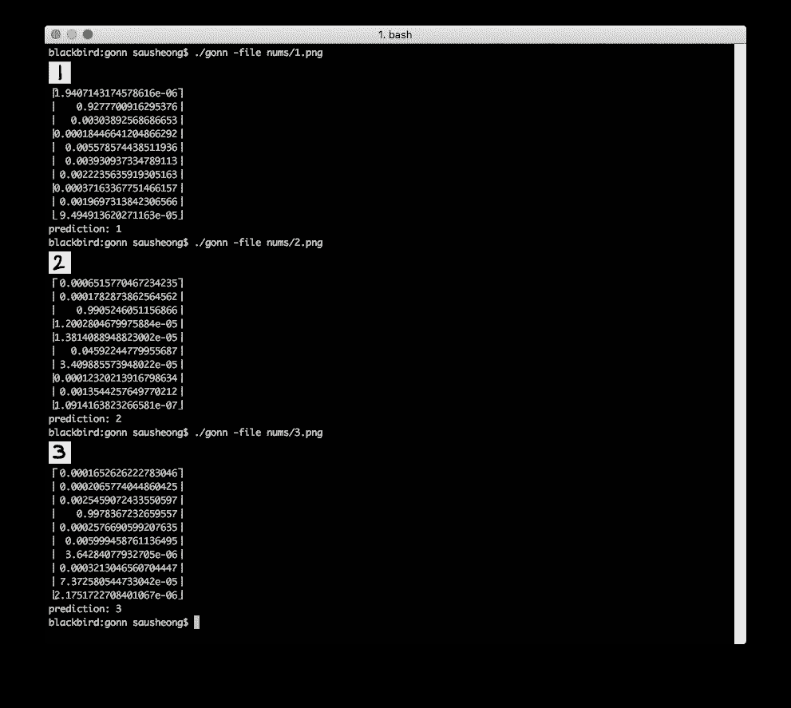

就这样，我们用 Go 从头开始编写了一个简单的 3 层前馈神经网络！

# 参考

这里是我写这篇文章和代码时参考的一些资料。

*   塔里克·拉希德的[制作你自己的神经网络](https://www.amazon.com/Make-Your-Own-Neural-Network-ebook/dp/B01EER4Z4G)是一本学习神经网络基础知识的好书，其简单的解释风格
*   迈克尔·尼尔森的[神经网络和深度学习](http://neuralnetworksanddeeplearning.com/)免费在线书籍是学习构建神经网络复杂性的另一个惊人资源
*   丹尼尔·怀特纳克写了一本关于用围棋进行机器学习的书，他关于 T2 在围棋中从头开始构建神经网络的帖子很有教育意义
*   Ujjwal Karn 的数据科学博客有一篇关于神经网络的很好的[介绍文章](https://ujjwalkarn.me/2016/08/09/quick-intro-neural-networks/)