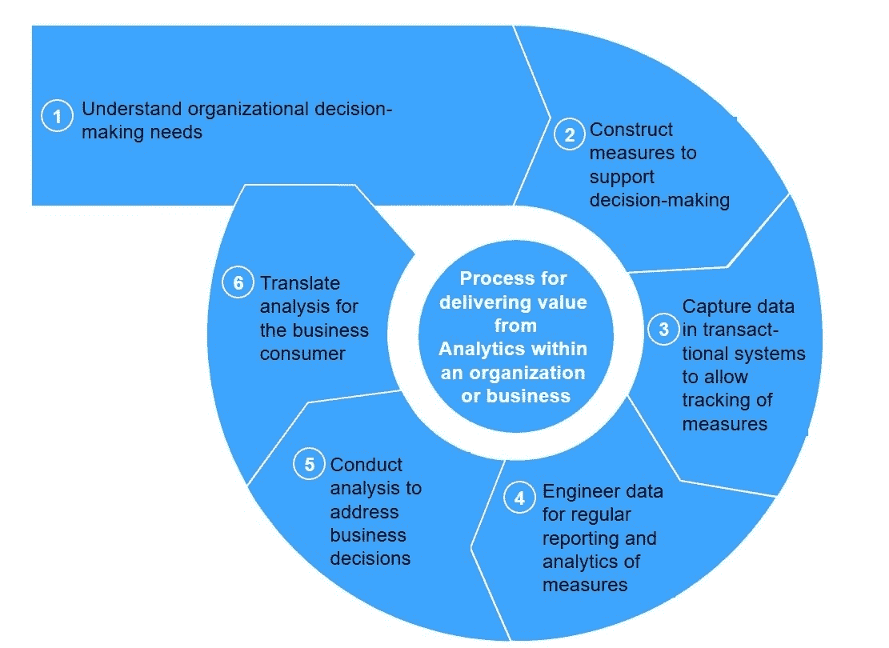

# 如何在组织中建立影响分析团队

> 原文：<https://towardsdatascience.com/how-to-build-an-analytics-team-for-impact-in-an-organization-21bb05925587?source=collection_archive---------2----------------------->

## 分析价值生命周期是一个框架，可以帮助分析团队的设计和结构

他们说智慧来自经验，我不得不同意这一点。我花了两年时间建立了一个分析团队，主要目标是对业务产生影响，只是现在我觉得我可以谈谈如何做到这一点。

我花了一些时间来形成一个观点的原因之一是，我们已经试验了一些不同的模型和结构，以便找出哪些最有效。另一个原因是，没有一个人有答案，我们的模型需要时间通过与团队的关键成员和业务中重要的利益相关者进行协商来开发。

也就是说，分析团队在企业或组织中的运作模式现在在我的脑海中已经更加清晰了。它有六个步骤，围绕业务决策形成了一个“生命周期”。这六个步骤告知团队应该如何运作，需要什么技能，团队应该如何构建，以及团队应该具有什么类型的特征和技能。我意识到，许多阅读这篇文章的人不一定能够获得完全遵循这种模型所需的资源，这通常是因为他们所服务的组织太小，不值得这样做，但尽管如此，我相信总体情况仍然是令人感兴趣的。

Diagram of the analytics value lifecycle

# 步骤 1:了解企业的决策需求

*为什么？*分析团队无法发挥最佳功能的一个常见原因是缺乏对他们所服务的业务中发生的决策的理解。如果一个分析团队配备了过多的技术或学术人才，这种“概念差距”很可能会影响团队的潜在影响，因为分析通常是由团队成员的个人利益驱动的，而不是违背关键内部客户的要求。

*如何？*分析团队中至少有一名高级成员应与企业的决策机构保持密切联系，无论是首席财务官、CHRO 还是其他负责做出关键业务决策的委员会或小组。应建立定期论坛，在论坛上交流业务的主要优先事项，并就分析情报的不足之处提供反馈。这将允许形成一个分析议程，并建立最能满足关键内部客户未来需求的数据结构和工具。负责此事的个人最好来自业务本身，具有分析和战略头脑(尽管不一定技术熟练)，并有热情和动力在业务内开发分析和分析能力。

# 步骤 2:构建支持业务决策的方法

*为什么？*我的老读者可能会厌倦听我说这些，但分析的成功取决于有效的衡量。如今，许多分析团队举步维艰，因为他们无法获得准确的测量数据。在了解业务的决策需求后，要问的第一个问题应该是“我们需要衡量什么才能理解这一点？”。测量可能是一个极其困难的问题。确定适当的衡量标准是数学和统计原则的微妙平衡，同时还要考虑数据系统和数据捕获流程以及人类行为。这通常是一种妥协，但需要有很强的专业知识和判断力才能做好。

*如何？*确定解决特定业务问题的衡量方法需要分析团队中多种技能的参与。一个*测量专家*是绝对必要的。例如，如果是人员和技能问题，这可能是一个心理计量学专家；如果是销售或营销问题，这可能是一个营销计量学专家。除了度量专家之外，还需要数据专家的输入，通常是了解交易系统和数据流的工程师、了解如何在进行分析时处理数据的分析专家(如数据科学家),以及第 1 步中能够向技术专家正确解释和解释业务决策需求的人员。

# 步骤 3:在事务系统中捕获数据，以便跟踪度量

*为什么？*如果第二步产生的度量是新的，那么通常需要在组织内的原子级别输入新类型的数据。这将需要在系统级别实现，还需要理解所需的规则和逻辑，以及对人工流程所需的调整，以确保准确捕获数据。

*如何？*数据工程师*在任何分析团队中都是一个基础角色。他们将充当与系统管理员和专家的主要联系人，并且他们需要对如何在事务系统中构造字段和输入规则以允许准确和可靠的数据流有重要的发言权。这不是他们唯一的关键角色(见下一步)。*

# 步骤 4:为定期报告和度量分析设计数据

*为什么？*将交易业务数据转化为对分析和决策有用的衡量标准的过程可能会很费力。围绕这一点的一些仔细思考可以对分析操作的效率和可靠性产生巨大的影响。能否定期(每小时、每天、每周、每月)对事务性数据进行预处理，以创建表或视图，这些表或视图在一定级别上进行聚合，从而实现更快速的分析和洞察？这些视图应该如何设计？应该提供什么样的人口统计或削减？

*如何？*一个有能力的数据工程师可以在理解数据预处理需求以及实际创建和设计所需的聚合数据源方面创造奇迹。

# 步骤 5:进行分析以解决业务问题

*为什么？*这部分显而易见。

*如何？这值得更全面的讨论，我将在以后的文章中重点讨论。需要划清界限*

*   定期标准化报告，这需要数据科学、数据工程、可视化、UX 和数据自动化和供应方面的软件开发技能。理想情况下，几乎没有团队时间应该花费在手工交付定期报告上。外部供应商的产品可能有助于填补这方面的空白，但我的经验是，没有一个供应商的工具能够满足这里的全部需求。最好的团队会为自己设计这个。
*   即席分析，要求商业智能专业人员了解组织的数据系统，并能够使用它们来满足来自商业客户的特定的、非标准的问题。
*   高级分析，要求深入了解高级统计方法，熟练掌握高级数据科学工具，以便使用这些高级方法分析和处理数据。

# 步骤 6:为企业消费者翻译分析

*为什么？*分析在业务和组织中没有影响的主要原因之一是结果没有被很好地理解，并且由于缺乏对结果的有效沟通，经常得出明显错误的结论。为了在组织中产生影响，分析团队需要能够利用有助于以业务领导者可以理解的方式清晰地翻译结果的技能，其中许多人可能不具备为自己翻译的知识或技能。当采用先进的分析方法时，这一点尤为重要。

*如何？**翻译*是高效分析团队中的关键角色。翻译人员了解组织战略和决策，有很强的解决问题的能力，对分析有热情和兴趣，并有客户服务的心态。分析翻译是目前最难找到的职位，因为这个角色太新了，还没有被很好地理解。根据我的经验，最有效和最有能力的翻译都来自于业务本身。翻译人员提供全面的领导和指导，并与技术人员(数据科学、测量、工程、可视化和设计)合作，找到满足客户需求的最佳解决方案。翻译人员在业务中保持长期的客户关系，以便根据需求的变化调整分析方法。

这是我第一次阐述分析价值生命周期，毫无疑问，它将进一步发展，所以请将它视为一项正在进行的工作。在接下来的几周和几个月里，我还打算花更多的时间来充实生命周期某些部分的细节，以及有效地为这样的行动配备人员所需的角色和个人简介。

*最初我是一名纯粹的数学家，后来我成为了一名心理计量学家和数据科学家。我热衷于将所有这些学科的严谨性应用到复杂的人的问题上。我也是一个编码极客和日本 RPG 的超级粉丝。在*[*LinkedIn*](https://www.linkedin.com/in/keith-mcnulty/)*或*[*Twitter*](https://twitter.com/dr_keithmcnulty)*上找我。*