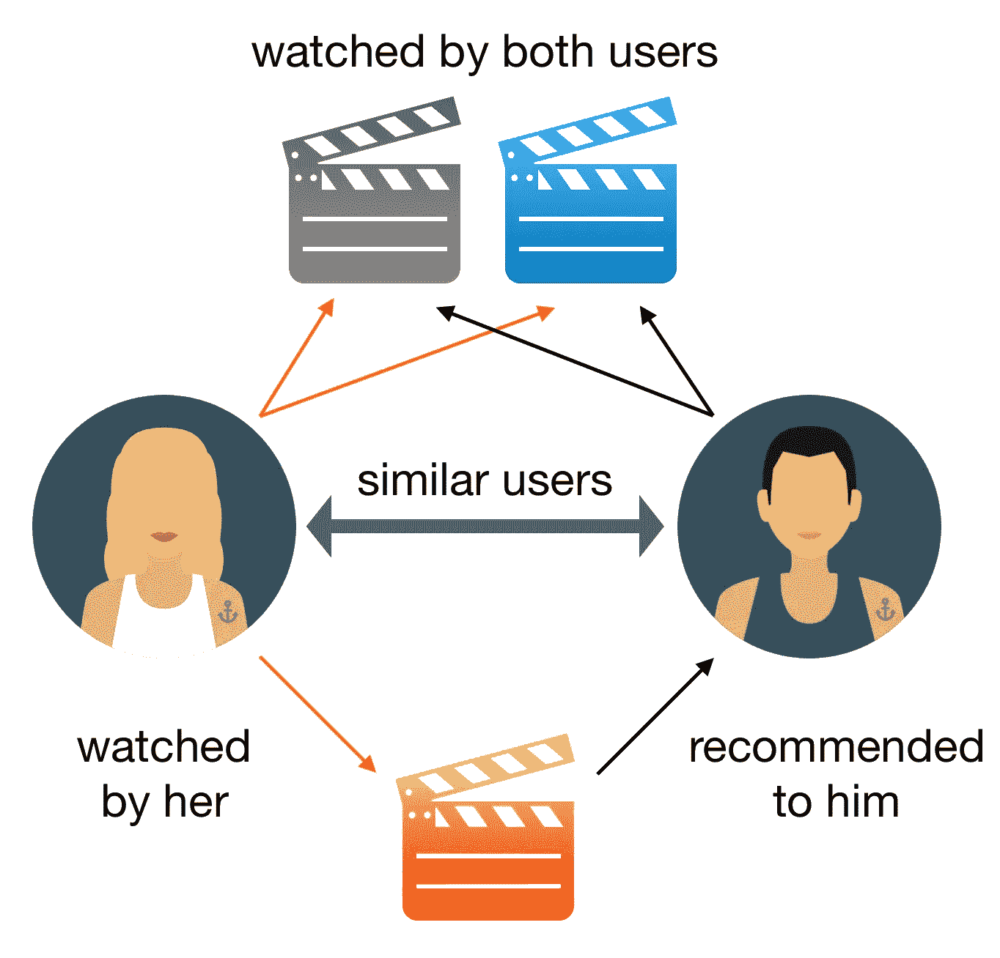
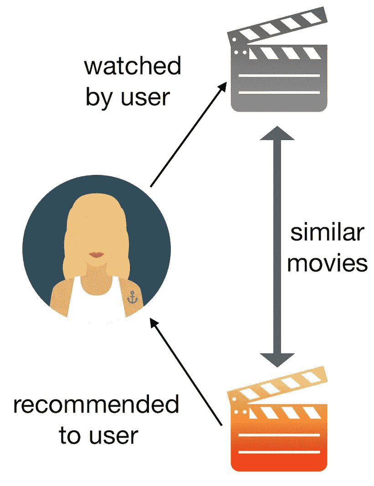
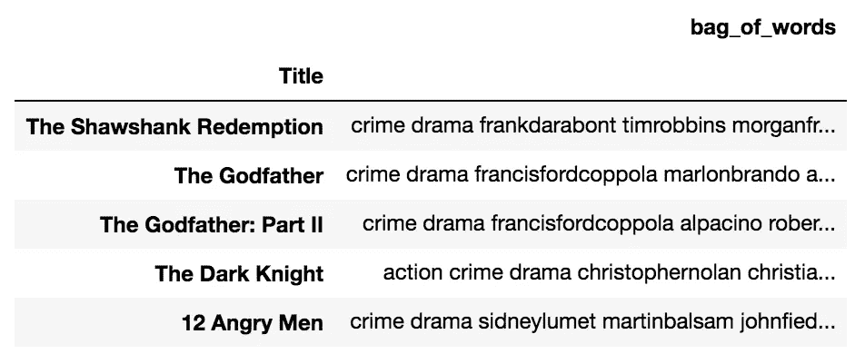

# 如何用自然语言处理构建基于内容的电影推荐系统

> 原文：<https://towardsdatascience.com/how-to-build-from-scratch-a-content-based-movie-recommender-with-natural-language-processing-25ad400eb243?source=collection_archive---------0----------------------->

“empty brown theater chairs” by [Tyler Callahan](https://unsplash.com/@tylercallahan?utm_source=medium&utm_medium=referral) on [Unsplash](https://unsplash.com?utm_source=medium&utm_medium=referral)

在某种程度上，我们每个人肯定都想知道网飞、亚马逊、谷歌给我们的所有推荐来自哪里。我们经常在互联网上对产品进行评级，我们表达的所有偏好和分享的数据(明确地或不明确地)都被推荐系统用来产生实际上的推荐。推荐系统的两种主要类型要么是协作式的，要么是基于内容的过滤器:这两个名称都是不言自明的，但是让我们看几个例子来更好地理解它们之间的区别。我将使用电影作为例子(因为如果可以的话，我会一直看电影/电视节目)，但是请记住，这种类型的过程可以应用于您观看、收听、购买的任何类型的产品，等等。

# **协同过滤器**

这种类型的过滤器是基于用户的比率，它会向我们推荐我们尚未观看过，但与我们相似的用户已经观看过，并且喜欢的电影。为了确定两个用户是否相似，该过滤器考虑他们观看的电影以及他们对电影的评价。通过查看共同的项目，这种类型的算法将根据相似用户的评价，基本上预测尚未观看该电影的用户的评价。

Collaborative-based filter.

为了准确地工作，这种类型的过滤器需要评级，并且不是所有用户都不断地对产品进行评级。他们中的一些人几乎从不评价任何东西！这种方法的另一个特点是建议的多样性，这可能是好的或坏的，取决于具体情况。比如说用户 A 非常喜欢反乌托邦电影和黑色喜剧。用户 B 也喜欢反乌托邦电影，但从未看过黑色喜剧。协作过滤器将基于两个用户对反乌托邦电影的共同品味，向用户 B 推荐黑色喜剧表演。这种情况可能有两种方式:要么用户 B 发现他/她非常喜欢黑色喜剧，在这种情况下，很好，他/她的列表上有很多新的东西可以看！或者，用户 B 确实喜欢较轻的喜剧风格，在这种情况下，推荐没有成功。

# 基于内容的过滤器

Content-based filter.

这种类型的过滤器不涉及其他用户，如果不是我们自己。基于我们喜欢的东西，该算法将简单地挑选内容相似的项目来推荐给我们。

在这种情况下，推荐的多样性将会减少，但是这将会影响用户对事物的评价。如果我们将此与上面的示例进行比较，可能用户 B 潜在地喜欢黑色喜剧，但他/她永远不会知道，除非他/她决定自主尝试，因为该过滤器只会继续推荐反乌托邦电影或类似的电影。当然，我们可以计算许多类别的相似性:在电影的情况下，我们可以决定只基于类型建立自己的推荐系统，或者我们可能希望包括导演、主要演员等等。

> 当然，现有的过滤器并不只有这两种。还有基于集群或行为的，仅举几个例子。

到目前为止，我已经多次提到这个词*相似性，*但是它到底是什么呢？这似乎不是我们可以量化的东西，但令人惊讶的是它是可以测量的！在进入如何构建基于内容的系统的实际例子之前，让我们简单回顾一下余弦相似性的概念。这是我们在计算用户或内容之间的相似性时可以使用的指标之一。

# 余弦相似性

我们都很熟悉向量:它们可以是 2D、3D 或其他什么-D。让我们在 2D 想一会儿，因为它更容易在我们的脑海中描绘出来，让我们首先刷新一下*点积*的概念。两个向量之间的点积等于其中一个向量在另一个向量上的投影。因此，两个相同向量(即具有相同分量的向量)之间的点积等于它们的平方模，而如果这两个向量垂直(即它们不共享任何方向)，则点积为零。一般来说，对于 *n* 维向量，点积可以计算如下。

Dot product.

点积在定义相似性时很重要，因为它与相似性直接相关。两个向量 **u** 和 **v** 之间的相似性的定义实际上是它们的点积和它们的大小的乘积之间的比率。

Similarity.

通过应用相似性的定义，如果两个向量相同，这实际上等于 1，如果两个向量正交，则等于 0。换句话说，相似性是一个介于 0 和 1 之间的数字，它告诉我们两个向量有多相似。相当简单！

现在是编码的时候了！

# 1.收集数据

对于这个问题，我决定使用包含 IMDB 中排名前 250 的电影的数据集。事实上，这个表收集了 250 个观察值(电影)和 38 列。然而，我希望我的推荐者只基于电影导演、主要演员、流派和情节，所以这些是我在建模中考虑的唯一列。

这是数据帧头部的样子。

我的目标是为包含上述所有特征的每部电影只获取一列，以便执行矢量化。没错，我们需要使用 NLP，因为我们需要数字来计算余弦相似度，而我们还没有…还没有！当然，首先要做一些清洁工作。

# 2.数据清理

我在`nltk`包中发现了一个很好的特性，允许我们从文本中提取关键词，它甚至给每个词打分。我没有真正考虑这个基本推荐者的分数，但是我使用这个`Rake`函数从`Plot`列中提取关键词，所以我没有使用描述情节的整个句子，而是只考虑描述中最相关的词。为了做到这一点，我将这个函数应用于`Plot`列下的每一行，并将关键字列表分配给一个名为`Key_words`的新列

Extracting key words from movie plots.

其他的柱子也需要清洗。一切都需要小写以避免重复，我还决定将所有的名和姓合并成一个唯一的单词。因为，想想看:如果我们有导演是丹尼·鲍伊尔的电影 A，和主要演员之一是丹尼·德维托的电影 B，推荐者会因为他们的名字而发现相似性，而这是我们不想要的。我希望推荐器只在与不同电影相关联的人完全相同时才检测相似性。

在所有的清理和合并之后，我将索引重新分配给电影标题列(这不是我的功能之一)，这就是准备进行矢量化的数据帧。

# 3.建模

为了检测电影之间的相似性，我需要向量化，正如我上面提到的。我决定使用`CountVectorizer`而不是`TfIdfVectorizer`，原因很简单:我需要为我的`bag_of_words`列中的每个单词设置一个简单的频率计数器。Tf-Idf 倾向于对出现在整个语料库(在本例中是我们的整个专栏)中的单词不太重视，这不是我们在这个应用程序中想要的，因为每个单词对检测相似性都很重要！一旦我有了包含每个单词计数的矩阵，我们就可以应用`cosine_similarity`函数了

相似矩阵是这样的。

Similarity matrix.

让我们简单看一下:对角线上的所有数字都是 1，因为，当然，每部电影都和它自己一模一样。矩阵也是对称的，因为 A 和 B 之间的相似性与 B 和 A 之间的相似性相同。

此时，我可以编写实际的函数，该函数以电影标题作为输入，并返回前 10 部类似的电影。为了做到这一点，我还创建了一个简单的带有数字索引的电影标题系列，以便将相似性矩阵中的索引与实际的电影标题相匹配。事实上，我的函数一旦接收到输入，就检测与输入的电影对应的行中的 10 个最高数字，获取相应的索引并将它们与电影标题系列进行匹配，以返回推荐的电影列表。当我说该函数考虑 10 个最高的相似性值时，我是在丢弃单元值(很容易是最高的)，以便该函数不会返回我输入的相同电影标题。

# 4.测试推荐器

任务完成了！当然，这是一个非常有限的推荐系统，因为我只使用了一个包含 250 部电影的数据集，但它一点也不差！遵循相同的程序，但使用更多的数据，并实现关键字的分数，例如，这个系统可以很容易地完善。但是让我们通过输入 *Fargo:* 来测试一下，这是(250 部电影中)最值得推荐的 10 部电影。

Movies recommended because I like Fargo.

我看这个不错！主要是基于导演和剧情我能看出一些相似之处。我喜欢上面列表中我已经看过的电影，就像我喜欢《法戈》一样，所以我想我会去看我仍然错过的几部电影！

请随意查看:

[我的其他中等岗位。](https://medium.com/@emmagrimaldi)

[我的 LinkedIn 个人资料。](https://www.linkedin.com/in/emmagrimaldi/)

[我的这个项目的 GitHub 资源库。](https://github.com/emmagrimaldi/Content_based_movie_recommender)

**感谢您的阅读！**