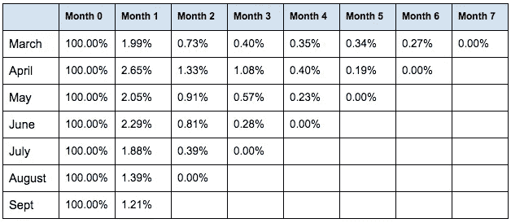

# 如何计算各行业的流失率

> 原文：<https://towardsdatascience.com/how-to-calculate-churn-rates-across-industries-68c692b64605?source=collection_archive---------0----------------------->

一个可悲的商业事实是，你不可能永远留住客户。随着时间的推移，你会失去客户，因为他们的需求不断变化，竞争加剧，或者只是因为他们离开(如果你是一个实体零售商)。

你在一段时间内失去的客户百分比被称为你的**流失率**，或者简称为**流失率**。了解你的客户流失对于控制你的客户获取成本和确保你的业务增长至关重要。你要确保增加客户的速度快于失去客户的速度！

计算你的客户流失看起来很难。事实上，客户流失可能是你在业务中使用的最复杂的指标，因为很难可靠地定义和计算。在这篇文章中，我们将涵盖许多不同的方法来计算客户流失，即使我们不强调一种方法适合你的业务，给你的想法，就如何计算自己的客户流失。

具体来说，我们将涵盖:

*   **第一部分** —定义流失
*   **第二部分** —收入流失
*   **第三部分** —交易型流失
*   **第四部分** —合作

> [***异常值***](http://outlier.ai/about-outlier/) ***监控您的业务数据，并在发生意外变化时通知您。*** *我们帮助营销/增长&产品团队从他们的业务数据中获取更多价值。* [*今天安排一个演示*](http://outlier.ai/about-outlier/) *。*

让我们从定义客户流失的确切含义开始，并理解为什么说起来容易做起来难。

# 第一部分。**什么是流失？**

在我们开始分析我们的客户流失之前，我们需要就一个定义达成一致。流失率通常被定义为你失去现有客户的比率。在这种情况下，通过以下方式计算客户流失应该很容易:

A typical churn calculation that disregards time

然而，这并不完全清楚！我们什么时候衡量客户流失？我们从哪一点开始计算我们的客户总数？为了做到这一点，我们需要测量特定时间窗口内的客户流失。因此，客户流失率通常是按月来衡量的:

Typical churn calculation by month

这更有道理，但仍有一个大问题。我们如何定义客户总数？如果当月增加客户，要不要统计？他们在第一个月没有机会流失，所以这可能会扭曲我们的指标。为了解决这一问题，仅对当月开始的客户计算流失率:

Churn calculation for customers at start of month

这更好，因为现在我们可以了解有多少开始这个月的客户在这个月流失了。这仍然不能捕捉到在第一个月开始并流失的客户，但至少他们不会扭曲我们的计算。

即使在三次迭代之后，该解决方案仍然存在许多问题:

*   **延迟洞察**。在任何给定的时间，你最近的客户流失指标至少是一个月前的。三月份，您将获得的最新客户流失指标来自二月份！这使得实时解决客户流失问题变得困难。
*   **顾客交融**。这一指标无法区分与您合作多年并流失的客户和最近成为客户并在下个月离开的客户。将这些价值观融合在一起，就无法判断你是在失去长期客户还是短期客户！

我们可以继续完善我们的等式[1]，但是，最终，您使用的流失计算将取决于您希望它包含的内容。你想每周都进行客户流失测量吗？你想用不同的方式衡量你的顾客吗？没有神奇的、单一的客户流失方程式，因为每个公司对客户流失的看法都不一样。

要创建你的客户流失公式，就像我们上面做的那样，列出它需要包含的重要特性，并对其进行提炼。注意不要把它弄得太复杂，因为它变得越复杂，就越有可能有人在某个时候计算错误，你就会有一个误导性的指标。

# **第二部分。收入流失**

到目前为止，我们已经介绍了如何根据一段时间内获得和失去的客户来计算客户流失率。然而，并不是所有的顾客都是平等的！如果一个每月付给你 10 美元的客户流失了，那也没有失去一个每月付给你 1000 美元的客户重要！事实上，低价客户留存率高，高价客户留存率低是很常见的。这将被我们昨天讨论的流失计算所隐藏。

**收入流失**是另一种思考流失的方式，它关注的是你如何从客户那里保持收入。如果您的客户有各种各样的定价，这可能是一种更有用的思考客户流失的方式。

在计算收入流失时，您的第一反应可能是像我们的客户流失公式一样处理它:

Calculating churn for revenue.

然而，计算收入不同于计算客户，因为任何给定的客户都可能在给定的一个月内开始多付或少付你钱。我们需要更具体地了解“收入损失”的含义:

A better way to calculate churn for revenue, this time accounting for upgrades

我们已经用一个简单的等式代替了“**收入损失**”，该等式从每月第一天的总收入开始，减去该月最后一天来自这些客户的收入(从而得出损失的收入)，然后减去升级的价值。我们需要减去升级，因为如果您的客户向上销售非常有效，它们可能会隐藏客户的流失。

这个等式的一个有趣的副作用是，如果你的客户升级率高于客户流失率，你的收入流失率可能是负数！这被认为是非常好的，因为负收入流失率是建立高增长业务的关键因素[1]。

# 第三部分。**事务性流失**

大多数交易业务，如电子商务，使用重复购买率等指标来评估客户保持率。这是因为客户流失指标要求您知道何时会失去客户，这对于交易型企业来说非常困难。在订阅业务中，你知道他们何时会取消订阅，但如果是一个网站，客户可以随心所欲地来来去去，那该怎么办？但是，难不代表不值得做！

确定何时失去交易型客户的一个常用方法是使用活动时间窗口。每当顾客购物时，你就启动一个计时器。如果同一个客户在一段时间内没有回来，你就认为他们被解雇了。我在下面举例说明了这一点:

Using a purchase history window to measure customer churn

这很有道理，但是如果同一用户在你把他们标记为“搅动”的第二天又回来购买，你会怎么做呢？

Options to handle a use-case where the customer has churned: treat them as a new customer or re-calculate churn rates.

对于如何处理这些情况，您有几个选择:

*   **把他们当成新客户**。将回头客视为新客户似乎是欺骗，但如果你的时间足够长，这可能是最好的。如果你的网站和产品在客户上次购买你的产品后的 6 个月内发生了显著的变化，他们的体验将是全新的，他们在大多数方面都将是一个新客户。
*   重新计算你的流失率。每个月，你可以重新计算过去一年的流失率，因为你可以识别那些被认为已经流失但后来又回来购买的客户。这是最准确的方法，但在实践中最难使用，因为您过去的指标会不断变化！

这似乎很容易，尽管选择你的时间窗口是至关重要的。你是用一周，一个月，还是几个月？如果你选择的窗口太短，你会显示一个人为的高流失率。如果你选择的时间太长，那么你不会知道你什么时候失去了顾客，直到他们离开很久以后。您将需要利用您对业务和典型使用模式的了解来做出明智的选择，如果您觉得客户流失指标不能反映真实的客户流失，请重新进行评估。

# 第四部分。合作

不管你用什么方法来衡量客户流失，所有的方法都很大程度上依赖于使用预先确定的时间间隔(比如几个月)。这种方法的一个挑战是，它可以通过混合许多不同类型的客户来隐藏长期趋势。例如，在一个特定的月份里，你可能会失去三个和你在一起超过一年的客户，和 10 个只和你在一起一个月的客户。你可能想知道为什么你会失去这三个长期客户，但是他们可能会被你的流失指标所淹没。

出于这个原因，客户流失几乎总是根据客户群来衡量和可视化。这种协作可以让你看到，随着你改进产品、调整定价和对业务做出其他改变，客户流失是如何随着时间的推移而变化的。例如，群组可以是客户开始使用你的产品的月份。

让我们来看一个数字示例，说明客户是如何通过每月的购买群体流失的。在这个例子中，我将使用保留率(这是流失率的倒数)，因为它可以更直观地看到保留率随着时间的推移而下降，而不是流失率增加。你觉得哪个更容易理解取决于你:

对于每个月(3 月至 9 月)，该图表显示了客户首次成为客户后每个月的流失情况。第一行表示，对于 3 月份开始的客户，此后每个月的保留率。第 0 个月将始终是 100%,因为该月是客户成为客户的第一个月，因此他们不会有变动。在这一行中，每个群组的保留率始终小于或等于前一列中的值，因为群组无法增加久而久之。

请注意，并非所有行都有 7 个月之后的值，因为这些月份可能还没有发生！这张图表是在假设现在是 10 月份的情况下查看您的数据，因此 9 月份获得的客户只有一个月的时间来衡量他们的保留率。

按群组考虑人员流动会很容易发现模式。从第 1 个月开始，从 3 月份开始，我们的客户保持率约为 2%，直到 7 月份开始下降，9 月份获得的客户一直下降到 1.21%。很明显，我们在业务中所做的一些改变导致了第 1 个月更高的流失率，我们需要解决这个问题！

**回顾**:流失率可能很难计算，但随着时间的推移，它是了解和提高客户保持率的非常有价值的工具。无论你从事哪种业务，你都可以也应该把流失率作为一个关键的绩效指标来衡量。

> [***离群值***](http://outlier.ai/about-outlier/) ***监控您的业务数据，并在发生意外变化时通知您。*** *我们帮助营销/发展&产品团队从他们的业务数据中获取更多价值。* [*今天安排一个试玩*](http://outlier.ai/about-outlier/) *。*

[1]为了更好地了解负收入流失及其如何创造高增长，我推荐 [Tomasz Tunguz 的帖子](http://tomtunguz.com/negative-churn/)。

[2]重复购买率是再次购买的顾客的百分比。它为您提供了一个简写方式，让您知道在给定的时间范围内，新客户或现有客户购买了多少商品。理想情况下，随着你积累更多的忠实客户，这个比率会随着时间的推移而增加。