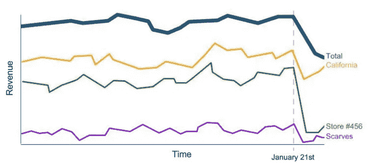

# 如何进行正确的根本原因分析

> 原文：<https://towardsdatascience.com/how-to-conduct-a-proper-root-cause-analysis-789b9847f84b?source=collection_archive---------0----------------------->

我们所有人都害怕那种老板会问“为什么收入下降了？”唯一比这个问题更糟糕的是没有任何答案！您的业务每天都在发生许多变化，通常您会希望确切地了解是什么推动了给定的变化，尤其是在变化出乎意料的情况下。

理解变化的根本原因被称为根本原因分析。根本原因是最终导致变化的行动或事件。请注意，根本原因本身可能不会导致变更，它可能会引发一系列其他事件，最终导致变更。当然，给定变化的根本原因可能不止一个。

例如，假设我们经营一家名为 Sean's Snowshoes 的大型连锁零售店。如果我们的收入下降，可能是由于以下原因之一:

*   竞争降低了他们的价格，导致我们的销售额减少。
*   一场大规模的暴风雪使我们的顾客呆在家里，而不是在我们的商店里。
*   我们的一个主要营销活动结束了。
*   我们改变了让顾客困惑的优惠券策略。

….或者其他几十个潜在原因中的一个！

正如你所想象的，根本原因分析可能是复杂和具有挑战性的。本周，我们将介绍一系列技术和工具，帮助你在这些困难的水域中航行。具体来说，我们将涵盖:

*   **第 1 部分** —确定影响因素
*   **第二部分** —排序因素
*   **第三部分** —分类因素
*   **第 4 部分** —根本原因分析设计

让我们开始帮助 Sean 的雪地靴进行根本原因分析，确定我们需要考虑的所有影响因素。

> [***异常值***](http://outlier.ai/about-outlier/) ***监控您的业务数据，并在发生意外变化时通知您。*** *我们帮助营销/增长&产品团队从他们的业务数据中获取更多价值。* [*今天安排一个试玩*](http://outlier.ai/about-outlier/) *。*

# 第一部分。**确定影响因素**

根本原因分析的第一步是识别所有促成问题变化的因素。业务变化有两种主要的促成因素:

*   **内部**。这些都是你所采取的行动，这些行动导致了你的企业发生了变化。示例包括新产品发布、产品更新和营销活动变更。
*   **外部**。不管你愿不愿意，这些事情都会发生在你身上。例子包括竞争性价格变化、用户行为转变和自然灾害。

我们的目标是列举每一个可能的因素，这两种类型，可能有助于我们正在分析的变化。我们在这个阶段越全面，就越有可能找到根本原因。

让我们回到 Sean's Snowshoes 的例子，这是一家零售连锁店，在 1 月 21 日收入有所下降。我们希望找到这种下降的根本原因，因此首先我们将汇集一份可能导致这种下降的所有内部和外部因素的列表:

*   1 月 21 日:我们开始了新的营销活动。(**内部**
*   1 月 20 日:我们一些最大的商场开始施工。(**外挂**)
*   1 月 20 日:我们的一项主要营销活动结束了。(**内部**)
*   1 月 19 日:我们开始了新的在线优惠券促销活动。(**内部**)
*   1 月 18 日:一场大规模的暴风雪袭击了我们所有的工作地点。(**外部**)
*   1 月 17 日:421 号店、439 号店和 456 号店新聘经理。(**内部**)
*   1 月 10 日:竞争对手在选定的地点降低了价格。(**外部**)

要避免的一个重要陷阱是假设促成因素必须与变化同时发生。例如，由于收入在 1 月 21 日下降，我们的第一直觉可能是识别 1 月 21 日发生的所有事情。然而，真正的因素(以及根本原因本身)很可能发生在收入下降之前。根据它们触发的事件链，起作用的因素可能发生在问题变化的几天、几周甚至几个月之前。

请注意，每个因素都有一个与之相关联的日期(或时间),这样我们就可以构建一个导致(和跟随)变更事件的时间表。事实上，如果你的潜在因素列表足够短，你应该现在就做！不幸的是，在现实世界中，这个列表可能会太长，你首先需要缩小范围。

# 第二部分。分类因素

有了你的潜在因素清单，是时候开始将它们削减到最有可能导致变化的原因了。评估数百个潜在因素可能是不可能的，但如果我们能把它减少到几十个，这就成了一个可管理的问题。最好从一开始就指出变化的指标和组成变化的部分开始。

让我们回到 Sean's Snowshoes 的例子，一家零售连锁店的收入下降了。收入本身很容易理解，因为它是我们从销售中获得的现金总额。但是，收入可以由许多不同的因素分解:

*   存储位置
*   客户位置
*   产品
*   星期几

通过查看每个维度(以及所有维度的组合)的收入，应该会清楚哪些细分市场导致了收入下降。是一家特别的商店吗？一些具体的产品？特定的日期或时间？您希望确定哪些部分在总体变化的同时发生了变化，以及哪些部分的数量最多。

以下是肖恩雪地鞋收入的一些精选维度的图表:加州的收入、销售围巾的收入和 456 号店的收入。

该图帮助我们确定哪些方面是变化的驱动因素，哪些方面可能是副作用:

*   右边的总收入(蓝色)大幅下降。我们的目标是找到这种变化的根本原因。
*   加州(黄色)的收入显然是总收入的重要组成部分，它确实与总收入同时下降。然而，它没有总收入下降那么多，而且恢复得很快，所以看起来不像是下降的原因。
*   围巾(紫色)的收入与总收入同时大幅下降，但这只是总收入的一小部分。总收入中如此小的一部分更可能是副作用，而不是根本原因。
*   456 号店(绿色)的收入是总收入的重要组成部分，当总收入下降时，其收入也大幅下降。这是一个明显的落点来源。

一旦您有了看起来与变更相关的最重要的部分，您就可以使用它来选择最有可能影响这些部分的因素。如果我们重温昨天的潜在因素列表，我们可以排除那些不会影响 456 号店的因素。具体来说，任何影响所有商店的变化都不太可能比可能影响该商店的因素起作用:

*   1 月 21 日:我们开始了新的营销活动。(内部)
*   1 月 20 日:我们一些最大的商场开始施工。(外部)
*   1 月 20 日:我们的一项主要营销活动结束了。(内部)
*   1 月 19 日:我们开始了新的在线优惠券促销活动。(内部)
*   1 月 18 日:一场大规模的暴风雪袭击了我们所有的工作地点。(外部)
*   1 月 17 日:421 号店、439 号店和 456 号店新聘经理。(内部)
*   1 月 10 日:竞争对手在选定的地点降低了价格。(外部)

当然，在你的分析中，你会有成百上千个不同的维度和组合需要检查。像我在这里所做的那样绘制它们是不可行的，因为与每个指标相关的维数太大了。为了帮助简化这个问题，您可以使用我们的[系列中关于集群](https://outlier.ai/data-driven-daily/clustering/)的技术，称为[层次集群](https://en.wikipedia.org/wiki/Hierarchical_clustering)。层次聚类的目标是以层次结构中最重要的聚类形式汇总数据，这是突出显示哪些维度可能与更改相关的好方法。只要你按照总的百分比和变化幅度的组合进行分类，这个层次结构应该能够完成我们通过上面的观察所做的事情。[1]

# 第三部分。**分类因素**

现在我们有了一个较短的潜在原因(因素)列表，按影响的可能性排序，我们需要确定哪一个是根本原因。每个因素可分为四组:

*   **关联结果**。这些因素是同一根源的其他症状。例如，如果收入下降，我们的销售税征收减少，销售税的减少不是收入减少的原因，而是根本原因的另一个副作用(导致收入下降的原因)。
*   **无关因素**。这些因素看起来可疑，但实际上与所讨论的变化无关。
*   **促成因素**。这些因素虽然是导致连锁反应的事件链的一部分，但不是根本原因。例如，如果收入下降，购买总数下降，购买总数的减少可能是收入下降的原因，但不是购买本身下降的原因。
*   **根本原因**。这是引发导致变化的一连串事件的因素。记住，可能不止一个！

我们的第一步是将所有高可能性因素排列成一个时间表。在你的时间线上确定因素发生的顺序并不总是像检查它们发生的时间一样容易，有时你需要依靠你对业务和内部流程的了解。

如果你还记得 Sean 滑雪板的例子，很明显，456 号店是我们 1 月 21 日收入下降的核心原因。以下是我们确定的与 456 号店相关的因素的时间表。

按照时间来组织这些因素，当它们开始向我们讲述一个故事时，更容易对这些因素进行分类。

*   1 月 10 日:竞争降低了附近商店的价格。这几乎是下降前的两周，不太可能是根本原因，因为我们会在更早的时候看到收入变化。**判决:无关**。
*   *1 月 18 日:助理经理辞职*。这可能是 1 月 17 日招聘新经理的结果。充其量这只是一个促成因素，但更有可能是出了什么问题的另一个症状。**判定:相关因素**。
*   *1 月 20 日:停车场开工*。这可能是罪魁祸首，因为如果顾客不能停车，他们可能无法到达商店。然而，像这样的施工是另一个决定的结果，因为施工人员不会自己出现。这是导致变化的事件链的一部分，但不是根本原因。**裁决:促成因素**。
*   *1 月 17 日:新经理入职*。这是我们最有可能的罪魁祸首，因为它发生在下降之前不久，新经理将不得不批准停车场的建设开始。**判决:根本原因**。

很明显，这是一个简单的例子，但是我希望它能给你一个重新创建时间线和对因素进行分类的过程是如何为你工作的感觉。

你可能已经注意到，根本原因分析很像侦探工作。你从一些证据开始，排除可能的嫌疑，希望重建事件的时间线。就像侦探工作一样，有些事情你今天就可以开始做，这将有助于你在未来更好地进行根本原因分析。

# 第四部分。**为根本原因分析而设计**

正如您所看到的，确定根本原因具有挑战性。确保您能够可靠地识别根本原因的最佳方法是设计您的业务流程，使其更容易。关键是要确保你已经记录了所有你需要的数据，并且很容易获取，以便找到根本原因。

以下是一些最佳实践:

*   **记录你的动作**。在共享日历上跟踪重要的业务决策和行动。这将让你很容易地识别出所有可能导致变化的内部因素。
*   **追踪外力**。监控所有可能影响你业务的外部力量，包括竞争、经济和政府政策。有许多服务将为你做这件事，但是你的任务是识别最重要的，因为你不能监控整个世界。
*   **对您的数据进行分段**。确保您的度量是分段的，以便您可以有效地评估任何给定分段促成变更的可能性。如果你不能对你的指标进行细分，你将不得不花费大量的时间通过其他方式来消除潜在的因素。
*   **绘制您的流程图**。你的业务流程应该被写下来，这样你就可以找出促成因素和根本原因之间的区别。

你能做的越多，将来你就能越快、越容易地找到问题的根源。

一句提醒的话:在你做了许多根本原因分析之后，当一个新的变化事件发生时，很容易依赖你的直觉。它可能看起来和感觉起来像你过去分析过的其他人，这使你很容易根据你以前的经验得出结论。这是危险的，因为你假设未来和过去一样，而许多其他事情可能已经改变了。即使你认为你知道根本原因，也要仔细分析，确保你没有遗漏任何东西。

# **在回顾**

确定业务变化的根本原因包括三个步骤。首先，找出所有可能导致变化的因素。第二，使用您的指标分段从该集合中选择最可能的因素。最后，重新创建变化的时间表，并使用它对因素进行分类，确定其中的根本原因。

根本原因分析也是找到问题根源的有力工具。祝你好运！

[1]如果您有兴趣了解这方面的更多信息，宝洁公司发表了一篇有趣的[论文](https://pdfs.semanticscholar.org/aee4/f369c02d8089c4c836cffc0c17cafcd84a07.pdf)，介绍了聚类在根本原因分析中的应用。

> [***异常值***](http://outlier.ai/about-outlier/) ***监控您的业务数据，并在发生意外变化时通知您。*** *我们帮助营销/增长&产品团队从他们的业务数据中获取更多价值。* [*今天安排一个试玩*](http://outlier.ai/about-outlier/) *。*