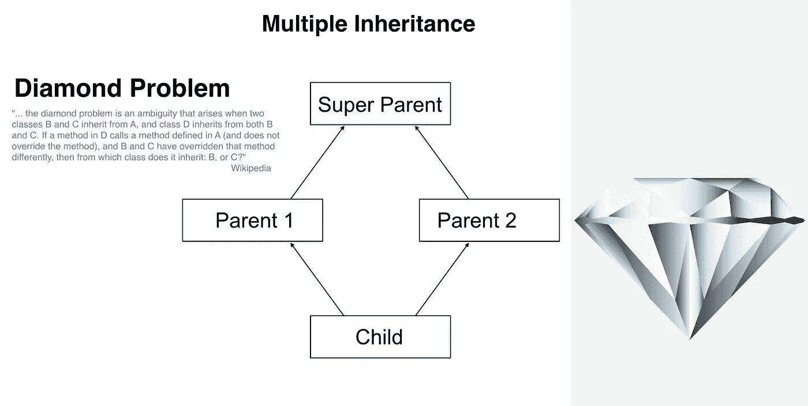
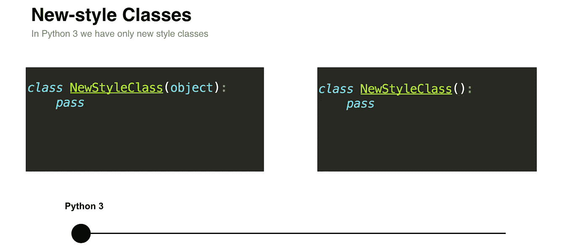
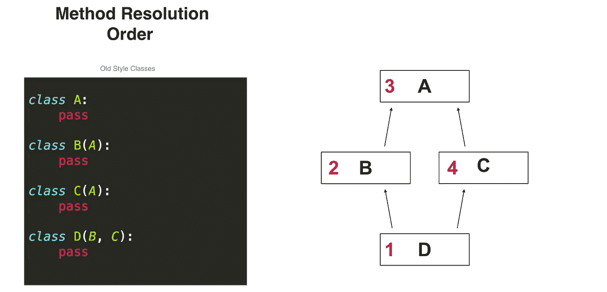
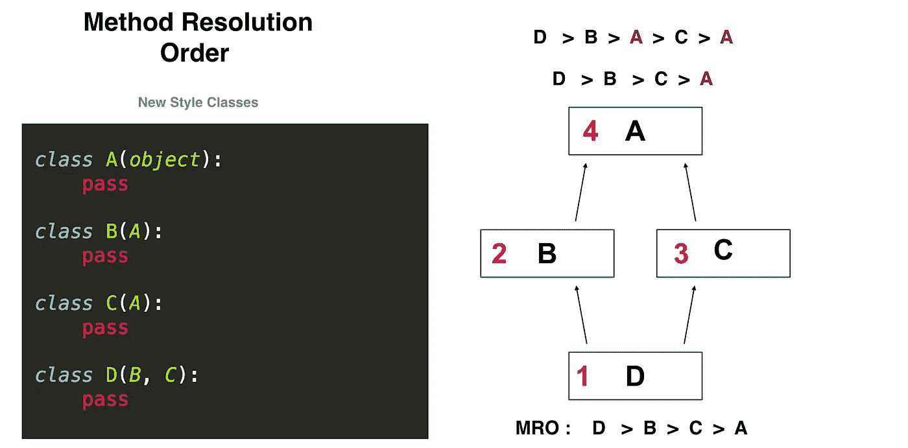
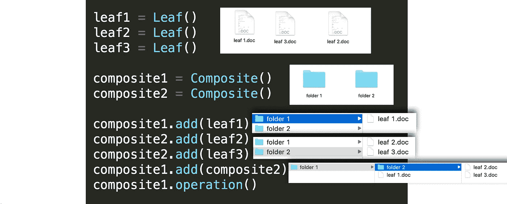

# 如何用 Pythonic 方式将不同情况下的对象相互连接

> 原文：<https://towardsdatascience.com/how-to-connect-objects-with-each-other-in-different-situations-with-pythonic-ways-d3aaf4c89553?source=collection_archive---------2----------------------->

Credits — author : Joanna Malinowska; illustrator : Tatuna Gverdtsiteli

你知道什么是“地理课的效果”吗？！我想，你没有。因为这种效应是由我的朋友命名的，它描述了一种感觉，当你完全准备好某事时，例如为上课，当你被问到某事时，在你回答完之后，你有一种感觉，你可以做得更好，这不是你的最佳答案。很常见吧？有很多原因可以解释为什么它在每个人的生活中至少发生过一次，但这超出了我们的范围。我只是想说，这种感觉对于音箱来说是很常见的(行业无所谓)。每次他们中的大多数人都认为这次经历没有最大限度地发挥他们的潜力，当他们试图在另一个会议上或更好的情况下做同样的演讲时，他们会把他们的演讲写成一篇文章，因为写博客要容易得多。你没有严格的日程安排和时间限制或其他类似的尴尬因素。

老实说，我可以说我没有受到这种影响。我喜欢每次都尽力而为，我也喜欢这种做法，这一点我在上面已经提到过了(在另一场会议中不是同样的谈话)😀 ).所以我决定写一篇关于这个话题的文章，我认为这真的很重要，并且引用了我大约参加过的 Pycon 会议。两个月前。

演讲的视频还没有上传。这对于会议来说很常见，尤其是对于 Pycons 来说，他们需要 2 个多月的时间才能在 Youtube 上上传所有的演讲。当然，这不是一个很长的时间，当你应该剪辑 50-100 个演讲时，主要持续时间是 30 分钟，但我只有一个问题-为什么不做一个视频编辑的人工智能工具，在那里你可以学习人工智能你已经得到的(幻灯片，演讲)和你想要的结果(用幻灯片演讲)，它会自动执行这些，而没有任何不必要的努力？无论如何，如果你喜欢这个想法，并决定写这个项目-添加我的学分🙂

现在，如何用 pythonic 方式连接对象，何时使用关联、聚合、继承等等..

不难看出并记住对象之间这种关系的区别，但是，例如，当我向某人询问这些话题时，几乎每个人都说他们有相当模糊的知识，例如聚合和组合之间的区别，或者组合和复合设计模式之间的区别，或者如果他们有知识，他们只知道抽象的概念。

诚然，面向对象的设计原则并不是特定于语言的，但是不同语言在实现细节上有所不同，并且有一些技术并不适合所有语言。

例如，当我们谈论多重继承时——我们应该考虑到这对于面向对象的范例来说是一个非常敏感的话题，存在类似“钻石问题”的情况

对于一些语言来说，这是一个非常严重的问题，它们不允许多重继承。也有语言不允许类多重继承，只允许接口多重继承。

因此，对于许多只实现单一继承的语言来说，使用接口、协议、混合、特征和其他架构解决方案来提供真正多重继承的一些功能是非常常见的。

与 DI( [依赖注入](https://en.wikipedia.org/wiki/Dependency_injection))相关的题目，也是很重要很痛苦的。

在这种情况下，已经了解 oop 概念的程序员不会再问一些愚蠢的问题，比如“我们到底为什么需要对象？我们可以使用函数编写任何东西。”我觉得这句话用 Python 来说很讽刺，有其他编程语言背景的人还是没有考虑到我们一定要用 Python 的方式写 Python 代码。

例如，他们没有考虑如何使用 super 来制作 di。我不想写这些话题，因为这里有一个最流行的话题。雷蒙德·赫廷格认为超级就是超级。

因此，在开始讨论如何用 python 的方式将对象相互连接之前，我们必须深刻理解 MRO 是如何在 python 中处理新旧样式类的。

众所周知，Python 支持多重继承，也就是说，在 Python 中，一个类可以继承多个类的特性和属性。

MRO 或方法解析顺序是在父类中查找方法时搜索基类的层次结构。python 中有两种类型的类。

> 直到 Python 2.1，旧式的类是用户可以使用的唯一风格。—docs.python.org

> Python 2.2 引入了新样式的类来统一类和类型的概念。—docs.python.org

> **Python 3 只有新型类**。不管你是否继承了`object`的子类，类在 Python 3 中都是新的样式。—docs.python.org

它们之间有很大的区别(新样式类和旧样式类)，例如，在新样式类中添加了

*   描述符
*   时间
*   静态方法
*   类方法
*   低级构造函数

但是最重要的事情之一是在新的风格类别中，我们有了新的 MRO。

旧类 MRO 算法非常简单易懂，它是这样工作的:“深度优先，从左到右”。
这意味着当我们实现多重继承时——Python 构建了一个要搜索的类列表，因为它需要解析当实例调用一个方法时必须调用哪个方法。

该算法首先在实例类中查找被调用的方法。

如果它不存在于实例类中，那么它会查找第一个父类。如果没有出现，则检查父类的父类，这一直持续到类深度的末尾，最后，直到继承类的末尾。

根据该算法，方法分辨率应为:

**D>B>A>c**

但是对于新的类型类——Python 使用 c3 线性化算法，也称为 c3 超类线性化。

这意味着，如果我们在新的类型类中有相同的结构，方法解析应该是 D > B > C > A。

让我们继续 Mixins。

## 混合和特性

> Mixin 是一个包含供其他类使用的方法的类，而不必是那些其他类的父类。
> 
> -维基百科

当我们开始讨论多重继承时，我们说过在一些面向对象的语言中存在混合的概念，它主要是一个包含其他类可以使用的方法的类。

我们也可以说它是一个类的语言结构，用于向另一个类添加功能。

它们并不意味着要独立存在——只有当它们与其他阶级混在一起时才有意义。还有一个关于混合蛋白的非常流行的短语，它帮助我们更好地理解混合蛋白的本质——混合蛋白是“包含的”而不是“继承的”。

Ruby 使用模块支持 mixin，所以我们可以看到在 ruby 中实现 mixin 的最简单的例子:

PHP 使用 traits 类来继承特定的方法实现。

> Trait 是面向对象编程中使用的一个概念，它表示一组可用于扩展类功能的方法。
> 
> -维基百科

可以这样做:

这些方法之间几乎没有区别，但是在这种情况下，我们只对这种关系的结构感兴趣。
现在让我们从 Python 的角度来探索 Mixins。

Python 语言并没有混合的概念，但是它提供了多重继承。尽管 mixins 和多重继承的技术实现是相似的，并且可以类似地使用，但是在很多方面有一些非常重要的区别。

通常 mixins 是扩展某些类的可选定制；它们不同于抽象类，因为当 mixin 提供功能但不能直接使用它时，抽象类只提供接口，没有可用的功能，所以定义了一组函数。但是就它们自己而言，这些类是没有用的，你不能单独实例化它们。

如果你知道这个词的来源，这是很符合逻辑的。
马萨诸塞州一家冰淇淋店的老板第一次使用了“混合”这个名称，他将冰淇淋的基本口味与坚果、饼干等其他配料混合在一起。

Credits : Tatuna Gverdtsiteli

因此，当我们实现具有多重继承的混合时——通常它被用作二级基类，但是因为我们在 Python 中有 MRO，所以不强制将其用作二级基类。

为了更好地理解，我们可以看到字典对象最简单的混合示例:

首先，我们编写 mixin 类并试图覆盖 setitem 函数，当我们有了字典并设置了新的 key:value 对时，就会调用这个函数。接下来我们创建 dictionary 类，它将是 mixin 类的子类，也是 dictionary 对象的子类。
最后，我们可以从我的字典类创建新的实例，当我们在字典中设置一个键值时，MRO 调用我们的 mixins __setitem__()来打印这些文本，并为超类调用 __setitem__()在本例中是字典。

因此，我们可以看到 MRO 在使用 mixin 方面发挥了重要作用，因为 Python 本身并没有 mixin 的具体实现。

正确使用 mixins 的最好例子——我们可以在 Sqlalchemy 中看到，它是 Python 中最流行的对象关系映射器和 sql 工具包之一。

例如，当我们想要创建模型，该模型将与具有相似名称的表相连接，并且我们想要为每个表 id 创建一个 pk 时，我们可以编写我们的 mixin，然后，我们创建 MyModel 类，它将是基类的子类，也是 mymixin 的子类，我们得到如下的类:

如果我们知道基类没有定义 mymixin 定义的任何变量，我们可以使用这两个代码并得到相似的结果。但是如果我们在两个类中都有 __tablename__ attr，我们会得到不同的结果，因为 mro 在那里的工作方式不同。

在关系中使用 mixins 也很常见——当我们想要创建表之间的关系时，例如当我们有类 foo 和类 bar，并且我们想要在它们和类 target 之间进行引用时。

这是我们的班级结构:

接下来我们创建 mixin RefTargetMixin，我们可以将这个 mixin 添加为 foo 和 bar 类的父类。最终结果将是这样的:

当 sqlalchemy 使用 mixins 时，还有更高级的情况，您可以阅读文档查看其他示例。

所以总的来说，当我们想为一个类提供不同的可选特性时，mixins 是最好的。

这也是一个非常灵活的解决方案，当你想在不同的类中拥有相同的特性，又不想打破一成不变的规则时。

所以，通常 mixins 经常在框架中和流行的工具包中使用。

# 联合

那么联想呢？

当语言支持多重继承时，这是非常灵活的，但当我们想要将对象相互连接时，每次都使用继承并不完美。

举个例子，因为在 oop 中有一个很流行的情况，当你想要一个香蕉，但是你得到的是一个拿着香蕉的大猩猩。

> 你想要一个香蕉，但你得到的是一只大猩猩拿着香蕉和整个丛林。
> 
> —乔·阿姆斯特朗

除此之外，还有类似于《Python 掌握设计模式的艺术》一书中的经验法则:

> 如果你认为你需要多重继承，你可能是错的，但是如果你知道你需要它，你可能是对的。

如果我们使用多重继承，并且没有正确地定义某些东西，将来可能会导致更多的问题。

这正是我们需要联想概念的地方。

> 在面向对象编程中，关联定义了对象类之间的关系，允许一个对象实例引起另一个对象实例代表它执行一个动作。
> 
> -维基百科

它通过对象在两个独立的类之间建立关系。

当我们使用继承时——通常类之间存在“是-是”关系。例如，如果我们有一个 conference 类，并且我们想从它实例化 python conference 类，我们将执行以下操作。

这是一个经典继承的例子，我们看到，它们之间确实存在“是-a”关系，因为在现实中——python 大会— **也是一个**大会。

在 associacion 的情况下，我们通常使用' **has-a** '和' **uses-a** 关系。

第一个词的名字是 composition，从逻辑上我们可以看到——“has-a”比“uses-a”联想更强。

我们也可以说，组合是将几个对象收集在一起创建一个新对象的行为，当一个对象是另一个对象的一部分时，这通常是一个好的选择。

组合是一种受限的聚合形式，其中两个类高度依赖于彼此。

例如人类和身体部分，我们需要身体部分来生存，身体部分需要我们的身体来生存。所以我们可以说，这些物体的寿命和类是一样的，或者说，如果人类类不存在，心就没有意义。人和大脑以及人和心脏是非常常见的例子，它们对于更好地理解非常有用，但是在所有情况下使用相同的例子会使记忆非常困难，因为每个人在谈论 oop 时都会使用这些例子，所以我们可以使用“演讲者”和“幻灯片放映”的例子，当演讲者是对象时，它会创建自己的幻灯片放映并使用它，所以如果没有演讲者，就不会有幻灯片放映。我们可以看到实现是什么样子的:

关联的第二种形式是聚合，它表示 has-a 关系，而且在聚合中，两个条目可以单独存在，这意味着结束一个对象不会影响另一个对象。

聚合的典型例子是组织和个人，或者聚合的另一个例子是学校班级中的学生，当学校关闭时，该学生仍然存在，然后可以加入另一所学校。这里我们也可以使用更具体的情况，例如扬声器和麦克风，因为麦克风的存在不依赖于扬声器的存在。我们可以看到代码示例:

因此，作为结论，我们可以说组合和聚集都是两个对象之间的关联形式，但是组合和聚集之间有细微的区别，

当一个类拥有另一个类，而当另一个类的所有者被破坏时，另一个类无法有意义地存在时，我们将两个对象之间的关联称为复合。但是如果 A 和 B 相互关联，使得 B 可以不与 A 关联而存在，那么这种关联被称为聚合。

还有，记住这一点很重要，那就是组合是聚合；聚合只是一种更一般的组合形式。正如我们已经说过的——“组合是聚合的一种受限形式”，任何复合关系也是聚合关系，但不是相反。我们可以看到图像，以便更好地理解。

# **复合设计模式**

再举一个例子——当我们谈到关联、它的用法和对象之间的强关系时——我们必须紧急承认一个最常用的基于这种范式的设计模式。

credits: Wikipedia

复合模式为我们提供了从简单组件构建树状结构的可能性。这些组件被称为复合对象和叶对象。

如果它们有子组件——它们的行为就像一个容器，或者如果它们没有子组件——它们的行为就像变量。复合对象是容器对象，其中的内容实际上可能是另一个复合对象。

关键是复合节点和叶节点可以有相同的接口。我认为 UML 图非常简单:

book: Python Master the Art of Design Patterns

文件夹的结构是使用复合模式的最好例子。我们可以在文件夹中创建文件，也可以在这些文件夹中创建其他文件夹。

现在我们可以看到一些代码示例来更好地理解复合设计模式，并再次看到关联的实现。

首先，我们声明一个抽象类，并在其中创建一个抽象方法，之后，每个复合对象和每个叶对象都必须实现这个抽象类的行为，这是强制性的，因为如果我们再次谈论文件夹和文件，我们也可以对它们进行相同的操作，例如复制、粘贴、删除、重命名等。

在复合类的初始化方法中，我们为子类创建了“set”集合。接下来，创建一个添加子节点的方法和操作方法，为每个子节点调用相同的方法。

还有一个 leaf 类，它表示一个 leaf 对象，leaf 是一个没有子对象的对象，所以我们在 leaf 类中定义了 operation method，因为我们已经说过它也继承了组件。

因此，最后我们可以创建一些叶对象，复合对象，将叶对象添加到复合对象，然后调用复合对象上的操作方法，如果我们运行代码，我们会看到操作方法将执行三次，因为我们总共有 3 个叶对象。

我真的很喜欢 Python，并且仍然在尝试语言概念，试图找到每种情况下的最佳实践，所以如果您有任何问题或想法，请不要犹豫，留下您的评论。

谢谢你，祝你愉快！