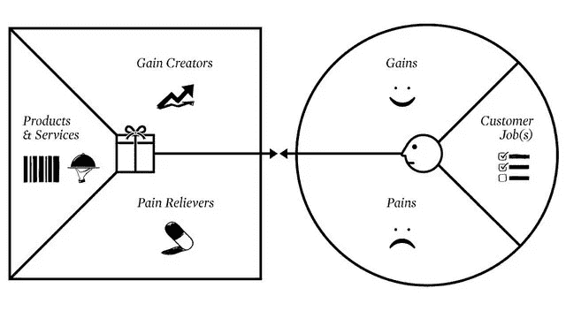

# 如何利用您的数据科学项目创造价值

> 原文：<https://towardsdatascience.com/how-to-create-value-with-your-data-science-projects-62460db3bb4f?source=collection_archive---------1----------------------->

在我的数据科学之旅中，我遇到了许多关于数据科学的有趣文章和教程，它们旨在提供解决特定业务问题或技术挑战的视角或方法，我从中获得了巨大的价值。我想我应该对现有的文献有所贡献，写一些关于数据科学的过程以及我认为每个人都应该知道的关于最大化其用途的东西。

数据科学可用于了解客户、选择合适的客户、提高产品质量、提高团队效率、在团队成员之间建立协作文化，最重要的是，*让员工能够做出更好的决策*。要做到这一点，我们需要确保我们回答了正确的问题，但我们也有正确的信息。这些是解决问题时的常见挑战，我们作为数据科学家的职责是克服这些挑战，以便我们的客户能够做出正确的决策。

思考您的数据科学项目的最佳方式之一，是将其视为您为客户或客户制作的产品。为了说明我的想法，我将使用价值主张画布和客户资料，您可以在这里或这里了解更多关于[的信息。我发现这是培养个人和团队同理心的有效方法，这样他们就能正确理解客户需求并开发出正确的解决方案。](https://www.peterjthomson.com/2013/11/value-proposition-canvas/)

The Business Value Proposition Canvas (left) and Customer Profile (right)

**客户档案**将我们的注意力集中在客户需要完成的目标(工作)上。它还让我们专注于与做这些工作相关的挑战(痛苦)和出色完成工作的回报(收获)。我个人喜欢理解“*收益*”，因为它有助于我们的主张与用户的动机保持一致。

**价值主张画布**是一张地图，记录了您的产品或服务如何满足我们客户的需求(产品&服务)以及他们选择采用它的原因(收益创造者、止痛者)。缓解疼痛者处理与完成客户感兴趣的工作相关的挑战，并获得创造者，使完成工作所获得的利益价值最大化。

挑战在于确保你所创造的东西能够完美地解决给定的问题。帮助用户完成他们的“工作”应该是你项目的目标。我将在随后的文章中举例说明这实际上是如何工作的。

## 结论

我当然希望这篇文章是有用的，并希望您在从事数据科学项目时可以考虑另一个有用的视角。一如既往，我感谢您的反馈，并欢迎对文章的建议和改进我迄今为止与您分享的内容的方法。

如果您想进一步了解前面提到的价值主张画布以及如何使用它，请观看下面的视频:

我当然希望这篇文章是有用的，我急切地等待你的反馈。期待我的下一篇文章。