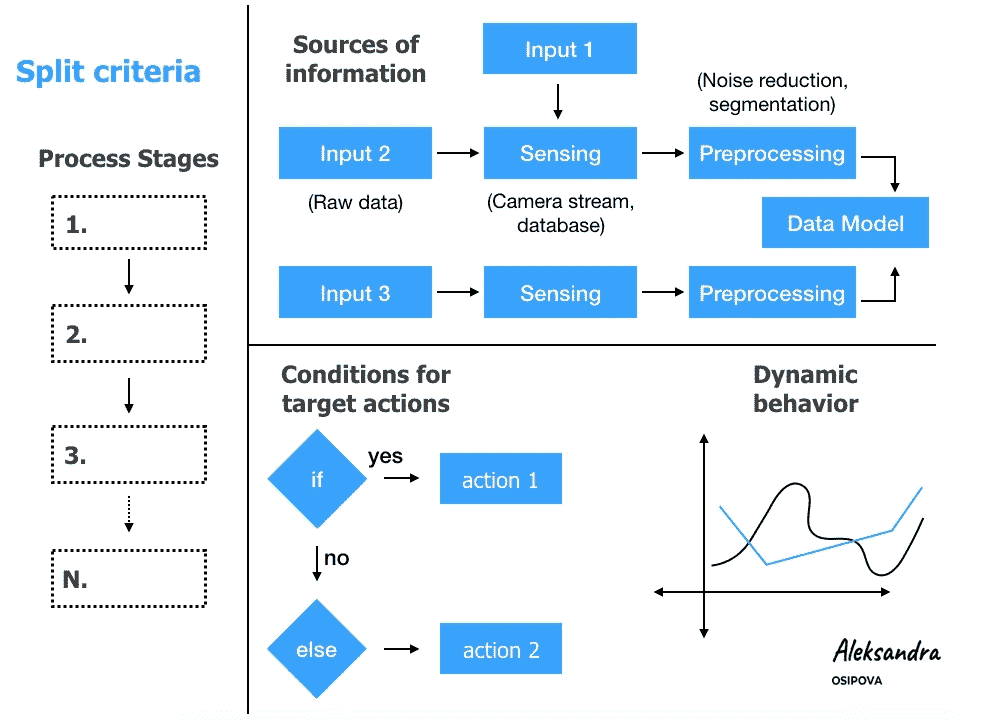

# 如何设计人工智能系统？

> 原文：<https://towardsdatascience.com/how-to-design-an-artificial-intelligent-system-part-1-concept-development-cdbc8aee30d8?source=collection_archive---------8----------------------->

## 概念开发、解决方案发现和资源评估，为您的第一个人工智能系统产品做好准备。

要开始设计一个智力模型，你需要制定目标。例如，学习洞察力，开发实验和知识，执行预测或训练系统来解决问题。

为了让这篇文章的阅读起作用，把你的项目记在心里，并把想法写下来。我向你保证，做完这个练习后，你对构建智能系统和所需资源规划的理解将会更加清晰。

# **在地上**

我们都来自不同背景的人工智能，这种想法可能看起来模糊。让我们定义一些概念:

*   **AI** 是一套数学方法，让程序机器有意识地运转。这意味着机器有动机和能力设定任务并解决它。
*   一个**智能系统**是狭义人工智能的同义词。它研究代理和机器，这些代理和机器使用基于相关领域知识的统计和机器学习算法来执行明确定义的任务的自动化。
*   **机器学习**是一类算法，它通过吸收数据统计信息来学习执行一项任务并增强性能结果，而无需改进算法本身。

# **形成一个概念**

**技能:叙事讲故事，同情心**

你打算解决什么问题？最好的答案是从为什么开始，而不是从如何或什么开始。为什么会有这个问题呢？你为什么想找到解决办法？“如何”这个问题回答了你将应用什么技术；什么描述了你想要产生的结果。为什么你坚持这个问题。你必须感受到问题的痛苦。当你理解其背后的动机时，你会看到多个解决方案，并能够选择一个满足项目约束的方案。

谁将从该解决方案中受益？没有目标受众的问题是不存在的。避免一概而论——将观众分成清晰的部分。这些人是谁？他们有什么共同点:有什么鲜明的特点吗？

# **进行研究**

**技能:批判性思维、数据分析**

研究首先要了解以前的解决方案是如何解决这个问题的。参考资料使研究可靠，也让你与该领域的专家联系起来。在竞争分析之上的人工智能相关项目中，人们研究学术解决方案。一个全面的出版物将包括实验设计，数据选择的标准，模型描述，模型的优点和缺点，以及改进的想法。不需要重现一个实验，你所关心的只是算法如何解决问题，性能基准，以及引用源如数据集和开源代码。

我使用[谷歌学术](https://scholar.google.com/)来研究最相关和被引用的解决类似问题的文章和模型。它可能包括算法伪代码，但最有可能链接到开源库，如 [GitHub](https://github.com/search?q=machine+learning) 。此外，大量记录良好的现成 ML 框架和工具集给出了最新方法的评论(例如， [Azure 机器学习](https://docs.microsoft.com/en-us/azure/machine-learning/studio/algorithm-cheat-sheet)、 [Amazon Sage Maker](https://docs.aws.amazon.com/sagemaker/latest/dg/algos.html) 、 [PyTorch 1.0](https://pytorch.org/features) 、 [TensorFlow](https://www.tensorflow.org/tutorials/keras/) )。不要忘记提到你选择使用或修改的模型或代码的版权——透明和交流是人工智能社区的主要驱动力。

最初的研究有助于创建你的假设，因此你准备好收集历史数据和在线观察。起初，你可能想积累更多的信息。然后，在数据探索之后，只有必要的体积将保留在研究中。但是，提问时不要提出答案，因为你不想用确认偏见影响结果，并保持批判性，包括可能与你的假设相矛盾的特征。

研究状态的关键是了解解决问题的成本。在业务建模中，这个过程被称为[客户开发](https://www.youtube.com/watch?v=QoAOzMTLP5s&feature=youtu.be)。您将需要这个答案来在同事、客户、赠款发放者中推广解决方案，以将项目推进到下一步。

# **拆分问题**

**技能:创意分析**

对于流程阶段，一个事件从另一个事件开始。对于其余的，发现变量之间的关系:如果改变一个变量导致另一个变量的变化，那么后者是可靠的；如果没有—独立。反之亦然，以确定相互依赖。

在复杂的系统中，有更多的标准来划分阶段。例如，过程阶段的演化条件、不同的数据和知识来源、目标行动的约束以及相关的环境动态。形成独立的步骤和组件后，确保您有所有需要完成的部分。

作为一个例子，为了建立一个智能系统，该系统能够应用 [R-CNN](https://www.youtube.com/watch?v=4eIBisqx9_g&vl=en) 对象检测模型来识别视频流中的事件，组件是:流输入源、相关条件、传递知识、预处理图像、为对象建议区域、计算 CNN 特征、对区域分类、标记对象。作为输出，智能模型可以捕捉视频流中的事件。

Example of criteria to split the stages and conditions for a complex system

地图和草图，例如绘制统一建模语言图和以产品为中心的流程图，对于看到完整的图片和进一步交流信息是有价值的。在你觉得舒服的任何程序中做插图。我使用 [Keynote](https://www.apple.com/keynote/) 构建简单的图表，使用 [Cacoo](https://app.cacoo.com) 应用思维导图、ER 和 Azure/AWS 模板。

# **提出假设**

**技巧:提问**

下一步是准备假设。如果一个假设有可能产生至少一个你可以用实验证明的精确预测，那么这个假设就是正确的。假设的结构因你所做的项目类型而异。为了研究——如果我们这样做，我们会发现。对于企业来说，如果我们这样做，我们将会赢得。

尽管如此，总体结构仍然是相似的:在选定的数据集上进行的实验显示了自变量是否如预期的那样变化，而因变量以特定的模式做出响应。为了使调查可靠，提及与代表偏见的主要结果或见解相矛盾的已知来源。

# **创建计划**

**技能:战略思维**

当谈到在计划中执行解决方案的愿景时，我发现一些有用的草图，比如包含正面和负面场景的决策树。一个被拒绝的假设不会将整个项目置于定义明确的战略的不确定性风险中。相反，它支持一个有意识的决定，考虑剩下的时间和资源。大计划保持敏捷和灵活，因此行动响应即将到来的信息和见解。

# **估计资源**

**技能:正念**

一切都可以用原来的公制或者至少从 0 到 5 来衡量。用数字定义成功和失败的计划意味着敏感性——理解表演阶段和状态的能力。此外，这种估计有助于推导出让你和利益相关者了解情况的影响概率。

在评估技术准备程度时，考虑您团队的独特优势和知识。如果你能反思以前的经验，也从中估计；如果没有，不要担心——寻求专家的建议或在这个过程中指导你。

资源测量通过减少一次做很多事情的欲望，保护你远离模糊的概念，并向太多的方向发展。资产和资源来源于团队的知识和技能、时间、金钱、情感和身体健康。因此，保持计划简单，不要对未来几年提出太精确的建议:专注——一次一步。

# **当日成绩**

首先，祝贺你，你做得很好:你澄清了概念，并制定了可测试和可测量的假设。现在，您已经准备好交流已知和未知的信息，以填补缺失的信息并获取项目资源。我很高兴听到你的故事和问题——在[推特](https://twitter.com/hainyx)上丰富我，让我们保持联系。

**关于作者:**
我是一名从事复杂系统建模和数据科学的应用数学家。我在计算神经科学领域进行数据翻译研究，并与各种客户一起解释业务数据源，以获得洞察力并创造产品。