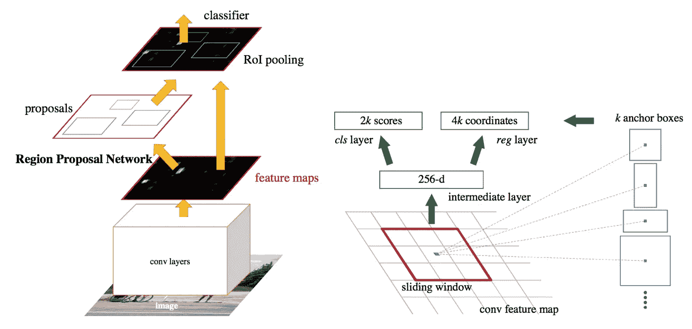
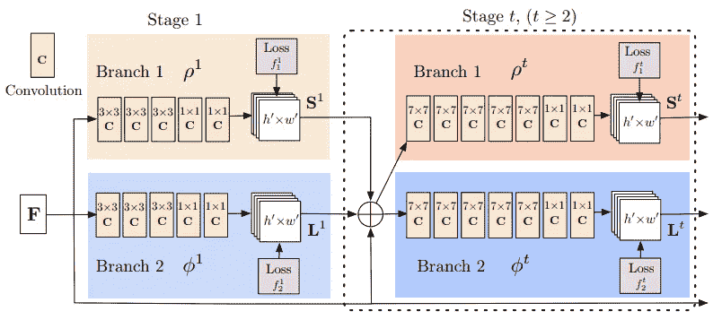
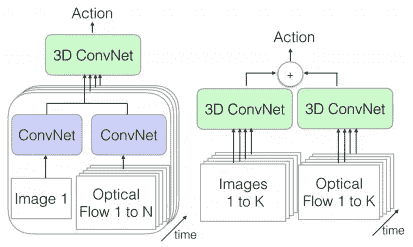

# 如何在计算机视觉中做所有的事情

> 原文：<https://towardsdatascience.com/how-to-do-everything-in-computer-vision-2b442c469928?source=collection_archive---------10----------------------->

## 将深度学习魔法用于计算机视觉

Mask-RCNN doing object detection and instance segmentation

> 想获得灵感？快来加入我的 [**超级行情快讯**](https://www.superquotes.co/?utm_source=mediumtech&utm_medium=web&utm_campaign=sharing) 。😎

想做计算机视觉？深度学习是当今的趋势。大规模数据集加上深度卷积神经网络(CNN)的代表能力有助于建立超精确和稳健的模型。只剩下一个挑战:如何设计你的模型。

像计算机视觉这样广泛而复杂的领域，解决方案并不总是清晰的。计算机视觉中的许多标准任务都需要特别考虑:分类、检测、分割、姿态估计、增强和恢复以及动作识别。尽管用于它们中每一个的最先进的网络展示了共同的模式，但是它们仍然需要它们自己独特的设计。

那么，我们如何为所有这些不同的任务建立模型呢？

我来给你演示一下如何用深度学习做计算机视觉中的一切！

# 分类

其中最著名的！图像分类网络以固定大小的*输入开始。*输入图像可以有任意数量的通道，但对于 RGB 图像通常是 3 个。设计网络时，从技术上讲，分辨率可以是任何大小，只要它足够大，能够支持整个网络中的缩减采样量。例如，如果在网络内进行 4 次缩减采样，则输入的大小至少需要为 4 = 16 x 16 像素。

随着网络的深入，空间分辨率将会降低，因为我们试图压缩所有的信息，并得到一维向量表示。为了确保网络始终有能力传送它提取的所有信息，我们增加了与深度成比例的特征地图的数量，以适应空间分辨率的降低。也就是说，我们在下采样过程中丢失了空间信息，为了适应这种丢失，我们扩展了我们的特征图以增加我们的语义信息。

在您选择了一定数量的缩减像素采样后，要素地图将被矢量化并输入到一系列完全连接的图层中。最后一个图层的输出与数据集中的类一样多。

# 目标检测

物体探测器有两种类型:一级和二级。两者都是从“锚箱”开始的；这些是默认的边界框。我们的探测器将预测这些盒子和地面真相之间的差异，而不是直接预测盒子。

在两级检测器中，我们自然有两个网络:盒建议网络和分类网络。盒子提议网络在它认为物体存在的可能性很高的地方提议边界盒子的坐标；同样，这些是相对于锚盒的相对位置。然后，分类网络采用这些边界框中的每一个，并对位于其中的潜在对象进行分类。

在一级检测器中，建议和分类器网络融合成一个单级。网络直接预测边界框坐标和位于该框内的类。因为两级融合在一起，所以单级检测器往往比两级检测器更快。但是由于两个任务的分离，两级检测器具有更高的精度。

The Faster-RCNN two-stage object detection architecture

The SSD one-stage object detection architecture

# 分割

分割是计算机视觉中更独特的任务之一，因为网络需要学习低级和高级信息。低级信息用于按像素精确分割图像中的每个区域和对象，高级信息用于直接对这些像素进行分类。这导致网络被设计成将来自早期层和高分辨率(低级空间信息)的信息与更深层和低分辨率(高级语义信息)的信息相结合。

正如我们在下面看到的，我们首先通过一个标准的分类网络运行我们的图像。然后，我们从网络的每个阶段提取特征，从而使用从低到高范围的信息。在依次将它们组合在一起之前，每个信息级别都被独立处理。随着信息的组合，我们对特征图进行上采样，最终得到完整的图像分辨率。

要了解更多关于深度学习如何分割的细节，请查看[这篇文章](/semantic-segmentation-with-deep-learning-a-guide-and-code-e52fc8958823)。

The GCN Segmentation architecture

# 姿态估计

姿态估计模型需要完成两项任务:(1)检测图像中每个身体部位的关键点(2)找出如何正确连接这些关键点。这分三个阶段完成:

(1)使用标准分类网络从图像中提取特征

(2)给定这些特征，训练一个子网络来预测一组 2D 热图。每个热图与特定的关键点相关联，并且包含每个图像像素关于关键点是否可能存在的置信度值

(3)再次给定来自分类网络的特征，我们训练子网络来预测一组 2D 矢量场，其中每个矢量场编码关键点之间的关联程度。然后，具有高关联性的关键点被称为是连通的。

用子网以这种方式训练模型将共同优化关键点的检测和它们的连接。

The OpenPose Pose Estimation architecture

# 增强和恢复

增强和恢复网络是他们自己独特的野兽。我们不会对这些图像进行*任何*下采样，因为我们真正关心的是高像素/空间精度。下采样将真正杀死这些信息，因为它将减少多少像素，我们有空间的准确性。相反，所有处理都是在全图像分辨率下完成的。

我们首先以全分辨率将我们想要增强/恢复的图像不加任何修改地传送到我们的网络。该网络简单地由许多卷积和激活函数的堆栈组成。这些块通常是受启发的，偶尔也是最初为图像分类开发的那些块的直接拷贝，例如[剩余块](https://arxiv.org/pdf/1512.03385.pdf)、[密集块](https://arxiv.org/pdf/1608.06993.pdf)、[挤压激发块](https://arxiv.org/pdf/1709.01507.pdf)等。最后一层没有激活函数，甚至没有 sigmoid 或 softmax，因为我们想直接预测图像像素，不需要任何概率或分数。

这就是这些类型的网络的全部内容！在图像的全分辨率下进行大量处理，以实现高空间精度，使用已被证明适用于其他任务的相同卷积。

The EDSR Super-Resolution architecture

# 动作识别

动作识别是少数几个特别要求*视频数据*正常工作的应用之一。为了对一个动作进行分类，我们需要了解场景随时间发生的变化；这自然导致我们需要视频。我们的网络必须被训练以学习*空间*和*时间*信息，即*空间*和*时间*的变化。最完美的网络是 3D-CNN。

顾名思义，3D-CNN 是一个使用 3D 卷积的卷积网络！它们与常规 CNN 的不同之处在于，卷积是在三维空间中应用的:宽度、高度和时间 T21。因此，每个输出像素都是通过基于其周围的像素以及相同位置的前一帧和后一帧中的像素的计算来预测的！

Passing images in a large batch directly

视频帧可以通过几种方式传递:

(1)直接进行大批量，如第一图。因为我们传递的是一系列帧，所以空间和时间信息都是可用的

Single frame + optical flow (left). Video + optical flow (right)

(2)我们也可以在一个流中传递单个图像帧(数据的空间信息)和来自视频的其对应的光流表示(数据的时间信息)。我们将使用常规的 2D 有线电视新闻网从两者中提取特征，然后将它们组合起来传递给我们的 3D 有线电视新闻网，后者将两种类型的信息组合在一起

(3)将我们的帧序列传递给一个 3D CNN，并将视频的光流表示传递给另一个 3D CNN。两个数据流都具有可用的空间和时间信息。这可能是最慢的选择，但也可能是最准确的，因为我们正在对包含所有信息的两种不同的视频表示进行特定的处理。

所有这些网络输出视频的动作分类。