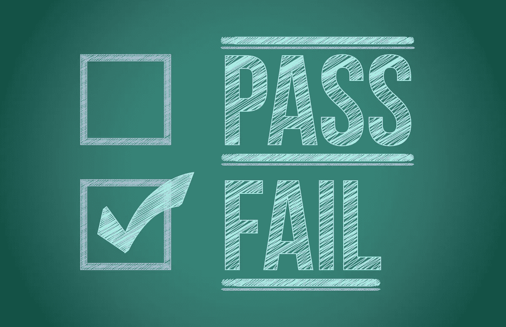

# 机器学习失败的 5 种方式

> 原文：<https://towardsdatascience.com/how-to-fail-at-machine-learning-36cf26474398?source=collection_archive---------2----------------------->

[https://lawschooli.com/wp-content/uploads/2014/03/shutterstock_123177382.jpg](https://lawschooli.com/wp-content/uploads/2014/03/shutterstock_123177382.jpg)

机器学习是艰难的。当我第一次知道它的时候，我真的认为它可以做任何事情。你只要朝它扔点东西，它就会发出“滴滴答答”“哔哔”的声音，然后出来……什么东西？我甚至不确定*机器学习*的最终结果是什么。

从那以后，我学会了在我的产品中实现机器学习时正确地设定我的期望，以便它为我的客户提供[价值](http://www.forbes.com/sites/louiscolumbus/2017/03/18/machine-learning-is-the-new-proving-ground-for-competitive-advantage/)。这是我学到的一些事情的一个过于简单化的例子:

1.  **机器学习是为了预测**。这就是它的作用。它可以预测你正在展示的图片是一只猫还是一座火山，或者根据你的教育程度和年龄预测你目前赚了多少钱。你基本上是用一种模式来武装它，然后当你向它展示新的信息时，它试图根据与模式的匹配程度来对信息进行分类。
2.  **不能含糊**。至少，现在还没有。你需要解决一个具体的问题。你需要认真思考你要解决的问题，从小事做起。你不能把你所有的数据都扔进去，然后期望得到有用的回报。最幸运的是，我开始训练一个模型来预测两件事情中的一件。这个客户评价是好是坏？这幅画是一只猫还是一只狗？你可以在此基础上成长，但要确保你真的在思考你试图解决的问题。
3.  **你需要大量的训练数据**。在面部识别方面已经有了一些令人着迷的进步，例如，你需要用来训练的面部数量非常少。但对于大多数其他类型的机器学习模型，你需要高质量的训练数据，而且是大量的数据。不要指望只用 100 个例子就能训练出一个预测房价或交通模式的模型。你的训练数据也需要高质量。也就是说，让它尽可能与你期望的真实输入相匹配。不要用加州的房价来训练你的模型，然后期望它能很好地适应纽约的房价。
4.  **不要指望准确率超过 80%** 。当然，尽可能接近 100%的准确性是很好的，但事实证明，80%是非常好的。事实是，大多数人的平均准确率约为 80%。如果你将顾客评论外包给 1000 个人，并要求他们将评论分为正面或负面，经过全面分析后，你会发现所有回答的准确率约为 80%。但是你猜怎么着？你的机器学习驱动的产品为他们做到了这一点，所以你刚刚为你的客户节省了一大笔钱，获得了与雇佣 1000 个人相同的结果。这就是价值。
5.  **机器学习不能解决一切。**你可能认为房价或股市有规律可循，但实际上可能没有。即使你用纽约证券交易所的每笔交易训练了一个机器学习模型，然后试图用它来预测市场，你也会失败。有些事情是无法预测的。你必须记住，没有机器学习模型是在真空中运行的。它只和你提供给它的数据一样好，如果数据没有足够的信息或者太不一致，模型就不能解决你的问题。