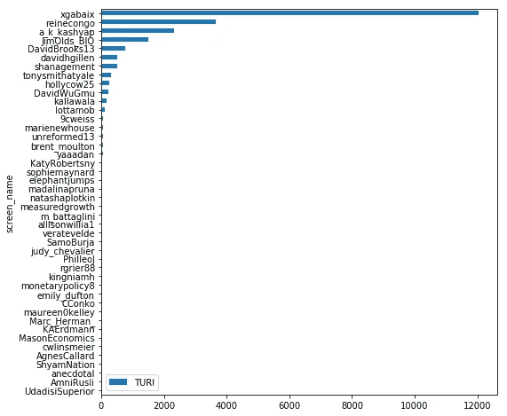
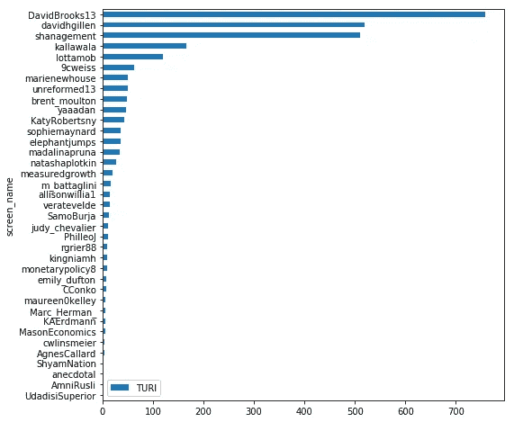
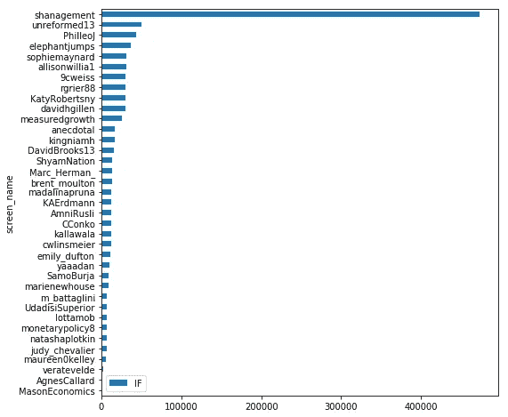

# 如何用 TURI (Twitter 低估指数)在 Twitter 上找到被低估的人

> 原文：<https://towardsdatascience.com/how-to-find-underrated-people-on-twitter-with-turi-twitter-underrated-index-c3ab8867bea9?source=collection_archive---------6----------------------->

你可以培养的最好技能之一是在别人之前找到有才华的人的能力。

泰勒·考恩([边际革命](https://marginalrevolution.com/)的经济学家和博客作者)的这个好建议让我思考:有什么策略可以找到有才华但被低估的人？

一个可能的来源是 Twitter。很长一段时间，我没有“得到”Twitter，但在遵循了[迈克尔尼尔森的建议](https://twitter.com/michael_nielsen/status/975884635535101952)后，我正式成为了一名皈依者。关键是仔细选择你关注的人的名单。如果你做得好，你的 Twitter feed 就会变成源源不断的有价值的信息和有趣的人。

如果你仔细观察，你会发现 Twitter 上有很多被严重低估的人，即*非常聪明的人，他们提供有价值和有趣的内容，但他们的追随者比你想象的要少*。

这些人是最值得关注的:你可以获得很多其他人得不到的见解(因为没有多少人关注他们)，他们更有可能回应询问或参与讨论(因为他们需要管理的关注者较少)。

寻找这些人的一个选择是试错法，但我想看看是否有可能量化人们在 Twitter 上被低估的程度，并自动化寻找优秀人物的过程。

我称之为 TURI (Twitter 低估指数)，因为嘿，它需要一个名字，缩写词让事情听起来如此官方。

# TURI 的组件

该指数有三个主要组成部分:增长、追随者的影响力和追随者的数量。

**增长(G):用户发布的每单位内容(即每条推文)的关注者数量。**

一个推特粉丝迅速增长的用户暗示他们被低估了。这意味着他们正在推出高质量的内容，人们开始迅速注意到这一点。我衡量的方法是一个人在每条推特上获得的关注者数量。

另一个可能的增长衡量标准是用户在单位时间内获得的关注者数量(即关注者数量除以 Twitter 账户存在的时间长度)。然而，这个选项有几个问题:

*   Twitter 账户可能会休眠数年。举例来说，有人可能开了一个账户，但 5 年没有发微博，然后发布了很棒的内容。用时间来衡量增长会不公平地惩罚这些人。
*   一个人可能有不断发微博的策略。部分内容产生了追随者，但整体质量仍然较低。我们在寻找发布*伟大*内容的人，不一定是发布*大量*内容的人。

**关注者影响力(IF):用户的关注者的平均关注人数。**

在我看来，一个人的粉丝影响力是决定他们在 Twitter 上是否被低估的最重要因素。以下是几个原因:

*   一般来说，有影响力的人能更好地判断好内容。
*   有影响力的人在决定追随谁时更有选择性，尤其是如果 Twitter 是他们在线“品牌”的重要组成部分。
*   有影响力的人往往在他们的线下个人生活中与其他高质量的人接触或有某种联系，这些人更有可能出现在他们的 Twitter feed 中，即使他们还没有被广泛了解或欣赏。

我有点偏向于这种方法，因为从我个人的经验来看，当我浏览那些在我的 feed 上被有影响力的人关注的人时，这种方法非常有效。如果我看到有人被[泰勒·考恩](https://twitter.com/tylercowen)、[亚历克斯·塔巴罗克](https://twitter.com/ATabarrok)、[鲁斯·罗伯兹](https://twitter.com/EconTalker)、[帕特里克·科利森](https://twitter.com/patrickc)和[马克·安德森](https://twitter.com/pmarca)追随，但他们只有 5000 名粉丝，那么我很有信心这个人目前被低估了。

经过一番考虑，我认为利用 Twitter API 中的可用数据来衡量用户追随者影响力的最佳方式是获取用户追随者的追随者的平均数量。

我仔细考虑了使用中间值而不是平均值的可能性，但决定不这么做:如果一个有 100 万粉丝的人关注一个有 50 个粉丝的人，我想更多地了解那个人，即使他们的 TURI 很高只是因为那个有很大影响力的粉丝。离群值是好的——我们在寻找未经雕琢的钻石。

**关注者总数(NF):用户当前拥有的关注者总数。**

在这种情况下，我们对“被低估”的定义是，当一个用户没有你预期的那么多追随者时，那么追随者的总数显然将在 TURI 中发挥重要作用。

因此，总结 TURI 背后的主要思想:如果一个人拥有大量“有影响力的”追随者，相对于他们发布的内容量，他们的追随者数量增长很快，但他们仍然拥有少量的追随者，那么他们很可能被低估。

# 定义索引

对于任何用户 I，我们可以计算他们的 Twitter 低估指数(TURI)为:

其中 G 是增长，IF 是追随者的影响力，NF 是追随者的数量。

这个公式具有我们正在寻找的一般关系:每单位内容用户的高增长，高影响力的追随者，以及低数量的总追随者都推动 TURI 向上。

我们可以通过重写 G = NF / T 来简化等式，其中 T 是用户的推文总数。取消一些条款，这给了我们最终版本的指数:

换句话说，我们关于一个人在 twitter 上被低估程度的指数是由用户 I 的每条 tweet 的平均粉丝数给出的。

在为一组用户计算 TURI 之前，您可能需要采取一些预处理步骤来改善结果:

1.  ***过滤掉已核实的账户*** 。TURI 的缺点之一是，如果一个用户已经是名人，他的成长/轨迹会非常高。这些人通常在每条推特上有大量的追随者，不是因为他们发布的内容，而是因为他们已经在其他地方获得了名气。幸运的是，Twitter 有一个名为“验证账户”的功能，如果被确定为公共利益的账户，则应用“[”。通常，这包括用户在音乐、表演、时尚、政府、政治、宗教、新闻、媒体、体育、商业和其他关键兴趣领域维护的账户。这是一个要过滤掉的素数群，因为我们找的不是知名人士。](https://help.twitter.com/en/managing-your-account/about-twitter-verified-accounts)

*   **虽然可能会有这样的情况，一个拥有 50 万追随者的人被低估了，但这似乎不太可能是你要找的那种人，所以不值得 API 资源。**
*   **通过一些较高的追随者阈值进行过滤降低了包括没有经过验证的账户的名人的风险。**
*   **您可以限制调用 API 的次数。就 API 调用而言，成本最高的操作是计算出关注者的影响力。一个人的追随者越多，计算 TURI 所需的 API 调用就越多。**

# **试用 TURI**

**为了测试这个指数，我计算了 49 个人的一个子集的价值，这些人是泰勒·考恩(Tyler Cowen)关注的，他们有 1000 个或更少的关注者(泰勒在我最喜欢的博客的[上写博客，激发了这个项目，并对关注的人有很好的品味)。](https://marginalrevolution.com/)**

**下图显示了这些用户的 TURI(不包括由于隐私设置而无法访问的 4 个帐户)。**

****

**正如你所看到的，有一个用户( [@xgabaix](https://twitter.com/xgabaix) )是一个显著的异常值。仔细看看这个简介，这是哈佛大学的著名经济学家 Xavier Gabaix。他的 TURI 很高，因为他有几个非常有影响力的追随者，而且他还没有发微博。**

**那么 TURI 在这里失败了吗？我不这么认为，因为如果他真的在发微博，这很可能是一个值得关注的人。然而，将一个实际上没有任何 Twitter 内容的人放在列表的顶部似乎有点奇怪。**

**所以，我再次筛选了发布了至少 20 条推文的用户:**

****

**下面的图表只关注不同用户的 IF(他们的追随者的影响力)。有趣的是，另一个用户 [@shanagement](https://twitter.com/shanagement) 拥有迄今为止最有影响力的关注者。然而，他们在总体旅游指数中排名第三，因为他们发推特的次数明显多于@davidbrooks13 或@davidhgillen。**

****

# **限制**

**当然，TURI 也有一些缺点:**

*   *****很难判断 TURI 的表现有多好*** :这些指标是基于直觉，显然没有关于 twitter 用户实际上被低估程度的“基本事实”数据。所以，我们并没有一个真正的基于数据的方法来观察指数的效果，并系统地改进它。例如，你可能会问增长 G 是否应该包含在指数中。我认为这有一个很好的论据:如果人们在每单位内容上很快获得追随者，那么该内容一定有吸引其他人的地方。但是，另一方面，也许他们并没有被真正低估。也许真正被低估的人有很好的内容，但是你的普通 Twitter 用户即使读了一些帖子也低估了他们。当人们看到高质量时，并不总是知道它。**
*   *****计算 TURI*** 需要相当长的时间:这是由于 API 请求的 Twitter 速率限制。例如，计算上面 49 个 Twitter 用户的 TURI 大约需要一个小时。对于拥有大量追随者的人来说，这需要更长的时间(记住，我只关注拥有 1000 或更少追随者的人)。所以，如果你想做一个大批量的人，这可能是一个好主意，在一个服务器上运行这个持续的基础上，并存储用户和 TURI 信息到一个数据库中。**

# **其他想法？**

**有很多不同的方法可以指定这样的索引。如果你有任何建议，请在[推特](https://twitter.com/MarkNagelberg)或[电子邮件](mailto:mark@marknagelberg.com)上留言或联系我。**

**另一个可能的调整是计算用户关注的人数。我注意到一些 Twitter 用户似乎有一个策略，那就是关注大量的人，希望被跟踪回来。在这些情况下，他们的跟随战略可能是他们高增长的原因，而不是他们内容的质量。一种解决方案是通过乘以(用户关注者的数量)/(用户关注的人数)来调整 TURI。举例来说，这将惩罚那些拥有 15，000 名追随者但自己却追随 15，000 人的人。**

# **技术细节**

**你可以在这里找到我用来与 API 交互并计算 TURI [的代码。代码使用了](https://github.com/marknagelberg/twitter-underrated) [python-twitter 包](https://github.com/bear/python-twitter)，它提供了一种与 Twitter API 交互的好方法，抽象出令人讨厌的细节，因此您不必处理它们(例如，使用 OAuth 进行认证，处理速率限制)。**

***原载于 2018 年 7 月 8 日 www.marknagelberg.com***。要访问我共享的 Anki deck 和 Roam Research notes 知识库，以及关于间隔重复和提高学习效率的技巧和想法的定期更新，* [*加入“下载马克的大脑”。*](http://downloadmarksbrain.marknagelberg.com/auth)***