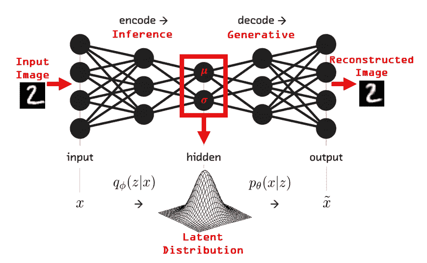

# 如何使用自动编码器生成图像

> 原文：<https://towardsdatascience.com/how-to-generate-images-using-autoencoders-acfbc6c3555e?source=collection_archive---------10----------------------->

你知道什么会很酷吗？如果我们不需要所有这些标记数据来训练我们的模型。我的意思是标记和分类数据需要太多的工作。遗憾的是，现有的从支持向量机到卷积神经网络的模型，大部分都离不开它们的训练。

除了一小组他们能做到的算法。好奇吗？这叫做无监督学习。无监督学习通过自身从未标记的数据中推断出一个函数。最著名的无监督算法是 K-Means 和 PCA，K-Means 已被广泛用于将数据聚类成组，PCA 是降维的首选解决方案。K-Means 和 PCA 可能是有史以来最好的两种机器学习算法。让它们更好的是它们的简单。我的意思是，如果你抓住了它们，你会说:“为什么我没有早点想到呢？”

我们想到的下一个问题是:“有没有无监督的神经网络？”。你大概从帖子的标题就知道答案了。自动编码器。

为了更好地理解自动编码器，我将在解释的同时提供一些代码。请注意，我们将使用 Pytorch 来构建和训练我们的模型。

自动编码器是简单的神经网络，其输出就是输入。就这么简单。他们的目标是学习如何重建输入数据。但这有什么帮助呢？诀窍在于它们的结构。网络的第一部分就是我们所说的编码器。它接收输入，并在低维的潜在空间中对其进行编码。第二部分(解码器)获取该向量并对其进行解码，以产生原始输入。

中间的潜在向量是我们想要的，因为它是输入的**压缩的**表示。应用非常广泛，例如:

*   压缩
*   降维

此外，很明显，我们可以应用它们来复制相同但稍有不同甚至更好的数据。例如:

*   数据去噪:给它们一幅有噪声的图像，然后训练它们输出没有噪声的相同图像
*   训练数据扩充
*   异常检测:在单个类上训练它们，使得每个异常都给出大的重构误差。

然而，自动编码器面临着和大多数神经网络一样的问题。他们倾向于过度拟合，并遭受梯度消失问题。有解决办法吗？变分自动编码器是一个非常好的和优雅的努力。它本质上增加了随机性，但不完全是。

让我们进一步解释一下。变分自动编码器被训练来学习模拟输入数据的概率分布，而不是映射输入和输出的函数。然后**从该分布中采样**点，并将它们馈送到解码器，以生成新的输入数据样本。但是等一下。当我听到概率分布时，我想到的只有一件事:贝叶斯。是的，贝叶斯法则再次成为主要原则。顺便说一下，我不想夸大其词，但贝叶斯公式是有史以来最好的方程式。我不是在开玩笑。到处都是。如果你不知道什么是，请查一下。放弃这篇文章，学习贝叶斯是什么。我会原谅你。

回到变分自动编码器。我认为下面的图片说明了问题:

这就是了。随机神经网络。在我们自己构建一个生成新图像的示例之前，有必要再讨论一些细节。

VAE 的一个重要方面是损失函数。最常见的是，它由两部分组成。重建损失衡量重建数据与原始数据的不同程度(例如二进制交叉熵)。KL-divergence 试图调整该过程，并尽可能保持重建数据的多样性。

另一个重要的方面是如何训练模型。困难的出现是因为变量是确定性的，但随机和梯度下降通常不会这样工作。为了解决这个问题，我们使用了重新参数化。潜在向量(z)将等于我们分布的学习均值(μ)加上学习标准差(σ)乘以ε(ε)，其中ε遵循正态分布。我们重新参数化样本，使随机性与参数无关。

在我们的例子中，我们将尝试使用可变自动编码器生成新图像。我们将使用 MNIST 数据集，重建的图像将是手写的数字。正如我已经告诉你的，我使用 Pytorch 作为一个框架，没有特别的原因，除了熟悉。首先，我们应该定义我们的层。

正如你所看到的，我们将使用一个非常简单的网络，只有密集的(在 pytorch 的例子中是线性的)层。下一步是构建运行编码器和解码器的函数。

只是几行 python 代码。没什么大不了的。最后，我们开始训练我们的模型，并看到我们生成的图像。

快速提醒:Pytorch 有一个与 Tensorflow 相反的动态图，这意味着代码正在运行。不需要创建图形，然后编译并执行它，Tensorflow 最近通过其急切执行模式引入了上述功能。

当训练完成时，我们执行测试函数来检查模型的工作情况。事实上，它做得相当好，构建的图像几乎与原始图像相同，我相信没有人能够在不了解整个故事的情况下区分它们。

下图显示了第一行中的原始照片和第二行中生成的照片。

很好，不是吗？

在我们结束这篇文章之前，我想再介绍一个话题。正如我们所见，变分自动编码器能够生成新的图像。这是生成模型的经典行为。生成模型正在生成新数据。另一方面，判别模型是对现有数据进行分类或判别。

用一些数学术语来解释:生成模型学习联合概率分布 p(x，y ),而判别模型学习条件概率分布 p(y|x)。

在我看来，生成模型要有趣得多，因为它们为许多可能性打开了大门，从数据扩充到可能的未来状态的模拟。但是在下一篇文章中会有更多的介绍。可能是关于一种相对新型的生成模型的帖子，叫做生成对抗网络。

在那之前，继续学习 AI。

> ***如果您有任何想法、评论、问题或者您只想了解我的最新内容，请随时在***[**Linkedin**](https://www.linkedin.com/in/sergios-karagiannakos/)**，**[**Twitter**](https://twitter.com/KarSergios)**，**[**insta gram**](https://www.instagram.com/sergios_krg/)**，**[**Github**](https://github.com/SergiosKar)**或在我的**

*原载于 2018 年 9 月 8 日*[*sergioskar . github . io*](https://sergioskar.github.io/Autoencoder/)*。*