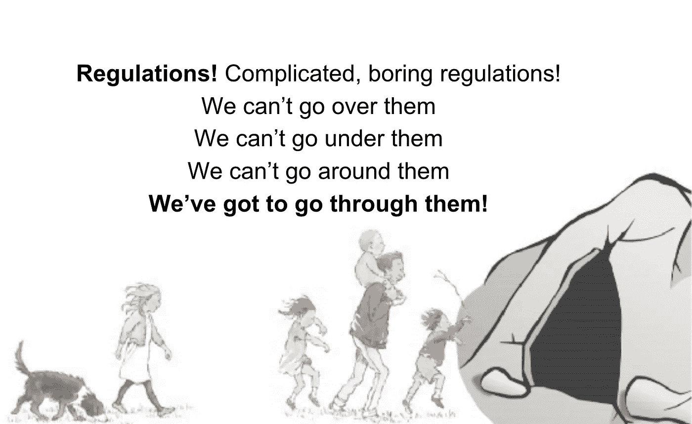
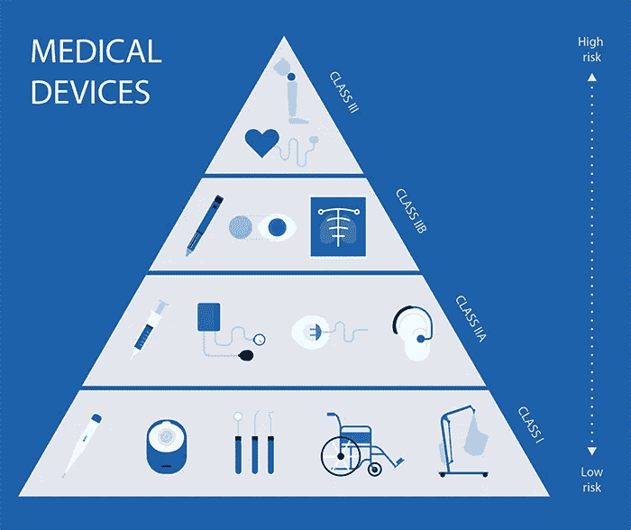
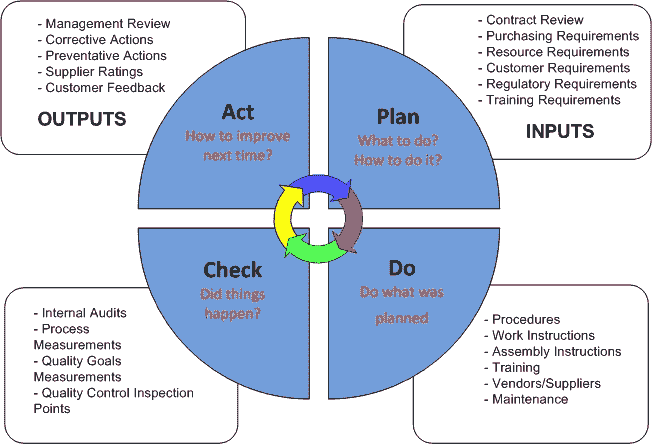

# 如何让临床人工智能技术获得监管机构的批准

> 原文：<https://towardsdatascience.com/how-to-get-clinical-ai-tech-approved-by-regulators-fa16dfa1983b?source=collection_archive---------0----------------------->

*本文于 2019 年 6 月更新，以适应医疗器械法规即将到来的变化*

医学中的人工智能正在迅速发展，除了一个讨厌的障碍，几乎没有什么可以阻止它。无论你是一家三人创业的小公司，还是一家价值数十亿美元的国际企业集团，你都必须通过医疗器械监管的试金石测试。没有回避它，没有躲避它，所以你不妨拥抱它。还记得儿童故事书《我们要去猎熊吗？…

与医疗保健产品相关的法规比人工智能存在的时间要长得多。这一切开始于 20 世纪 60 年代，当时人们开始意识到(可悲的是)沙利度胺会严重损害未出生的婴儿。因此，药品开始要求上市前证据和质量控制监管，以避免这种灾难性事件再次发生。在药品之后不久，医疗器械也被纳入监管范围。

医疗器械法规传统上适用于物理产品(例如手术器械)和运行物理临床机器的软件(心电图机内的软件)。制定这些法规的原因很简单——患者安全。监管机构只想知道一件事——您的产品是否能安全有效地用于预期目的？医学上(或任何地方)没有什么是 100%完美的，所以你必须提供证据，证明你已经尽了最大努力来确保使用该设备的好处大于任何风险，并且任何未减轻的风险都是可以接受的。

试图以极快的速度创新固然很好，但监管者并不在乎这些。他们希望你停下来，测试，验证并证明你不会“造成伤害”。请记住，你现在是在医疗保健行业，而不是某个应用商店或研究实验室，你和任何医生一样对病人负有责任。你不会希望你的技术被认为和沙利度胺一样危险吧？

你不仅要使用可验证的数据真实准确地描述设备的性能和功能，还必须以你的营销团队能够传达的方式进行描述，而不要过度宣传、错误销售或错误品牌。一个巨大的错误是告诉监管者一件事，然后又卖另一件…

听说过 [Theranos](https://www.nbcnews.com/business/consumer/how-9-billion-blood-testing-startup-theranos-blew-n671751) 吗？这家美国实验室公司告诉 FDA，他们的血液测试只能检测极少量样本的结果，但随后被发现有多达三分之一的内部质量控制检查失败，影响了凝血测试结果的患者护理，并可能导致中风和心脏病发作，从而损失了近 90 亿美元的价值。这里要学习的一课——对你的产品能做什么要真实和诚实！

在本文中，我将介绍根据最新版本的医疗器械法规，使您的产品获准进入欧洲市场所需的最新步骤，并获得圣杯式的认证标志——CE 标志。

你可能想知道一个学术放射学家是如何知道这些东西的？2016 年，我在英国数字健康技术初创公司( [Babylon Health](https://www.babylonhealth.com/) )负责监管事务，并成功为一个人工智能支持的医疗移动应用程序获得了世界上第一个 CE 标志(I 级)，现在是 [Kheiron Medical](https://www.kheironmed.com/) 的临床总监，这是第一家获得放射学深度学习软件 CE 标志(IIa 级)的英国公司。

你可以这样做…但是我警告你，这不是为容易被吓住的人准备的…

# 什么是 CE 标志？

CE 是法语短语“Conformité Européene”的首字母缩写。希望这不需要翻译...

CE 标志不仅适用于医疗器械，在欧洲几乎任何产品上都可以找到。只要看一下你附近的一个物体，在小字的某个地方会有一个 CE 标志。该标志表示该产品符合相关指令的基本要求，并且可以合法地在整个欧洲成员国自由投放市场。就医疗器械而言，产品必须符合欧盟委员会制定的[欧盟医疗器械法规](https://eur-lex.europa.eu/legal-content/EN/TXT/PDF/?uri=CELEX:32017R0745&from=EN) 2017/745 (MDR)的要求。这些法规是强制性和规范性的，将于 2020 年 5 月取代现有的医疗器械指令(MDD 或 MEDDEVs)。它们也是治疗失眠的好方法，但这不是它们的预期用途。

# 预期用途

无论你的算法或 AI 产品做什么，你都需要仔细清晰地定义它。这种描述在监管术语中被称为设备的“预期用途”，它是你进入监管行业迷宫之旅的基石。定义一个目的不仅能让监管者清楚地了解你的设备，还能帮助你的团队牢牢记住他们在做什么。

预期用途通常分为几个部分:

名称、型号、设备描述、安全分类、操作原理、预期用途、确切的医疗适应症、医疗条件的阶段和严重程度、预期使用环境、预期患者人群(包括排除)、预期用户、使用风险、预期结果限制和正常使用条件。

明确设备的预期用途是获得监管机构批准的第一步，因此确保正确非常重要。你必须准确描述你的设备能做什么，而不是它能做什么。(如果你不确定它的预期用途是什么——去你的浴室橱柜，拿出一包药片，并阅读里面那张纸的开头。这是您需要生成的最低限度的文档级别)。一旦你定义了你的预期用途，就是这样。没有回头路可走——监管机构将根据你的描述对你的产品进行分类和评判。对你预期用途的任何改变都意味着你必须重新开始整个过程。

# 找出你的设备的类别

在欧洲，医疗器械的分类是由 MDR 定义的(见下面分类的最新变化)。在美国，FDA 规定了设备类别。根据对患者的潜在风险，分类分为三种主要类型:

I 级—低风险，如听诊器、温度计或助残工具。

II 级——中等风险在欧洲也分为 IIa 级和 IIb 级，后者风险更大，如与人体直接接触的隐形眼镜。

III 级—高风险，如手术器械或植入式除颤器。

这些等级(I、IIa、IIb、III)决定了您需要走四条合格评定路线中的哪一条。

不言而喻，你的设备风险越大，它的故障就越具有侵入性或危险性，它的副作用就越多，它的级别就越高。类似地，所需的监管审查水平随着设备类别的增加而增加。

一般来说，根据当前的规则，支持医生决策的人工智能算法被称为临床决策支持软件(CDS)，并被视为第二类。它是 IIa 类还是 b 类取决于您的算法的预期用途。我希望我能给你一个精确的分类，到底哪个算法函数属于哪个类，但不幸的是，这不是非黑即白的。然而，根据经验，其输出能够被人重写的 CDS 装置通常是 IIa，而那些更自主的是 IIb。

如果你不确定，你应该和监管者或监管顾问展开对话。不要浪费时间去申请一个不正确的课程！

# 二级符合性

一旦您确定了您的预期用途和设备类别，您需要指定一个认证机构(NB)。这是一个独立的外部组织，它来到你的工作场所，审查你如何制造和测试你的产品。指定机构的原因是，欧盟委员会没有时间或资源自己完成这项工作(并且不信任您自己完成这项工作，除非您的设备属于 I 类)，因此他们转而依赖第三方，而第三方又受当地政府机构的监管。例如，在英国，负责监管医疗器械法规的政府机构是执行 MDR 的药品和医疗保健产品监管局(MHRA)。他们要求开发人员使用经批准的 NB，以使 CE 标志有效。

对于 IIa 类医疗器械，您可以选择 NB 按照以下四种规定的合规途径之一对您进行审核:

*   每个产品的检查和测试；
*   生产质量保证体系的审核；
*   最终检验和测试的审计；或者
*   全面质量保证体系的审计。

对于 IIb 类，你需要一个 NB 来执行第四个选项，*和*前三个中的任何一个。

在实践中，临床人工智能开发人员不会想走批量测试路线或最终检查和测试(选项 1 和 3)，因为这意味着算法的每一次更新都需要经过反复的临床验证。这将是极其缓慢和昂贵的。相反，人工智能开发人员应该选择质量保证路线，因为这是一个衡量你在确保产品开发过程中严格质量保证的标准。

# 质量管理体系简介

质量管理体系是一系列文件和标准操作程序(sop ),详细说明贵公司的开发程序、风险管理和测试。不出所料，这听起来很无聊，但如果你想卖掉你的算法，这绝对是至关重要的。对你来说幸运的是，有一个固定的标准可以遵循，即所谓的[【ISO13485:2016】](https://www.iso.org/standard/59752.html)。这也是治疗失眠的另一个好方法。幸运的是，即使是监管行业的人也意识到了这一点，甚至有人[把它翻译成简单的英语](http://www.praxiom.com/iso-13485.htm)，让它稍微容易理解一些。

ISO13485 有许多不适用于人工智能系统，如消毒、包装和环境危害，但其中许多仍然对您的 ce 标志之旅直接至关重要，并且基本上是医疗设备 CE 标志所需的唯一标准。另一方面，许多 ISO13485 已经被其他指令覆盖，如质量管理([【ISO9001】](https://www.iso.org/iso-9001-quality-management.html)，你的组织可能已经有了)、风险管理(，同上)和信息安全管理([【ISO27001】](https://www.iso.org/isoiec-27001-information-security.html)，双重同上)。是的，几乎所有事情都有一个标准，所以不要认为你可以偷工减料！如果你的人工智能正在使用实时患者数据并以任何方式存储它，你很可能需要后者。

A typical QMS will contain all of the above… and much more! Get expert advice if you don’t know where to start!

我的建议是尽可能早地开始按照这些标准工作，因为仅仅为了进入市场而改变你的开发过程是不会成功的。审核员希望看到完整的质量管理体系，并有证据证明你在审核开始前至少已经使用了三个月。如果你有困难，你可以把一些工作外包给无数以此为生的第三方公司。

与认证机构合作，您必须通过两阶段审核才能获得 ISO13485 认证。然而，要获得 CE 标志还需要做更多的事情！

# 技术文件

除了通过质量管理测试之外，您还必须通过额外的审核才能获得 CE 标志。这将考虑到你的 13485 认证，但也要求你出示所谓的技术文件。该文件是一份电子或硬拷贝档案，不仅与您的 QMS 相关联，还包含几个关键因素，使您能够证明您符合 MDR 中规定的基本要求。

使用说明；如您的手册/支持材料或软件本身所示

标签；盒子和包装上的标签。这也是一个好主意，有营销文案的例子，所以你知道你的营销将是光明正大的。

设计规范，如可接受的功能和为确保设备按预期工作而采取的措施。

系统架构；这是设计档案的形式。

符合性声明；公司负责人签署的声明，基本上说一切都符合要求。

最后…

# 临床评估报告(CER)

到目前为止，你们当中精明的(并且仍然清醒的)人会注意到还没有提到临床表现数据。你以为你逃脱了，是吗？嗯，抱歉，你还需要通过进行临床研究来证明你的人工智能有效。

CER 是您的设备在开发、上市前测试和上市后性能期间进行的所有临床测试的档案。

你不需要证明你的设备 100%准确地工作——在医学中没有什么是需要证明的。相反，你必须证明你已经按照你的预期用途在正确的临床环境下对你的设备进行了适当的测试，并且可以用证据支持任何准确性的声明。例如，市场上的化疗药物只能治愈 5%的患者。这很好，只要这是在临床试验中证明的，并在任何标签或营销中明确说明。必须明确风险/效益比率，该比率在很大程度上取决于正在接受治疗/诊断的疾病的严重程度以及任何临床研究的结果。

您的 CER 将包括四个关键部分:

1.  文献综述—您需要确定您的设备的最先进水平，任何同等设备的性能和安全指标，并对您的设备的潜在优势和风险有一个关键的了解。
2.  临床研究计划——这是一份正式的研究大纲，通常由独立的研究伦理委员会(REC)批准，该委员会既遵守良好临床实践(GCP)原则，也遵守 ISO 14155 标准。是的，另一个 ISO 标准供你阅读和入睡！
3.  临床调查结果和分析——包括阳性和阴性结果。这通常是以可发表论文的形式，但你不一定需要在杂志上发表结果，只需准备好供专家分析。如果你不确定要运行什么样的统计分析，[我会在这里支持你](/how-data-scientists-can-convince-doctors-that-ai-works-c27121432ccd)——或者你可以从 FDA 查看一些好的[建议。](https://www.fda.gov/downloads/drugs/guidancecomplianceregulatoryinformation/guidances/ucm073137.pdf)
4.  最终报告——总结文献综述的风险和益处，以及关于您的设备的临床性能及其局限性的结论。

如果你的公司缺乏临床研究的专业知识，你可以和一个被认可的学术机构，合同研究组织(CRO)合作，或者在内部雇佣相关的专家。在大多数情况下，认证机构希望看到真实世界的证据(RWE)，因此这意味着您需要对真实的临床数据或患者进行试验，因此在这方面，拥有良好的临床合作伙伴关系至关重要。也不要低估一项适当的临床研究需要多长时间——记住，大多数研究从计划到完成需要一年或更长时间！

# 那么是什么改变了呢？

新法规于 2017 年 5 月生效，过渡期为 3 年，这意味着对于那些希望保持合规并进入市场的人来说，最后期限是 2020 年 5 月。MDD 和 MDR 之间的主要变化如下(非详尽列表):

*   医疗器械的定义已经扩大到包括不受 MDD 监管的非医疗和美容器械。例如吸脂设备。因此，到 2020 年 5 月，你可能会看到吸脂服务的减少…
*   被通知机构的严格监督*和*被通知机构更严格的审查(其影响之一是一些国家统计局最近已经放弃提供这些服务，例如 [LRQA](https://www.raps.org/news-and-articles/news-articles/2019/6/uk-nb-will-not-apply-for-eu-mdrivdr) )。
*   在新的 MDR 中,“安全”一词出现了 290 次，而 MDD 只用了 40 次。你想读什么就读什么…
*   附录 I 基本要求现在是“一般安全和性能要求”(GSPR)，它确定了组织必须针对大多数遗留设备解决并重新认证的新条件(即那些在 MDD 下具有 ce 标志的设备需要更新到新的 MDR)。
*   根据新规定，大多数设备制造商需要更新临床数据、技术文件和标签。
*   可植入器械和 III 类器械需要更严格的临床证据。
*   将实施唯一设备识别(UDI ),这使得随着时间的推移跟踪设备版本变得更加容易。
*   根据更高的风险对设备进行重新分类，这意味着许多聊天机器人将被移至 IIa 类，一些放射人工智能软件将被移至 IIb 类。
*   确定公司内部法规遵从性的“负责人”。我和你一样惊讶地发现这在以前并不是一项要求。
*   更加重视警戒报告、上市后临床随访(PMCF)和经前综合症收集数据。记住，CE 标志是终身的，不仅仅是圣诞节的！

# 唷——就是它

一旦你有了一个有效的质量管理体系，ISO 13485 认证和一份完整的临床评估报告，你就为你的最终 ce 认证审核做好了准备！

然而，它并不止于此…

一旦获得认证，您需要保持您的 ISO 认证，并定期重新审核和重新测试您的设备的性能。拥有一个良好的售后市场监督(PMS)系统将有助于你保持 CER 更新，正确使用 QMS 将确保你在事情的顶部。雇佣一个质量经理是个好主意，因为你需要有人来确保你在竞争中领先——记住——监管者可以随时来看你的文件！

如果您想在欧洲之外的其他地方推出，有一个新的流程称为医疗器械单一审核计划( [MDSAP](https://www.bsigroup.com/en-GB/medical-devices/our-services/Medical-Device-Single-Audit-Program/) )，其中包括一个进一步的审核，让您获得澳大利亚、巴西、日本和加拿大、美国认可的质量管理体系，并很可能在不久的将来成为医疗器械的国际标准。并非所有的认证机构都有资格进行 MDSAP 审计，所以一定要先询问。

最后……进入美国市场涉及到众所周知的严格的美国食品药品监督管理局( [FDA](https://www.fda.gov/) )，它有相似但稍微更严格和详细的程序要通过。但是我已经告诉你够多了，所以我现在就把它留在这里！

监管机构，上马！

如果你和我一样对人工智能在医学成像领域的未来感到兴奋，并想讨论这些想法，请联系我们。我在推特@drhughharvey

*如果你喜欢这篇文章，点击推荐并分享它会很有帮助。*

*关于作者:*

*Harvey 博士是一名委员会认证的放射科医生和临床学者，在英国国民医疗服务体系和欧洲领先的癌症研究机构 ICR 接受过培训，并两次获得年度科学作家奖。他曾在 Babylon Health 工作，领导监管事务团队，在人工智能支持的分诊服务中获得了世界第一的 CE 标记，现在是顾问放射科医生，皇家放射学家学会信息学和人工智能委员会成员，以及人工智能初创公司的临床总监，包括 Kheiron Medical。*