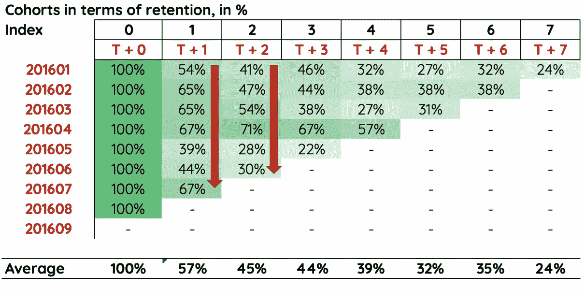

# 如何通过 5 个步骤开始使用指标

> 原文：<https://towardsdatascience.com/how-to-get-started-with-metrics-in-5-steps-7de6d496bc71?source=collection_archive---------5----------------------->

所以，你决定使用 KPI 和指标，用数据来发展你的创业公司。恭喜你！您将获得[奖励](https://medium.com/daphni-chronicles/it-seems-like-weve-found-the-secret-sauce-to-growth-for-early-stage-startups-eeae141a1aa3)！现在，艰难的工作从实际决定什么指标重要和创建数据驱动的文化开始。那么你从哪里开始呢？启动行动是来帮忙的。在本指南中，你会找到几个步骤，让你朝着正确的方向前进:

**1。定义你的战略目标**

因为你想为你的事业做每一件事，所以在有限的几个目标上做出决定可能是困难的。但是这确实是您需要开始的地方，因为您的度量应该是您的战略目标的延伸。与几个关键绩效指标相关联的几个目标将帮助您专注于重要的事情。

一旦你做出决定，将它们分成**财务目标**和**客户价值目标**。

让我们从财务开始考虑，这显然是最简单的。我假设你正在经营一家初创公司，这意味着你正在经营一个从零开始的组织，然后你的财务目标可能是在不消耗太多现金的情况下实现收入最大化。更多的钱进来，更少的钱出去！另一方面，如果你在经营一个更成熟的组织，你的目标可能是达到或增加盈利能力。如果你还没有开始赚钱，你的财务目标可能是未来与你的收入流紧密相连的东西，比如在保持低成本的同时最大化活跃用户的数量。

如果你经营订阅业务，你的目标可能是**月经常性收入** (MRR)。然而，对于一个市场，你可能会关注**商品总值** (GMV)。

现在你可以明白为什么尽早确定你的目标很重要了！

设定客户价值目标更加棘手。简单来说，把它们想象成你公司的愿景或使命。它可能是你如何帮助你的客户，解决问题，或者为他们创造价值。设定一个目标，如果达到这个目标，将保证客户需要你的产品，为你的企业创造长期稳定。例如，如果你提供一个 B2C 预算节省应用程序，你的目标可能是帮助你的用户节省更多的钱。尽量保持低数量的客户价值目标——两个是一个好数字，如果你是一家早期创业公司，不要超过三个。俗话说，不会走路就不要试着跑！

为了决定你的目标，确保你和你的核心团队(创始/执行团队和/或董事会)坐下来好好谈谈。如果你的目标被具体地写了下来，你们很有可能达成一致。这对于实现长期目标至关重要，因为整个团队需要朝着同一个方向努力。不要犹豫改变或更新你的目标，因为你可能会学到关于你的市场的新东西，并在你业务的不同生命周期阶段之间移动。适应性是关键。

The whole team needs to push in the same direction

# **2。使其可测量**

你的下一个挑战是将你的目标转化为可衡量的 KPI。这些将是 2-3 个指标，推动你的企业朝着你的目标前进。通过这样做，你将能够具体地定义你的目标是什么，以及你每天都在努力提高什么样的绩效。让你的目标变得可衡量会让你更容易监控你的创业是否越来越接近你的目标。为了进一步分析你的 KPI，你需要将它们分解成更小的部分，也称为指标，这将使你更清楚地了解哪些杠杆可以提高你的 KPI。

例如，如果你设定了 MRR、GMV 或 MAU，财务目标几乎不需要转化为 KPI。因此，让我们深入探讨如何分解它。你如何做到这一点完全取决于你的商业模式，但你需要做的是把你的收入一点一点分开。例如，如果你是一家 SaaS 公司，向你的客户收取月订阅费，你的第一层指标将是付费客户的数量和月费用。看一看:

***客户数量*** *** ***月费****=****MRR****(月经常性收入)*

你的下一层指标将是新的、保留的和流失的客户。我们是这样计算的:

***新增*** *+* ***留存—流失*** *=* ***客户数量。***

这种细分可以一直进行到你的漏斗的开始，网站访问者转化为试用用户，试用用户转化为新的付费客户。

要查看一个虚构的 SaaS 企业的示例，您可以查看下面链接的指标树。在不同的列中，您可以看到绝对数量、客户总数的百分比以及与前一个月相比的变化。通过做这个练习，团队可以很好地理解你的收入是如何形成的，以及所有的数字是如何与你的月绩效联系起来的。理解这些数据将使原始数据转化为结果变得更加容易。要阅读度量树的详细分解，请查看这篇文章**。**

****

**为了控制成本和优化利润，您还可以增加收入成本比。这意味着你要从普通客户那里获得净收入，换句话说，就是你的**客户终身价值** (LTV)，然后把它除以你的不同成本组。例如，如果你为客户获取付费，你应该计算你的**客户获取成本** (CAC)。然后你计算 LTV/CAC，得到一个比率，帮助你控制最重要的可变成本。该比率应该优选至少为 3 或 4。如果更低，通常意味着你还没有以最具成本效益的方式接近你的客户，或者你的客户没有被产品吸引，因此离开(流失)。**

**要分解客户价值目标，你的挑战将是具体定义它们是什么。它需要一些创造力来得出比率和百分比，这将有助于你确定你是否实现了你的客户价值目标。**

**让我们再来看看预算节省应用程序的例子。他们的目标是帮助用户省钱。这个目标可以转化为一个 KPI，其形式为用户在第三个月与第一个月相比节省的量的比值。如果这个比例很高，证明这个 app 帮用户省了更多的钱。**

**为了分解这个 KPI，你可以看看有多少第一次下载应用程序的用户回来使用它(保留)以及使用频率。这两个指标可以作为您可以优化的指标，以帮助您将 KPI 推向正确的方向。**

**当你在创业时，你的团队会不断地添加新功能，纠正产品中的错误。这意味着，根据用户到达的时间，他们可能会看到不同的产品。此外，这意味着通过根据用户行为指标到达的时间对它们进行分组来研究它们是值得的。这是通过群组完成的，如下图所示。**

****

**您希望从群组表中看到的是，每一组新客户都比前一组客户表现得更好。例如，如果在第一周下载你的应用的客户的三周保留率是 29 %,你希望在第二周加入的客户的三周保留率更高。所以在上图中，你会希望数字沿着箭头的方向增加。**

**当看到你的指标与前一个月的差异时，奇迹真的会发生。然后，您可以将您的指标与您在一个月中采取的不同行动联系起来，看看这些行动对您的成长有何直接影响。反过来，这将启动你的反馈循环，你的结果将有助于你计划下个月的行动。一般来说，这都是为了进入你的客户的头脑，看看你的行动如何影响他们的决策和行为。不要害怕利用自己作为消费者的经验！**

# ****3。可视化****

**你一天刷两次牙，一周锻炼三次，每天吃 500 克青菜。跟踪您的指标也应该是一个健康的习惯，以保持对您公司健康状况的掌控。你不想花时间更新仪表板，所以投资于自动化仪表板，因为这样你就可以始终确保完成。**

**你可以在我的[关于创业仪表板的文章](https://medium.com/swlh/dashboards-tools-tips-tricks-and-why-your-startup-cant-survive-without-them-604c70a0b230)中了解不同的仪表板软件。我想在这里提一个，那就是克利普弗利奥。他们提供了一个非常灵活和强大的工具，但引导友好的定价。**

**在您的仪表板中，您应该从两个角度显示您的 KPI 和指标:**

1.  **每月或每周概览，您可以在其中查看历史发展。**
2.  **滚动总数或平均值。例如，过去 7 天与之前 7 天的对比，或过去 30 天与之前 30 天的对比。这是为了让你对你的行动获得快速反馈——你不应该等到月底才衡量你行动的效果。**

**仪表板应该总是告诉你一个不需要任何人解释的故事，这意味着它需要简单明了。看到仪表板的人应该想，“哦，我看到我们添加的新功能对参与度有非常积极的影响，但它没有帮助我们降低流失率。嗯，我想知道我们还能做些什么来减少客户流失？”**

**要实现这一点，请使用条件格式来自动标记某些内容是否有所改进、减少或保持不变。你可以使用颜色，像箭头一样的符号，或者简短的单词。让它充满活力，但保持简单。**

# ****4。问为什么****

**你会意识到，可视化你的创业公司的表现的仪表板将回答很多问题，但它也会让你提出新的问题。这正是你想去的地方。**

**我建议你每周召开团队会议，检查你的表现和仪表盘。在这些会议中，每个团队成员都应负责展示他们的图表，并解释*他们增加或减少*的原因。这件事我怎么强调都不为过——无论何时你讨论你的仪表盘，都应该是关于为什么，为什么，为什么(你好，两岁的孩子！).这个想法是，你的仪表板将是你的公司健康状况的截图，这需要通过对业绩具体变化之外的原因进行更深入的特别分析来跟进。**

**当你知道*你的表现是什么*以及*你为什么会有这样的表现*时，你将学会什么样的行动是有效的，以及如何使用有效的杠杆。你将能控制自己的表现，并能实现快速增长。**

# ****5。教育****

**在您的组织中工作的每个人都应该了解您的仪表板中的 KPI 和指标的作用。你们都应该知道他们为什么在那里，以及他们如何提高你的创业公司的业绩。与每一位新员工坐下来，就如何使用该系统对他们进行培训，这应该是一个优先事项。为了简化这一部分，一起写一个文档，解释你所有的 KPI、指标和图表，这样你就有了一个参考。**

**最后，你的努力应该会导致一个创新和可持续发展的公司，在那里员工可以被激励，并更好地了解公司的立场。这使得团队成员更容易采取主动，更快地做出决策，而没有沉重的官僚作风。**