# 如何突出 3D 大脑区域

> 原文：<https://towardsdatascience.com/how-to-highlight-3d-brain-regions-2e6c15a35574?source=collection_archive---------9----------------------->

最近，我在读霍华德 *et。艾尔。，*(2018)“**对 807，553 名个体进行的抑郁症全基因组元分析确定了 102 个独立的变异，并在另外 1，507，153 名个体中复制**”并看到了与抑郁症相关的突出显示大脑区域的非常酷的 3D 可视化:

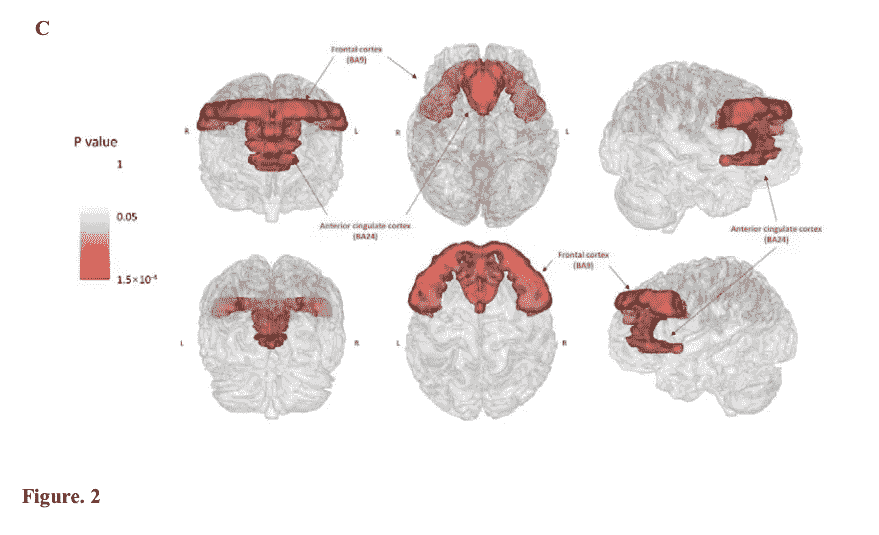

Source: [https://goo.gl/7rY5KV](https://goo.gl/7rY5KV)

经过彻底的搜索，我无法在方法或补充信息中找到任何关于这是如何完成的参考，所以我联系了作者。在我等待回复的时候，我也联系了推特上的[T21，看看是否有人知道可以用来创建这样一个可视化的工具。](https://twitter.com/MattOldach/status/1051909841529315328)

头盔卡里姆暗示说，也许这些图像是使用`MATLAB`中的`BrainNet Viewer`创建的，所以这是我尝试的第一种方法。

*注意*:本文中涉及的所有方法都使用了所谓的`brain Atlas`叠加在标准化 T1 MRI 图像上作为`mask`。我选择突出显示这些方法的`left hippocampus`,以便它们具有可比性。

# BrainNet 浏览器


首先遵循`BrainNet Viewer` [的安装说明，然后从终端启动图形用户界面(GUI)。](https://www.nitrc.org/docman/view.php/504/1280/BrainNet)

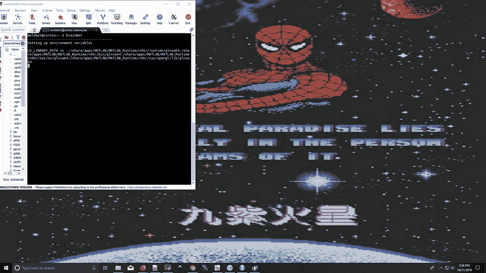

接下来选择加载文件，并选择一个表面模板`surface template`和一个`mapping`文件(*即* a `brain atlas`)。软件包提供了样本，所以我选择了`BrainMesh_ICBMI52_smoothed.nv`和[[aa l90](http://neuro.imm.dtu.dk/wiki/Automated_Anatomical_Labeling)]([http://neuro.imm.dtu.dk/wiki/Automated_Anatomical_Labeling](http://neuro.imm.dtu.dk/wiki/Automated_Anatomical_Labeling))`brain atlas`，它们已经标记了 90 个大脑区域的体积。

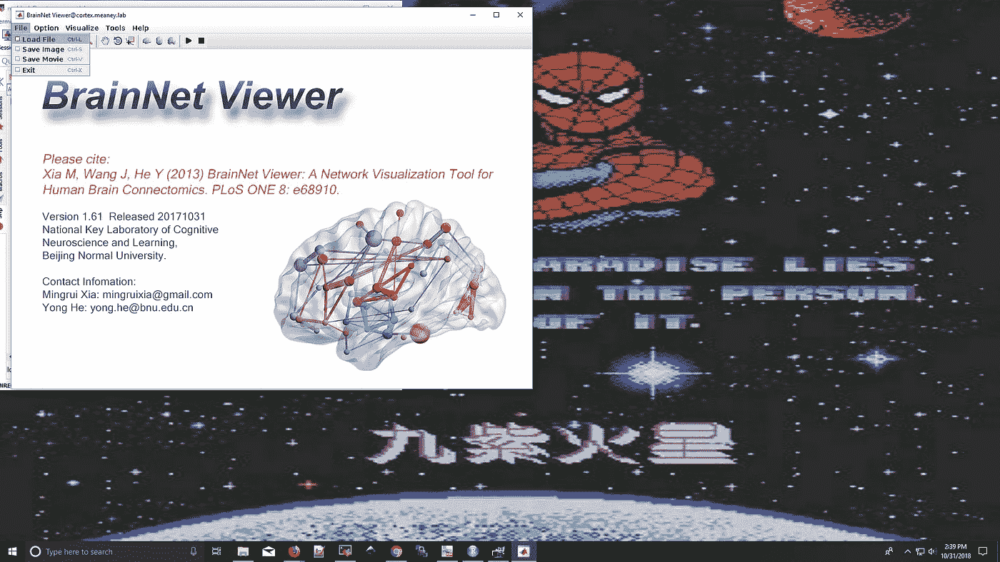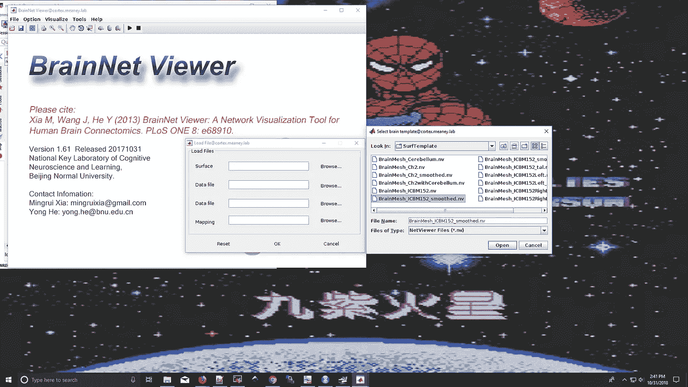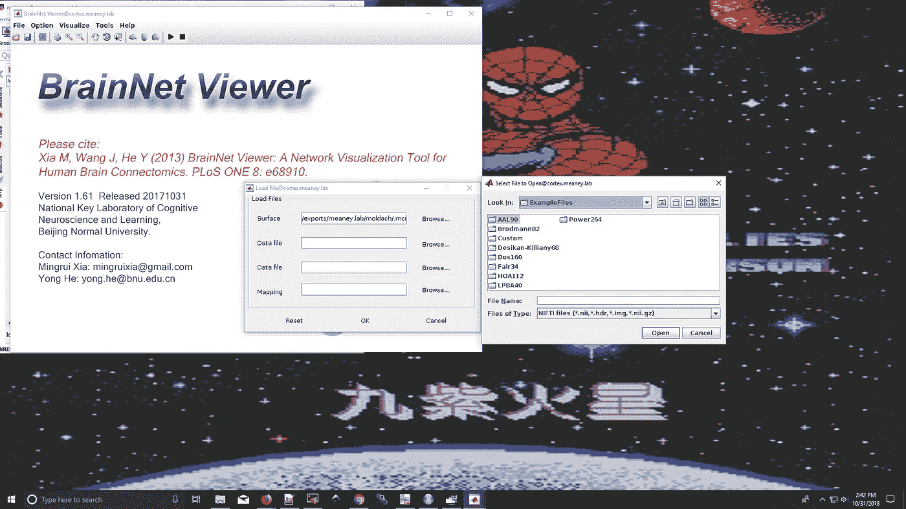

接下来将弹出一个包含 7 个部分的窗口，我们对其中的`layout`、`surface`和`volume`感兴趣。

在`layout`中选择您想要的视图，我选择了`full view`，它将显示八个不同的视角。


在`surface`选项卡中，你可以选择表面贴图的透明度——我已经将它设置为 **0.75** 。


在`volume`选项卡中选择`ROI drawing`，取消选择`draw all`，在自定义框中输入**37**(`hippocampus_L`的代码)。然后选择**确定**。

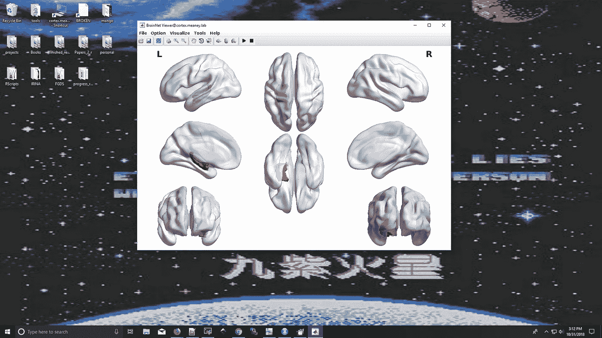

# 芒果

我目前正在与霍华德实验室讨论，试图获得他们用来创建他们的数字图像的确切方法，但我认为这是他们如何用[ [芒果](http://ric.uthscsa.edu/mango/download.html) ]做到的。

`Mango`有很好的[视频教程](http://ric.uthscsa.edu/mango/videos.html)、[用户指南](http://rii.uthscsa.edu/mango/userguide.html)和[论坛](http://rii.uthscsa.edu/mango/forum/)但是对于我们这些唯一感兴趣的是创建一个高亮的 3D 大脑图像的人来说，这是一大堆需要浏览的材料。因此，我决定为这个过程创建一个详细的协议来节省其他人的时间。

我决定下载[锤子大脑图谱](https://figshare.com/articles/Hammers_mith-n30r95_parietal_lobe_MRI_atlas_database/5024939)作为蒙版/覆盖图和`Mango`提供的样本图像

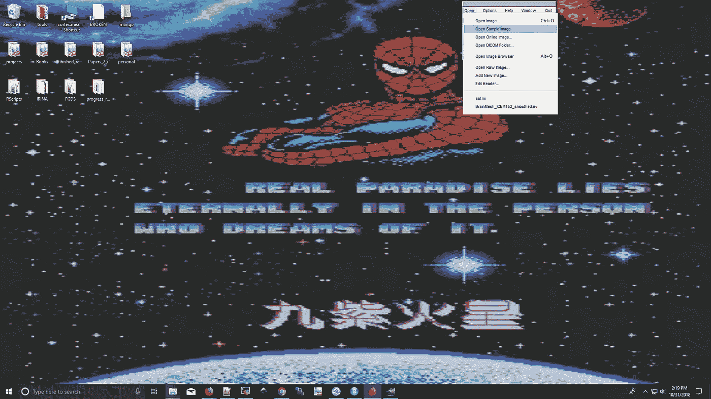

接下来选择`Add Overlay`并选择`hippocampus_L`。

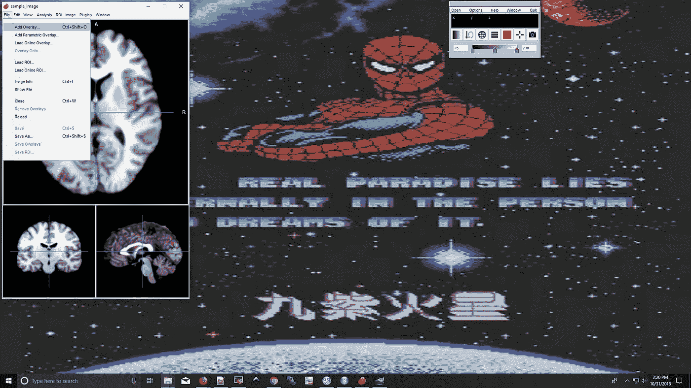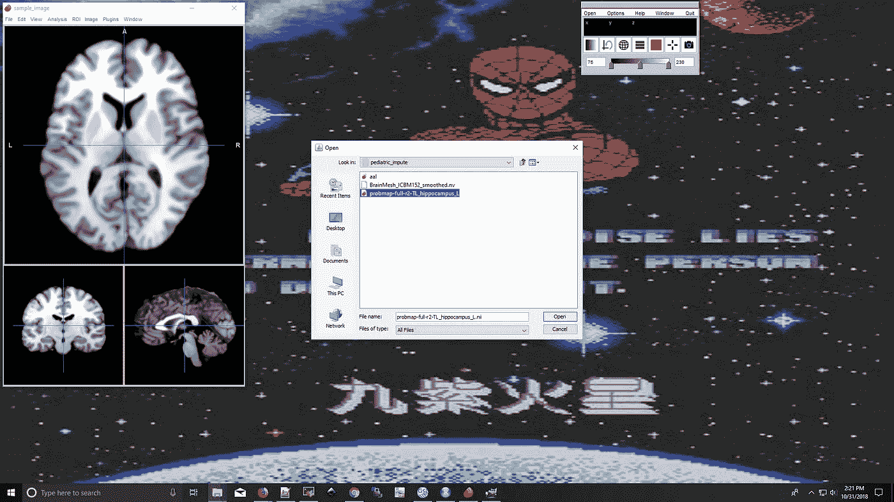

现在选择`Image > Build Surface`创建大脑的 3D 图像。

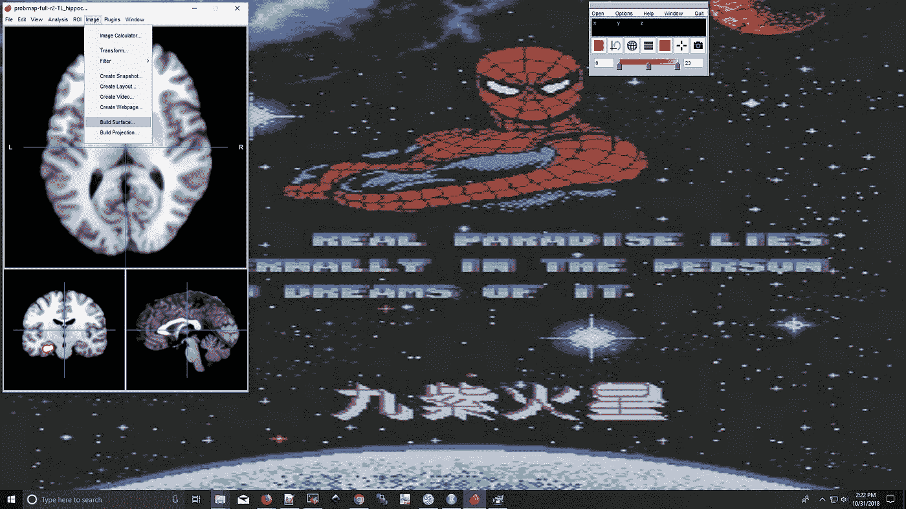

在这个新的弹出 GUI 中，我们想做一些事情。首先，将背景改为白色，这样就可以在手稿中发表了。第二，将这张图片的透明度改为 **0.75** 。

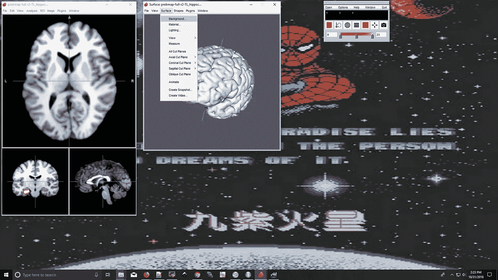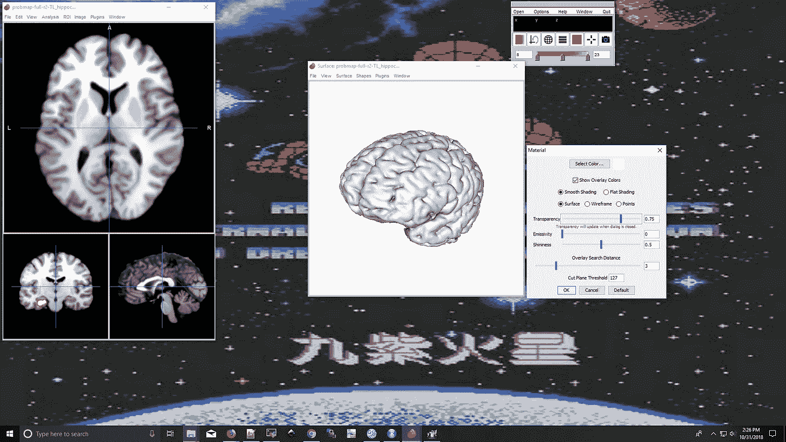

在`View`选项卡下取消选择十字光标。

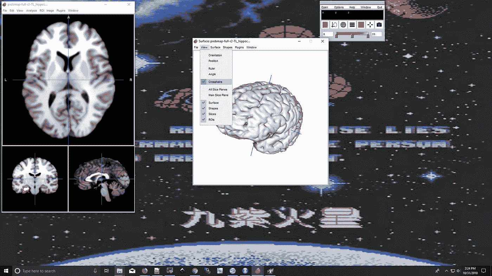

在另一个面板中选择`Analysis > Create Logical Overlays`，然后在表面面板中选择`Shapes > Add Logical`。

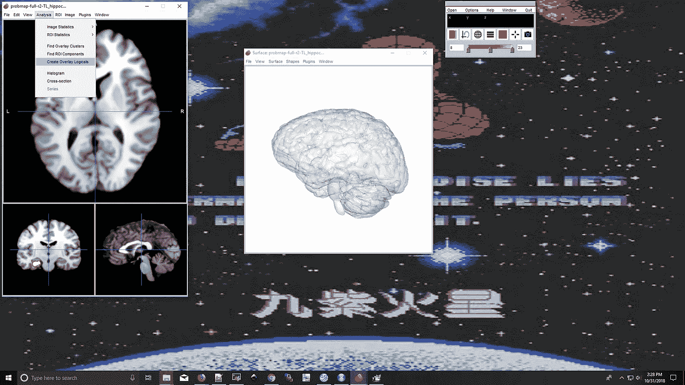

然后在`Surface > Views`下，你可以选择任何你喜欢的方向，然后`Surface > Create Snapshot`保存为`.png`。


下面是海马体的三视图 _L: **前**、**左**和**上**:

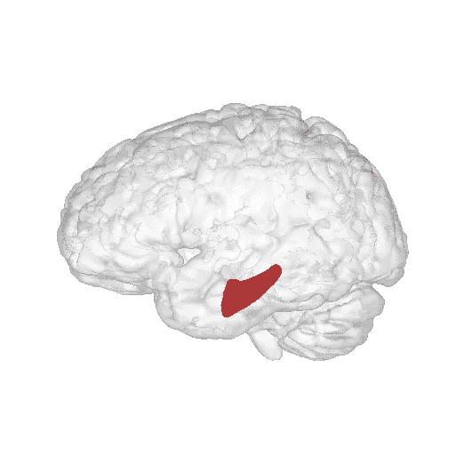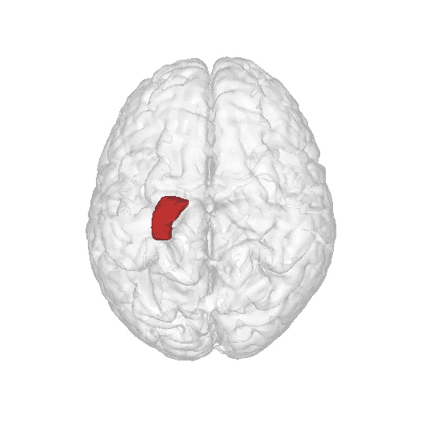

# r 实施

约翰·穆斯切利约翰·霍普金斯大学彭博公共卫生学院的助理科学家，他写了许多`R`包(*例如* `fslr`)几周后回复了我的推特。他想出了一个要点来强调《T2》中的 3D 大脑图像。

```
library(rgl)
library(misc3d)
library(neurobase)
if (!requireNamespace("aal")) {
  devtools::install_github("muschellij2/aal")
} else {
  library(aal)
}
if (!requireNamespace("MNITemplate")) {
  devtools::install_github("jfortin1/MNITemplate")
} else {
  library(MNITemplate)
}img = aal_image()
template = readMNI(res = "2mm")
cut <- 4500
dtemp <- dim(template)# All of the sections you can label
labs = aal_get_labels()# Pick the region of the brain you would like to highlight - in this case the hippocamus_L
hippocampus = labs$index[grep("Hippocampus_L", labs$name)]mask = remake_img(vec = img %in% hippocampus, img = img)### this would be the ``activation'' or surface you want to render 
contour3d(template, x=1:dtemp[1], y=1:dtemp[2], z=1:dtemp[3], level = cut, alpha = 0.1, draw = TRUE)
contour3d(mask, level = c(0.5), alpha = c(0.5), add = TRUE, color=c("red") )
### add text
text3d(x=dtemp[1]/2, y=dtemp[2]/2, z = dtemp[3]*0.98, text="Top")
text3d(x=-0.98, y=dtemp[2]/2, z = dtemp[3]/2, text="Right")
rglwidget()
```

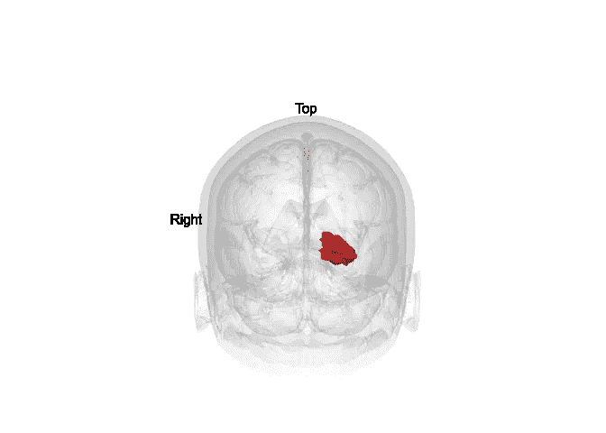

John Muschelli 也在`R`教授一些关于成像的短期课程，我目前正在上他的[ [神经黑客](https://www.coursera.org/learn/neurohacking)课程。我真的很感谢他花时间做这件事。

如果你有兴趣在`R`了解更多关于医学成像的知识，一定要去看看[神经传导](https://www.ncbi.nlm.nih.gov/pubmed/29325029)

如果你觉得这篇文章有用，请随意与他人分享或推荐这篇文章！😃

一如既往，如果您有任何问题或意见，请随时在下面留下您的反馈，或者您可以随时通过 [LinkedIn](https://www.linkedin.com/in/matthewoldach/) 联系我。在那之前，下一篇文章再见！😄