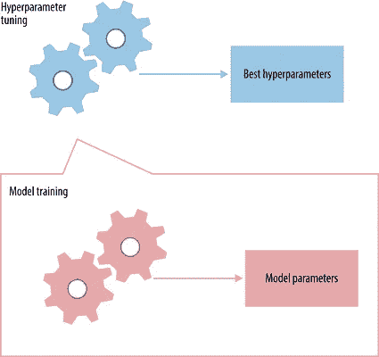
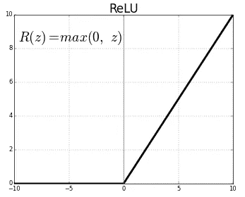

# 改善神经网络的性能

> 原文：<https://towardsdatascience.com/how-to-increase-the-accuracy-of-a-neural-network-9f5d1c6f407d?source=collection_archive---------2----------------------->


神经网络是机器学习算法，提供许多用例的准确性状态。但是，很多时候，我们正在构建的网络的准确性可能不令人满意，或者可能不会让我们在数据科学竞赛的排行榜上名列前茅。因此，我们一直在寻找更好的方法来提高我们模型的性能。有许多技术可以帮助我们实现这一目标。跟着去了解他们，建立你自己精确的神经网络。

## 检查是否过度配合


确保您的神经网络在测试数据上表现良好的第一步是验证您的神经网络没有过度拟合。好了，打住，什么叫过度拟合？当您的模型开始记忆来自训练数据的值而不是从中学习时，就会发生过度拟合。因此，当您的模型遇到一个它以前没有见过的数据时，它无法对它们执行良好的操作。为了让你更好的理解，我们来看一个类比。我们都会有一个擅长记忆的同学，假设数学考试即将来临。你和你擅长记忆的朋友从课本开始学习。你的朋友继续记忆教科书上的每一个公式、问题和答案，但另一方面，你比他更聪明，所以你决定依靠直觉解决问题，并学习这些公式是如何发挥作用的。考试日到了，如果试卷中的问题直接取自教科书，那么你可以期待你的记忆朋友在这方面做得更好，但是，如果问题是涉及运用直觉的新问题，你在考试中做得更好，而你的记忆朋友却悲惨地失败了。

如何识别自己的模型是否过度拟合？你可以交叉检查训练的准确性和测试的准确性。如果训练精度比测试精度高得多，那么你可以假定你的模型已经过度拟合了。您也可以在图表上绘制预测点来验证。有一些避免过度拟合的技巧:

*   数据规范化(L1 或 L2)。
*   中断——随机中断神经元之间的连接，迫使网络寻找新的路径并进行归纳。
*   早期停止—加速神经网络的训练，从而减少测试集中的错误。

## 超参数调谐



超参数是您必须对网络进行初始化的值，这些值不能在训练时被网络学习到。E.x:在卷积神经网络中，一些超参数是内核大小、神经网络的层数、激活函数、损失函数、使用的优化器(梯度下降，RMSprop)、批量大小、要训练的时期数等。

每个神经网络将有其最佳的超参数集，这将导致最大的准确性。您可能会问，“有这么多的超参数，我如何为每一个选择使用什么？”不幸的是，没有直接的方法来确定每个神经网络的最佳超参数集，因此它主要是通过反复试验获得的。但是，下面提到了一些超参数的最佳实践，

*   学习率——选择一个最佳的学习率是很重要的，因为它决定了你的网络是否收敛到全局最小值。选择一个高的学习率几乎不会让你达到全局最小值，因为你很有可能超过它。因此，你总是在全局极小值附近但从不收敛于它。选择小的学习速率可以帮助神经网络收敛到全局最小值，但是这需要大量的时间。所以，你要对网络进行更长时间的训练。小的学习率也使网络容易陷入局部最小值。即网络将收敛到局部最小值，并且由于小的学习速率而不能摆脱它。因此，在设定学习率时，你必须小心。
*   网络架构——没有一个标准的架构能在所有的测试案例中给你高的准确性。你必须进行实验，尝试不同的架构，从结果中获得推论，然后再试一次。我建议的一个想法是使用经过验证的架构，而不是构建自己的架构。对于图像识别任务，你有 VGG 网，Resnet，谷歌的 Inception 网络等。这些都是开源的，并且已经被证明是高度准确的，因此，你可以复制它们的架构，并根据你的目的进行调整。
*   优化器和损失函数——有无数的选项可供你选择。事实上，如果有必要的话，你甚至可以定义你自己的损失函数。但常用的优化器有 RMSprop、随机梯度下降和 Adam。这些优化器似乎适用于大多数用例。如果你的用例是分类任务，常用的损失函数是分类交叉熵。如果您正在执行回归任务，均方误差是常用的损失函数。请随意试验这些优化器的超参数，以及不同的优化器和损失函数。
*   批量大小和时期数量——同样，没有适用于所有用例的批量大小和时期的标准值。你必须尝试不同的方法。在一般实践中，批处理大小值被设置为 8、16、32…历元的数量取决于开发人员的偏好和他/她拥有的计算能力。



ReLU Activation Funciton

*   激活函数—激活函数将非线性函数输入映射到输出。激活函数非常重要，选择正确的激活函数有助于模型更好地学习。如今，校正线性单元(ReLU)是最广泛使用的激活函数，因为它解决了消失梯度的问题。早期的 Sigmoid 和 Tanh 是使用最广泛的激活函数。但是，它们遇到了梯度消失的问题，即，在反向传播期间，当它们到达开始层时，梯度的值减小。这阻止了神经网络随着层数的增加而变得更大。ReLU 能够克服这个问题，因此允许神经网络具有较大的规模。

## 算法集成


如果单个神经网络不像您希望的那样准确，您可以创建一个神经网络集合，并结合它们的预测能力。您可以选择不同的神经网络架构，在数据的不同部分对它们进行训练，然后集成它们，利用它们的集体预测能力来获得测试数据的高准确性。假设，你正在构建一个猫和狗的分类器，0-猫和 1-狗。当组合不同的猫和狗分类器时，基于个体分类器之间的皮尔逊相关性，集成算法的准确度增加。让我们看一个例子，取 3 个模型并测量它们各自的准确度。

```
Ground Truth: 1111111111
Classifier 1: 1111111100 = 80% accuracy
Classifier 2: 1111111100 = 80% accuracy
Classifier 3: 1011111100 = 70% accuracy
```

三个模型的皮尔逊相关系数都很高。因此，将它们组合在一起并不能提高精度。如果我们使用多数投票将上述三个模型集成，我们会得到以下结果。

```
Ensemble Result: 1111111100 = 80% accuracy
```

现在，让我们来看三个模型，它们的输出之间具有非常低的皮尔逊相关性。

```
Ground Truth: 1111111111
Classifier 1: 1111111100 = 80% accuracy
Classifier 2: 0111011101 = 70% accuracy
Classifier 3: 1000101111 = 60% accuracy
```

当我们集成这三个弱学习者时，我们得到以下结果。

```
Ensemble Result: 1111111101 = 90% accuracy
```

正如你在上面看到的，具有低皮尔逊相关性的弱学习者的集合能够胜过它们之间具有高皮尔逊相关性的集合。

## 缺乏数据


在执行了上述所有技术之后，如果您的模型在测试数据集中仍然表现不佳，这可能是由于缺少训练数据。在许多用例中，可用的训练数据量是有限的。如果你不能收集更多的数据，那么你可以求助于数据扩充技术。


Data Augmentation Techniques

如果您正在处理图像数据集，可以通过剪切图像、翻转图像、随机裁剪图像等方式将新图像添加到训练数据中。这可以为神经网络训练提供不同的例子。

## 结论

这些技术被认为是最佳实践，在提高模型学习特征的能力方面通常是有效的。这似乎是一篇很长的帖子，谢谢你通读，如果这些技巧对你有用，请告诉我:)