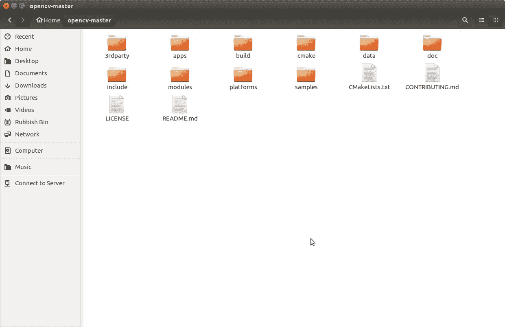
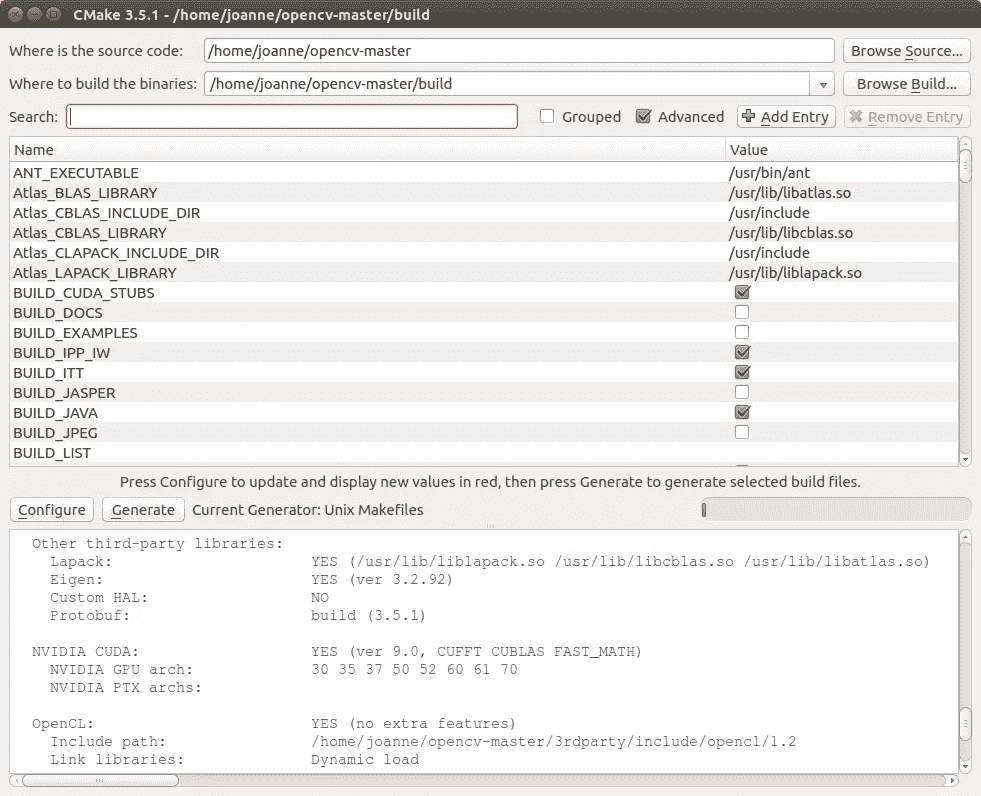
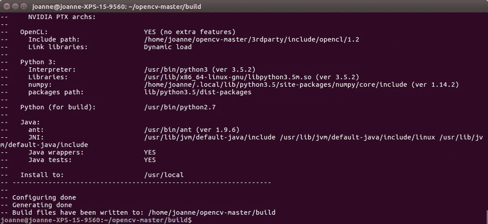
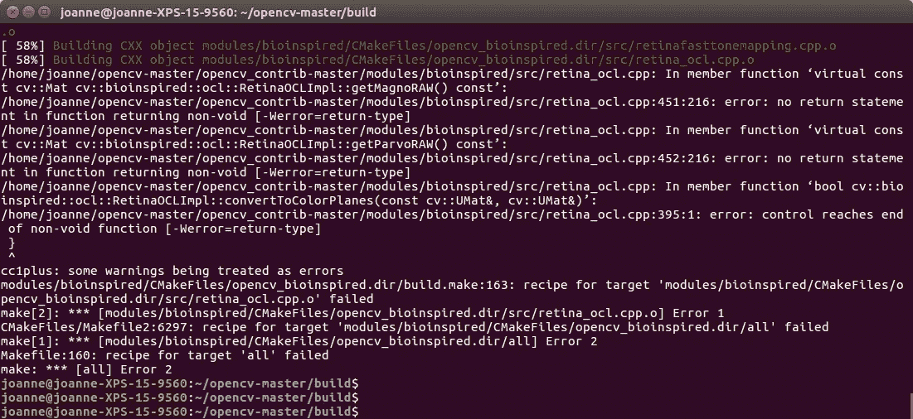
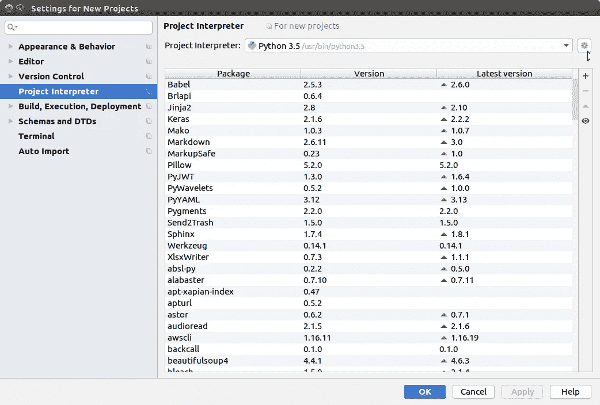
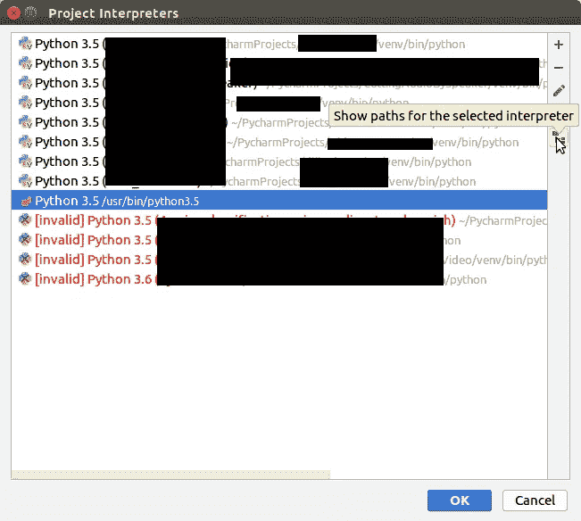
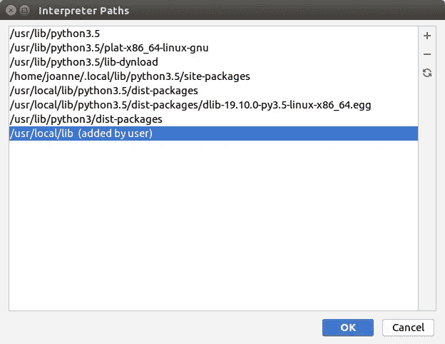
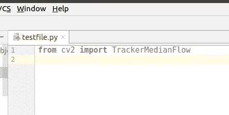

# 如何使用 Cmake 从源代码构建和安装 OpenCV 和额外的模块，并配置您的 Pycharm IDE

> 原文：<https://towardsdatascience.com/how-to-install-opencv-and-extra-modules-from-source-using-cmake-and-then-set-it-up-in-your-pycharm-7e6ae25dbac5?source=collection_archive---------1----------------------->

OpenCV(开源计算机视觉)是一个非常强大的图像处理和机器学习任务库，它还支持 Tensorflow、Torch/Pytorch 和 Caffe。这个库是跨平台的，你可以在 CPU 的支持下 pip 安装它(如果你使用 Python 的话)。或者，举例来说，如果您想在 GPU 支持下使用它，您可以从源代码构建它，这更复杂。本文介绍了在 Linux Ubuntu 机器上从源代码构建 OpenCV 的过程。

特别是，本文解释了如何:

*   使用 Cmake GUI 从源代码安装 OpenCV master 和 OpenCV contrib 文件
*   在 Cmake 中构建时，通过适当地选择/取消选择，仅选择您想要的 OpenCV contrib 模块
*   配置您的 Pycharm IDE 以识别生成的 OpenCV 安装

几个月前(2018 年 5 月)，我决定使用 Cmake 从头构建 openCV，因为我希望 OpenCV 在我的本地机器上有 Nvidia GPU 支持，而不是只在 CPU 上运行 OpenCV。我第一次安装 openCV 是在 5 月份，从 github 资源库下载，网址是:

 [## opencv/opencv

### 开源计算机视觉库。在 GitHub 上创建一个帐户，为 opencv/opencv 开发做贡献。

github.com](https://github.com/opencv/opencv) 

下载完成后，我用 Cmake 安装了 openCV。我当时没有意识到的是，由于没有将“opencv_contrib”作为 Cmake 安装的一部分，我错过了多少 openCV 的功能。这些是 OpenCV 的附加模块。

 [## opencv/opencv_contrib

### OpenCV 额外模块的存储库。通过在…上创建帐户，为 opencv/opencv_contrib 开发做出贡献

github.com](https://github.com/opencv/opencv_contrib) 

当时我还不知道 openCV contrib(T1 ),并认为安装 openCV 本身会给我提供 openCV 必须提供的几乎所有功能。那么，从源代码来看，标准的“openCV”安装缺少哪种模块呢？比如 openCV 的 TrackerMedianFlow(openCV 中的对象跟踪器之一)。如果你从头开始制作 openCV，没有 *opencv_contrib* 文件，这个对象跟踪器不包括在内。这个跟踪器甚至包含在带 CPU 支持的 openCV 的标准 pip 安装中。如果您感兴趣，这里解释了可用的 OpenCV 跟踪器:

 [## OpenCV:OpenCV 跟踪器简介

### 在本教程中，您可以选择视频或图像列表作为程序输入。如帮助中所写，您…

www.docs.opencv.org](https://www.docs.opencv.org/3.1.0/d2/d0a/tutorial_introduction_to_tracker.html) 

因此，本文解释了我使用 Cmake 重新安装 OpenCV 的过程，但是这次选择了我需要的额外的 openCV 功能，可以从 *opencv_contrib* 库获得。安装过程有几个“陷阱”(这当然让我)；我已经解释了这些是如何绊倒我的，以及我是如何解决它们的。

请注意，我正在描述 OpenCV 的 Cmake 过程，我的机器上已经安装了一些东西，下一段将详细介绍。

## **我的系统规格和我已经安装的内容**:

1.  我的操作系统: *Linux Ubuntu 16.04 LTS*
2.  Nvidia GPU: GeForce GTX 1050，驱动程序版本:384.130(你可以在电脑上打开一个终端，输入`nvidia-smi`来检查这一点
3.  从源代码构建应用程序: *CMake 3.5.1* (在 Linux 上可以通过打开计算机上的终端并键入`sudo apt-get install cmake)`来安装)。
4.  CUDA 9.0

## 这篇文章中的步骤概述如下:

1.  从 github 克隆最新的 openCV master 和 openCV contrib 模块
2.  在 Cmake GUI 中，配置，然后在您创建的新“build”文件夹中生成新的构建文件
3.  在您的终端中，导航到“build”文件夹，然后运行“make”和“install”命令。“make”命令将花费相当长的时间，并且可能会产生错误(将在下面讨论)。
4.  检查这个进程在哪里安装了在 Cmake 进程中创建的 cv2.xxx.so 文件(如果需要的话，用符号链接)
5.  在 Python 控制台中检查 openCV 是否已经安装，以及它是否被 Python 识别
6.  在 Pycharm 中配置 openCV，以便 Pycharm IDE 识别新安装的 OpenCV 包并检查结果。

# 使用 Cmake 从源代码下载文件并进行编译的更多详细步骤

**步骤 1** : **将主 openCV 文件(opencv_master)和附加模块(opencv_contrib)从 Github 下载/克隆到您的电脑上**

图 1 显示了从 Github 下载的 opencv_master 文件夹。下载或克隆主要 openCV 文件后，我创建了一个名为“ *build* ”的新(空)文件夹。Cmake 将在这里为您的新构建创建文件。

Fig 1: Downloaded opencv-master folder with new empty ‘build’ folder I created inside

**步骤 2:在 Cmake GUI 中，“配置”然后在您创建的新“构建”文件夹中“生成”新的构建文件**

通过在 bash 终端的＄符号后键入以下命令，打开 Cmake GUI:

`$ cmake-gui`

这将打开一个 Cmake GUI 窗口，如图 2 所示。在 Cmake GUI 中，您会注意到，在从 Github 下载资源库时，我已经将 opencv-master 文件放在我的计算机上名为“…/opencv-master”的文件夹中，然后在 GUI 中，我在“*Where are the source code*”选项中指向它。如步骤 1 所述，在 opencv-master 文件中，我创建了一个名为“build”的新的空子文件夹。这个构建文件夹是二进制文件将要构建的地方，文件路径设置“*在哪里构建二进制文件*”指向这个空文件夹。关于 Cmake 的伟大之处在于，如果你完全塞住了你的构建过程(在我弄清楚我在做什么之前，我做了令人沮丧的大量工作…)然后，在再次开始构建过程之前，您应该删除构建文件夹的内容。

Fig 2: Cmake GUI example building opencv-master

**在 Cmake GUI 中运行配置命令**

按下'*配置*'(图 2 左侧的按钮)。运行 configure 将填充构建文件的内容，该文件到目前为止是空的。首次配置时，这将提示您为交叉编译指定工具链。我选择了原生工具链。当这个过程完成时——这并不需要很长时间——您应该在窗口中得到一条消息，说“*配置完成*”。

**将 OpenCV Contrib 中的额外模块添加到您的 OpenCV 构建中**

按下 GUI 上的'*配置'*,然后浏览参数并查找“OPENCV_EXTRA_MODULES_PATH”。浏览参数，寻找名为 OPENCV_EXTRA_MODULES_PATH 的形式；使用搜索表单快速关注它。单击“advanced ”(高级)复选框(分别显示在图 2 和图 3 的右上方),通过勾选或取消勾选相应的复选框，搜索您特别希望包括或排除的模块。

Fig 3: Searching for, selecting and deselecting additional openCV modules (e.g. opencv_face)

**在 Cmake GUI 中运行“生成”命令**

配置完成后，按下'*生成*'(见图 3)，同样应出现“*生成完成*”。

**步骤 3:在您的终端中，导航到“build”文件夹，运行“make ”,然后运行“install”命令。**

在 bash 终端中使用以下命令导航到构建文件夹(这里的示例显示了导航到我的构建文件夹，因此相应地修改您的路径):

`$ cd /home/joanne/opencv-master/build`

然后在命令行中输入 cmake 命令:

`$ cmake .`

过了一会儿，这将产生一条消息(如图 4 所示):

" *—配置完成—生成完成
—构建文件已写入:/home/Joanne/opencv-master/Build*"

(根据您将构建文件写入的位置，此消息会有所不同)。

Fig 4: Running the cmake command in your build folder

接下来，在命令行上，键入:

`$ make -j8`

请注意，数字“8”指的是您拥有的 CPU 内核的数量(您在这里的数量可能不同)。那个-j[8]标志是并行的，因此可以加速构建。正是这个“制作”过程需要时间(大约 2 个小时)，而且对我来说，会产生一些错误。当您的“make”过程成功完成时，通过以下命令在您的终端中再次执行最后的安装步骤:

`$ sudo make install`

注意，使用这些“make”和“install”命令，您可能不需要在它们前面包含“sudo”来获得 Linux 上的必要权限。我发现我的机器需要这个。2018 年 5 月，我已经在我的机器上安装了来自我的原始 openCV 版本的 OpenCV。运行' *sudo make install* 命令成功覆盖了原始安装。

**抓到你了！对您的 Cmake 构建进行故障排除**

**Trip hazard 1** : **确保你的 openCV 和 openCV_contrib 代码同步，在同一天** 下载

*正如我在本文开头提到的，我最初是在 2018 年 5 月下载并构建 openCV 的。因为当时我没有包含 openCV_contrib 模块，所以我不得不重新构建 openCV，这一次包含了 openCV_contrib 模块 ***和*** 。*

*我在 2018 年 8 月下载了 openCV_contrib 代码，但最初尝试结合我在 2018 年 5 月下载的 openCV 代码在 Cmake 中构建。这三个月的差异足以使 openCV 主代码库和 openCV_contrib 模块之间出现不兼容。结果，当 make 进程试图构建 contrib 模块时，我的构建在' *make -j8* '阶段总是失败。这导致整个 openCV 'cmake '构建过程失败。例如，模块“*生物感应*失败，如图 5 所示。最初，当我遇到这样的故障时，我通过 GUI 排除了那些额外的模块，并再次运行了重建过程。然而，经过几次尝试后，很明显有许多模块以这种方式失败了，我意识到问题的根源是主要的 openCV 代码来自 2018 年 5 月，与最近的 *contrib* 模块不兼容。因此，我不得不下载 2018 年 8 月的 openCV 代码，并将其用于我的 Cmake 构建，以确保与 2018 年 8 月的 *contrib* 模块兼容。*

**

*Fig 5: Contrib module ‘bioinspired’ failing as a result of incompatibility between main OpenCV code version and the OpenCV contrib modules*

***跳闸危险 2:可能有奇怪的 openCV_contrib 模块就是不工作***

*即使您已经确保在同一天从代码库构建 openCV 和 openCV_contrib，也可能有奇怪的 openCV_contrib 模块会失败。 *contrib* 模块本质上更具实验性，因此还没有成为标准的 openCV 版本。*

*我发现只有一个 openCV 模块不管我做什么都不工作，并导致我的整个构建失败，这就是“ *xfeatures2d* ”。图 5 显示了这个附加模块的失败，它使得整个构建陷入停顿。*

**

*Fig 6: Build failure due to the xfeatures2d openCV_contrib module*

*事实证明，我不需要额外的“ *xfeatures2d* ”模块。我使用 Cmake GUI 从构建中排除这个模块(参见**在步骤 2 **中从 OpenCV Contrib 中添加额外的模块到 OpenCV 构建中**)**，然后使用上面的步骤重新构建*

***跳闸危险 3** : **从源代码重建时，删除“构建”文件的内容***

*如上所述，如果您不得不多次从源代码构建，在 Cmake GUI 中再次运行配置和生成命令之前，按“生成”会确保您删除了*构建*文件的内容(留下一个空的*构建*文件)。*

***第 4 步:查看该进程在何处安装了 openCV”。所以“在 Cmake 过程中创建的文件***

*假设你的库已经安装成功，你应该可以找到你的' *cv2.xxx.so* '文件。在我的例子中，文件是“*cv2 . cpython-35m-x86 _ 64-Linux-GNU . so”*安装在*“/usr/local/lib/python 3.5/dist-packages*”中。我的另一个"*。所以与 openCV 相关的*文件位于“*”/usr/local/lib”*路径下，如图 7 所示。*

**

*Fig 7: The location of my openCV .so files*

***第 5 步:在 Python 控制台中检查 openCV 是否已经安装，以及它是否被 Python 3 识别***

*当我使用 Pycharm 进行 Python 开发时，我使用 Pycharm 中的 console 选项卡来检查 OpenCV 的安装。如图 10 所示，输出显示了到的完整路径。所以归档吧。*

**

*Fig 10\. Checking the installation path of OpenCV using the python console tab in Pycharm*

***步骤 6:在 Pycharm 中配置 openCV，确保 Pycharm IDE 能够识别新安装的 OpenCV 包***

*尽管 Pycharm 中的 Python 控制台可以识别 openCV(如图 10 所示)，但是第 6 步可以确保 Pycharm IDE 能够识别新安装的 openCV 包。在主菜单中，如果您选择 File -> Settings(或 Settings for new projects)，那么这将显示项目解释器，如图 11 所示。*

**

*Fig 11\. Project Interpreter selected (note ‘cog’ symbol in top right shown by pointer)*

*在图 11 中窗口的右上方，有一个 cog 图标，如果你点击它，会给你“添加”或“显示所有”项目解释器的选项。选择“显示全部”会打开一个新窗口，显示所有可用的项目解释器(我在这里稍微编辑了一下)。*

**

*Fig. 12: Path addition in Pycharm IDE*

*对于给定的解释器，您可以添加路径。当你点击图 12 右手边的按钮时(当你悬停在上面时，显示“显示所选解释器的路径”)，一个名为“解释器路径”的新窗口打开(图 12)。在该窗口中，可以通过按“+”号添加新路径。我在图 12 中添加了一个新路径，名为“ */usr/local/lib* ”。我发现这对于 Pycharm IDE 识别我新安装的 OpenCV 是必要的。*

**

*Fig.12: Adding a new interpreter path in the Pycharm Integrated Development Environment*

*要测试 Pycharm IDE 是否识别新的 OpenCV 安装，您可以尝试在 IDE 中创建一个新的 python 文件。尝试主 OpenCV 构建中缺少的“TrackerMedianFlow”现在是可用的，如图 13 所示。*

**

*Fig. 13: Checking import of OpenCV and additional modules e.g. TrackerMedianFlow*

*就是这样！OpenCV(在我的例子中有 GPU 支持)现在已经从源代码安装好了，可以在 Python 控制台或 Pycharm IDE 中使用。*