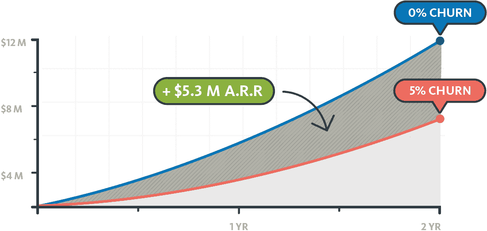

# 如何利用人工智能预测(并防止)客户流失

> 原文：<https://towardsdatascience.com/how-to-leverage-ai-to-predict-and-prevent-customer-churn-f84d653a76fb?source=collection_archive---------6----------------------->

对于任何数字或在线业务来说，赢得客户只是战斗的一半。这也是为了吸引并最终留住客户，以取得长期成功。解决客户流失问题一直是品牌和开发在线用户体验的产品团队面临的最大挑战之一。对大多数人来说，每月 5%的流失率听起来没什么大不了的，但是每年复合计算，你可能会失去将近一半的客户！也就是说，你需要非常努力地工作，才能让你的企业保持目前的规模，而不是萎缩。

没有什么比在众所周知的仓鼠轮上“奔跑”时烧掉你辛苦赚来的资本更糟糕的了

…换句话说，努力工作却一事无成。当你有 5%的流失率时，很难想象会有什么增长，你需要稳定下来，保持运转。是时候我们停止猜测客户流失的原因，开始利用一些新的方法来解决这个问题了。

获得一个新客户的成本通常是留住一个现有客户的 5 到 25 倍[，这使得最大限度地减少客户流失对任何企业都至关重要。这就是为什么产品经理采取积极主动的方法来留住用户，以最大限度地降低获取成本，并增加长期大规模采用的机会是如此重要。但是任何产品经理都知道，他们将会遇到严重的障碍，从而影响产品的采用和保留。](https://hbr.org/2014/10/the-value-of-keeping-the-right-customers)

问题是，大多数经理传统上采取追溯的方法来解决客户流失。他们会进行调整、变化和调整，然后追溯过去，并对这些变化是否有效进行事后分析。然而，随着人工智能(AI)应用的最新进展，产品经理现在能够更好地预测客户流失，并采取积极措施防止客户流失。

# 追溯方法的问题是

你已经创建了一个看起来功能良好的产品或应用程序，拥有流畅的用户体验，并在用户获取方面取得了一些初步成功。但过了一段时间，用户开始减少，客户流失，你不太清楚为什么。为了减少流失，设计师、开发人员和产品经理会尝试各种策略来解决这个问题。他们可能会改变颜色，调整字体，移动付费墙，或改变用户界面(UI)，然后等待 2-3 周来衡量营业额是否有所改善。根据几周前的保留基准，他们将尝试找出是哪项或哪些更改产生了影响。是一个变化，几个变化，还是变化的总和？

这种循环的中断会扼杀与改进 UX 相关的所有部门的工作流程、生产力和整体效率。这种一次测试一个或两个变更、衡量成功、选择最佳选项，然后进行下一步的 A/B 方法是缓慢、繁琐和低效的。更糟糕的是，即使考虑这样做是正确的，你也需要一次实现一个改变，这可能比你的业务跑道花费更多的时间。

简而言之，这是一种落后的方法，分割了 UX 改进过程，并且经常解决客户流失的根本原因太少，太晚。

# 人工智能如何主动解决客户流失问题

我们的数据科学家团队已经开发出一种更好、更快、更有效的方法来解决客户流失问题，这种方法利用了机器学习的新进展。我们方法的真正秘诀是以预测的方式利用人工智能。你越能预测客户流失，你就能越好地预防它。通过机器学习模型，你可以了解是什么导致了客户流失。产品经理、开发人员、设计人员和高管都免于猜谜游戏。

# 预言；预测；预告

第一步是探索阶段，在这个阶段，你要深入研究数据。与点击流或购买数据不同，利用机器学习可以让你筛选大量数据，而不仅仅是一小部分。例如，如果您有一个 100 名用户的列表，按照流失可能性从上到下排列，您可以分析聚类以查看哪些类型的人似乎出现在“极有可能流失”桶中。通过揭示客户的年龄、性别、收入、活动和客户来源等个人资料属性，您将能够更好地预测哪些类型的客户可能会流失(哪些不会)。

# 诊断

机器学习可以带你分析数据，以便分析师能够帮助业务团队了解谁可能会流失，并在用户界面上提出预防性的变化。通过行为分析工具，您可以根据任何属性(行为、支出水平、年龄或群体)对用户进行细分，并采取适当的行动。诊断步骤也是至关重要的，因为你可以量化风险，纠正过程，并采取措施防止未来发生人员流动。

# 利用人工智能的行动步骤

现在，你已经有效地利用人工智能来开发预测模型，以预测哪些类型的客户很可能流失，下面是一些你可以采取的具体行动，以防止在你的业务或产品的生命周期内流失:

*   **干预** —防止客户流失的最佳方法之一是对可能流失的客户档案的客户生命周期进行干预。通过向用户和您的内部团队发出警报，您可以集中精力采取措施留住重要客户甚至特定的个人。
*   **收购** —客户流失并不总是基于个人资料元素来预测。它还取决于收购渠道(谷歌广告词、社交媒体、内容营销、合作伙伴推荐等)。).基于你的预测分析，你可以只锁定那些拥有最佳留存率和 LTV 的最有利可图的用户，当然，也可以针对这些特定的客户微调你的产品。
*   **体验** —颜色、字体、用户流量和体验的其他部分都是最终影响客户流失的因素。有了人工智能和行为分析，你现在有工具知道在哪里集中精力调整用户体验。

底线是客户流失不能再追溯解决了。如果公司、品牌和产品经理想要有意义地降低流失率，他们需要采取主动的方法。通过利用人工智能生成数据驱动的预测策略，公司可以不再猜测将精力集中在哪里，以实现更健康的 SaaS 业务，甚至获得竞争优势。