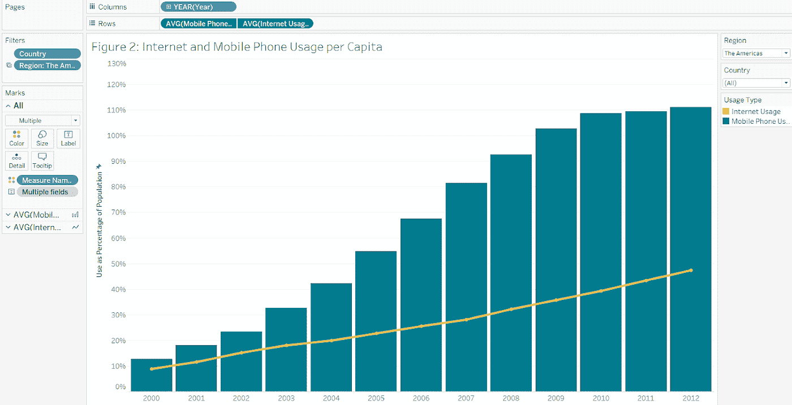
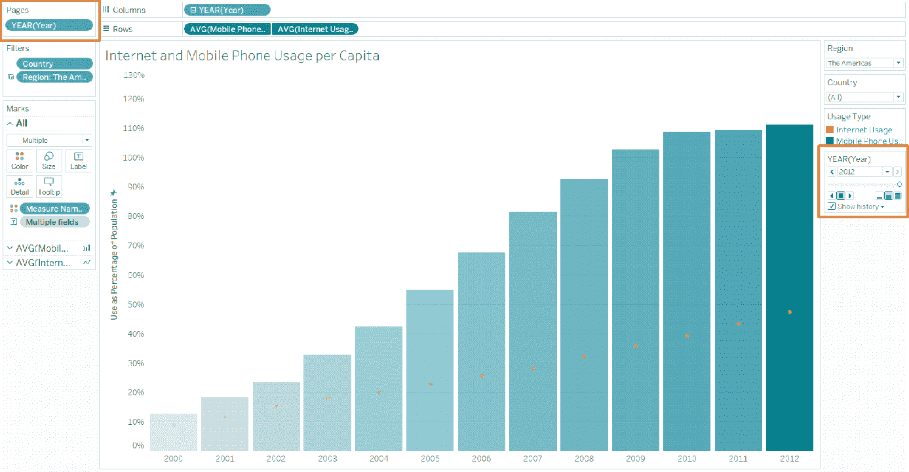
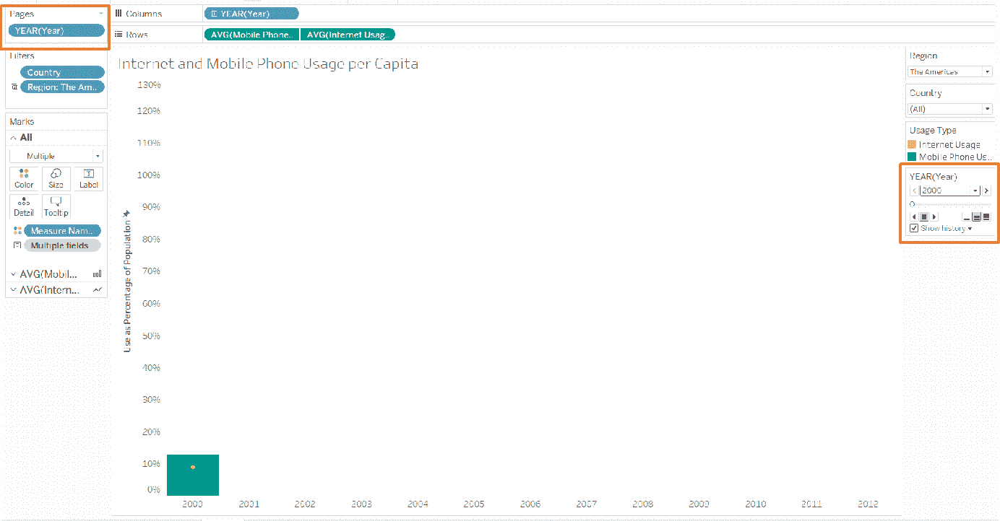
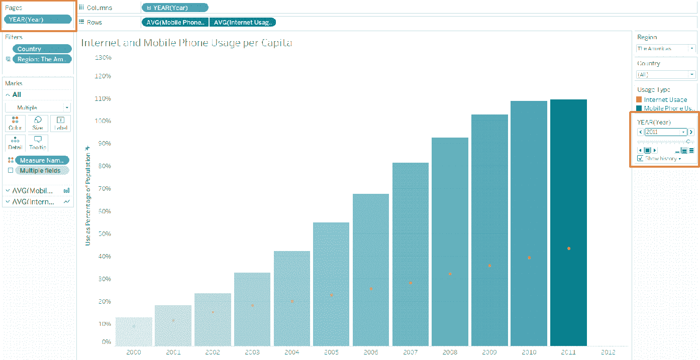
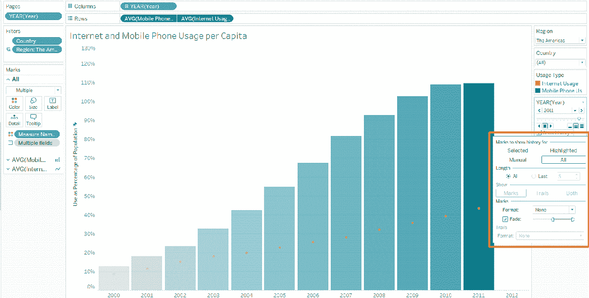
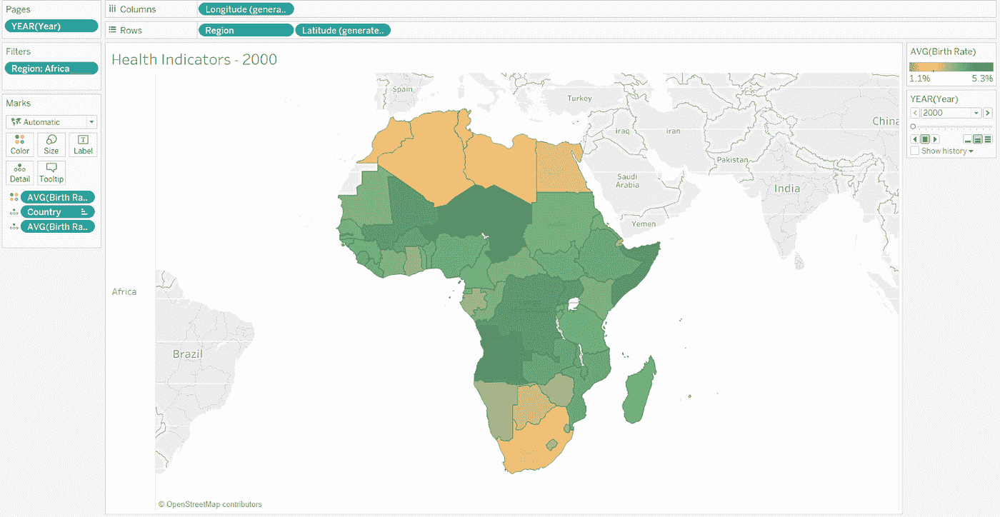
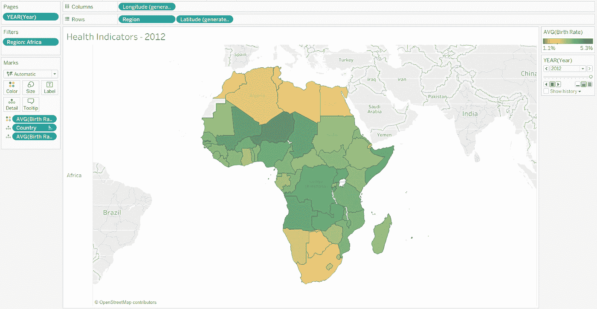

# 如何使用 gif 制作有趣的 Tableau 仪表盘

> 原文：<https://towardsdatascience.com/how-to-make-interesting-tableau-dashboards-using-gifs-182eab5fe354?source=collection_archive---------6----------------------->

可视化可以对我们如何感知不同的事物产生巨大的影响，尤其是数据。将数据以结构化方式排列成表格格式远比非结构化数据好得多；以图表的形式用图形表示数据也比以表格的形式表示数据要好。随着可视化程度的提高，我们对数据及其呈现环境的理解也在提高。

我们举个例子，自己验证一下上面的说法。

试着阅读上面的表格并理解它的意思。

好吧，我来帮你。

因此，该表提供了人均互联网和移动电话使用量的逐年变化趋势。总体趋势是积极的，互联网和移动电话的人均使用量逐年增加。然而，为了更进一步理解这些年来的相对增长，我们必须在分析之前做一些计算并得到一些数字。然而，如果我们以一种更好的视觉格式呈现上述数字，比如说条形图或折线图，那么它可能有助于我们的目的。我们将能够看到这些数字多年来的总体变化，并进一步看到这些年来的相对增长。让我们看看下面的图表，看看有什么不同。

柱状图为我们提供了人均手机使用数据，而折线图为我们提供了人均互联网使用数据。我可以毫不避讳地说，上图的视觉吸引力比表格中的简单数字好无数倍。上图为我们提供了多方面的见解，其中一些观点如下:

*   人均移动电话使用量和人均互联网使用量的总体增长
*   2009 年至 2012 年期间，人均移动电话使用率增长不多；尽管人均互联网使用率几乎一直呈线性增长
*   人均互联网使用率的增长率远远低于人均移动电话使用率的增长率——这可以从每年的折线图与条形图的位置推断出来。2000 年，线很接近杠顶；而在 2012 年，这条线几乎位于酒吧的中心。

从上面的图表中可以得出许多其他的见解。这就是数据可视化的力量。它的互动性和动态性越强，就越有利于用户从中获得洞察力。

上面两个图表是在 Tableau 中创建的，Tableau 是市场上最先进的数据可视化工具之一。Tableau 帮助我们用简单的拖放方法创建强大的交互式可视化。使用 Tableau，我们将尝试通过将静态图表转换为更具交互性的形式，即通过将它们转换为 gif，将我们的可视化提升到一个新的水平。通过一个简单的播放按钮，用户可以看到所有的条形图和折线图根据时间线移动。我们将举几个例子，了解如何在 Tableau 中创建 gif。

我们将使用标准的 Tableau World Indicators 内置仪表盘作为示例。首先，我们将使用互联网和手机的人均使用数据，并了解如何创建一个 GIF，看看它提供的影响。我们在图 1 和图 2 中看到了两种不同形式的相同数据。要以 GIF 格式显示图表，首先按照标准说明以所需格式创建图表。标准图表可能如下图所示。

现在，要将标准图像转换成 GIF，你所要做的就是将 Year 字段移动到左上角的 Pages shelf。完成后，你会在右边看到一个页面卡片，上面有一个“播放”按钮。只要点击播放按钮，你就可以制作一个 GIF 了。请看下图中的 pages 卡片。

因为，Tableau 的当前版本不提供下载 gif 的灵活性，你将不得不使用第三方工具来录制屏幕。

现在让我们将上面的图片分成三个部分(在不同的年份点)，并了解整个 GIF 是如何演变的。

上图是 GIF 的第一步(年份= 2000)。让我们看看 2005 年的第二步。

接下来，我们来看一下 Year = 2011 时的图像。

当你按下播放按钮时，图像会一次移动一年。使用右侧的 pages 卡，您可以选择不同的选项，如过渡速度和特定年份。如果您点击“显示历史”旁边的小箭头，将出现如下所示的弹出窗口。使用这个弹出窗口，你可以改变颜色，褪色的酒吧等。

此外，如果您不想在图表随年份移动时保留以前的条形，您可以选择“突出显示”选项，而不是“全部”，结果如下所示。

现在，让我们看另一个例子，看看 gif 如何有助于在区域地图上提供一段时间内的指标趋势。我们将使用 Tableau 的内置仪表板——世界指标，但这一次我们将使用不同的数据集——健康指标。

我们将首先为非洲不同国家的平均出生率创建一个静态区域热图。图表如下所示:

现在，将 Year 字段移动到 Pages 窗格，点击 play 按钮，观察不同国家的颜色变化。你会观察到，不同国家的颜色随着平均出生率的变化而变化。阿尔及利亚的情况明显不同。

在 2000 年，阿尔及利亚是金黄色的，这表明平均出生率接近 1.1%(看上图中的梯度比例)；而在 2012 年，阿尔及利亚的颜色变成了浅绿色，表明平均出生率逐年提高。

然后，Tableau 表可以移动到任何 Tableau 仪表板，并在演示文稿中使用。这是 Tableau 提供的一个非常强大的功能，它可以帮助我们以一种非常吸引人和交互的方式呈现数据。

尽管 gif 在创建吸引人的可视化效果方面非常有用，但在使用时还是要小心。它们应该主要用于当你想要呈现一段时间内的变化趋势时，例如:一个国家多年来的 GDP 变化。另一个例子是，如果您想要比较两个或更多国家/地区之间的一个指标，并查看多年来的变化趋势。我们可以在更多的领域看到这种 gif 的应用，你能想到吗？在 Tableau 中创建 gif 时，我们很高兴听到您的观点和经验。

# **作者简介:**

本文由 Perceptive Analytics 供稿。Saneesh Veetil、Sinna Muthiah Meiyappan 和 Chaitanya Sagar 对本文有贡献。

Perceptive Analytics 为电子商务、零售、医疗保健和制药行业提供 [Tableau 咨询](https://www.perceptive-analytics.com/tableau-consultants/)、数据分析、商业智能和报告服务。我们的客户包括美国和印度的财富 500 强和纽约证券交易所上市公司。