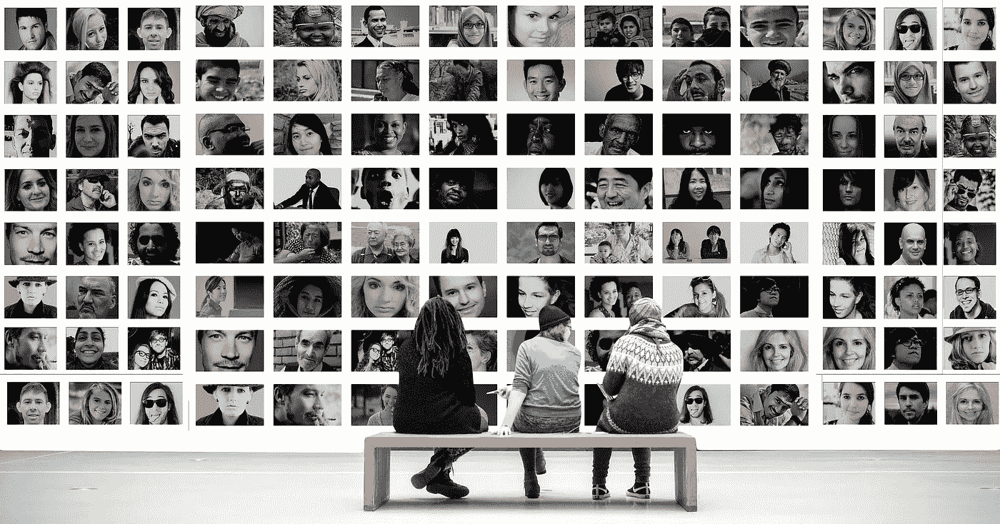

# 如何利用机器学习来理解社交媒体

> 原文：<https://towardsdatascience.com/how-to-make-sense-of-social-media-using-machine-learning-8a3db1506d03?source=collection_archive---------3----------------------->

社交媒体最初是为个人提供的环境，但品牌很快注意到了个人互动的机会。目前，顶级社交媒体平台也是相关的营销渠道，有时会完全取代电视广告或传单等传统选择。每秒钟，脸书上出现 330 万条新帖子，推特上出现近 50 万条。如果你想记录你的品牌被提及的所有次数，该怎么办？

为了利用社交媒体的力量，创建一个营销计划并相应地分配预算。品牌希望对自己行为的影响、客户的偏好甚至负面评价有清晰的认识。然而，鉴于信息量如此之大，手动操作是不可能的。

# 克服信息过载

进入[机器学习(ML)](https://topvendors.co/machine-learning/) ，这是一系列算法，使计算机能够识别数据中的模式，并将其分类成簇。这非常适合非结构化数据，因为社交媒体帖子不遵循任何规则。它通常是文本、图像、声音和视频的混合。

这种分析的结果可以给出关于所选用户的可操作的见解。自然语言处理提供了关于社交媒体帖子作者的年龄、性别、位置和偏好的有价值的线索。来自 [NLP API](https://indatalabs.com/natural-language-processing-api) 的数据可以帮助基于真实世界的数据而不是统计或有根据的猜测进行客户细分。

# 为什么要使用机器学习

在社交媒体分析中部署 ML 有几个原因，这是由大数据的 3 比(数量、速度和多样性)决定的。

## 可攀登的

社交媒体活动的庞大数量需要自动化工具来处理处理活动。即使有专门的社交媒体团队，也不可能跟踪所有渠道和品牌提及。相反，网络抓取工具收集所有可能与品牌相关的帖子，将它们放入一个数据湖中，然后输入到算法中，将它们分割成相关的部分。

## 文本与语境

搜集阶段依赖于一个关键词，如品牌或产品名称。对于专门的活动，可以使用标签进行搜索，但这仅仅是开始。与为结构化数据设计的简单统计工具相比，使用大数据我们可以实现更多。这些只是统计关键词在对话中出现的次数，并增加更多的过滤级别，如地理位置和性别，而现在我们可以创建图表来显示现有的链接并给出意义。更重要的是不仅要分析焦点词(文本)，还要分析它所处的语境。通过 NLP 支持的情感分析，公司可以了解客户对产品的满意程度，以及与积极和消极感觉相关的词语。这类似于人类通过语调相互理解的方式，或者朋友通过即时消息交流的方式。

## 相关性和权威性

在社交媒体中，识别影响者非常重要，无论他们是个人还是机构，因为他们是网络中的中心节点，与他们建立合作关系可以创造出促进营销的病毒式内容。

斯坦福的一篇[文章解释了如何追溯链接，查看每条信息的来源，甚至使用图表跟踪最初帖子的变化。最相关的条目有许多引用，而具有最高权限的内容生成者始终如一地创建相关帖子。](http://snap.stanford.edu/proj/socmedia-www/socMedia-www11-part1.pdf)

## 说他们的语言

就在十年前，市场调研是通过调查和焦点小组完成的。机器学习不仅提高了答案的准确性、速度和可靠性，而且它可以结合不同组的预先存在的信息来回答新问题。这有助于在初始测试后缩小选择范围或创建新的行动路线，从而迭代地做出决定。

通过查看社交媒体洞察，营销人员可以了解客户使用产品的新方式，他们购买产品时的感受，甚至新的商业机会。

以前的客户细分技术无法创建用户角色，但现在通过聚类，公司不仅可以发现他们的典型客户是二十出头、受过大学教育和生态学家，而且他们还可以生成听起来像她自己的帖子，达到非常个性化的目标营销水平。

说到语言，由于机器学习算法只是使用了聚类，因此可以用来分析不同的语言，而无需修改底层命令。此外，这些工具非常适合社交媒体分析，在这种环境下，用户有时会混合使用多种语言，尤其是在非英语母语的情况下。例如，文本可以用用户的母语书写，有表情符号，这是通用和流行的英语标签，创建与全球用户联系的更丰富的信息。

# 电脑不理解

重要的是要明白，计算机处理信息的方式与人类不同，尽管这是人工智能的最终目标。目前，

他们只是创造规则并应用它们，给人以推理的印象。然而，这并不是反对使用机器学习的理由，只是提醒一个程序的能力和一种设定现实预期的方法。

这种限制的可能缺点是，在校准阶段，分析社交媒体帖子需要特别注意，特别是关于元通信，如表情符号和使用讽刺和挖苦。虽然人类可以更容易地发现这一点，但机器可能会将这样的帖子分类到错误的垃圾箱中，并忽略不满意的客户。

# 从用户到影响者

在社交媒体出现之前，能够影响他人的人数是有限的，通常由电影明星、运动员、医生或专家等高调、高知名度的个人组成。内容创作也仅限于出版社和媒体渠道。通过智能手机民主化，我们每个人都是内容创造者，成为影响者的门槛降低了，因此任何人都可以创建帐户并发表自己的想法。在这种去监管化的环境下，企业不再能控制自己的形象。现在，他们只能观看表演，并确定导致积极市场刺激的行为来鼓励他们。