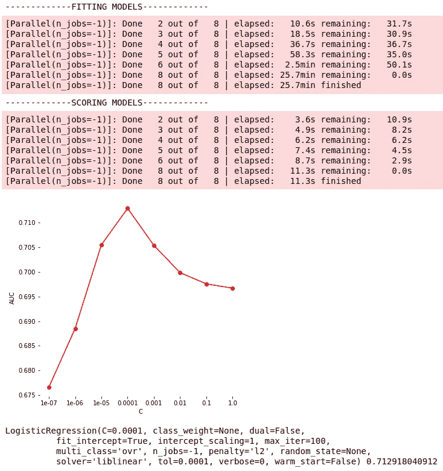
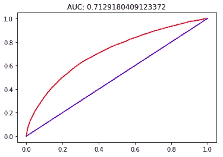
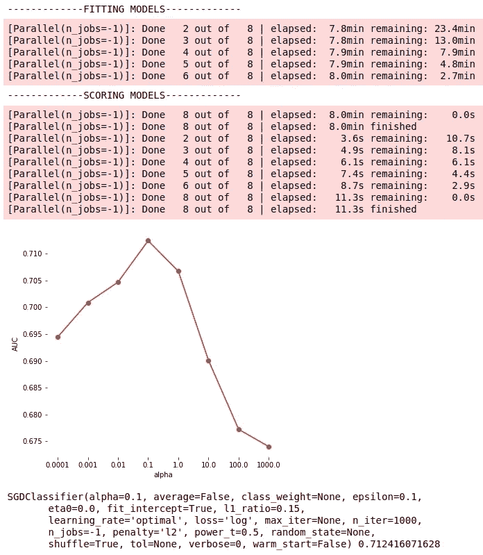

# 如何使用 parfit 使 SGD 分类器的性能与逻辑回归一样好

> 原文：<https://towardsdatascience.com/how-to-make-sgd-classifier-perform-as-well-as-logistic-regression-using-parfit-cc10bca2d3c4?source=collection_archive---------1----------------------->

对于大型数据集，使用 parfit 优化的超参数，我们可以在 LogisticRegression 所用时间的第三分之一内获得与 SGDClassifier 相当的性能。

**什么是 SGD 量词？**

SGD 分类器使用随机梯度下降实现正则化的线性模型。

**那么，什么是随机梯度下降？**

随机梯度下降在改变权重时仅考虑 1 个随机点，不同于考虑整个训练数据的梯度下降。因此，在处理大型数据集时，随机梯度下降比梯度下降快得多。Quora 上有一个很好的回答，详细解释了梯度下降和随机梯度下降的区别。

**我们已经有了逻辑回归，为什么还要关心 SGD 分类器？**

默认情况下，逻辑回归使用梯度下降，因此在较大的数据集上使用 SGD 分类器会更好。你可能想要使用 SGD 分类器的另一个原因是，如果你不能在 RAM 中保存数据集，逻辑回归，在其普通的 sklearn 形式下，将不会工作，但 SGD 仍然会工作。

**我们如何让 SGD 分类器表现得和逻辑回归一样好？**

默认情况下，SGD 分类器的性能不如逻辑回归。它需要一些超参数调整来完成。

**使用**[**par fit**](https://github.com/jmcarpenter2/parfit)**:**进行超参数优化

Parfit 是一个新的软件包，由我的同事和旧金山大学的 MSAN 学生 Jason Carpenter 编写。该软件包(使用并行处理)允许用户在模型上执行详尽的网格搜索，这使用户能够灵活地指定验证集、评分标准，并可以选择在输入的超参数网格上绘制分数。你可以在媒体上的[这篇文章中读到更多关于这个包的信息。](https://medium.com/@jmcarpenter2/parfit-hyper-parameter-optimization-77253e7e175e)

您可能希望使用 parfit 的一个关键原因是，它为您提供了在单独的验证集上评估指标的灵活性，而不像 GridSearchCV 那样使用交叉验证。交叉验证并不是在所有情况下都是好主意。您可能不想使用交叉验证的一个原因是当数据中有时间成分时。例如，在这种情况下，您可能希望使用最近 20%的观察值创建一个验证集。fast.ai 的 Rachel Thomas 写了一篇非常好的博文，关于如何(以及为什么)创建一个好的验证集。

在本文中，我将把验证集的性能作为“模型表现如何”的指标。这里的度量是' sklearn.metrics.roc_auc_score '。

# **Logistic 回归拟合:**

在这里，我们将使用带有“l2”惩罚的逻辑回归作为我们的基准。对于逻辑回归，我们将调整 1 个超参数 c。

C = 1/λ，其中λ是正则化参数。C 值越小，正则化越强。由于 parfit 并行拟合模型，所以我们可以为 C 提供大范围的参数，而不必太担心寻找最佳模型的开销。

**如何使用 parfit:**

*bestFit* 接受以下参数:

1.  模型:在我们的例子中，输入模型是逻辑回归。请注意，该函数只接受类作为输入，而不接受它的对象。
2.  *paramGrid* :运行模型的超参数的参数网格对象
3.  *X_train* ， *y_train* ， *X_val* ， *y_val* :训练和验证集
4.  *公制*:评估你的模型的公制。
5.  *bestScore* :返回通过“max”时的最高分。

它不仅返回*最佳模型*及其*最佳分数*，还返回*所有模型*及其*所有分数*。

Hyper Parameter Optimisation for Logistic Regression using parfit

**输出:**

后勤部门花了大约 26 分钟找到最佳模型。这么长的持续时间是为什么使用 SGDClassifier 而不是 LogisticRegression 是个好主意的主要原因之一。对于 C = 0.0001，我们得到的最好的 **roc_auc_score** 是 0.712。

让我们看看我们的最佳模型 roc_curve:

Code to plot ROC curve

AUC curve for Logistic Regression’s best model

# **SGD 分类器上的部分匹配:**

与逻辑回归相同，我们将对 SGD 分类器使用“l2”惩罚。这里需要注意的一个重要的超参数是 n_iter。sklearn 文档中的“n_iter”定义为

> 通过训练数据的次数(也称为时期)。”

sklearn 中的 n_iter 默认为 None。我们在这里将其设置为足够大的值(1000)。最近添加的 n_iter 的一个替代参数是 max_iter。同样的建议应该适用于 max_iter。

阿尔法超参数有双重用途。它既是一个正则化参数，也是默认时间表下的初始学习率。这意味着，除了正则化逻辑回归系数之外，模型的输出还取决于α和拟合程序执行的历元数(n_iter)之间的相互作用。具体来说，当α变得非常小时，必须增加 n_iter 来补偿缓慢的学习速率。这就是为什么当搜索大范围的α时，指定足够大的 n_iter 更安全(但是更慢),例如 1000。

Hyper Parameter Optimisation for SGD Classifier using parfit

**输出:**

请注意，SGD 分类器只花了 8 分钟就找到了最佳模型，而逻辑回归花了 26 分钟才找到最佳模型。此外，我们在 n_iter = 1000 时运行 SGD 分类器。SGD 分类器在α = 0.1 时给出最佳模型。最佳模型的 **roc_auc_score** 为 0.712，这与我们从逻辑回归得到的结果相似，精确到小数点后第三位。

现在，让我们看看最佳模型上的 AUC 曲线。

AUC curve for SGD Classifier’s best model

我们可以看到 AUC 曲线类似于我们在逻辑回归中观察到的曲线。

# 摘要

就像这样，通过使用 parfit 进行超参数优化，我们能够找到一个 SGD 分类器，它的性能与逻辑回归一样好，但只需要三分之一的时间就可以找到最佳模型。

对于足够大的数据集，最好实现 SGD 分类器而不是 Logistic 分类器，以便在更短的时间内产生相似的结果。

***生物:*** *我目前正在旧金山大学攻读分析(数据科学)硕士学位，并在 Manifold.ai 实习。此前，我曾在惠普企业云部门担任软件存储工程师。*

***领英:***[*https://www.linkedin.com/in/vpatlolla/*](https://www.linkedin.com/in/vpatlolla/)