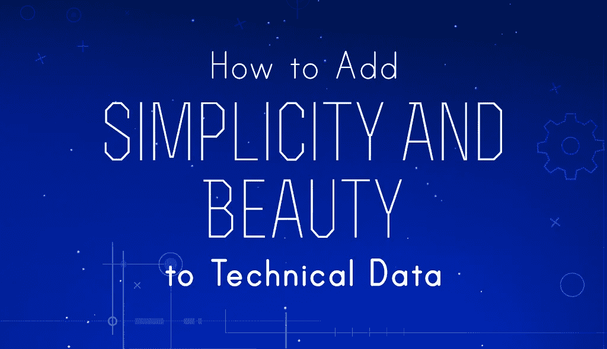
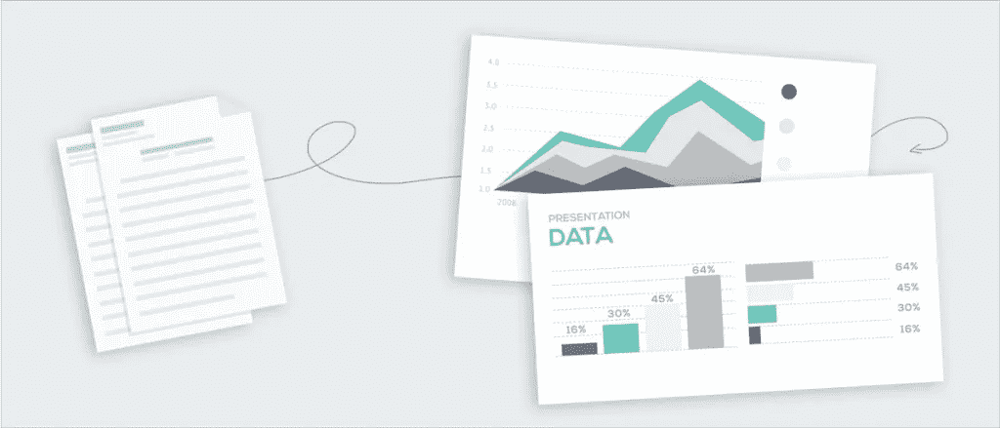
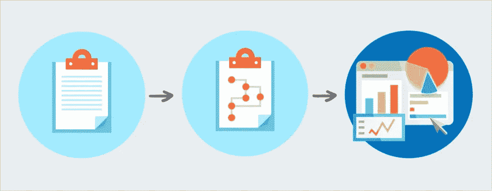
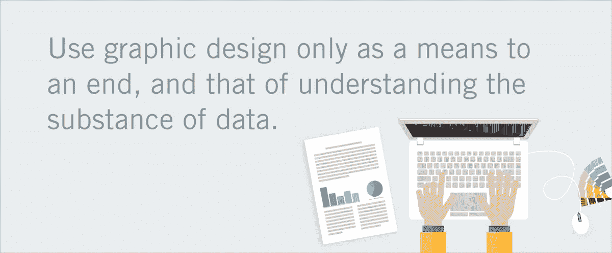
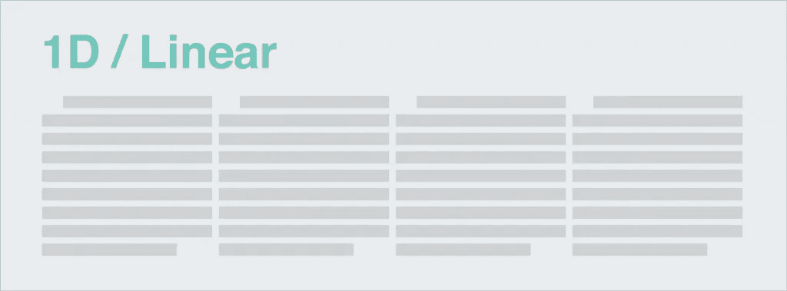
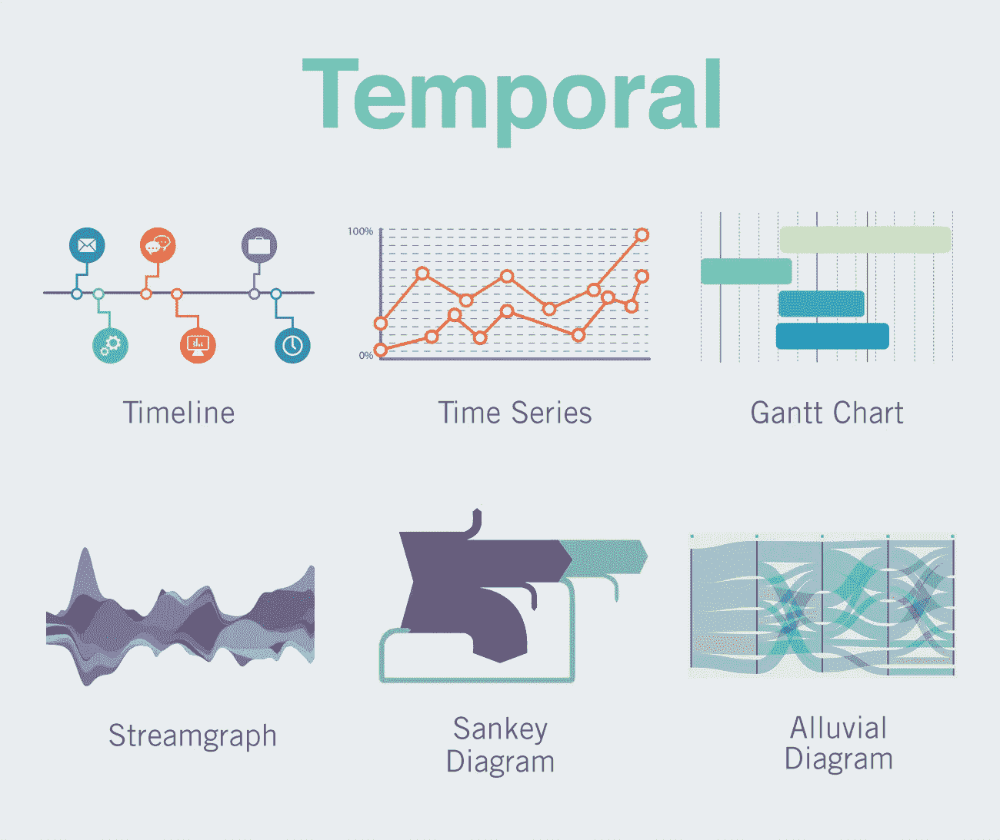

# 如何让技术资料简洁美观

> 原文：<https://towardsdatascience.com/how-to-make-technical-data-simple-and-beautiful-4724038bb74d?source=collection_archive---------10----------------------->

数据是任何演示或报告的支撑。它提供了真实的片断，这些片断共同构成了一幅精确的图像。

没有数据，营销人员会根据假设和推测来创建他们的活动，而不是确切地知道他们的客户想要什么。更不用说工程师从一开始就只会建造危险的建筑。甚至消费者也需要数据来知道如何相应地使用他们的新产品。

尽管技术数据无处不在，但它仍被视为冰冷而平淡。以下是一些关于如何通过内容和设计简单而漂亮地传达技术信息的技巧。

[相关:关于如何通过数据可视化吸引注意力的专家提示](http://blog.visme.co/data-visualization-tips/)

# 技术数据需要可视化升级

有四种学习方式，分别是视觉、听觉、读写和动觉。这意味着我们都以不同的方式理解信息。人们通常有一种主导风格，但他们也需要其他三种风格来吸收新内容的复杂图像。

可视化数据可以结合几乎所有的学习风格，以获得一个全面的方案。T2 1998 年的一项研究发现,**人对图像的记忆能力比文字更强。这是因为人们应该一次读一行。另一方面，只要看一眼就能理解图像。作家需要整个页面来描述一个场景。然而，一幅图像可以同时包含所有细节。**

视觉数据不仅仅是图像。它是关于找到一种方法来连接两个在文本中看起来不相关的元素。一旦信息被清楚地分类，视觉元素就可以进来表示内容。一旦他们每个人都有了自己的形式，与他们一起工作就很容易了。

数据解释器可以创建真实的场景，并使用地理定位来找到两个看似陌生的元素之间的联系。地理方位将使你能够找到两点之间的联系，就像人们在几何学中所做的那样。文本不能给你一个空间的解释，数据可以隐藏在背景后面。

例如，架构师使用数据可视化为每个真实元素分配一个可视化的解释。他们画了一条线来代替“墙”这个词。他们没有用“窗户”这个词，而是在墙上画了第二条线。每个元素在设计领域都有自己的诠释，并成为一种符号。

通过将复杂的图像简化为简单的线和点，建筑师可以很容易地发现某些联系。因此，建筑师的工作不仅需要设计技能，还需要广泛的解决问题的能力，我们都知道建筑师的收入。

# 如何交流技术信息

人们通过同化来学习。我们把一个完全未知的概念放在它在这个世界上的正确位置。我们需要理解它的意义以及它与我们已知的事物和概念的关系。例如，当我们学习一门新的语言时，我们将每个单词与现实中的物体或现象同化。

我们的课程越简洁明了，我们学得就越快。我们的人性要求我们在未知背后找到一个逻辑或理由。因此，史前时代把打雷或下雨之类的奇怪自然现象的原因，找到了神的力量。我们都知道这些影响的背后是科学，我们也知道了它与天气的联系。

因此，为了创建易于理解的技术数据表示，我们需要结构。新信息必须符合逻辑。如果没有这个组织，就只会有一些随机的数字和短语。

为了简化，您的技术数据需要组织。人们需要一个逻辑的开头、中间和结尾来理解和掌握新的概念。因此，任何清晰的视觉数据都应该尊重[五个逻辑结构之一](http://blog.visme.co/types-of-infographics/):

*   位置；
*   字母表；
*   年表；
*   类别；
*   等级制度。

如果没有这些结构，将会有大量紧凑的无限数据。这个世界运行在复杂的规则和方程上，一个人的一生不足以掌握所有的规则和方程。

但是人们不需要知道所有的事情。通过在逻辑结构中构建一个精确的主题，你向他们感兴趣的主题传递了意义。

# 如何化简单为有效

简单性和结构本身不足以支持有效的视觉数据。他们需要一个共同目标的帮助。报告的目的是什么？数据为什么问题提供了解决方案？因此，任何技术内容都应致力于[以下一个或几个功能](http://www2.cs.uregina.ca/~rbm/cs100/notes/spreadsheets/tufte_paper.html):

*   以可视结构显示数据；
*   把平面设计仅仅作为达到目的的一种手段，以及理解数据实质的一种手段；

*   避免在普通文本中不恰当的短语组合后出现的曲解；当你使用数据而不是文本时，你回避了可能导致多种解释的单词的上下文性质；
*   提供大量与图形主题相关的重要数字；
*   为大型数据集提供清晰度；
*   使用户能够在图形或数字元素之间进行比较；

*   激活几个层次的概述，从一个领域的广泛描述到深入的部分；
*   尊重以下[简明目的](http://www.carleton.edu/departments/LIBR/startseeingnumbers/pages/TufteNotes.html)之一:
*   装饰(用令人愉快的设计来组织数据，使其更容易消化)；
*   制表(将数据分类成表格形式)；
*   描述(概述数据的背景和来源)或探索(根据收集的数据形成分析的行为；
*   将统计数据和文字描述整合到图形中。

# 数据可视化的类型

既然我们已经介绍了简单性在交流技术信息中的重要性，那么是时候将数据可视化集成到设计精美的图形中了。有许多方法可以赋予数据视觉元素和意义。下面是一个复杂的可视化类型列表，可以用逻辑和精确的图形来组织数据。

# 1.1D/线性

这种一维结构可以由我们所知道的[物品清单](http://uark.libguides.com/c.php?g=79179&p=511885)来定义。虽然这是最常用的视觉类型，但它确实缺乏深度。观看者无法执行逻辑关联，其项目之间的联系隐藏在多维主体的缺失之后。

# 2.2D /平面

这是一种综合类型的图形，依赖于地理解释。它的主要目的是综合描述真实区域(如国家、城市或社区)的数据。有几种方法可以释放平面可视化的潜力，甚至可以产生[交互式地图](http://blog.visme.co/create-interactive-map/)。

*   这是一张以颜色或图案分类的地图。它的目标是提供一个总体视图，显示某个特征(如人口密度)在不同地区之间的差异。
*   **图表:**这种类型的地图用土地面积或距离代替某些变量。例如，可以改变地区的大小，以显示与其他地区相比有多少公民。
*   **点分布图:**这种地图表示使用点来表示特定区域内特定因素的存在。一个点代表数据记录的现象的位置。因此，观察某一代理人在整个国家的影响是很方便的。
*   **比例符号图:**与图表样式一样，比例符号的任务是在地图上的精确位置显示现象的正确表示。这些符号可以根据它们的数量改变它们的大小。
*   **等高线图:**这是一种用不同函数的曲线来表示数据的地图。

# 3.三维/立体

这种类型的可视化为[提供了广泛的方法来表示三维记录的数据](http://www.webdesignerdepot.com/2009/06/50-great-examples-of-data-visualization/)，三维是长度、宽度和高度。

这是完美的可视化风格，使观众能够理解空间中的联系。很容易找到独特的角度和数据元素的组合，否则在 2D 或 1D 的表现中看不到。

# 4.暂时的

*   **时间线:**时间线尊重年代规律。数据的逻辑发展尊重时间线，使观众能够理解数据的演变。
*   **时间序列:**这是一个可视化列表，其中数据元素在时间或空间维度上接收它们自己的点。通过将它们之间的点按时间顺序连接起来，你就获得了一个描绘某个领域起伏的图形。基于时间序列，专家有足够的数据来准确预测该领域的未来。
*   **甘特图:**其实就是一个关注项目进度的条形图。有一个预先确定的时间段，在该时间段中，由图形表示的工作活动出现在它们发生的精确时刻。甘特图用于记录项目管理的有效性以及其他有用的功能。
*   **流图:**流图有一个中轴，通常是时间线。在这个轴上流动的是某个领域中记录的一些变量。最受欢迎的流图之一是《纽约时报》制作的，用来比较电影票房收入。
*   **桑基图:**数据用箭头表示，根据其影响程度改变大小。
*   **冲积图:**这种可视化技术以时间轴为轴，用水平线根据一个系统的发展历史来改变它们的轨迹。

# 5.多维的

最复杂的数据可视化提供了最全面的解决方案。很难在多维领域保持相关性。然而，最终结果将把复杂的结构变成简单的图形。

从这里开始，将它们之间的元素联系起来并理解它们如何作为一个整体一起工作就变得非常简单了。

*   **饼状图:**这是一个圆形，有多个切片。每一段代表一个变量。该图简化了几个数值因子之间的定量比例。
*   **直方图:**描述了概率分布的估计。有两个轴通常代表时间和数量。
*   **标签云:**用于突出关键词元数据。这些单位随机显示。它们的规模越大，就越重要。
*   **泡泡云:**酷似标签云。然而，在这种情况下，每个术语都有自己的气泡。但它们的重要性仍由泡沫的大小来衡量。
*   **树形图:**遵循层次规则。每个元素接收自己的矩形，矩形可以有自己的更小的矩形作为子分支。在树状图中，创作者可以使用颜色来标记几个分支之间的某种相似之处。矩形的大小象征着它的尺寸或相对于其他的成功。
*   **散点图:**使用笛卡儿坐标，根据变量的值将它们放置在正确的位置。最终结果看起来像是代表数据的图形表示的点的集合。
*   **面积图:**表示定量数据的逼真图形。使用这种类型，您可以比较几个折线图来衡量它们之间的差异。商务人士用它们来记录某个领域最流行的趋势。
*   **热图:**这是一个矩阵，其中的变量有特定的颜色。颜色编码很精确。例如，红色表示高活动，而黄色表示较低的记录。
*   **平行坐标:**这种可视化技术采用高维几何，通过依赖于几条垂直线的平行线来表示数据。人们将它们用于空中交通管制、数据挖掘、计算机视觉和优化。

总而言之，技术数据的有效性取决于简单性和可视化表示。简单意味着以某种方式组织数据，使其服务于一个单一的目标。

美感和视觉表现对鼓励观众理解数字和其他记录所描述的系统至关重要。一旦用户接受了某个主题的教育，数据就完全达到了目的。

# 轮到你了

如果你想知道是否需要高级专业知识——甚至是数据科学学位——来创建这些类型的数据可视化，也有大量针对初学者的**易于使用的信息设计工具**可以帮助你在几分钟内创建交互式图表、图形和信息图。

您可以尝试的一个选项是 Visme，这是一个一体化的可视化内容创建工具。 [**点击这里**](https://www.visme.co/make-infographics/) **免费试用。**

如果你有任何关于如何向非技术受众传达技术信息的信息设计技巧和建议，请在下面的评论区给我们留言。

*本帖* [*原版*](http://blog.visme.co/how-to-communicate-technical-information/) *最早出现在 Visme 的* [*视觉学习中心*](http://blog.visme.co/) *。*