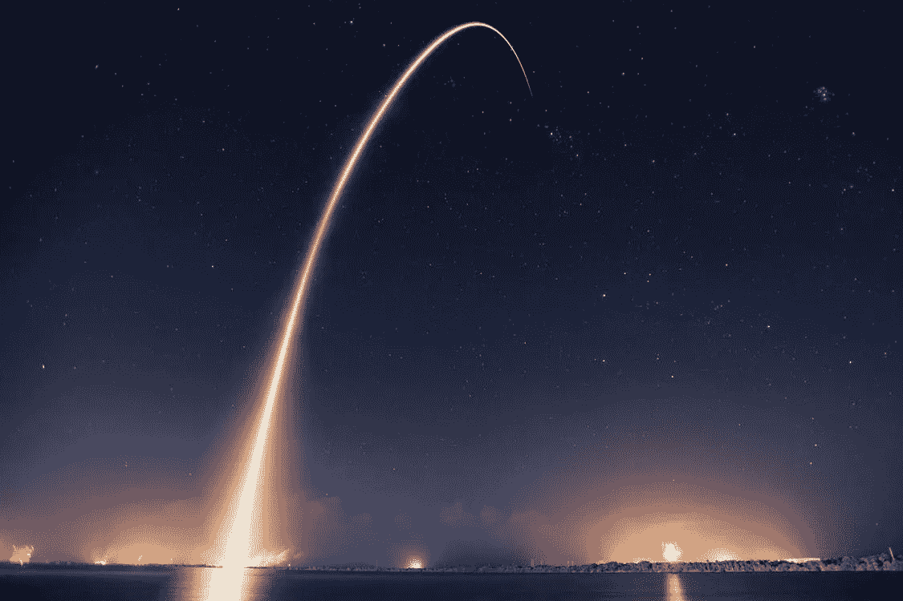
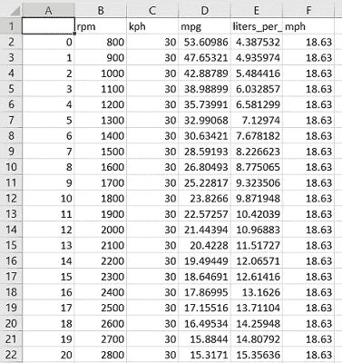
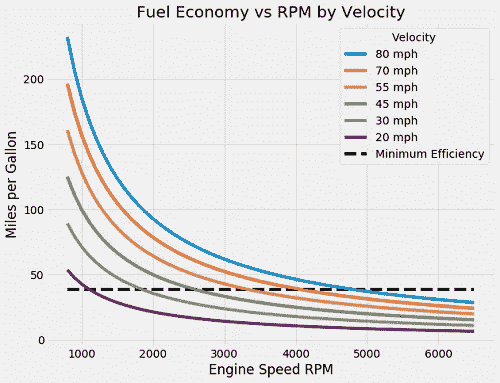
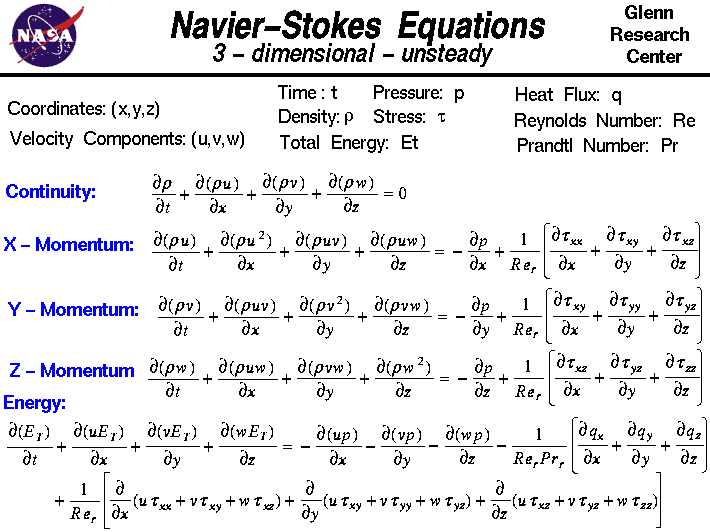

# 如何掌握新技能

> 原文：<https://towardsdatascience.com/how-to-master-new-skills-656d42d0e09c?source=collection_archive---------4----------------------->

**为什么尽量避免电子表格是学习数据科学的最佳方式**

学习新技能的最好方法是用它来解决问题。在我以前作为一名航空航天工程学生的生活中，我花了几个小时在 Excel 中编写复杂的公式来做从设计机翼到计算航天器再入角度的一切事情。经过几个小时的努力，我会用平淡无奇的 Excel 图表来展示结果，这些图表主宰了许多幻灯片。确信这不是一个最佳的工作流程，我决定学习 Python，一种常见的编码语言，仅仅是为了避免把我醒着的时间都花在 Excel 上。

在 Al Sweigart 的 [*的帮助下，用 Python*](https://automatetheboringstuff.com/) 自动处理枯燥的东西，我学会了足够多的语言，将我在 Excel 中花费的时间减少了 90%。我没有记忆基础知识，而是专注于有效地解决航空航天问题。我很快就完成了作业，当我在课堂上展示 Python 图形时，有人问我使用了哪种神奇的技术。甚至不用尝试，我就获得了一个能把混乱的电子表格转换成清晰图像的人的名声。

The difference between data (left) and knowledge (right)

具有讽刺意味的是，只有当我达到我所在领域的顶峰时，我才决定转向数据科学。当我在美国国家航空航天局做航天工程师实习生时，我周围都是这个国家最聪明的人。然而，这些人的才华受到了严重限制，因为他们最终花了大部分时间钻研现代数据的诅咒:Excel 电子表格。这些人致力于扩展人类对宇宙的知识，实际上是在电子表格中做火箭科学！就在那一刻，我意识到，作为一名帮助人们从数据中理解事物的数据科学家，我会比作为一名航空航天工程师产生更大的影响。

尽管我当时正在执行一项任务，将一颗卫星送入太空(近地小行星侦察任务)，但我对这项工作感到沮丧，因为它主要涉及数小时的翻阅数字。通常，这些电子表格已经使用多年，人们相信这些数字，尽管不能理解这些公式。我最终放弃了试图理解电子表格，而是开始使用我所知道的一点点 Python 来自动计算。基于我在学校试图逃离电子表格时获得的有限知识，并使用我从 Stack Overflow 复制和粘贴的一些代码，我能够提高我的工作效率和质量。

Not pictured: the millions of lines of Excel behind the ISS

我试探性地向同事们提到有一种更好的方法来完成他们的工作。尽管他们持怀疑态度，但他们已经看到了我的成果，并愿意倾听。在向他们展示了一些我编写简单代码来代替手工编辑电子表格的例子后，他们开始接受这个想法。起初，我为他们编写脚本，这是一项我很乐意承担的任务，因为几行代码就大大减少了我的工作量，但最终他们能够开始编写自己的脚本了。(虽然我确实说服了他们写代码，但几乎都是用 Matlab 甚至 Fortran。有些事情你就是改变不了！)在几周的时间里，我从一名卑微的实习生变成了我所在部门的首席数据顾问。

这个真实的应用程序说明了两个关键点:

*   新技能是从解决问题中学习的，而不是从理论中学习的
*   **不需要多少知识就能达到有用的结果**

与传统的教育模式相反，我们首先开发应用，然后形成理论，而不是相反。内燃机是历史上最有影响力的技术之一，它是由工程师而不是理论家几十年的修补成果。只有在发动机被发明出来之后，发动机工作原理的理论才变得清晰起来。我学习编程和数据科学不是靠记忆数据结构和公式的细节，而是靠写代码解决问题。一路上，我学到了很多本可以在书上读到的基础知识。现在当我学习一种新的机器学习方法时，我会直接将其用于真实数据，而不是研究公式。通过实际操作而不是在页面上看到模型，我可以更好地理解模型是如何工作的。

Theory vs Application. Only one actually flies.

人们通常认为他们需要成为某个领域的专家才能做出贡献。这使得他们甚至无法开始学习一项新技术，因为他们认为这项技术需要几年才能派上用场。我在 NASA 的经历为这种误解提供了一个反例。数量有限的正确知识，在这种情况下是数据科学，可能非常有影响力。我没有等到对编码了如指掌，而是应用了我所知道的，并取得了有益的结果。

罗马不是一天建成的，这句老话意味着大型项目需要多年的努力。然而，这里有一个更重要的信息:一个完整的城市不需要在有用之前就建成。即使只有几户人家，一个城市仍然有它的用途。半个罗马比没有罗马好，正如有些知识比没有知识好。每一栋新房子或每一个额外的知识都会在积极的反馈循环中激发更多的成长。关键是在学习过程中不断解决问题，而不是等到掌握了一门学科才使用！

这些想法应该鼓励任何想学习新技能或转换领域的人。如果你认为学习一门技术需要太长时间，或者你对基础感到厌烦，不要担心！简单的东西是乏味的，你最好通过解决问题和学习过程中的基本原理来学习。此外，意识到你可以用有限的正确知识获得有用的结果。解决一些基本问题，并在复杂性增加时根据需要提高技能。

因为我们已经使用了一个陈词滥调，这里有另一个:“种树的最佳时间是 20 年前。第二好的时间是今天。”不要后悔在学校时没有学习编程——或者任何技能——而是想想你将来想知道什么！找出你(或你的同事)需要解决的问题，并开始学习。现在回过头来看，我的数据科学之路并不是一帆风顺的规划出来的，而是通过解决问题，稳步获取工具而进化出来的。现在是自学的最好时机，扩展你技能的最好方法就是开始解决问题！

一如既往，我欢迎反馈和建设性的批评。可以通过 Twitter [@koehrsen_will](https://twitter.com/koehrsen_will) 找到我。

我要感谢 Taylor Koehrsen (PharmD no less！)对她的编辑帮助。