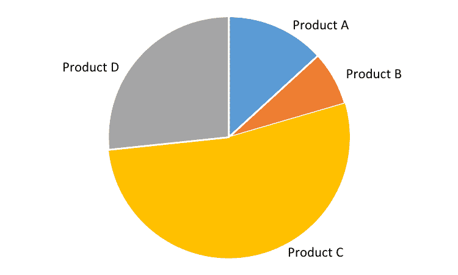

# 如何恰当地用数据讲述一个故事——以及要避免的常见陷阱。

> 原文：<https://towardsdatascience.com/how-to-properly-tell-a-story-with-data-and-common-pitfalls-to-avoid-317d8817e0c9?source=collection_archive---------1----------------------->

使用数据最重要的一个方面，但最不受重视的是如何传达数据告诉你的信息。即使你每天都遵循我们关于数据驱动的所有建议，如果你传达你的见解很差或者误导了观众，这可能比根本不使用数据更糟糕。

历史上一些最糟糕的商业决策都是由数据驱动的！当百事可乐的崛起威胁到可口可乐在软饮料领域的主导地位时，可口可乐采取了数据驱动的方法来解决这个问题。他们配制了新的可口可乐，并在全国范围内的口味测试中发现，它轻而易举地击败了百事可乐。有了确凿的数据，该公司把他们的未来押在了新可乐上。

不幸的是，新可乐的部分故事被遗漏了。新可乐非常甜，所以它很容易赢得品尝测试，顾客只喝一小口，但喝满一杯或一瓶就不喜欢了。此外，测试人员未能衡量消费者对旧口味可乐的情感依恋，他们是伴随着旧口味可乐长大的。如果没有测试数据的背景，决策者就会忽略消费者不喜欢新可乐的事实。在一次灾难性的推出后，公司不得不绝望地回到最初的模式。[1]

在这篇文章中，我将展示讲故事如何影响人们以不同的方式看待相同的数据。我们将以三种不同的方式讲述一组数据的故事，这意味着三种不同的结论。下面是我们将使用的数据，这是一家拥有四种产品的公司的月收入数据:

从原始数据中无法得出明显的结论，我们需要做数据专家的工作，探索数据，讲述隐藏的故事。关于这些数据，我们会讲述哪些故事？具体来说，我们将涵盖:

*   第一部分——谎言的故事
*   **第二部**——误导人的故事
*   **第三部**——告知的故事
*   **第四部分** —一般讲故事

> [**离群值**](http://outlier.ai/about-outlier/) **监控您的业务数据，并在发生意外变化时通知您。**我们帮助营销/发展&产品团队从他们的业务数据中获取更多价值。[今天安排一次演示](http://outlier.ai/about-outlier/)。
> 
> - Outlier 是 Strata+Hadoop World 2017 观众奖得主。

# **第一部分。谎言的故事**

*首先，我要告诉你一个关于我们的数据(上面提供的)的故事，这是一个故意撒谎的好消息。*

收入增长迅速，12 月份比 11 月份大幅增加。您可以在下面的收入图表中看到这一点:

这一增长得益于产品 D 收入的 1，150%的跃升！如果这一趋势持续下去，我们预计 1 月份的总收入将首次超过 10 万美元。对于公司来说，这是一个激动人心的时刻，这种增长是我去年 6 月所做战略决策的直接结果。

**这个故事为什么好？**

不是，是骗人的。

**为什么这个故事不好？**

我在数据故事中使用了一些非常常见的技巧来欺骗你去读更多的东西。具体来说:

*   **操纵音阶**。查看图表时，您习惯于比较条形的大小来确定相对大小。通过让 y 轴从一个任意值开始，而不是从零开始，我改变了相对大小，使它看起来好像在没有增长的地方有显著的增长。
*   **樱桃采摘**。我只选择了几个数据点来说明我的情况(产品 D 的增长率)，而没有考虑数据的全部广度及其真正传达的内容。
*   **下结论**。尽管没有明确的逻辑依据，我还是根据数据得出了结论。为什么我去年 6 月做出的决定会影响 12 月的收入？

在这种情况下，我是恶意的，故意撒谎。

# **第二部分。误导人的故事**

*接下来，我要告诉你一个关于我们的数据的故事，这个故事是真实的，但却具有误导性:*

总的来说，所有产品的收入相当平均。产品 D 的收入在 12 月份出现了一个明显的例外，环比增长超过 1000%。

然而，单一产品的收入支配着所有其他产品——产品 C 占总收入的 50%以上。这意味着产品 C 的收入大于其他三种产品的总和。

**这个故事为什么好？**

这个故事是真的，这是一个好的开始。通过在第一个图表中使用相对标度，产品 D 的显著偏差变得非常清楚。这个故事试图通过对产品构成的一些洞察来分解整体趋势，但没有成功。

**为什么这个故事不好？**

这是非常误导人的。我在交流数据时犯了一些常见的错误，这让作为观众的你很容易得出不准确的结论。

*   **缺乏清晰度**。我还没有标记我的图表或我的讨论中的坐标轴！在第一个图表中，y 轴是增长率，而饼图是 12 月的收入。然而，因为你没有办法知道你可以得出各种不同的结论。
*   **混乱的图表**。这两个图表会切换哪些颜色代表哪些产品。黄色代表第一个图表中的产品 D，第二个图表中的产品 C！如果你快速阅读这篇文章，你可能会认为快速增长的产品是最大的，这是不正确的。
*   **没有上下文**。我提到产品 D 增长超过 1000%，但不是绝对值是多少！例如，从 1 美元增长 1000%是 11 美元，变化 10 美元，但从 100 美元增长 1000%是 1100 美元，变化 1000 美元。避免在没有提供适当上下文的情况下使用相对度量。

最后，我使用了一个饼状图，很多数据可视化的人认为这是一个[的大错误](http://outlier.ai/2016/09/16/data-visualization-representing-proportions-accurately/)。

# 第三部分。精彩故事

*让我们最终讲述我们数据的真实故事，并以此强调过去两个故事的糟糕程度。*

总体而言，过去一年的收入呈下降趋势(虚线)。夏季有一个明显的峰值，春季和秋季有所下降，根据前几年的数据，预期范围(绿色条)加强了这一季节性趋势。下面是显示这一趋势的总收入图表:

正如你所看到的，四月和五月是这一趋势中稍微反常的月份，但是总的来说收入模式是非常一致的。

隐藏在这一整体趋势下的是收入构成的转变。**产品 A** 在这一年中一直在下降，而**产品 C** 一直在上升。12 月，产品 C 的收入大幅增长，这是第一个月产品 C 的收入高于产品 a。

如果这种趋势持续下去，我们可以预期下一年的收入会增加。

**这个故事为什么好？**

这个故事遵循了许多数据叙事的最佳实践:

*   **先说大图**。将您所有的数据通信放在一个更大的框架内。在这种情况下，故事首先陈述了总收入呈下降趋势，看起来是季节性的。
*   **显示上下文**。通过在第一张图中突出整体营收的预期区间和线性趋势，更容易把握隐藏在数据中的更大格局。这些视觉引导是解释原始数据的重要背景。
*   **突出重要驱动因素**。通过识别总收入的两个重要驱动因素(产品 A 和 C)并描述它们之间的关系，隐藏在顶部图表中的洞察力变得清晰。这与挑选樱桃数据不同，因为我们强调的是数据中有意义和重要的驱动因素。

最重要的是，在这种情况下，我让数据来讲述故事，而不是试图用数据来讲述故事。这是很重要的一点，因为如果你试图让你的数据符合一个现有的故事，你将无法讲述整个故事。

**为什么这个故事不好？**

不是，虽然我可以说得更详细些。总的来说，我很满意。

像大多数诚实和直接的数据故事一样，结论远不如我们撒谎或误导时那么清晰。这是因为真实世界的数据很少给我们一个单一的、清晰的信息。你需要依靠你的专业知识和听众的判断来得出结论。

# **第四部分。一般讲故事**

我们回顾了好故事和坏故事，都是关于相同的数据。由于您将讲述关于您自己的数据的故事，因此让我们回顾一下围绕传达您自己的数据见解的最佳实践。

**做…**

*   **先说大图**。将您所有的数据通信放在一个更大的框架内。这让你的听众更容易理解，给你的故事一个强有力的开始。
*   **显示上下文**。你提供的语境越多，无论是视觉上的还是语言上的，你的听众就越不可能得出错误的结论。
*   **突出隐藏的见解。**您的数据中许多最重要的见解都隐藏在表面之下。突出这些，并将它们与总体指标进行对比，以形成一个强有力的故事。

**不要…**

*   **操纵标尺**。明确数据的刻度和单位，厌倦多轴图表[。与其让观众产生误解，不如就图表的背景进行过多的交流。](http://outlier.ai/2016/09/15/data-visualization-comparing-multiple-measures-on-the-same-plot/)
*   **樱桃采摘数据**。在你的沟通中包括全面的数据，而不仅仅是有助于你的案例的数据点。
*   **不一致**。在你的故事中，所有的陈述和可视化都使用相同的颜色、标签和惯例。这样做可以为您的数据创建一种自然语言，一种您的受众可以学习的语言。
*   **谎言**。说真的，就是不要。

总的来说，让数据来讲故事。避免试图使用数据来证明现有的决策或讲述现有的故事，因为这些途径注定会导致错误和失误。如果你让数据引导你，故事会自己告诉你。

> [**离群值**](http://outlier.ai/about-outlier/) **监控您的业务数据，并在发生意外变化时通知您。**我们帮助营销/发展&产品团队从他们的业务数据中获取更多价值。[安排今天的演示](http://outlier.ai/about-outlier/)。
> 
> - Outlier 是 Strata+Hadoop World 2017 观众奖得主。

[1]如果你想了解更多，Snopes 对新的可口可乐灾难有一个很好的分析。