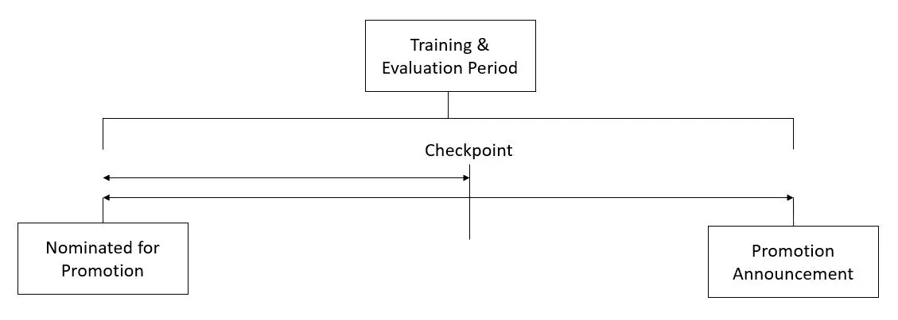
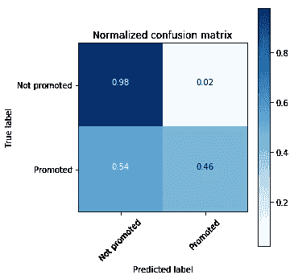

# 如何用机器学习节省 HR 的时间

> 原文：<https://towardsdatascience.com/how-to-save-hrs-time-with-machine-learning-b6f2226b789d?source=collection_archive---------2----------------------->


上周末，我参加了 [WNS 分析向导 2018](https://datahack.analyticsvidhya.com/contest/wns-analytics-hackathon-2018/) ，机器学习在线黑客马拉松。在 72 小时内，1000 多名参与者解决了 WNS 分析公司的一个任务。在这篇文章中，我将描述一种技术方法，它帮助我在这次活动中获得了第四名，并给你一些关于我的解决方案的商业价值的想法。

# 挑战简介

在这场竞争中，我们的客户是大型跨国公司 WNS 分析公司。他们想让我们找到合适的人选来升职。目前，这一过程包括几个步骤:

1.  他们首先根据推荐和过去的表现确定一组员工；
2.  被选中的员工将接受每个垂直行业单独的培训和评估计划。这些计划基于每个垂直行业所需的技能；
3.  在计划结束时，根据各种因素，如培训绩效、KPI 完成情况(仅考虑 KPI 完成率高于 60%的员工)等。，一名员工获得晋升。



The pipeline of a promotion process

正如你可能猜到的，整个过程需要很多时间。加快速度的一个方法是在检查点确定合适的候选人，这样公司可以节省时间和金钱。我们将使用数据驱动的方法来预测候选人是否会被提升。我们的预测将基于员工从提名晋升到关卡的表现以及人口统计特征的数量。

竞赛问题被公式化为一个二元分类任务，评价指标是 [F1 得分](https://en.wikipedia.org/wiki/F1_score)。训练集包括 54808 个样本，测试集包括 23490 个样本。只有 8.5%的员工被推荐晋升。


Dataset features explanation

# 验证策略

验证策略在所有数据驱动的任务中至关重要，尤其是在竞赛中。在比赛开始时，我假设测试数据来自不同的分布，然后是训练数据。如果训练/测试分割是由某个时间变量完成的，而组织者并没有提供该时间变量，则可能会出现这种情况。在这种情况下，`StratifiedKFold`进行的简单验证得出的分数可能会高估我们的真实分数和在排行榜上的预期位置。

我决定根据属于测试集的可能性，将训练数据集分成若干部分。这是一种简单而强大的技术，用于处理训练/测试零件中的不同分布。这种方法的思想很简单:在解决任何机器学习任务之前，我们计算每个训练样本出现在测试集中的可能性。它允许我们:

1.  确定明显区分训练数据集和测试数据集的特征。这些特征经常导致过度拟合(即它们是无用的)，我们可能会丢弃它们以增加模型的分数。此外，我们可能会从这些特性的本质中获得一些见解；
2.  确定与测试示例非常相似的训练样本(即“异常值”)。我们可以照亮这些样本，在训练期间给它们较低的权重，或者在训练和验证期间给它们较低的权重。根据我的经验，它总是在验证和排行榜上增加一个分数；
3.  进行更好的验证。我们希望我们的验证折叠具有与测试集完全相同的分布(这正是验证的理念)。通过在折叠中随机分割训练，我们可能会在这样一种情况下结束，其中几个折叠由与测试集相似的例子组成。我们不能依赖这种分裂的分数，因此我们的验证是无用的。通过作为测试集的一部分的相似性进行划分可以帮助我们克服这个问题。

为了执行这项技术，我添加了一个新的特性:`is_test`，它等于训练部分的`0`和测试部分的`1`。我将两个数据集结合在一起，预测了新的目标— `is_test`。

```
import pandas as pd 
import numpy as np
from scipy.stats import rankdata
from [sklearn.model_selection](http://scikit-learn.org/stable/modules/classes.html#module-sklearn.model_selection) import cross_val_predicttrain['is_test'] = 0
test['is_test'] = 1
train_examples = train.shape[0]
train = train.drop('is_promoted', axis=1)
data = pd.concat([train, test], axis=0).reset_index(drop=True)data_x = data.drop('is_test', axis=1)
data_y = data['is_test']is_test_probs = cros_val_predict(some_ml_model, data_x, data_y, method='predict_proba')[:train_examples]train['is_test'] = rankdata(is_test_probs)
bins = np.histogram(train['is_test'])[1][:-1]
train['is_test_bins'] = np.digitize(train['is_test'], bins)# use 'is_test_bins' as stratification
```

然而，这种方法在这次比赛中并没有帮助我。该任务的 AUC 分数约为 0.51，这清楚地表明分类器不能区分训练和测试部分(测试数据类似于训练数据)。我决定用 11 折的`StratifiedKFold`来代替。

# 预处理和特征工程

我用一个新的类别`missing`填充了`education`和`previous_year_rating`中缺失的值。所有其他要素都没有缺失值和异常值，该数据集使用起来非常舒适。

我添加了一些特征，作为分类特征和与员工年龄相关的特征的组合，它们略微增加了分数:

```
train['work_fraction'] = train['length_of_service'] / train['age']
test['work_fraction'] = test['length_of_service'] / test['age']train['start_year'] = train['age'] - train['length_of_service']
test['start_year'] = test['age'] - test['length_of_service']
```

此外，我注意到`avg_training_score`是分类器的一个重要特性，所以我创建了一堆带有分类特性和`avg_training_score`的组合。例如，新特性`avg_training_score_scaled_mean_department_region`是`avg_mean_score`除以特定地区和部门的平均分数的结果。从下图中可以清楚地看到，这种类型的归一化对于分类器来说是一个很好的特性。一个人的分数高于所在部门的平均水平，就有更大的机会得到提升。


The distributions of ``avg_training_score`` for a positive and negative target are presented on left figure. The distributions of `avg_training_score divided on the mean scores of each department_region` are presented on the right figure

为了使我的模型多样化，我使用了几种方法来处理分类特征:标签编码、一键编码和[均值编码](/smarter-ways-to-encode-categorical-data-for-machine-learning-part-1-of-3-6dca2f71b159)。均值编码通常会增加具有多层次分类特征的任务的得分。但另一方面，平均值编码的不正确使用可能会损害分数(见下图)。均值编码的正确方法是将数据集分成几个折叠，并在每个折叠内分别执行均值编码。


Results of playground experiments with [Click-Through Rate Prediction](https://www.kaggle.com/c/avazu-ctr-prediction) dataset and mean encoding (LogLoss metrics). The wrong approach to mean encoding will gradually increase CV score, but dramatically decrease leaderboard score

# 训练有素的模特

我在 11 个折叠(总共 55 个模型)上用不同的预处理策略训练了 3 个 CatBoost 和 2 个 LightGBM:

1.  CatBoost — 1
    旧功能+标签编码
2.  CatBoost — 2
    旧功能+新功能+标签编码
3.  CatBoost — 3
    旧功能+新功能+平均编码
4.  LightGBM — 1
    旧功能+新功能+ MeanEncoding
5.  LightGBM — 2
    旧功能+新功能+ OHE

对于每个模型，我在`StratifiedKFold`中对不同的模型使用了不同的种子(只要我不打算堆叠，那就可以了)。对于每个折叠，我根据折叠的 F1 分数来确定最佳阈值。最后的预测是 55 个模型的主要投票。最佳单个模型的交叉验证 F1 得分为 0.5310，最终模型为 0.5332，私人得分为 0.5318(公共排行榜第 20 位，私人排行榜第 4 位)。永远相信你的简历！



Row-wise normalized [confusion matrix](https://en.wikipedia.org/wiki/Confusion_matrix) of the best submit, F1 score is equal to 0.5432

# 总结

我们如何解释这场比赛的结果？我认为有很大的改进余地。首先，我认为问题的焦点应该从“谁应该被提升？”到“员工必须做些什么才能获得晋升？”。在我看来，机器学习工具应该为一个人指明道路，这样他就会有清晰的理解和动力在工作中取得成功。一个小小的焦点改变会让一切变得不同。

第二，在我看来，即使是最好的模型，分数结果也是相当差的。如果它的性能比人更好，这可能是有用的，但 WNS 分析公司可能会考虑在决策过程中添加更多数据。我说的是增加更多与促销过程无关的功能，而是在促销过程开始之前，增加与员工工作相关的 KPI。

最后，我为这次比赛的结果感到高兴。对我来说，这是一场很好的比赛。在这次竞赛中，我已经在真实世界的数据集上测试了几个想法；设置半自动管道进行混合和堆叠；处理数据，并完成了一些明显的特征工程以外的工作。

更别说很好玩了:)