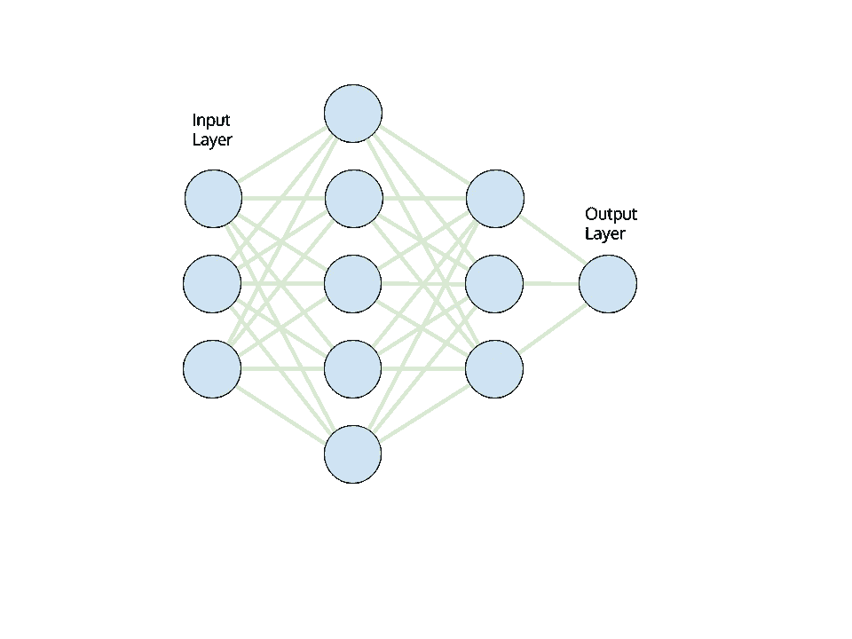
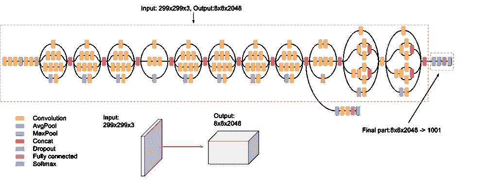
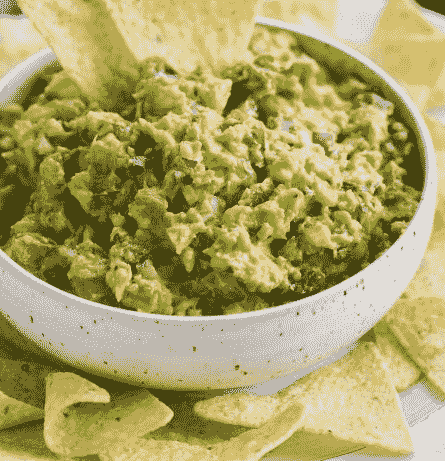

# 如何训练你的模型(大大加快)

> 原文：<https://towardsdatascience.com/how-to-train-your-model-dramatically-faster-9ad063f0f718?source=collection_archive---------6----------------------->


## **学习使用迁移学习，用 Python 编码的例子。**

我在[Unbox Research](http://unboxresearch.com)——[Tyler ney lon](http://tylerneylon.com)的新 ML 研发工作室担任机器学习工程师。我刚刚完成了一个项目，为一个客户实现了一个定制的图像分类器 iOS 应用程序——在这种情况下，迁移学习是一个强大的工具。

迁移学习是一种有效地、部分地重新训练神经网络的技术。为此，我们重用先前构建的模型架构和大部分学习到的权重，然后使用标准训练方法来学习剩余的、未重用的参数。

**迁移学习 vs 非迁移学习**



Figure 1: Model architecture for a standard neural network model, with green color indicating the training of all weights and biases.

经过充分训练的神经网络在初始层中获取输入值，然后顺序地将该信息向前馈送(同时对其进行转换),直到关键的是，某个倒数第二层已经构建了可以更容易地转换为最终输出的输入的高级表示。该模型的完整训练包括在每个连接中使用的权重和偏差项的优化，用绿色标记。

倒数第二层被称为瓶颈层**层*。瓶颈层将回归模型中的值或分类模型中的 softmax 概率推送到我们的最终网络层。*

**

*Figure 2: Model architecture for a transfer-learning neural network model, with red color indicating fixed weights and biases, and green color indicating the training of just the final layer’s weights and biases.*

*在迁移学习中，我们从整个网络的预训练权重开始。然后，我们将权重固定到最后一层，并让该层中的权重随着我们对新数据的训练而变化。如图所示，我们保持红色连接不变，现在只重新训练最后一层绿色连接。*

***传输效率***

*迁移学习有两大好处:*

1.  *对新数据的训练比从头开始更快。*
2.  *如果我们从零开始，我们通常可以用比我们需要的更少的训练数据来解决问题。*

**

*Figure 3: A high level overview of the InceptionV3 model, which we use to demonstrate a transfer learning example. The fancy flowchart nature of the image has to do with Inception being a [convolutional neural net](https://en.wikipedia.org/wiki/Convolutional_neural_network).*

*在这里，我们考虑迁移学习为什么如此有效。*

*通过只重新训练我们的最后一层，我们正在执行一个计算成本低得多的优化(学习数百或数千个参数，而不是数百万个)。*

*这与像 [Inception v3](https://arxiv.org/abs/1512.00567) 这样的开源模型形成了鲜明对比，后者包含 2500 万个参数，并使用一流的硬件进行了训练。因此，这些网络具有非常合适的参数和瓶颈层，具有高度优化的输入数据表示。虽然您可能会发现很难用自己有限的计算和数据资源从头开始训练一个高性能的模型，但您可以使用迁移学习来利用他人的工作，并强制倍增您的性能。*

***样本代码***

*让我们看一些 Python 代码，稍微深入一些(但不要太深入——不要在那里迷路！).*

*首先，我们需要从一个预训练模型开始。Keras 有一堆预训练的模型；我们将使用 InceptionV3 模型。*

```
*# Keras and TensorFlow must be (pip) installed.
from keras.applications import InceptionV3
from keras.models       import Model*
```

*InceptionV3 已经在 ImageNet 数据上进行了训练，该数据包含 1000 个不同的对象，其中许多我觉得非常古怪。例如，924 类是`guacamole`。*

**

*Figure 4: mmm….*

*事实上，预训练的概念 3 承认这一点。*

*`preds = InceptionV3().predict(guacamole_img)`返回一个 1000 维的数组(其中`guacamole_img`是一个 224x224x3 维的 np 数组)。*

*`preds.max()`返回 0.99999，而`preds.argmax(-1)`返回指数 924——盗梦空间模型非常确定这个鳄梨色拉酱就是那个！(例如，我们预测`guacamole_img`是 99.999%置信度的 Imagenet 图像#924。这里有一个可复制的[代码](https://github.com/unbox-research/transfer-learning-blog/blob/master/image_demo.py)的链接。*

*既然我们知道 InceptionV3 至少可以确认我当前吃的是什么，那么让我们看看是否可以使用底层数据表示来重新训练和学习一个新的分类方案。*

*如上所述，我们希望冻结模型的前`n-1`层，只重新训练最后一层。*

*下面，我们加载预训练模型；然后，我们使用 TensorFlow 的`.get_layer()` [方法](https://www.tensorflow.org/versions/r1.1/api_docs/python/tf/contrib/keras/models/Model)从原始模型中获取输入和倒数第二个(瓶颈)层名称，并使用这两个层作为输入和输出来构建新模型。*

```
*original_model    = InceptionV3()
bottleneck_input  = original_model.get_layer(index=0).input
bottleneck_output = original_model.get_layer(index=-2).output
bottleneck_model  = Model(inputs=bottleneck_input,           outputs=bottleneck_output)*
```

*这里，我们从初始模型的第一层(index = 0)获得输入。如果我们`print(model.get_layer(index=0).input)`，我们会看到`Tensor("input_1:0", shape=(?,?,?,3), dtype=float32)`——这表明我们的模型期望一些不确定数量的图像作为输入，具有未指定的高度和宽度，具有 3 个 RBG 通道。这也是我们希望作为瓶颈层输入的内容。*

*我们将`Tensor("avg_pool/Mean:0",shape=(?, 2048), dtype=float32)`视为瓶颈的输出，我们通过引用倒数第二个模型层来访问它。在这种情况下，Inception 模型已经学习了任何图像输入的 2048 维表示，其中我们可以认为这些 2048 维表示对于分类来说必不可少的图像的关键组成部分。*

*最后，我们用原始图像输入和瓶颈层输出实例化一个新模型:`Model(inputs=bottleneck_input, outputs=bottleneck_output).`*

*接下来，我们需要将预训练模型中的每一层设置为*不可训练的*——本质上，我们冻结了这些层的权重和偏差，并保留了已经通过 Inception 原始、费力的训练学习到的信息。*

```
*for layer in bottleneck_model.layers:
    layer.trainable = False*
```

*现在，我们制作一个新的`Sequential()`模型，从我们之前的构建模块开始，然后做一个小的添加。*

```
*new_model = Sequential()
new_model.add(bottleneck_model)
new_model.add(Dense(2, activation=‘softmax’, input_dim=2048))*
```

*上面的代码用于构建一个复合模型，该模型将我们的初始架构与一个包含两个节点的最终层相结合。我们使用 2，因为我们要重新训练一个新的模型来学习区分猫和狗——所以我们只有 2 个图像类。用你希望分类的类别来代替它。*

*如前所述，瓶颈输出的大小是 2048，所以这是我们对`Dense`层的 input_dim。最后，我们插入一个 softmax 激活，以确保我们的图像类输出可以被解释为概率。*

*我在这篇文章的最后附上了整个网络的一个非常高的网络布局图——一定要看看！。*

*最后，我们只需要几个标准的张量流步骤:*

```
*# For a binary classification problem
new_model.compile(optimizer='rmsprop',
                  loss='binary_crossentropy',
                  metrics=['accuracy'])one_hot_labels = keras.utils.to_categorical(labels, num_classes=2)new_model.fit(processed_imgs_array, 
              one_hot_labels, 
              epochs=2, 
              batch_size=32)*
```

*这里，`processed_ims_array`是一个大小为`(number_images_in_training_set, 224, 224, 3)`的数组，`labels`是地面真实图像类的 Python 列表。这些标量对应于训练数据中的图像类别。`num_classes=2`，所以`labels`只是一个包含 0 和 1 的长度`number_of_images_in_training_set`的列表。*

*最后，当我们在我们的第一个猫训练图像上运行这个模型时(使用 Tensorflow 非常方便的内置[双线性](https://en.wikipedia.org/wiki/Bilinear_interpolation) [重缩放](https://www.tensorflow.org/api_docs/python/tf/image/resize_bilinear)函数):*

**

*Figure 6: A cute cat…[is good for you!](https://www.psychologicalscience.org/news/minds-business/the-power-of-puppies-looking-at-cute-images-can-improve-focus.html)*

*该模型以 94%的置信度预测`cat`。考虑到我只使用了 20 张训练图像，并且只训练了 2 个时期，这已经很不错了！*

***外卖***

*通过利用预先构建的模型架构和预先学习的权重，迁移学习允许您使用学习到的给定数据结构的高级表示，并将其应用于您自己的新训练数据。*

*概括地说，使用迁移学习需要 3 个要素:*

1.  *预训练模型*
2.  *相似的训练数据-您需要输入与预训练模型的输入“足够相似”。足够相似意味着输入必须是**相同的**格式(如输入张量的形状、数据类型……)和**相似的**解释。例如，如果您使用一个为图像分类而预先训练的模型，图像将作为输入！然而，一些聪明的人将[格式的音频通过一个预先训练的图像分类器运行，得到了一些很酷的结果](/automatic-speaker-recognition-using-transfer-learning-6fab63e34e74)。一如既往，财富偏爱有创造力的人。*
3.  *培训标签*

*查看完整的工作示例[点击](https://github.com/unbox-research/transfer-learning-blog)查看使用本地文件的迁移学习演示。*

*如果你有任何问题/发现这个有价值，请在下面留下评论和掌声。如果你有任何想要讨论的机器学习项目，请随时联系我！will@unboxresearch.com。*

**

**对于纽约市的读者，我们将于 2019 年 1 月举办一场关于 TensorFlow 的研讨会—* [*在这里*](http://unboxresearch.com/tf101) *获取门票。**

***附录:***

*用 Netron 创建的我们网络的完整图形表示。你不庆幸我们不用完全构建自己吗？！*

********